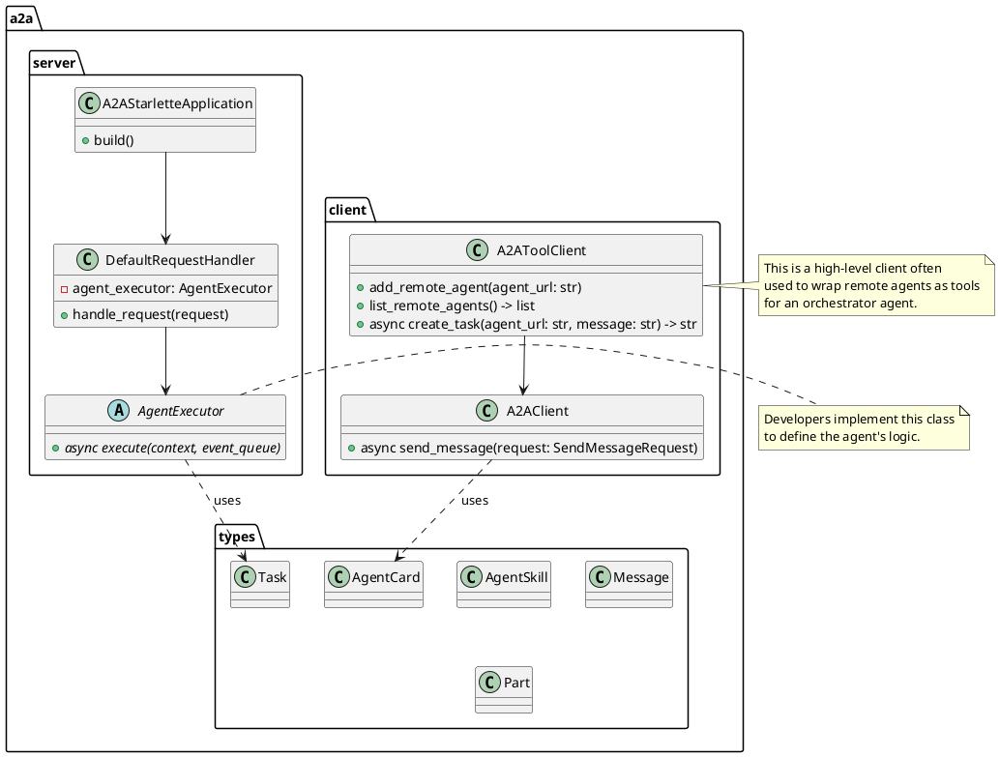

# Google A2A (Agent-to-Agent) Protocol 项目解读报告

## 0. 项目概览

- **项目名称**: A2A (Agent-to-Agent) Protocol
- **核心理念**: A2A 是一个由 Google 设计的开放协议，旨在为 AI Agent（人工智能代理）之间提供一个标准化的通信、发现和协作框架。它允许不同开发者、不同平台、不同技术栈构建的 Agent 能够互相理解、调用彼此的能力，从而构建更强大的、分布式的多 Agent 系统。
- **技术栈与主要依赖**:
  - **协议定义**: 使用 Protocol Buffers (`.proto`) 定义 gRPC 接口，使用 OpenRPC (`.json`) 定义 JSON-RPC 接口。使用 TypeScript (`.ts`) 提供协议核心类型的定义。
  - **Python SDK (`a2a-python`)**: `uvicorn`, `httpx`, `fastapi`/`starlette`, `grpcio`。
  - **示例与快速入门**: `google-adk`, `google-genai` (Vertex AI), Jupyter Notebook。

### 核心解读目录

- `A2A/`: 协议的根目录，包含了协议的权威定义。
  - `specification/`: 定义了协议的两种实现方式：`grpc` (通过 a2a.proto) 和 `json` (通过 a2a.json OpenRPC 规范)。
  - `types/`: 使用 TypeScript (`types.ts`) 定义了协议中的核心数据结构，作为跨语言实现的参考。
- `a2a-python/`: 官方 Python SDK 的实现，是开发者在 Python 环境中使用 A2A 协议的主要工具。
- `a2a-samples/`: 官方提供的示例，展示了如何使用 A2A 协议和 Python SDK 构建应用。
  - `notebooks/a2a_quickstart.ipynb`: 最佳的入门材料，通过一个实际案例讲解了 A2A 的核心概念和用法。
  - `demo/`: 一个更复杂的示例，包含UI界面。
  - `samples/python/`: 多个独立的 Python 示例，演示特定场景。

## 1. A2A 协议规范分析

A2A 协议的核心是"约定"，它定义了 Agent 如何对外"自我介绍"、如何"接收请求"以及如何"响应结果"。

### 1.1 核心概念

- **AgentCard**: 这是 Agent 的"名片"，一个标准化的元数据文件。它通过一个特殊的网络端点 `/.well-known/agent.json` 对外提供。
    > 注意：这是一个在服务运行时由A2A SDK动态生成的地址，并非项目中的一个物理文件，其详细作用请参考5.1节的服务发现模式）。它描述了 Agent 的名称、版本、描述、能力（如是否支持流式响应）以及最重要的 **Skills**
- **Skill**: 定义了 Agent 的一项具体能力，包括 ID、名称、描述以及调用示例。这使得其他 Agent 可以"发现"并理解本 Agent能做什么。
- **Message & Part**: 协议中通信的基本单元。一个 Message 可以包含多个 Part，Part 可以是文本（`TextPart`）、函数调用（`FunctionCallPart`）或工具代码（`ToolCodePart`）。
- **Task**: 代表一个需要执行的任务。当一个 Agent 调用另一个 Agent 时，会创建一个 Task 来跟踪这个请求的生命周期（如 `working`, `completed`, `failed`）。
- **Artifact**: 任务执行完成后产出的"交付物"。它可以是文本、文件或其他数据，是 Agent 执行 Skill 后的结果。

### 1.2 通信模式

A2A 支持两种主要的通信绑定：

1.  **JSON-RPC**: 基于 HTTP，使用 JSON 格式进行数据交换。[specification/json/a2a.json](https://github.com/google-a2a/A2A/blob/main/specification/json/a2a.json) 文件遵循 OpenRPC 规范，详细定义了所有方法（如 `a2a/sendMessage`）和数据结构。这是 Web 应用和轻量级服务集成的理想选择。
2.  **gRPC**: 基于 HTTP/2 和 Protocol Buffers，提供高性能的二进制通信。[specification/grpc/a2a.proto](https://github.com/google-a2a/A2A/blob/main/specification/grpc/a2a.proto) 文件定义了服务、RPC 方法和消息体。它更适合需要高性能、低延迟的内部服务间通信。

## 2. Python SDK (`a2a-python`) 架构分析

`a2a-python` SDK 是协议的 Python 实现，为开发者封装了协议的复杂性，提供了简单易用的高级 API。其源码位于 [a2a-python](https://github.com/google-a2a/a2a-python)。

### 2.1 模块划分与职责

- `types.py`: **核心类型定义**。将协议中定义的 `AgentCard`, `Skill`, `Message`, `Task` 等概念实现为 Python 的 `dataclasses`。这是整个 SDK 的数据基础。
- `server/`: **Agent 服务端**。提供了将一个普通 Agent (如 ADK Agent) 包装成一个 A2A 兼容的 Web 服务的所有工具。
  - `A2AStarletteApplication`: 核心类，用于构建一个符合 A2A 规范的 Starlette/FastAPI 应用。
  - `AgentExecutor`: Agent 执行逻辑的抽象基类，用户需要实现 `execute` 方法来定义 Agent 如何处理请求。
  - `DefaultRequestHandler`: 处理进来的 A2A 请求，管理 Task 的生命周期并调用 `AgentExecutor`。
- `client/`: **Agent 客户端**。提供了与其他 A2A Agent 通信的工具。
  - `A2AClient`: 用于向远程 A2A Agent 发送消息的核心客户端。
  - `A2AToolClient` (见 quickstart): 这是一个更高层的封装，可以将远程 Agent 的 Skills 包装成一个本地"工具"，让一个 Agent (如 Host Agent) 可以像调用普通函数一样调用另一个 Agent 的能力。
- `grpc/`: 包含了从 `a2a.proto` 自动生成的 gRPC Python 代码。
- `auth/`: 提供了认证相关的模块，用于保护 Agent 服务的安全。
- `utils/`: 提供了一些辅助函数，如创建新的 Task 或 Message 对象。

### 2.2 模块 PlantUML 类图



## 3. 快速入门指南 ([a2a_quickstart.ipynb](https://github.com/google-a2a/a2a-samples/blob/main/notebooks/a2a_quickstart.ipynb)) 解读

这个 Jupyter Notebook 是理解 A2A 实际应用的绝佳起点。它通过构建一个三 Agent 协作系统，清晰地展示了 A2A 的核心价值。

### 3.1 SDK 安装

要开始使用，首先需要安装 A2A SDK 及相关依赖。`a2a-sdk` 就是 `a2a-python` 库的包名。

```bash
pip install --upgrade -q google-genai google-adk a2a-sdk python-dotenv aiohttp uvicorn requests
```

### 3.2 实验步骤与 A2A 作用

实验构建了一个"热点话题分析系统"，包含三个角色：

1.  **Trending Topics Agent**: 一个基础 Agent，能力是使用 Google 搜索发现当前的热门话题。
2.  **Trend Analyzer Agent**: 另一个基础 Agent，能力是针对一个具体话题进行深入的量化分析。
3.  **Host Agent (Orchestrator)**: 核心协调者。它本身不执行具体任务，但负责理解用户需求，并调用前两个 Agent 来协同完成任务。

**A2A 在其中的作用**:

- **包装与暴露 (Server)**: `Trending Topics Agent` 和 `Trend Analyzer Agent` 都是用 `google-adk` 构建的。通过 `a2a.server.A2AStarletteApplication` 和自定义的 `ADKAgentExecutor`，它们的能力被包装成独立的、符合 A2A 协议的 Web 服务。每个服务都有自己的 `AgentCard`，清晰地描述了自己能做什么（比如 "Find Trending Topics" Skill）。
- **发现与调用 (Client)**: `Host Agent` 是整个系统的"大脑"。它使用 `A2AToolClient` (一个 `a2a.client` 的高级封装) 来实现与其他 Agent 的交互。
    1.  **发现**: Host Agent 首先调用 `list_remote_agents` 工具，读取其他两个 Agent 的 `AgentCard`，从而知道它们的存在和能力。
    2.  **协调与调用**: 当用户提出"分析当前热点"的需求时，Host Agent 的 LLM 大脑会进行规划：第一步，调用 `Trending Topics Agent` 获取热点列表；第二步，从列表中选择一个，调用 `Trend Analyzer Agent` 进行深入分析。这个"调用"动作就是通过 `create_task` 工具完成的，它本质上是向另外两个 Agent 的 A2A 服务端点发送一个标准化的请求。
- **解耦与协作**: A2A 协议使得这三个 Agent 可以被独立开发、部署和扩展。Host Agent 不需要知道其他两个 Agent 是如何实现的，只需要通过 A2A 协议这个"共同语言"与它们交互。这就是 A2A 实现多 Agent 协作的核心价值。

## 4. 示例分析 ([demo](https://github.com/google-a2a/a2a-samples/tree/main/demo) & [samples/python](https://github.com/google-a2a/a2a-samples/tree/main/samples/python))

### 4.1 Demo: Purchasing Concierge

在 `a2a-samples/demo` 中，一个重要的示例是采购礼宾服务（Purchasing Concierge）。

- **场景**: 模拟一个用户向导购 Agent 提出购买意图（如"我想买一台适合玩游戏的笔记本电脑"），该导购 Agent 会与后台的多个专家 Agent（如"笔记本电脑专家"、"库存查询专家"等）协作，为用户提供建议和最终的购买链接。
- **A2A 的作用**:
    - **服务发现**: 导购 Agent (Host) 动态发现所有可用的专家 Agent。
    - **能力路由**: 当用户请求到达时，导购 Agent 根据请求内容，决定将任务路由给哪个或哪些专家 Agent。例如，价格和库存问题会路由给"库存查询 Agent"。
    - **分布式系统**: 每个专家 Agent 都是一个独立的微服务，通过 A2A 协议对外提供服务。这使得系统非常灵活，可以随时增加或替换新的专家 Agent，而无需修改导购 Agent 的核心代码。

### 4.2 Python Sample: Currency Agent

在 `a2a-samples/samples/python` 中，`currency-agent` 是一个简单而典型的示例。

- **场景**: 包含一个 `CurrencyAgent`，其能力是查询和转换货币汇率；以及一个 `Host`，负责接收用户关于货币的各种问题。
- **A2A 的作用**: `Host` Agent 本身不具备货币换算能力。当用户问"100美元等于多少欧元"时，`Host` Agent 会通过 A2A 协议调用 `CurrencyAgent` 的汇率转换 Skill，获取结果，然后呈现给用户。这再次展示了 A2A 如何将特定的功能"服务化"，并允许其他 Agent 按需调用。

## 5. 架构与设计总结

### 5.1 核心设计模式

- **微服务架构**: A2A 鼓励将每个 Agent 构建为独立的微服务，每个服务负责一组高度内聚的业务能力。
- **服务发现模式**: 通过 `AgentCard` 和 `/.well-known/agent.json` 端点，A2A 实现了一套轻量级的服务发现机制。协调者 Agent 可以在运行时动态发现可用的能力。
- **适配器模式**: `a2a.server` 模块的设计就是典型的适配器模式。它可以将任何现有 Agent 的逻辑（无论是否基于 ADK）"适配"成符合 A2A 协议的服务接口。
- **外观模式**: `A2AToolClient` 可以被看作是外观模式的应用，它为 Host Agent 提供了一个简化的接口来与整个 A2A Agent 网络进行交互，隐藏了底层的 HTTP 请求、任务管理等复杂性。

### 5.2 项目亮点

- **开放与标准化**: 定义了一套清晰、开放的通信标准，解决了异构 Agent 间的"沟通"难题。
- **灵活性与扩展性**: 基于微服务和动态发现，系统极易扩展。可以随时向系统中加入新的 Agent 来提供新能力，而无需中断或修改现有系统。
- **框架无关性**: 虽然官方示例多与 Google ADK 结合，但 A2A 协议本身是框架无关的。任何技术栈实现的 Agent 只要遵循协议规范，都可以加入 A2A 网络。
- **双协议支持**: 同时支持 JSON-RPC 和 gRPC，兼顾了 Web 易用性和内部服务性能。

## 6. 总结与二次开发建议

### 6.1 潜在改进

- **安全性**: 示例中的认证机制较为基础，在生产环境中需要更健壮的认证和授权方案（如 OAuth2）。
- **任务管理**: `InMemoryTaskStore` 在重启后会丢失任务状态，生产环境需要替换为持久化的任务存储（如 Redis, 数据库）。
- **可观测性**: 需要引入更完善的日志、追踪和监控机制，以便在复杂的多 Agent 调用链中排查问题。

### 6.2 二次开发指南

- **从 `quickstart` 开始**: `a2a_quickstart.ipynb` 是理解 A2A 核心工作流的最佳实践，务必先跑通并理解它。
- **定义你的 `Skill`**: 在构建自己的 A2A Agent 时，首先要清晰地定义其 `AgentCard` 和 `Skills`。这是 Agent "存在" 的意义。
- **实现 `AgentExecutor`**: 将你的核心业务逻辑在 `AgentExecutor` 的 `execute` 方法中实现。
- **优先使用 `A2AToolClient`**: 在构建协调者 Agent 时，优先使用 `A2AToolClient` 将远程 Agent 包装成工具。这极大地简化了与远程 Agent 的交互逻辑，能更好地发挥 LLM 的工具调用能力。
- **考虑持久化**: 如果你的应用需要跟踪长时间运行的任务，请尽早将 `InMemoryTaskStore` 替换为持久化方案。

## 7. 智能体身份认证机制

### 7.1 A2A协议中的身份认证实现

根据对A2A协议源代码的分析，A2A协议采用了一套标准化但相对简单的身份认证机制，主要基于传统的API密钥和令牌认证方式，而非零知识证明技术。其认证机制包括以下几个关键组件：

- **auth模块**: A2A Python SDK中的`auth/`模块专门负责认证相关功能，提供了基础的身份验证框架。
- **多种认证方案支持**: A2A支持多种标准的Web认证方案：
  - HTTP Bearer令牌认证
  - OAuth2认证
  - OpenID Connect认证
  - API密钥认证（可在HTTP头、查询参数等位置）
- **认证拦截器**: 客户端使用`AuthInterceptor`自动处理认证流程，根据Agent的安全要求添加适当的认证信息。
- **凭证服务**: 通过`CredentialService`抽象接口管理凭证，默认实现是`InMemoryContextCredentialStore`，提供基于会话的凭证存储。

### 7.2 认证流程

1. **Agent注册与凭证获取**: 
   - 每个Agent在配置时需要定义其安全需求（`AgentCard.security`和`AgentCard.securitySchemes`）
   - 客户端需要通过某种方式（如用户输入、配置文件等）获取访问凭证

2. **请求认证流程**: 当Agent A调用Agent B的能力时：
   - Agent A的`AuthInterceptor`从`CredentialService`获取适当的凭证
   - 根据目标Agent的安全方案类型，将凭证添加到HTTP请求头或其他位置
   - Agent B的服务端验证这些凭证后处理请求

3. **用户身份表示**: 服务端使用`User`抽象类表示认证用户，包含`is_authenticated`和`user_name`属性。

### 7.3 安全增强建议

在实际部署中，A2A的身份认证机制可以通过以下方式增强：

- **实现更强大的凭证服务**: 替换默认的`InMemoryContextCredentialStore`，实现基于数据库或安全密钥管理系统的凭证存储。
- **接入OAuth2/OIDC**: 利用A2A已有的OAuth2和OpenID Connect支持，与企业现有的身份管理系统集成。
- **加密通信**: 确保所有Agent间通信使用TLS/SSL加密。
- **审计日志**: 实现详细的认证和授权审计日志，记录所有跨Agent调用的身份验证事件。
- **零信任架构**: 采用"零信任"原则，对每次Agent间的调用都进行完整的身份验证和授权检查。
- **考虑添加高级认证机制**: 如有需要，可以扩展A2A协议实现更高级的认证机制，包括零知识证明、多因素认证等。

通过这套身份认证机制，A2A协议确保了在分布式多Agent系统中，只有经过授权的Agent才能调用其他Agent的能力，从而保障了整个Agent网络的安全性和可信度。
