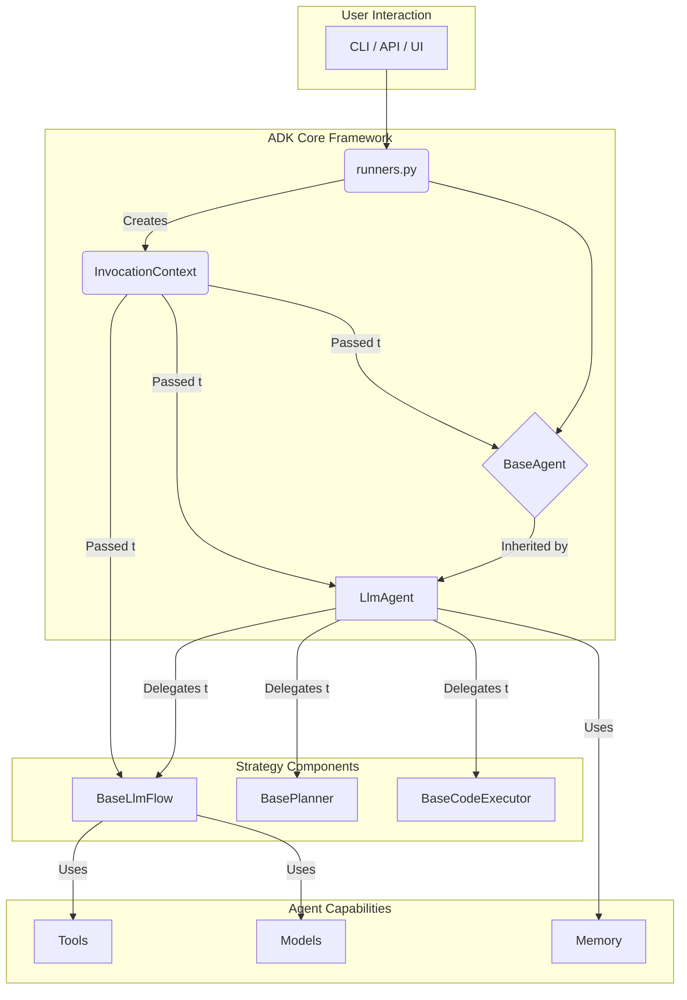
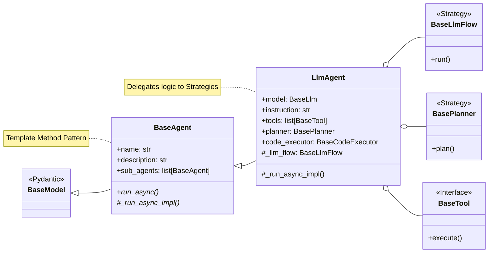

# 1. **初步分析README**
- **项目名称**：Agent Development Kit (ADK) for Python
- **核心理念**：一个开源的、代码优先的Python工具包，用于以灵活性和可控性来构建、评估和部署复杂的AIAgent。它旨在使Agent开发更接近传统的软件开发。
- **主要特性**：
    - **丰富的工具生态**：支持预构建工具、自定义函数、OpenAPI规范等。
    - **代码优先**：在Python中直接定义Agent逻辑、工具和编排。
    - **模块化多Agent系统**：通过将多个专用Agent组合成灵活的层次结构来设计可扩展的应用程序。
    - **随处部署**：可以轻松地在Cloud Run上容器化和部署Agent，或与Vertex AI Agent Engine无缝扩展。
- **技术栈**：虽然针对Gemini和Google生态系统进行了优化，但该框架是模型无关、部署无关的。
- **亮点功能**：
    - 支持单Agent和多Agent（协调器-子Agent）架构。
    - 内置用于测试、评估和调试的开发UI。
    - 提供命令行工具（`adk eval`）用于Agent评估。

---

# 2. **技术栈与依赖**
> 分析 `pyproject.toml` 文件，以深入了解其技术栈和项目依赖
*   **核心框架**：项目使用 `fastapi` 作为Web框架，并搭配 `uvicorn` 作为ASGI服务器。这表明ADK可以将Agent作为服务（API）来部署。`pydantic` 用于数据建模和验证，这对于定义Agent的输入/输出和工具接口至关重要。
*   **Google生态集成**：深度集成了多个Google Cloud服务，如 `google-genai` (Gemini模型), `google-cloud-aiplatform` (Vertex AI), `google-cloud-storage` 等。这验证了其"为Google生态优化"的说法。
*   **开放性与可扩展性**：
    *   通过可选依赖（`[project.optional-dependencies]`），项目支持与其他AI框架和模型集成，例如 `anthropic` (Claude模型), `litellm` (模型调用中间件), `langgraph`, `crewai`, `llama-index`。这体现了其模型无关和框架兼容的设计理念。
    *   `sqlalchemy` 的存在暗示了其具备与SQL数据库交互、实现持久化存储的能力。
*   **多Agent通信**：依赖 `mcp` 库，这似乎是实现多Agent通信的核心组件。
*   **可观测性**：集成了 `opentelemetry`，用于实现分布式追踪，这对于调试复杂的多Agent交互流程非常有价值。
*   **开发与工具链**：项目提供了名为 `adk` 的命令行工具（基于 `click`）。开发流程规范，使用了 `flit` 进行打包，`pyink` 进行代码格式化，`mypy` 进行静态类型检查。

**综合判断**：ADK是一个专业的、工程化的AIAgent开发框架。它不仅限于模型调用，更侧重于将Agent开发流程软件工程化，强调模块化、可测试性、可观测性和灵活部署。

---

# 3. **初步代码结构分析**

各个核心模块的职责：

*   `agents/`: **核心模块**，定义了Agent的基本行为和实现，如`README.md`中提到的`Agent`。
*   `tools/`: 定义了Agent可以使用的工具。这与`README.md`中提到的"丰富的工具生态系统"相对应。
*   `models/`: 封装了对不同语言模型（如Gemini、Anthropic等）的调用接口，提供了标准化的交互层。
*   `sessions/`: 管理与Agent交互的会话状态，这对于处理多轮对话和上下文至关重要。
*   `planners/`: 规划器模块。在Agent架构中，规划器负责将复杂目标分解为可执行的步骤序列。
*   `memory/`: 为Agent提供记忆功能，使其能够记住之前的交互信息。
*   `runners.py`: Agent执行器。该文件很可能包含了驱动Agent完成任务的逻辑，负责协调Agent、模型、工具和规划器之间的交互。
*   `flows/`: 定义任务或对话的流程，可能与多Agent系统的编排有关。
*   `platform/`: 平台集成模块，可能用于处理在Vertex AI或Cloud Run等特定平台上的部署逻辑。
*   `evaluation/`: 实现了`adk eval`命令的评估逻辑。
*   `cli/`: `adk`命令行工具的实现。
*   `code_executors/`: 代码执行器，为Agent提供执行代码的能力，这是一个强大但有风险的功能。
*   `artifacts/`: 用于处理Agent生成或使用的"产物"，例如生成的图片、文件等。
*   `events/`: 实现了事件驱动架构的相关逻辑，用于系统内部的事件发布与订阅（如：工具调用开始/结束）。
*   `auth/`: 处理认证逻辑。更新后的架构引入了`CredentialExchanger`和`CredentialRefresher`的抽象，使其能更好地处理OAuth等需要令牌交换和刷新的复杂认证场景，显著提升了与受保护API交互的健壮性。
*   `a2a/`: 实现了Agent间通信协议（A2A）的相关逻辑。
*   `utils/`、`telemetry.py`、`errors/`: 分别是工具类、遥测（监控）和自定义错误处理模块。

这个结构高度模块化，遵循关注点分离原则，是良好软件工程实践的体现。

## 3.1. **`BaseAgent`**

该文件定义了所有Agent的基础架构，其设计精良，体现了多种优秀实践。

*   **核心基类**：`BaseAgent(BaseModel)`。选择继承自Pydantic的`BaseModel`是关键的设计决策。这为Agent的属性提供了自动的数据校验、序列化和声明式定义，极大地增强了代码的健壮性和可维护性。

*   **核心属性**：
    *   `name: str`: Agent的唯一标识符。
    *   `description: str`: Agent功能的描述。在多Agent系统中，这个描述至关重要，父Agent或协调器会依据它来决定是否将任务委派给当前Agent。这实现了**基于能力的路由（capability-based routing）**。
    *   `sub_agents: list[BaseAgent]`: 实现**层级式多Agent系统**的核心机制。一个Agent可以包含一组子Agent，从而形成一个树状结构。
    *   `parent_agent`: 指向父Agent的引用，允许在层级结构中向上导航。

*   **执行流程（模板方法模式）**：
    *   `run_async` (文本) 和 `run_live` (音/视频) 是Agent的公开执行入口。它们被声明为`final`，子类无法覆盖。这种方法实现了**模板方法（Template Method）设计模式**。
    *   这两个`run`方法定义了执行的骨架：创建`InvocationContext` -> 执行前置回调 -> 调用核心实现 -> 执行后置回调。
    *   子类必须通过重写`_run_async_impl`或`_run_live_impl`方法来填充具体的业务逻辑。这种设计将通用的、不变的流程（如上下文管理、回调触发）与易变的、具体的Agent行为分离开。

*   **回调系统（钩子/观察者模式）**：
    *   `before_agent_callback`和`after_agent_callback`提供了一个强大的扩展机制，类似于**钩子（Hooks）**或**观察者模式**。开发者可以在不修改Agent核心代码的情况下，注入自定义逻辑（例如，输入验证、日志记录、格式转换等）。
    *   回调甚至可以通过返回值来中断或覆盖Agent的主要执行流程，提供了极高的灵活性。

*   **层级与发现**：
    *   `root_agent`属性和`find_agent`/`find_sub_agent`方法提供了在Agent树中导航和查找特定Agent的能力，这对于多Agent系统中的协调和通信至关重要。

*   **上下文管理**：
    *   `InvocationContext`对象在执行流程中逐层传递。它封装了单次Agent运行的所有状态（如对话历史、用户输入等），避免了使用全局变量，使状态管理更加清晰。

**架构小结 (`BaseAgent`)**：
`BaseAgent`通过巧妙地结合Pydantic、模板方法模式和回调系统，构建了一个健壮、可扩展的层级式Agent架构。该设计强力支持构建具有清晰职责划分和优秀可观测性的复杂多Agent系统。

## 3.2. **`LlmAgent`**

`LlmAgent`继承自`BaseAgent`，并在此基础上添加了与大语言模型（LLM）交互所需的所有组件。

*   **核心配置**:
    *   `model`: 定义了Agent所使用的LLM。它可以是一个字符串（将通过`LLMRegistry`查找），也可以是一个具体的`BaseLlm`对象。如果当前Agent不设置，它会巧妙地从父Agent继承，极大地简化了多Agent树的配置。
    *   `instruction`: Agent的系统指令（System Prompt）。它既可以是静态字符串，也可以是一个动态函数（`InstructionProvider`），能根据当前上下文动态生成指令，非常灵活。
    *   `tools`: Agent可用的工具列表。通过`ToolUnion`类型别名，我们可以看到工具的定义极为方便：它可以是一个普通的Python函数（框架会自动包装成`FunctionTool`）、一个`BaseTool`实例或一个`BaseToolset`（工具集）。

*   **组合优于继承（核心设计思想）**:
    *   `planner: Optional[BasePlanner]`: 框架没有将"规划"逻辑硬编码到Agent中，而是将其**委托**给一个独立的`Planner`对象。这是**策略模式（Strategy Pattern）**的绝佳应用。开发者可以轻松替换不同的规划策略（如ReAct或思维链），而无需修改Agent类本身。
    *   `code_executor: Optional[BaseCodeExecutor]`: 与规划器类似，代码执行这个复杂且高风险的功能也被委托给专用的执行器组件，实现了逻辑的隔离。
    *   `_llm_flow: BaseLlmFlow`: Agent核心运行循环（`_run_async_impl`的实现）被完全委托给一个"Flow"对象。Agent内部根据配置（如是否有工具、是否需要规划等）决定使用`SingleFlow`（简单问答）还是`AutoFlow`（需要工具调用和规划的复杂流程）。这再次应用了**策略模式**，使得`LlmAgent`类本身保持清晰，主要负责配置和组合，而将复杂的运行时状态机逻辑交由Flow对象处理。

*   **多层次回调系统**:
    *   在`BaseAgent`的`before/after_agent_callback`基础上，`LlmAgent`引入了更细粒度的回调：
        *   `before/after_model_callback`: 在LLM调用前后触发，允许直接检查甚至修改发送给模型或从模型返回的原始数据。
        *   `before/after_tool_callback`: 在工具调用前后触发，可用于日志记录、参数注入、甚至缓存或模拟工具的返回结果。
    *   这个多层次的回调系统为开发者提供了对Agent生命周期每个关键节点极强的内省和控制能力。

*   **结构化输入/输出**:
    *   `input_schema` 和 `output_schema`: 允许为Agent的输入和输出指定Pydantic模型，使其行为像一个强类型的函数。当一个Agent被另一个Agent当作工具调用时，这一点至关重要，它确保了被调用方能产生可预测的结构化输出。
    *   `output_key`: 允许将Agent的输出保存到共享状态中，使得Agent之间可以传递数据，实现更复杂的协作流程。

*   **`_run_async_impl`的实现**:
    该方法的核心实现非常简洁，只是调用了 `self._llm_flow.run(ctx)`。这证实了上述判断：核心的、复杂的运行时逻辑被策略化地委托给了`BaseLlmFlow`对象。

**`LlmAgent`架构总结**:
`LlmAgent`是灵活和可扩展面向对象设计的典范。它本身不处理复杂逻辑，而是作为一个**配置和组合的中心**。它将规划、代码执行、核心运行循环等关键职责委托给可替换的**策略对象**（`BasePlanner`, `BaseCodeExecutor`, `BaseLlmFlow`）。这种设计，再结合其多层次的回调系统，使得整个框架高度模块化、易于测试，能够灵活适应从简单聊天机器人到复杂自治多Agent系统的各种应用场景。

---

# 4. **`adk-python` 项目解读报告**

## 4.1. 项目概览

*   **项目名称与简介**
    *   Agent Development Kit (ADK) for Python 是一个开源的、代码优先的Python工具包，用于构建、评估和部署复杂的人工智能Agent。
*   **核心理念与设计哲学**
    *   ADK旨在将传统的软件工程原则引入AIAgent开发，强调代码优先、模块化、可测试性和可观测性，从而为开发者提供极大的灵活性和控制力。它通过组合优于继承、策略模式和多层回调系统等设计，实现了高度的可扩展性和可维护性。
*   **技术栈与主要依赖**
    *   **核心框架**: FastAPI (Web服务), Pydantic (数据建模与校验)
    *   **Google生态**: `google-genai` (Gemini), `google-cloud-aiplatform` (Vertex AI) 等。
    *   **开放性**: 支持与其他AI框架（LangGraph, CrewAI, LlamaIndex）和模型（Anthropic）集成。
    *   **可观测性**: 内置OpenTelemetry支持，提供分布式追踪能力。
    *   **数据库**: SQLAlchemy，提供ORM能力。
    *   **增强的认证机制**: 通过可插拔的凭证交换器(`CredentialExchanger`)和刷新器(`CredentialRefresher`)，实现了对OAuth等复杂认证流程的精细化管理，保证了Agent长时间运行的稳定性。

## 4.2. 项目架构设计

### 4.2.1. 系统整体架构

ADK采用高度模块化的分层架构。其核心是一个围绕`BaseAgent`和`LlmAgent`构建的层级式Agent系统。系统通过将复杂功能（如规划、代码执行、运行流）委托给独立的策略组件，实现了高度的灵活性和关注点分离。

### 4.2.2. 核心类图与继承体系

系统的核心是`BaseAgent`和`LlmAgent`的继承与组合关系。`BaseAgent`定义了所有Agent通用的树状层级结构和模板化的执行流程，而`LlmAgent`则在此基础上，通过组合`Planner`, `CodeExecutor`, `LLM`和`Tools`等外部组件，实现了功能丰富的AIAgent。

### 4.2.3. 核心模块分析

*   **`agents`**: 定义了Agent的核心抽象 (`BaseAgent`) 和主要实现 (`LlmAgent`)。`BaseAgent`负责层级结构和执行骨架，`LlmAgent`负责整合LLM、工具、规划器等能力。
*   **`flows`**: 实现了Agent运行的核心逻辑（策略模式）。`AutoFlow`和`SingleFlow`等类封装了从接收请求到调用模型、使用工具、返回响应的完整状态机。
*   **`planners`**: 规划器模块，将复杂任务分解为步骤。可插拔的设计允许开发者更换不同的规划算法。
*   **`tools`**: 提供了工具的基类和实现。框架对工具的定义非常友好，普通Python函数也能被轻松封装为工具。
*   **`models`**: 封装了对底层LLM的调用，提供统一的接口，解耦了Agent逻辑和具体的模型实现。
*   **`auth/`**: 处理认证逻辑。更新后的架构引入了`CredentialExchanger`和`CredentialRefresher`的抽象，使其能更好地处理OAuth等需要令牌交换和刷新的复杂认证场景，显著提升了与受保护API交互的健壮性。
*   **`a2a/`**: 实现了Agent间通信协议（A2A）的相关逻辑。
*   `utils/`、`telemetry.py`、`errors/`: 分别是工具类、遥测（监控）和自定义错误处理模块。

这个结构高度模块化，遵循关注点分离原则，是良好软件工程实践的体现。

## 4.3. 组件交互与通信

*   **组件间通信机制**:
    1.  **层级调用（Delegation）**: 在多Agent树中，父Agent（协调器）根据子Agent的`description`，将任务委托给最合适的子Agent。
    2.  **工具调用（Function Calling）**: `LlmAgent`通过LLM的Function Calling能力来调用`Tools`中定义的工具，实现与外部环境或API的交互。
    3.  **共享状态（State Sharing）**: `LlmAgent`的`output_key`属性可以将Agent的输出写入一个共享的会话状态(Session State)中，供其他Agent或工具后续使用。
    4.  **实时流式交互**: 框架支持与特定的实时流模型（如`gemini-2.0-flash-live-preview`）集成，能够处理实时双向数据流（如音频），这使得构建语音助手等实时交互应用成为可能。
*   **主要流程分析 (AutoFlow)**:
    1.  `Runner`接收用户请求，创建`InvocationContext`，调用根`Agent`的`run_async`方法。
    2.  `LlmAgent`的`_run_async_impl`将执行委托给`AutoFlow`。
    3.  `AutoFlow`构建发送给LLM的请求（包含指令、历史消息、可用工具等）。
    4.  调用`LLM`，获得响应。
    5.  如果LLM要求调用工具，`AutoFlow`会解析工具名和参数，调用相应的`Tool`对象，并将结果返回给LLM。
    6.  此过程（调用LLM -> 调用工具）循环进行，直到LLM生成最终回复。
    7.  所有步骤（模型请求、工具调用、最终回复）都被包装成`Event`对象`yield`回`Runner`。
*   **同步/异步处理策略**:
    *   整个框架是基于`asyncio`构建的，所有核心方法（如`run_async`）都是异步的。这使得它能高效地处理I/O密集型任务，如等待API调用（LLM、工具）的返回。

## 4.4. 设计模式分析

*   **模板方法模式 (Template Method)**: `BaseAgent`的`run_async`方法定义了Agent执行的固定骨架（创建上下文、执行回调），而将具体实现`_run_async_impl`延迟到子类(`LlmAgent`)中。
*   **策略模式 (Strategy)**: `LlmAgent`将`规划(Planner)`、`代码执行(CodeExecutor)`和`核心运行流(Flow)`等易变的行为委托给独立的策略对象。这使得这些行为可以在运行时被替换，极大地提高了灵活性。
*   **组合优于继承 (Composition over Inheritance)**: `LlmAgent`不是通过继承来获得所有功能，而是通过持有`Planner`, `Tools`, `LLM`等对象的实例来组合这些能力。
*   **观察者模式 (Observer) / 钩子 (Hooks)**: `before/after`回调系统允许在Agent生命周期的关键点附加自定义逻辑，实现了对框架的无侵入式扩展。
*   **工厂模式 (Factory)** / **注册表模式 (Registry)**: `LLMRegistry`允许通过字符串名称来获取`LLM`实例，解耦了使用者和具体的`LLM`实现类。

---

# 5. **核心模块深入分析**

## 5.1. `models/` - 模型层
这是连接LLM的适配器层。它的核心思想是**将不同来源的语言模型（Google、Anthropic、LiteLLM等）封装成统一的`BaseLlm`接口**，从而使上层`Agent`逻辑与具体的模型实现解耦。

**核心设计**:

*   **`base_llm.py`**: 定义了所有模型适配器的抽象基类`BaseLlm`。它规定了所有模型都必须实现的核心方法，如`generate_content_async`（用于生成内容）和`count_tokens_async`（用于计算token数）。这确保了上层代码（如`LlmAgent`）可以无差别地对待任何模型。
*   **具体实现**: `google_llm.py`、`anthropic_llm.py`、`lite_llm.py`等文件是`BaseLlm`的具体实现。每个文件负责将对应厂商的SDK调用方式适配到`BaseLlm`的统一接口上。
*   **标准数据结构**: `llm_request.py`和`llm_response.py`定义了与`BaseLlm`交互的标准化请求和响应结构，增强了解耦。
*   **注册表**: `registry.py`中的`LLMRegistry`允许通过字符串名称来查找并实例化对应的`BaseLlm`实现，简化了模型配置。

**小结**: `models`模块是ADK实现模型无关性的关键，它通过适配器模式和注册表模式，构建了一个灵活、可扩展的模型接入层。

## 5.2. `tools/` - 工具层
这是Agent与外部世界交互的"手臂"。它定义了工具的统一接口，并提供了多种便捷的方式来创建工具。

**核心设计**:

*   **`base_tool.py`**: 定义了所有工具的抽象基类`BaseTool`，规定了工具必须有`name`, `description`, 和 Pydantic `input_schema`。这些属性会被自动转换成LLM能理解的Function Calling格式。
*   **`function_tool.py`**: 框架的一大亮点。`FunctionTool`可以将任何一个普通的Python函数直接包装成一个`BaseTool`对象，它会自动利用函数的类型注解和文档字符串（docstring）生成工具的输入模式和描述，极大地降低了创建工具的门槛。
*   **丰富的集成与内置工具**:
    *   **框架兼容**: `langchain_tool.py`, `crewai_tool.py`提供了与其他Agent框架工具的兼容层。
    *   **API集成**: `openapi_tool/`可以根据OpenAPI (Swagger) 规范自动为RESTful API生成一套完整的工具。
    *   **Agent即工具**: `agent_tool.py`和`transfer_to_agent_tool.py`是实现多Agent协作的关键，允许一个Agent被另一个Agent调用或接收控制权。

**小结**: `tools`模块的设计兼具了强大、灵活和易用性。通过`FunctionTool`的自动化封装和对OpenAPI等标准的兼容，它为Agent提供了"开箱即用"的强大外部交互能力。

## 5.3. `planners/` - 规划层
这是Agent"大脑"的体现，它负责将复杂的目标分解成一系列可执行的步骤。这是实现高级自主能力（如ReAct范式）的核心。

**核心设计**:

*   **`base_planner.py`**: 定义了所有规划器的抽象基类`BasePlanner`。它规定了规划器必须实现的关键接口，例如 `plan_async`。这个统一的接口确保了`LlmAgent`可以无缝地切换不同的规划策略。
*   **`plan_re_act_planner.py`**: 这是一个具体的、功能强大的规划器实现，它遵循了著名的**ReAct (Reason + Act)**范式。其工作流程大致如下：
    1.  **Reason (思考)**: 基于当前目标和历史，LLM首先会生成一个"想法"（Thought），分析当前情况并决定下一步应该做什么。
    2.  **Act (行动)**: 根据"想法"，LLM决定是调用一个工具，还是回复用户。
    3.  **Observation (观察)**: 如果调用了工具，框架会执行该工具并将结果返回。这个结果作为"观察"被添加到上下文中。
    4.  **Repeat (重复)**: 框架将新的观察结果再次提供给LLM，循环回到第1步，直到任务完成。
    这种循环思考和行动的模式，使得Agent能够解决复杂的多步骤任务。
*   **`built_in_planner.py`**: 这个规划器比较特殊，它用于激活和配置**模型内置的规划（或思考）能力**。例如，某些Gemini模型版本自身就支持类似ReAct的思维过程。使用这个规划器，可以让ADK框架将规划任务完全委托给模型本身，而不是在ADK的客户端代码中通过多次调用来实现。

**小结**: `planners`模块是ADK实现高级自主能力的核心。通过**策略模式**，它将复杂的规划逻辑（如ReAct）从Agent主逻辑中解耦出来，形成了可插拔、可替换的组件。开发者既可以使用框架提供的`PlanReActPlanner`，也可以方便地实现自己的规划算法，甚至可以直接利用模型原生的思考能力。

## 5.4. `flows/` - 运行流层
如果说`LlmAgent`是配置中心，那么`flows`就是实际执行任务的引擎。它负责驱动整个与LLM交互的生命周期，是`LlmAgent`的`_run_async_impl`方法的真正实现者。

**核心设计**:

*   **`base_llm_flow.py`**: 定义了所有LLM运行流的基类`BaseLlmFlow`。这是一个复杂的类，它实现了与LLM交互的完整状态机，包括：构建请求、调用模型、解析和处理工具调用、处理代码执行、管理事件流等。
*   **`auto_flow.py` 和 `single_flow.py`**:
    *   `single_flow.py`: 这是最简单的Flow，用于不带工具、不带规划器的纯聊天场景。
    *   **`auto_flow.py`**: 这是**最核心、最常用**的Flow。当`LlmAgent`被赋予工具或规划器时，就会使用这个Flow。它继承了`BaseLlmFlow`中定义的完整生命周期，能够处理包含工具调用和规划的复杂多轮交互。
*   **功能分解（关注点分离）**:
    `BaseLlmFlow`的设计体现了极佳的关注点分离。它并没有将所有逻辑都写在自己内部，而是将构建请求的各个部分委托给了专门的模块（如`instructions.py`, `contents.py`, `functions.py`等），由它们分别负责处理指令、对话历史、工具声明等。`BaseLlmFlow`在运行时，会依次调用这些模块来组装最终的`LlmRequest`。

**小结**: `flows`模块是ADK框架强大能力的体现。它通过`BaseLlmFlow`这个"总指挥"，协同多个各司其职的子模块，共同完成了一次复杂的Agent运行。**这种将一个复杂流程分解为多个独立、可组合部分的设计思想，是整个框架中最值得学习和借鉴的地方之一**。它使得整个运行逻辑虽然复杂，但脉络清晰，易于维护和扩展。

## 5.5. `memory/` 和 `sessions/` - 记忆与会话层
这两个模块紧密相关，共同构成了Agent的记忆和会话管理系统。
*   **`memory/`**: 负责为Agent提供**长期记忆**。它的作用是将信息持久化，以便在不同的会话或多次运行之间共享。
*   **`sessions/`**: 负责管理**短期记忆**，即单次对话（Session）的上下文。它持有当前对话的状态，包括对话历史、从工具中获取的数据等。

**核心设计**:

*   **抽象与分离**: 框架通过`BaseMemoryService`和`BaseSessionService`两个基类，清晰地分离了长期记忆和短期会话上下文的接口。
*   **可插拔后端**: 两个模块都提供了多种后端的实现，这是其设计的核心优势。开发者可以根据需求选择不同的存储方式：
    *   **内存实现**: `in_memory...`提供了基于内存的实现，适用于快速开发和测试。
    *   **数据库实现**: `database_session_service.py`使用**SQLAlchemy**将会话数据持久化到数据库，为构建生产级应用提供了基础。
    *   **云服务实现**: `vertex_ai...`实现则体现了与Google Cloud的深度集成，允许用户直接利用托管的、可扩展的Vertex AI云服务来管理记忆和会话。
*   **数据模型**: `memory_entry.py`定义了记忆的最小单元，而`session.py`和`state.py`则定义了单次对话及其内部可自由读写的状态。

**小结**:
ADK通过`MemoryService`和`SessionService`两个抽象层，清晰地分离了长期记忆和短期会话。其**可插拔的后端设计**是最大的亮点，使得ADK能够同时满足从本地快速实验到大规模生产级云部署的各种需求，而无需修改上层业务逻辑。