# ADK Python Agents 架构分析

## 概述

ADK (Agent Development Kit) Python 的 agents 模块提供了一个完整的智能体框架，支持多种类型的智能体实现，包括基础智能体、LLM智能体、顺序智能体、并行智能体、循环智能体等。

## PlantUML 类图

```plantuml
@startuml ADK Python Agents Architecture

!theme plain
skinparam classAttributeIconSize 0
skinparam classFontSize 12
skinparam classFontName Arial
skinparam packageStyle rectangle

package "ADK Agents Core" {
  
  abstract class BaseAgent {
    + name: str
    + description: str
    + parent_agent: Optional[BaseAgent]
    + sub_agents: list[BaseAgent]
    + before_agent_callback: Optional[BeforeAgentCallback]
    + after_agent_callback: Optional[AfterAgentCallback]
    
    + {abstract} _run_async_impl(ctx: InvocationContext): AsyncGenerator[Event, None]
    + {abstract} _run_live_impl(ctx: InvocationContext): AsyncGenerator[Event, None]
    + run_async(parent_context: InvocationContext): AsyncGenerator[Event, None]
    + run_live(parent_context: InvocationContext): AsyncGenerator[Event, None]
    + clone(update: Mapping[str, Any]): SelfAgent
    + find_agent(name: str): Optional[BaseAgent]
    + find_sub_agent(name: str): Optional[BaseAgent]
    + root_agent: BaseAgent
  }

  class LlmAgent {
    + model: Union[str, BaseLlm]
    + instruction: Union[str, InstructionProvider]
    + global_instruction: Union[str, InstructionProvider]
    + tools: list[ToolUnion]
    + generate_content_config: Optional[types.GenerateContentConfig]
    + disallow_transfer_to_parent: bool
    + disallow_transfer_to_peers: bool
    + include_contents: Literal['default', 'none']
    + input_schema: Optional[type[BaseModel]]
    + output_schema: Optional[type[BaseModel]]
    + output_key: Optional[str]
    + planner: Optional[BasePlanner]
    + code_executor: Optional[BaseCodeExecutor]
    + before_model_callback: Optional[BeforeModelCallback]
    + after_model_callback: Optional[AfterModelCallback]
    + before_tool_callback: Optional[BeforeToolCallback]
    + after_tool_callback: Optional[AfterToolCallback]
    
    + canonical_model: BaseLlm
    + canonical_instruction(ctx: ReadonlyContext): tuple[str, bool]
    + canonical_global_instruction(ctx: ReadonlyContext): tuple[str, bool]
    + canonical_tools(ctx: ReadonlyContext): list[BaseTool]
  }

  class SequentialAgent {
    + _run_async_impl(ctx: InvocationContext): AsyncGenerator[Event, None]
    + _run_live_impl(ctx: InvocationContext): AsyncGenerator[Event, None]
  }

  class ParallelAgent {
    + _run_async_impl(ctx: InvocationContext): AsyncGenerator[Event, None]
    + _run_live_impl(ctx: InvocationContext): AsyncGenerator[Event, None]
  }

  class LoopAgent {
    + max_iterations: Optional[int]
    + _run_async_impl(ctx: InvocationContext): AsyncGenerator[Event, None]
    + _run_live_impl(ctx: InvocationContext): AsyncGenerator[Event, None]
  }

  class LangGraphAgent {
    + graph: Optional[StateGraph]
    + _run_async_impl(ctx: InvocationContext): AsyncGenerator[Event, None]
    + _run_live_impl(ctx: InvocationContext): AsyncGenerator[Event, None]
  }

  class RemoteA2AAgent {
    + remote_agent_url: str
    + remote_agent_name: str
    + _run_async_impl(ctx: InvocationContext): AsyncGenerator[Event, None]
    + _run_live_impl(ctx: InvocationContext): AsyncGenerator[Event, None]
  }
}

package "Configuration Classes" {
  
  abstract class BaseAgentConfig {
    + agent_class: Union[Literal['BaseAgent'], str]
    + name: str
    + description: str
    + sub_agents: Optional[List[AgentRefConfig]]
    + before_agent_callbacks: Optional[List[CodeConfig]]
    + after_agent_callbacks: Optional[List[CodeConfig]]
    
    + to_agent_config(custom_agent_config_cls: Type[TBaseAgentConfig]): TBaseAgentConfig
  }

  class LlmAgentConfig {
    + model: Optional[str]
    + instruction: Optional[str]
    + global_instruction: Optional[str]
    + tools: Optional[List[ToolConfig]]
    + generate_content_config: Optional[dict]
    + disallow_transfer_to_parent: bool
    + disallow_transfer_to_peers: bool
    + include_contents: str
    + input_schema: Optional[str]
    + output_schema: Optional[str]
    + output_key: Optional[str]
    + planner: Optional[str]
    + code_executor: Optional[str]
    + before_model_callbacks: Optional[List[CodeConfig]]
    + after_model_callbacks: Optional[List[CodeConfig]]
    + before_tool_callbacks: Optional[List[CodeConfig]]
    + after_tool_callbacks: Optional[List[CodeConfig]]
  }

  class SequentialAgentConfig {
    + agent_class: str = 'SequentialAgent'
  }

  class ParallelAgentConfig {
    + agent_class: str = 'ParallelAgent'
  }

  class LoopAgentConfig {
    + agent_class: str = 'LoopAgent'
    + max_iterations: Optional[int]
  }

  class AgentRefConfig {
    + config_path: Optional[str]
    + code: Optional[str]
    + validate_exactly_one_field(): AgentRefConfig
  }

  class CodeConfig {
    + name: str
    + args: Optional[List[ArgumentConfig]]
  }

  class ArgumentConfig {
    + name: Optional[str]
    + value: Any
  }
}

package "Context & Execution" {
  
  class InvocationContext {
    + artifact_service: Optional[BaseArtifactService]
    + session_service: BaseSessionService
    + memory_service: Optional[BaseMemoryService]
    + credential_service: Optional[BaseCredentialService]
    + invocation_id: str
    + branch: Optional[str]
    + agent: BaseAgent
    + user_content: Optional[types.Content]
    + session: Session
    + end_invocation: bool
    + live_request_queue: Optional[LiveRequestQueue]
    + active_streaming_tools: Optional[dict[str, ActiveStreamingTool]]
    + transcription_cache: Optional[list[TranscriptionEntry]]
    + run_config: Optional[RunConfig]
    + plugin_manager: PluginManager
    
    + increment_llm_call_count()
    + app_name: str
    + user_id: str
  }

  class CallbackContext {
    + state: State
    + load_artifact(filename: str, version: Optional[int]): Optional[types.Part]
    + save_artifact(filename: str, artifact: types.Part): int
    + list_artifacts(): list[str]
    + save_credential(auth_config: AuthConfig): None
    + load_credential(auth_config: AuthConfig): Optional[AuthCredential]
  }

  class ReadonlyContext {
    + invocation_context: InvocationContext
    + state: State
    + app_name: str
    + user_id: str
    + session_id: str
  }

  class RunConfig {
    + speech_config: Optional[types.SpeechConfig]
    + response_modalities: Optional[list[str]]
    + save_input_blobs_as_artifacts: bool
    + support_cfc: bool
    + streaming_mode: StreamingMode
    + output_audio_transcription: Optional[types.AudioTranscriptionConfig]
    + input_audio_transcription: Optional[types.AudioTranscriptionConfig]
    + realtime_input_config: Optional[types.RealtimeInputConfig]
    + enable_affective_dialog: Optional[bool]
    + proactivity: Optional[types.ProactivityConfig]
    + session_resumption: Optional[types.SessionResumptionConfig]
    + max_llm_calls: int
  }

  enum StreamingMode {
    NONE
    SSE
    BIDI
  }
}

package "Supporting Classes" {
  
  class LiveRequestQueue {
    + queue: asyncio.Queue
    + put(request: LiveRequest): None
    + get(): LiveRequest
    + empty(): bool
  }

  class LiveRequest {
    + content: types.Content
    + timestamp: float
  }

  class ActiveStreamingTool {
    + tool: BaseTool
    + args: dict[str, Any]
    + tool_context: ToolContext
  }

  class TranscriptionEntry {
    + content: types.Content
    + timestamp: float
    + transcription: str
  }
}

' 继承关系
BaseAgent <|-- LlmAgent
BaseAgent <|-- SequentialAgent
BaseAgent <|-- ParallelAgent
BaseAgent <|-- LoopAgent
BaseAgent <|-- LangGraphAgent
BaseAgent <|-- RemoteA2AAgent

BaseAgentConfig <|-- LlmAgentConfig
BaseAgentConfig <|-- SequentialAgentConfig
BaseAgentConfig <|-- ParallelAgentConfig
BaseAgentConfig <|-- LoopAgentConfig

ReadonlyContext <|-- CallbackContext

' 关联关系
BaseAgent *-- "0..*" BaseAgent : sub_agents
BaseAgent *-- "0..1" BaseAgent : parent_agent
BaseAgent *-- "0..1" InvocationContext : current_agent
BaseAgent *-- "0..1" CallbackContext : callbacks

InvocationContext *-- "1" BaseAgent : agent
InvocationContext *-- "0..1" RunConfig : run_config
InvocationContext *-- "0..1" LiveRequestQueue : live_request_queue
InvocationContext *-- "0..*" ActiveStreamingTool : active_streaming_tools

CallbackContext *-- "1" InvocationContext : invocation_context
ReadonlyContext *-- "1" InvocationContext : invocation_context

LlmAgent *-- "0..*" ToolUnion : tools
LlmAgent *-- "0..1" BasePlanner : planner
LlmAgent *-- "0..1" BaseCodeExecutor : code_executor

BaseAgentConfig *-- "0..*" AgentRefConfig : sub_agents
BaseAgentConfig *-- "0..*" CodeConfig : callbacks
LlmAgentConfig *-- "0..*" ToolConfig : tools

RunConfig *-- "1" StreamingMode : streaming_mode

@enduml
```

## 核心组件说明

### 1. 基础智能体 (BaseAgent)
- **作用**: 所有智能体的基类，定义了智能体的基本属性和行为
- **关键特性**:
  - 支持父子关系构建智能体树
  - 提供回调机制 (before_agent_callback, after_agent_callback)
  - 支持同步和异步执行模式
  - 支持智能体克隆和查找

### 2. LLM智能体 (LlmAgent)
- **作用**: 基于大语言模型的智能体实现
- **关键特性**:
  - 支持多种模型配置
  - 工具调用能力
  - 指令和全局指令配置
  - 输入输出模式控制
  - 规划器和代码执行器集成
  - 丰富的回调机制

### 3. 组合智能体
- **SequentialAgent**: 顺序执行子智能体
- **ParallelAgent**: 并行执行子智能体（隔离模式）
- **LoopAgent**: 循环执行子智能体
- **LangGraphAgent**: 基于LangGraph的智能体
- **RemoteA2AAgent**: 远程A2A智能体

### 4. 上下文管理
- **InvocationContext**: 调用上下文，包含会话、服务、配置等信息
- **CallbackContext**: 回调上下文，提供状态管理和资源访问
- **ReadonlyContext**: 只读上下文基类

### 5. 配置系统
- **BaseAgentConfig**: 基础配置类
- **LlmAgentConfig**: LLM智能体配置
- **AgentRefConfig**: 智能体引用配置
- **CodeConfig**: 代码引用配置

### 6. 运行时配置
- **RunConfig**: 运行时行为配置
- **StreamingMode**: 流式模式枚举

## 设计模式

1. **模板方法模式**: BaseAgent定义了智能体执行的基本流程
2. **策略模式**: 不同的智能体类型实现不同的执行策略
3. **组合模式**: 智能体可以组合成树形结构
4. **观察者模式**: 通过回调机制实现事件处理
5. **工厂模式**: 通过配置类创建智能体实例

## 扩展性

该架构具有良好的扩展性：
- 可以通过继承BaseAgent创建新的智能体类型
- 可以通过配置系统自定义智能体行为
- 支持插件机制和服务注入
- 支持多种执行模式和流式处理
