# 智能体协议深度解析：构建AI代理协作的未来基础设施

> 作者：AgenticX团队  
> 日期：2025年7月

## 引言：从孤岛到网络的演进

在人工智能快速发展的今天，AI Agents已经从简单的任务执行工具演变为能够自主感知、决策和协作的智能实体。然而，就像早期互联网时代各个系统相互隔离一样，当前的智能体生态系统也面临着"孤岛化"的挑战。不同厂商、不同平台的智能体无法有效沟通，这严重限制了它们的协作潜力。

智能体协议的出现，正是为了解决这一根本性问题。就像TCP/IP协议革命性地连接了全球计算机网络一样，智能体协议有望构建一个互联互通的智能网络，让不同的AI智能体能够无缝协作，释放集体智能的巨大潜力。

本文基于《A Survey of AI Agent Protocols》综述、ACPs论文以及对MCP和A2A的深入分析，为您全面解读智能体协议的现状、技术细节和未来展望。

## 第一章：智能体协议概览

### 1.1 为什么需要智能体协议？

根据《A Survey of AI Agent Protocols》的分析，智能体协议的核心价值在于：

1. **互操作性**：让不同技术栈、不同厂商的智能体能够相互理解和协作
2. **标准化交互**：提供统一的通信规范，降低集成成本
3. **安全性保障**：建立可信的身份认证和授权机制
4. **能力发现**：让智能体能够动态发现和调用其他智能体的能力
5. **集体智能**：通过协作产生超越单个智能体的智能涌现

### 1.2 智能体生态系统架构

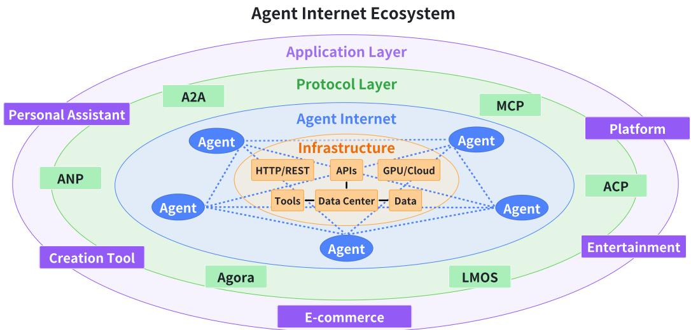

如上图所示，一个完整的智能体生态系统包含多个层次：
- **应用层**：各种智能体应用和服务
- **协议层**：标准化的通信和协作协议
- **基础设施层**：计算、存储、网络等基础资源

### 1.3 协议发展时间线

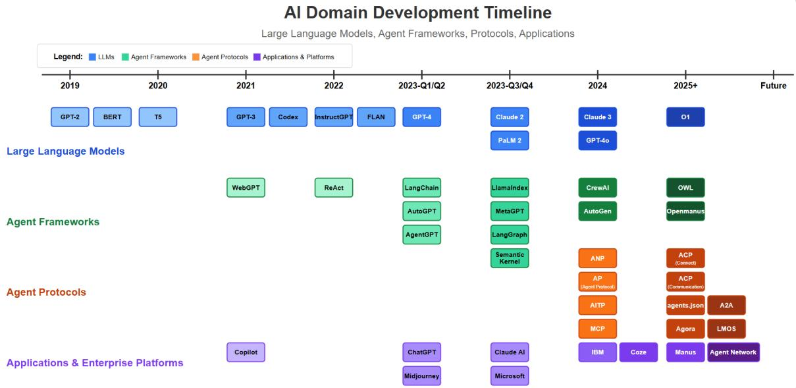

从早期的FIPA ACL和KQML到现代的MCP、A2A和ANP，智能体协议经历了从语义驱动到LLM原生的演进过程。

## 第二章：协议分类与架构

### 2.1 二维分类框架

根据综述的分析，智能体协议可以从两个维度进行分类：

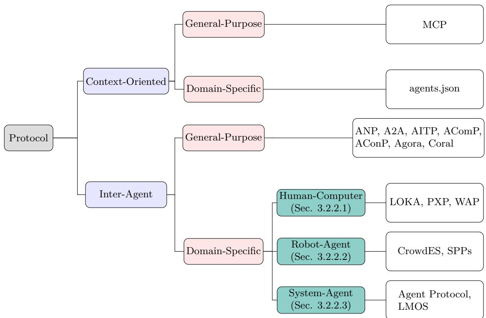

1. **对象导向维度**：
   - **上下文导向协议**（Context-Oriented）：专注于智能体与外部资源（工具、数据）的交互
   - **智能体间协议**（Inter-Agent）：专注于智能体之间的通信和协作。下图是通用智能体间协议对比（截至2025年4月的开发阶段评估）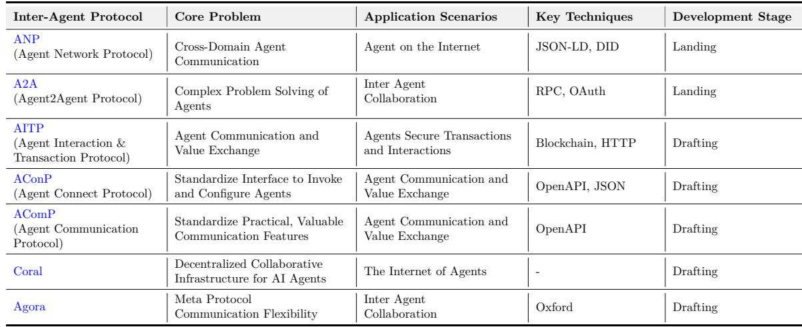

2. **应用场景维度**：
   - **通用协议**（General-Purpose）：适用于广泛场景
   - **领域特定协议**（Domain-Specific）：针对特定领域优化

### 2.2 主要协议概览

| 协议类型 | 代表协议 | 提出方 | 核心特性 | 发展阶段 |
|---------|---------|--------|---------|----------|
| 上下文导向 | MCP | Anthropic | 微服务架构、安全沙箱 | 事实标准 |
| 智能体间-通用 | A2A | Google | RPC/gRPC、任务管理 | 落地中 |
| 智能体间-通用 | ANP | ANP社区 | 去中心化、DID身份 | 落地中 |
| 智能体间-通用 | ACPs | 北邮团队 | 完整协议族、IoA愿景 | 起草中 |

## 第三章：核心协议深度解析

### 3.1 MCP：模型上下文协议

#### 3.1.1 架构设计

MCP采用了优雅的客户端-服务器架构，将LLM与外部资源的交互标准化：

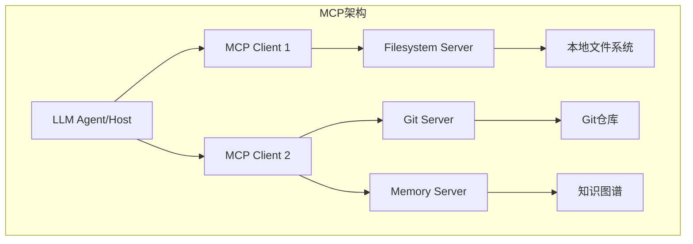

#### 3.1.2 核心特性

1. **工具定义标准化**：通过JSON Schema定义工具的输入输出
2. **安全沙箱机制**：限制文件系统访问范围，防止越权操作
3. **流式响应支持**：支持长时间运行任务的进度反馈
4. **资源管理**：统一管理文件、数据库等各类资源

#### 3.1.3 Python SDK示例

```python
from mcp.server.fastmcp import FastMCP

# 创建MCP服务器
mcp = FastMCP("CalculatorServer")

@mcp.tool()
def add(a: int, b: int) -> int:
    """将两个数字相加"""
    return a + b

@mcp.resource("constants://pi")
def get_pi() -> float:
    """提供圆周率的值"""
    return 3.14159265359

if __name__ == "__main__":
    mcp.run()
```

### 3.2 A2A：智能体间协议

#### 3.2.1 核心概念

A2A协议引入了几个关键概念来支持智能体间的协作：
- **AgentCard**：智能体的"名片"，描述其能力和接口
- **Skill**：智能体的具体能力定义
- **Task**：异步任务管理机制
- **Artifact**：任务执行的结果

#### 3.2.2 协作流程

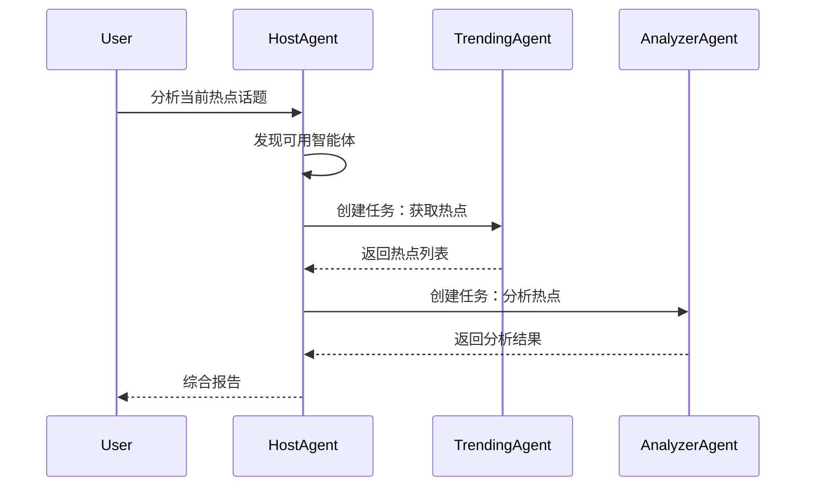

#### 3.2.3 Python实现示例

```python
from a2a.client import A2AToolClient
from a2a.server import A2AStarletteApplication

# 创建A2A客户端
client = A2AToolClient()

# 添加远程智能体
client.add_remote_agent("http://trending-agent.com")
client.add_remote_agent("http://analyzer-agent.com")

# 异步调用智能体能力
async def analyze_trends():
    # 获取热点
    trends = await client.create_task(
        "http://trending-agent.com",
        "Find current trending topics"
    )
    
    # 分析热点
    analysis = await client.create_task(
        "http://analyzer-agent.com",
        f"Analyze trend: {trends[0]}"
    )
    
    return analysis
```

### 3.3 ANP：智能体网络协议

#### 3.3.1 三层架构

ANP采用了创新的三层架构设计：

1. **身份与加密通信层**：基于W3C DID标准的去中心化身份
2. **元协议层**：支持协议的动态协商（如Agora）
3. **应用协议层**：具体的业务协议实现

#### 3.3.2 去中心化特性

ANP的核心创新在于其去中心化设计：
- 无需中央服务器
- 点对点身份认证
- 端到端加密通信

### 3.4 ACPs：智能体协作协议族

#### 3.4.1 IoA架构

ACPs提出了完整的"智能体互联网"（Internet of Agents, IoA）架构：

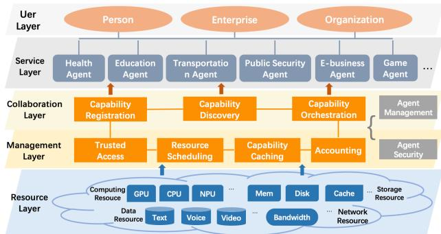

五层架构包括：
1. **资源层**：计算、存储、网络资源
2. **管理层**：可信接入、资源调度
3. **协作层**：能力注册、发现、编排
4. **服务层**：各类智能体服务
5. **用户层**：最终用户

#### 3.4.2 协议族组成

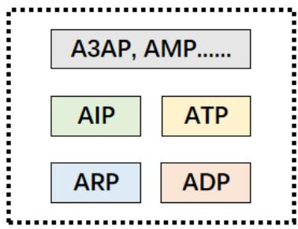

ACPs包含四个核心协议：
- **ARP**（Agent Registration Protocol）：智能体注册协议
- **ADP**（Agent Discovery Protocol）：智能体发现协议
- **AIP**（Agent Interaction Protocol）：智能体交互协议
- **ATP**（Agent Tooling Protocol）：智能体工具协议

#### 3.4.3 应用场景示例

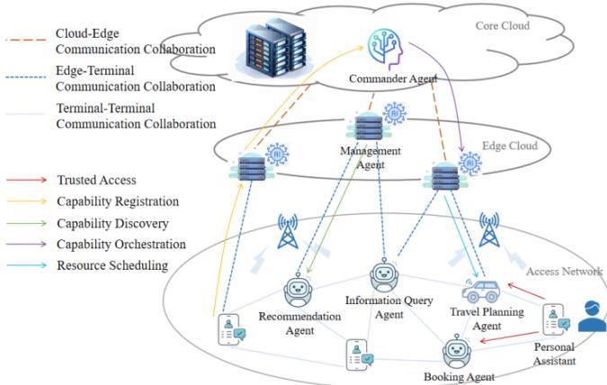

在餐厅预订场景中，多个智能体通过ACPs协议协作：
1. 个人助理智能体接收用户需求
2. 通过ADP发现相关智能体
3. 组建临时协作组
4. 分配子任务并协调执行
5. 汇总结果反馈给用户

## 第四章：协议对比与选择

### 4.1 功能特性对比
在相同用户指令下，四种协议的应用场景分析图
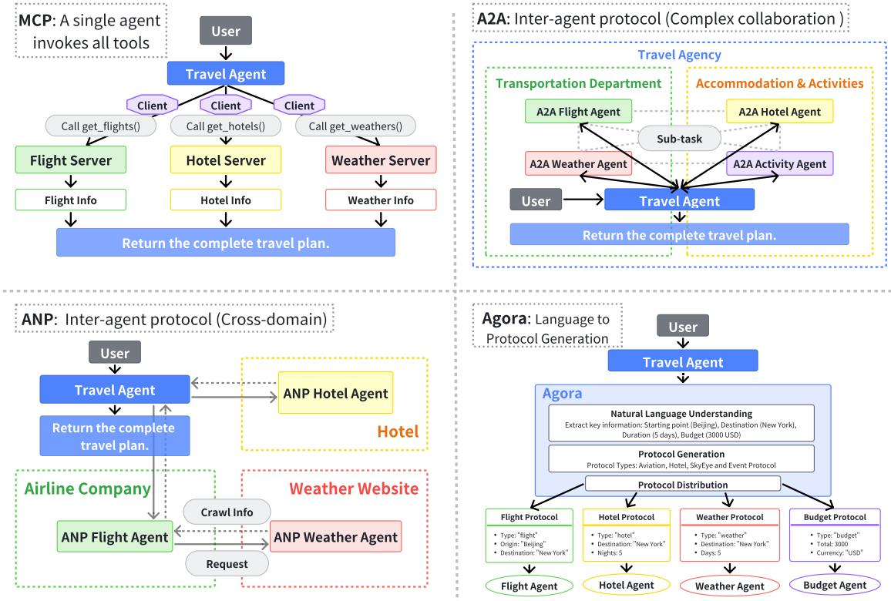

| 特性维度 | MCP | A2A | ANP | ACPs |
|---------|-----|-----|-----|------|
| 主要焦点 | LLM-工具集成 | 企业级协作 | 去中心化网络 | 完整生态系统 |
| 架构模式 | 客户端-服务器 | 任务驱动 | P2P网络 | 分层架构 |
| 身份认证 | 简单认证 | OAuth2/令牌 | DID去中心化 | 多级认证 |
| 适用场景 | 开发工具 | 企业应用 | 开放网络 | 通用平台 |
| 成熟度 | 高 | 中 | 低 | 初期 |

### 4.2 性能评估维度

根据综述的分析，评估智能体协议应考虑以下关键维度：

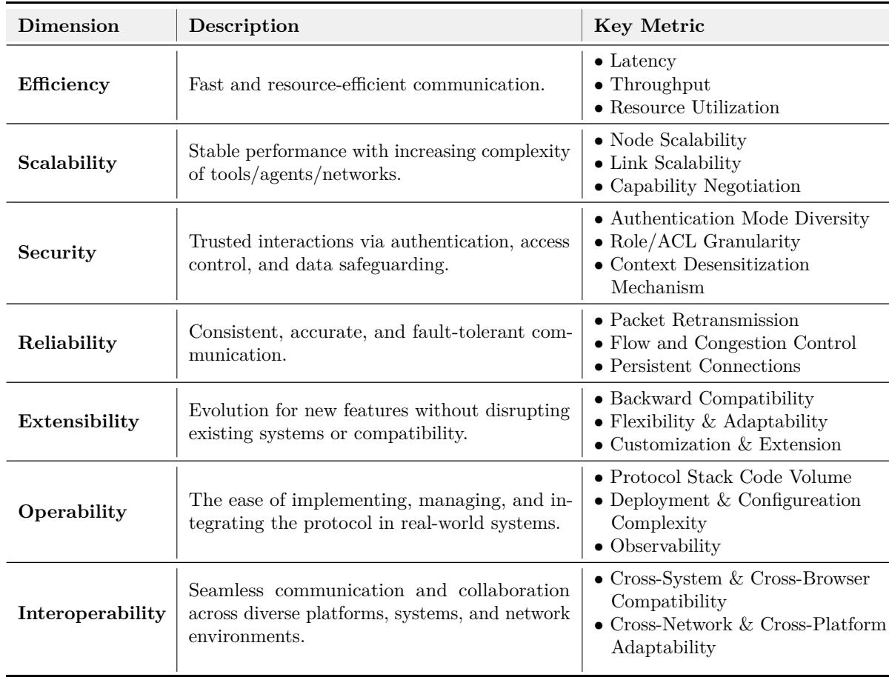

1. **效率性**：延迟、吞吐量、资源利用率
2. **可扩展性**：节点扩展、链路扩展、能力协商
3. **安全性**：认证多样性、访问控制粒度、数据脱敏
4. **可靠性**：消息重传、流控、持久连接
5. **可扩展性**：向后兼容、灵活适配、定制扩展
6. **可操作性**：部署复杂度、可观测性
7. **互操作性**：跨系统、跨平台兼容

### 4.3 选择建议

基于不同的应用场景，我们建议：

1. **工具集成场景**：选择MCP
   - 需要LLM访问本地文件、数据库等资源
   - 重视安全性和隔离性
   - 示例：AI编程助手、数据分析工具

2. **企业协作场景**：选择A2A
   - 需要多个智能体协同完成复杂任务
   - 有明确的任务管理需求
   - 示例：客服系统、业务流程自动化

3. **开放网络场景**：选择ANP
   - 需要去中心化的智能体网络
   - 跨组织、跨平台协作
   - 示例：去中心化AI市场、开放智能体生态

4. **综合平台场景**：选择ACPs
   - 构建完整的智能体生态系统
   - 需要全面的管理和治理能力
   - 示例：智慧城市、工业互联网

## 第五章：实践案例分析

### 5.1 旅行规划场景对比

让我们通过一个具体的例子——"规划从北京到纽约的5天旅行"，来对比不同协议的实现方式：

#### MCP实现：中心化工具调用

```python
# MCP方式：单一智能体调用多个工具
class MCPTravelClient:
    def plan_trip(self, origin, destination, duration):
        # 直接调用各个服务器工具
        flights = self.call_tool("flight_server", "get_flights", 
                               {"from": origin, "to": destination})
        hotels = self.call_tool("hotel_server", "get_hotels",
                              {"city": destination})
        weather = self.call_tool("weather_server", "get_forecast",
                               {"city": destination, "days": duration})
        
        # 中心化处理所有信息
        return self.generate_plan(flights, hotels, weather)
```

#### A2A实现：智能体协作

```python
# A2A方式：多个智能体协作
class A2ATravelPlanner:
    async def plan_trip(self, request):
        # 创建协作任务组
        flight_task = await self.create_task(
            "flight_agent", 
            f"Find flights from {request.origin} to {request.destination}"
        )
        
        hotel_task = await self.create_task(
            "hotel_agent",
            f"Find hotels in {request.destination} for {request.duration} days"
        )
        
        # 智能体直接通信获取天气信息
        # Flight Agent会自主联系Weather Agent
        
        # 收集结果
        results = await asyncio.gather(flight_task, hotel_task)
        return self.synthesize_plan(results)
```

## 第六章：技术实现细节

### 6.1 身份认证机制

不同协议采用了不同的身份认证方案：

#### MCP：简单令牌认证
```python
# MCP服务器端认证
@mcp.middleware
async def auth_middleware(request, call_next):
    token = request.headers.get("Authorization")
    if not validate_token(token):
        raise AuthenticationError("Invalid token")
    return await call_next(request)
```

#### A2A：OAuth2集成
```python
# A2A的OAuth2认证流程
class A2AAuthHandler:
    async def authenticate(self, agent_id, credentials):
        # 获取OAuth2令牌
        token = await self.oauth_client.get_token(
            client_id=agent_id,
            client_secret=credentials.secret,
            scope=["agent.read", "agent.execute"]
        )
        return token
```

#### ANP：DID去中心化身份
```python
# ANP的DID身份验证
class ANPIdentityManager:
    def verify_agent_identity(self, did, signature, message):
        # 解析DID文档
        did_document = self.resolve_did(did)
        public_key = did_document.get_public_key()
        
        # 验证签名
        return self.verify_signature(
            public_key, signature, message
        )
```

### 6.2 消息格式标准

#### MCP消息格式
```json
{
    "jsonrpc": "2.0",
    "method": "tools/call",
    "params": {
        "name": "read_file",
        "arguments": {
            "path": "/home/user/document.txt"
        }
    },
    "id": "call_123"
}
```

#### A2A任务格式
```json
{
    "task": {
        "id": "task_456",
        "type": "request",
        "skill": "analyze_data",
        "parameters": {
            "data_source": "sales_2024",
            "metrics": ["revenue", "growth"]
        },
        "context": {
            "user_id": "user_789",
            "priority": "high"
        }
    }
}
```

### 6.3 错误处理与重试机制

智能体协议需要健壮的错误处理：

```python
class ProtocolErrorHandler:
    async def execute_with_retry(self, func, max_retries=3):
        for attempt in range(max_retries):
            try:
                return await func()
            except NetworkError as e:
                if attempt == max_retries - 1:
                    raise
                await asyncio.sleep(2 ** attempt)  # 指数退避
            except AuthenticationError:
                # 重新认证
                await self.refresh_credentials()
            except ProtocolError as e:
                # 协议错误，记录并上报
                self.log_error(e)
                raise
```

## 结语

智能体协议正在成为AI时代的关键基础设施。从MCP的工具集成，到A2A的企业协作，再到ANP的去中心化网络，以及ACPs的完整生态系统愿景，每个协议都在推动智能体技术向前发展。

正如互联网协议TCP/IP连接了全球的计算机，智能体协议将连接全球的AI智能体，创造一个充满可能性的智能未来。无论您是开发者、企业决策者还是研究人员，现在都是参与这场变革的最佳时机。

让我们一起构建智能体互联的美好未来！

## 参考资料

1. Yang, Y., et al. (2025). "A Survey of AI Agent Protocols". arXiv:2504.16736.
2. Liu, J., et al. (2025). "ACPs: Agent Collaboration Protocols for the Internet of Agents". Beijing University of Posts and Telecommunications.
3. Anthropic. (2024). "Model Context Protocol". https://modelcontextprotocol.io
4. Google. (2025). "Agent-to-Agent Protocol". https://github.com/a2aproject/A2A
5. ANP Team. (2024). "Agent Network Protocol". https://agent-network-protocol.com

## 附录：快速开始指南

### A. MCP快速开始

```bash
# 安装MCP SDK
pip install "mcp[cli]"

# 创建简单的MCP服务器
mcp create my-first-server

# 运行并测试
mcp dev my-first-server.py
```

### B. A2A快速开始

```bash
# 安装A2A SDK
pip install a2a-sdk google-genai

# 克隆示例项目
git clone https://github.com/google/a2a-samples

# 运行快速入门示例
cd a2a-samples/notebooks
jupyter notebook a2a_quickstart.ipynb
```

*本文持续更新中，欢迎关注AgenticX项目获取最新进展。* https://github.com/DemonDamon/AgenticX
