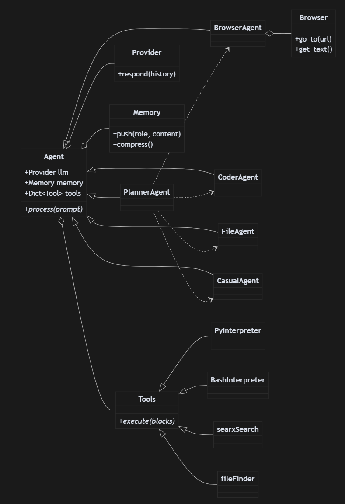
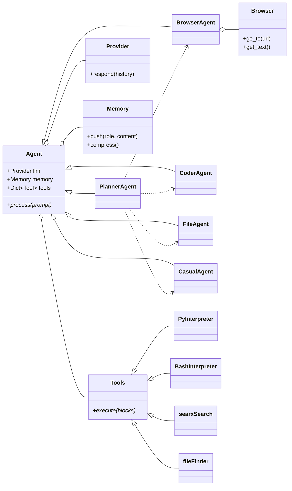

# AgenticSeek 项目解读报告

## 0. 项目概览

### 0.1 项目简介
**AgenticSeek** 是一个100%本地化的AI助手系统，定位为 Manus AI 的开源替代方案。该项目的核心理念是提供完全私有、本地运行的智能助手，能够自主浏览网页、编写代码、规划任务，同时确保所有数据都保存在用户设备上，实现零云依赖。

### 0.2 核心特性
- **🔒 完全本地化与隐私保护**：所有处理都在本地机器上进行，无云端数据共享
- **🌐 智能网页浏览**：自主搜索、阅读、提取信息、填写表单
- **💻 自主编程助手**：支持 Python、C、Go、Java 等多种编程语言的代码编写、调试和运行
- **🧠 智能代理选择**：根据任务自动选择最适合的智能体
- **📋 复杂任务规划与执行**：将大型任务分解为步骤并使用多个AI代理完成
- **🎙️ 语音交互**：支持语音到文本和文本到语音的交互方式

### 0.3 技术栈概览
- **后端框架**：FastAPI + Python 3.10+
- **前端**：React (容器化部署)
- **AI模型支持**：Ollama、LM Studio、OpenAI、Google Gemini、Deepseek 等
- **浏览器自动化**：Selenium + Chrome WebDriver
- **搜索引擎**：SearxNG (私有搜索)
- **容器化**：Docker + Docker Compose
- **数据存储**：Redis (会话管理)
- **语音处理**：Text-to-Speech 和 Speech-to-Text

## 1. 项目架构设计

### 1.1 系统整体架构

AgenticSeek 采用微服务架构，主要由以下几个核心组件构成：

```
┌─────────────────┐    ┌─────────────────┐    ┌─────────────────┐
│   Frontend      │    │   Backend       │    │   LLM Provider  │
│   (React)       │◄──►│   (FastAPI)     │◄──►│   (Ollama/API)  │
└─────────────────┘    └─────────────────┘    └─────────────────┘
                                │
                                ▼
┌─────────────────┐    ┌─────────────────┐    ┌─────────────────┐
│   SearxNG       │◄──►│  Agent Router   │◄──►│   Browser       │
│   (Search)      │    │   (Dispatcher)  │    │   (Selenium)    │
└─────────────────┘    └─────────────────┘    └─────────────────┘
                                │
                                ▼
                      ┌─────────────────┐
                      │     Redis       │
                      │   (Memory)      │
                      └─────────────────┘
```

### 1.2 核心智能体类型

系统定义了5种专门化的智能体，每种都有特定的职责：

1. **CasualAgent（对话智能体）**：处理日常对话和简单查询
2. **CoderAgent（编程智能体）**：负责代码编写、调试和执行
3. **FileAgent（文件智能体）**：处理文件操作、搜索和管理
4. **BrowserAgent（浏览器智能体）**：执行网页浏览和网络搜索任务
5. **PlannerAgent（规划智能体）**：分解复杂任务并协调其他智能体

### 1.3 智能体继承体系

```python
# 核心智能体类层次结构
Agent (抽象基类)
├── CasualAgent (对话智能体)
├── CoderAgent (编程智能体)  
├── FileAgent (文件智能体)
├── BrowserAgent (浏览器智能体)
└── PlannerAgent (规划智能体)
    └── 协调所有其他智能体
```

### 1.4 系统类图





## 2. 核心模块详细分析

### 2.1 智能体路由系统 (router.py)

**职责**：作为系统的"总调度员"，在处理用户初始请求时，决定哪个智能体最适合处理该任务。

**混合分类策略**：它采用了一种非常智能的混合方法来做决策：
1. **复杂度优先**：首先，它使用一个经过少量样本学习（Few-shot Learning）的 `AdaptiveClassifier` 来评估用户请求的复杂度。如果判断为`HIGH`（高复杂度），它会直接将任务交给 `PlannerAgent`，因为复杂任务通常需要多步骤规划。
2. **模型投票机制**：对于`LOW`（低复杂度）的任务，它会同时使用两个模型进行分类：
    - 一个是通用的、基于`facebook/bart-large-mnli`的零样本分类（Zero-shot Classification）模型。
    - 另一个是同样经过大量特定任务样本（如"写代码"->"coding"）微调的`AdaptiveClassifier`。
3. **加权决策**：`router_vote` 方法会比较两个分类器的置信度（confidence score），选择置信度更高的那个作为最终的分类结果，从而决定是调用`CoderAgent`、`BrowserAgent`还是`FileAgent`。

**多语言支持**：在分类之前，它会使用`language.py`中的工具检测用户输入的语言，并将其翻译成英文，确保路由逻辑可以统一处理。

这种结合了硬编码规则（高复杂度->规划器）、模型集成和多语言预处理的路由策略，使得AgenticSeek在任务分发上既灵活又准确。

### 2.2 LLM提供者抽象层 (llm_provider.py)

**职责**：统一不同LLM提供者的接口，创建一个抽象层，使得上层应用（如智能体）可以用同样的方式与任何支持的语言模型进行交互，无需关心底层的API差异。

**核心类**：`Provider`

**设计模式**：该模块巧妙地运用了**策略模式（Strategy Pattern）**。
- `Provider` 类在初始化时，会创建一个名为 `available_providers` 的字典。
- 该字典将提供者名称（如 `"ollama"`、`"openai"`）映射到具体的处理函数（如 `self.ollama_fn`、`self.openai_fn`）。
- 当需要调用LLM时，`respond` 方法会根据配置的 `provider_name` 从字典中查找并执行对应的函数。
- 这种设计使得添加新的LLM提供者变得非常简单，只需实现一个新的处理函数并将其注册到字典中即可，无需修改核心调用逻辑。

**支持的提供者**：
- **本地提供者**：Ollama、LM Studio、任何与OpenAI API兼容的本地服务器（如 llama.cpp）、以及项目自带的独立服务器模式。
- **云端API**：OpenAI、Google Gemini、Deepseek、Hugging Face、TogetherAI、Anthropic、OpenRouter。

**核心实现**：
```python
class Provider:
    def __init__(self, provider_name, model, server_address="127.0.0.1:5000", is_local=False):
        self.provider_name = provider_name.lower()
        self.model = model
        self.is_local = is_local
        # ...
        self.available_providers = {
            "ollama": self.ollama_fn,
            "server": self.server_fn,
            "openai": self.openai_fn,
            "lm-studio": self.lm_studio_fn,
            "huggingface": self.huggingface_fn,
            "google": self.google_fn,
            "deepseek": self.deepseek_fn,
            "together": self.together_fn,
            "openrouter": self.openrouter_fn,
            # ...
        }
        # ...

    def respond(self, history, verbose=True):
        """
        Use the choosen provider to generate text.
        """
        llm = self.available_providers[self.provider_name]
        # ...
        try:
            thought = llm(history, verbose)
        # ...
        except Exception as e:
            # ...
        return thought
```

**特色功能**：
- **动态环境适应**：代码能自动检测是否在Docker容器内运行 (`get_internal_url`)，并相应地调整连接地址（例如，从 `http://localhost` 切换到内部Docker网络地址 `http://host.docker.internal`），增强了部署的灵活性。
- **自动模型下载（Ollama）**：在与Ollama交互时，如果检测到请求的模型不存在（HTTP 404错误），系统会自动尝试执行 `ollama pull` 命令来下载该模型，提升了用户体验的流畅性。
- **统一API兼容性**：巧妙地利用 `openai` Python库作为与其他多种API（如Google Gemini, Deepseek, OpenRouter）交互的客户端。通过在初始化时仅改变 `base_url`，实现了对多种"类OpenAI"接口的兼容，极大地减少了代码冗余。
- **连接状态检测**：在调用独立的 `server_fn` 模式前，会使用 `is_ip_online` 函数（通过ping命令）检查目标服务器是否在线，避免了不必要的连接超时等待。
- **健壮的错误处理**：`respond` 方法中包含了全面的异常捕获逻辑，能处理网络连接错误、模块未找到、API速率限制、服务器无响应等多种情况，并向用户返回清晰的错误信息。
- **API密钥管理**：通过 `dotenv` 库从 `.env` 文件中安全地加载API密钥，避免了将敏感信息硬编码在代码中。

### 2.3 浏览器自动化引擎 (browser.py)

**职责**：提供高级网页自动化能力

**核心特性**：
- **反检测技术**：使用 undetected-chromedriver 和 selenium-stealth
- **智能表单填写**：自动识别和填写网页表单
- **内容提取**：将网页内容转换为Markdown格式
- **截图功能**：支持网页截图和可视化调试

**关键实现**：
```python
class Browser:
    def __init__(self, driver, anticaptcha_manual_install=False):
        self.driver = driver
        self.setup_tabs()  # 设置多标签页管理
        self.patch_browser_fingerprint()  # 反指纹识别
```

**高级功能**：
- 人工模拟鼠标移动和滚动
- 自动处理验证码
- 表单自动提交
- 页面内容智能解析

### 2.4 内存管理系统 (memory.py)

**职责**：管理对话历史和会话状态，确保智能体在长时间的交互中能够保持上下文连贯性，并避免超出语言模型的上下文长度限制。

**核心特性**：
- **会话持久化**：支持将完整的对话历史以JSON格式保存到本地文件，并在下次启动时恢复。这使得智能体能够"记忆"之前的交互，实现跨会话的连续工作。
- **内存压缩**：这是该模块最核心和最具特色的功能。当对话历史变得过长时，系统会自动使用一个专门的摘要模型 (`pszemraj/led-base-book-summary`) 来压缩历史记录中的长消息，生成更精炼的摘要。这有效地解决了大语言模型上下文窗口大小有限的问题。
- **上下文管理**：系统能根据当前使用的模型名称（如 `deepseek-r1:14b`）来估算其理想的上下文窗口大小 (`get_ideal_ctx`)，并以此为依据决定何时启动内存压缩，实现了智能化的上下文控制。
- **原子化操作**：提供了一套完整的内存操作接口，如 `push` (添加消息)、`clear` (清空历史)、`get` (获取完整历史) 等。

**实现细节**：
```python
class Memory:
    def __init__(self, system_prompt: str, recover_last_session: bool = False, memory_compression: bool = True, model_provider: str = "deepseek-r1:14b"):
        # ... 初始化内存，加载摘要模型
        if self.memory_compression:
            self.download_model()

    def push(self, role: str, content: str) -> int:
        # 在添加新消息前，检查内容长度是否超限
        ideal_ctx = self.get_ideal_ctx(self.model_provider)
        if ideal_ctx is not None:
            if self.memory_compression and len(content) > ideal_ctx * 1.5:
                # 如果超限，先对历史进行压缩
                self.compress()
        # ... 添加新消息到 self.memory
        
    def summarize(self, text: str, min_length: int = 64) -> str:
        # 使用Hugging Face模型进行文本摘要
        input_text = "summarize: " + text
        inputs = self.tokenizer(input_text, return_tensors="pt", max_length=512, truncation=True)
        summary_ids = self.model.generate(
            inputs['input_ids'],
            # ... 生成参数
        )
        summary = self.tokenizer.decode(summary_ids[0], skip_special_tokens=True)
        return summary
    
    def compress(self) -> str:
        # 遍历内存，对过长的消息进行摘要
        for i in range(len(self.memory)):
            if self.memory[i]['role'] == 'system':
                continue
            if len(self.memory[i]['content']) > 1024:
                self.memory[i]['content'] = self.summarize(self.memory[i]['content'])

    def save_memory(self, agent_type: str = "casual_agent") -> None:
        # 将 self.memory 保存为JSON文件
        # ...

    def load_memory(self, agent_type: str = "casual_agent") -> None:
        # 从最新的JSON文件中加载历史记录
        # ...
```

**工作流程**:
1.  **初始化**：创建一个 `Memory` 实例，加载系统提示。如果 `recover_last_session` 为 `True`，则查找并加载上一次的会话文件。如果 `memory_compression` 为 `True`，则从Hugging Face下载并加载摘要模型。
2.  **交互循环**：在每次用户与智能体交互后，调用 `push` 方法将用户输入和智能体回复添加到内存列表中。
3.  **智能压缩**：在 `push` 新消息前，如果消息内容过长，会触发 `compress` 方法。该方法会遍历整个对话历史，将其中超过一定长度（如1024字符）的条目替换为其AI生成的摘要。
4.  **会话保存**：在会话结束或特定时机，调用 `save_memory` 将当前的完整对话历史（可能包含已压缩的内容）保存到磁盘。

该系统通过AI驱动的摘要技术，实现了一种动态的、自适应的内存管理机制，是整个AgenticSeek项目能够处理复杂、长期任务的关键保障。

### 2.5 工具系统架构 (tools/)

**设计理念**：提供一个统一、可扩展的工具框架，其中每个工具都是一个独立的类，负责一项具体的功能（如执行代码、搜索网络等）。所有工具都继承自一个共同的基类 `Tools`，确保了接口的一致性。

**核心基类**：`sources/tools/tools.py` 中的 `Tools` 类
- **抽象设计**：该类定义了所有工具必须遵循的接口，主要包括三个抽象方法：
    1. `execute()`: 执行工具的核心逻辑。
    2. `execution_failure_check()`: 检查执行输出，判断任务是否失败。
    3. `interpreter_feedback()`: 根据执行结果，生成结构化的反馈信息给AI。
- **代码块解析**：`Tools` 类包含一个关键方法 `load_exec_block()`，它负责从LLM生成的文本中解析出用特定标签（如 ` ```python `）包裹的代码块。该方法还能识别并提取可选的文件名（如 ` ```python:script.py `），这使得AI能够指示代码的保存路径。

**核心工具类**：
- **`PyInterpreter`**：Python代码执行器。
    - **实现方式**：使用内置的 `exec()` 函数执行代码。它巧妙地将 `sys.stdout` 重定向到一个内存中的 `StringIO` 缓冲区，从而捕获所有打印输出。
- **`BashInterpreter`**：Shell命令执行器。
    - **实现方式**：使用 `subprocess.Popen` 来执行命令。
    - **安全与路径**：为了确保所有文件操作都在指定的项目工作区内进行，它会自动在每个命令前加上 `cd {self.work_dir} &&`。
    - **危险命令检测**：集成 `safety.py` 中的 `is_any_unsafe` 函数，可以阻止执行一些预定义的危险命令（如 `rm -rf`, `shutdown`, `format` 等），增加了一层重要的安全保障。
- **编译型语言解释器** (`CInterpreter`, `GoInterpreter`, `JavaInterpreter`)：
    - **通用模式**：这几个类采用了一致的"编译-运行"模式，设计得非常健壮。
    1.  **隔离环境**：使用 `tempfile.TemporaryDirectory` 创建一个临时的、独立的目录来存放源代码和编译产物，操作完成后会自动清理。
    2.  **源码写入**：将AI生成的代码写入临时目录中的源文件（如 `temp.c`, `temp.go`）。
    3.  **编译阶段**：通过 `subprocess.run` 调用外部编译器（`gcc`, `go build`, `javac`）。如果编译失败（`returncode != 0`），它会立即返回详细的编译错误信息。
    4.  **运行阶段**：如果编译成功，它会接着执行生成的可执行文件，并返回其输出。
    - **健壮性**：这种分阶段的处理方式，使得AI可以清晰地知道失败发生在编译阶段还是运行阶段，从而进行更精确的调试。

**工具抽象**：
```python
# tools.py
class Tools:
    @abstractmethod
    def execute(self, blocks: [str], safety: bool) -> str:
        """执行工具的核心功能"""
        pass
    
    @abstractmethod
    def execution_failure_check(self, output: str) -> bool:
        """检查执行是否失败"""
        pass

# PyInterpreter.py (示例)
class PyInterpreter(Tools):
    def execute(self, codes:str, safety = False) -> str:
        # ...
        stdout_buffer = StringIO()
        sys.stdout = stdout_buffer
        try:
            exec('\n'.join(codes), global_vars)
            output = stdout_buffer.getvalue()
        finally:
            sys.stdout = sys.__stdout__
        return output
```

**总结**：该工具系统设计良好，通过面向对象的抽象和继承，实现了高度的模块化和可扩展性。针对不同类型的工具（解释型语言、编译型语言、Shell命令）采用了最适合其特性的执行策略，并内置了必要的安全检查和清晰的反馈机制，为上层智能体的稳定运行提供了坚实的基础。

### 2.6 专用工具分析

除了代码执行器，项目还提供了一系列专用工具来赋予智能体与外部世界交互和在本地文件系统上操作的能力。

#### 2.6.1 SearxNG 网页搜索 (`searxSearch.py`)
- **职责**：作为智能体主要的网页搜索工具，与一个自托管的、注重隐私的SearxNG元搜索引擎实例进行交互。
- **实现**：
    - `execute` 方法接收一个搜索查询字符串。
    - 它向SearxNG实例的 `/search` 端点发送一个POST请求。
    - 使用 `BeautifulSoup` 库解析返回的HTML搜索结果页面。
    - 从HTML中提取每条结果的标题、摘要（snippet）和URL，并将它们格式化为一段清晰的文本返回。
- **特色**：包含一个 `link_valid` 辅助函数，可以检查URL的可访问性，并进行初步的付费墙（paywall）检测。

#### 2.6.2 文件查找与读取 (`fileFinder.py`)
- **职责**：赋予智能体在指定的工作目录 (`work_dir`) 内查找和读取文件的能力。
- **实现**：
    - `execute` 方法支持两种操作：`info`（获取文件信息）和 `read`（读取文件内容）。
    - **递归搜索**：`recursive_search` 方法会递归地遍历整个工作目录，以查找文件名中包含指定关键字的文件（子字符串匹配）。
    - **多格式读取**：`read_arbitrary_file` 方法是其核心亮点之一。它不仅能读取纯文本文件，还能：
        - 使用 `pypdf` 库提取PDF文件的文本内容。
        - 智能地跳过图片、视频等二进制媒体文件。
        - 尝试用UTF-8解码其他未知二进制文件。
- **灵活性**：这个工具为智能体提供了强大的本地信息获取能力，是其能够"阅读"项目文件、分析数据的基础。

## 3. 智能体详细分析

AgenticSeek 的核心是其专门化的智能体。这些智能体都继承自 `sources/agents/agent.py` 中定义的抽象基类 `Agent`。

### 3.0 Agent 基类 (`agent.py`)
`Agent` 类为所有具体的智能体提供了一个通用的框架和工作流程。
- **职责**：定义所有智能体的通用属性（名称、工具、内存）和核心行为（LLM交互、工具执行）。
- **核心属性**：
    - `self.llm`: LLM提供者实例。
    - `self.memory`: 对话内存实例。
    - `self.tools`: 一个字典，存放该智能体可用的工具实例。
- **核心方法**：
    - `add_tool()`: 向智能体注册一个工具。
    - `sync_llm_request()`: 与LLM进行同步交互，获取响应，并自动处理思维链（`<think>`...`</think>`）的提取和存储。
    - `execute_modules()`: 这是智能体执行其能力的核心循环。它会解析LLM的最新回答，查找所有可执行的代码块，调用相应工具的 `execute` 方法，然后将工具返回的反馈信息（如 `[success] ...` 或 `[failure] ...`）推送回内存，供下一轮LLM思考。
    - `process()`: 一个抽象方法，每个具体的智能体都需要实现此方法来定义其独特的处理逻辑。

### 3.1 规划智能体 (PlannerAgent)

`PlannerAgent` 是整个系统的"大脑"和"项目经理"，负责处理被 `AgentRouter` 标记为高复杂度的任务。

**核心职责**：将一个复杂的用户目标分解成一个由多个顺序或并行的子任务组成的计划，并协调其他专业智能体（如`CoderAgent`, `BrowserAgent`）来执行这个计划。

**工作流程 (`process` 方法)**：
1.  **生成计划**：首先，`make_plan` 方法会调用LLM，要求它根据用户目标生成一个JSON格式的计划。这个JSON详细定义了每个步骤（`id`）、要使用的智能体（`agent`）、具体的任务描述（`task`），以及该任务所依赖的其他任务的ID（`need`）。
2.  **执行循环**：它会遍历计划中的每一个任务。
3.  **依赖管理**：在执行一个任务前，它会检查 `need` 字段，并从一个全局的 `agents_work_result` 字典中收集所有依赖任务的输出。
4.  **智能体调度**：`start_agent_process` 方法会实例化指定的智能体（如`BrowserAgent`），并使用 `make_prompt` 将任务描述和依赖信息整合成一个清晰的指令，然后调用该智能体的 `process` 方法。
5.  **动态调整**：一个任务执行完毕后，`update_plan` 方法会被调用。它会向LLM报告刚刚完成的任务是成功还是失败，并让LLM有机会根据这个结果来修改计划的后续步骤。例如，如果一个任务失败了，LLM可能会在计划中增加一个重试或修正的步骤。
6.  **结果聚合**：循环继续，直到所有任务都完成。最终的答案是最后一个任务的输出。

`PlannerAgent` 通过这种"计划-执行-评估-调整"的循环，赋予了AgenticSeek解决需要多个步骤、多个工具、多个智能体协同才能完成的复杂问题的能力。

### 3.2 浏览器智能体 (BrowserAgent)

`BrowserAgent` 是一个高度复杂的状态机，专门用于自主地浏览网页以完成用户请求。

**核心能力**：
- 自主网络搜索和多链接导航。
- 网页内容提取、总结和记录（taking notes）。
- 自动填写网页表单。
- 跟踪已访问的链接以避免循环。

**工作流程 (`process` 方法)**：
1.  **制定搜索策略**：首先，它会调用LLM（`search_prompt`）将用户的自然语言请求（例如"查找关于X的最新消息"）转换成一个高效的搜索引擎查询。
2.  **执行搜索**：使用 `searxSearch` 工具执行该查询并获取结果列表。
3.  **选择链接**：向LLM展示搜索结果，并让其选择一个最相关的链接进行访问（`make_newsearch_prompt`）。
4.  **导航和阅读**：
    - 使用 `browser.go_to()` 导航到所选链接。
    - 提取新页面的文本内容，并使用 `make_navigation_prompt` 提示LLM。这个提示非常关键，它向LLM提供了当前页面内容、可点击的链接列表、以及之前记录的所有笔记。
5.  **决策与行动**：LLM根据导航提示决定下一步行动：
    - **记录笔记**：如果页面内容有用，就记录关键信息（`Note: ...`）。
    - **继续导航**：从当前页面选择一个新的链接继续深入。
    - **返回**：如果当前页面无用，则返回到搜索结果列表，选择另一个链接（`GO_BACK`）。
    - **填写表单**：识别并填写页面上的表单。
    - **完成任务**：如果认为已经收集到足够的信息来回答用户的问题，则退出循环（`REQUEST_EXIT`）。
6.  **总结**：退出循环后，它会调用LLM（`conclude_prompt`），将所有记录的笔记综合起来，生成一个最终的、结构化的答案。

`BrowserAgent` 通过这一系列精心设计的提示和状态管理，实现了一个强大的、能够模拟人类研究和信息收集过程的自主浏览循环。

### 3.3 编程智能体 (CoderAgent)

**支持语言**：Python、Bash、Go、Java、C

**核心功能**：
- 代码生成和调试
- 多语言项目创建
- 依赖管理
- 代码执行和测试

**执行环境**：
- 沙盒化代码执行
- 工作目录隔离
- 安全检查机制

## 4. 系统交互流程

### 4.1 用户请求处理流程

```
用户输入 → 语言检测 → 复杂度评估 → 智能体选择 → 任务执行 → 结果返回
```

### 4.2 复杂任务处理流程

```
复杂任务 → PlannerAgent → 任务分解 → 智能体调度 → 并行/串行执行 → 结果整合
```

### 4.3 多模态交互支持

- **文本输入**：命令行和Web界面
- **语音输入**：语音转文本（STT）
- **语音输出**：文本转语音（TTS）
- **视觉输出**：网页截图和可视化

## 5. 技术亮点与创新

### 5.1 智能路由系统 (`router.py`)
- **职责**：作为系统的"总调度员"，在处理用户初始请求时，决定哪个智能体最适合处理该任务。
- **混合分类策略**：它采用了一种非常智能的混合方法来做决策：
    1.  **复杂度优先**：首先，它使用一个经过少量样本学习（Few-shot Learning）的 `AdaptiveClassifier` 来评估用户请求的复杂度。如果判断为`HIGH`（高复杂度），它会直接将任务交给 `PlannerAgent`，因为复杂任务通常需要多步骤规划。
    2.  **模型投票机制**：对于`LOW`（低复杂度）的任务，它会同时使用两个模型进行分类：
        - 一个是通用的、基于`facebook/bart-large-mnli`的零样本分类（Zero-shot Classification）模型。
        - 另一个是同样经过大量特定任务样本（如"写代码"->"coding"）微调的`AdaptiveClassifier`。
    3.  **加权决策**：`router_vote` 方法会比较两个分类器的置信度（confidence score），选择置信度更高的那个作为最终的分类结果，从而决定是调用`CoderAgent`、`BrowserAgent`还是`FileAgent`。
- **多语言支持**：在分类之前，它会使用`language.py`中的工具检测用户输入的语言，并将其翻译成英文，确保路由逻辑可以统一处理。

这种结合了硬编码规则（高复杂度->规划器）、模型集成和多语言预处理的路由策略，使得AgenticSeek在任务分发上既灵活又准确。

### 5.2 反检测浏览器技术
- 先进的反爬虫检测技术
- 人工行为模拟
- 动态指纹伪造

### 5.3 多LLM提供者支持
- 统一的LLM接口抽象
- 本地和云端的无缝切换
- 自动错误处理和重试

### 5.4 内存压缩技术
- AI驱动的对话历史压缩
- 动态上下文长度调整
- 会话状态持久化

## 6. 部署架构

### 6.1 容器化部署
```yaml
# docker-compose.yml 核心服务
services:
  backend:     # FastAPI后端
  frontend:    # React前端  
  searxng:     # 私有搜索引擎
  redis:       # 会话存储
```

### 6.2 配置管理
- 环境变量配置
- 多环境支持（开发/生产）
- 安全的API密钥管理

### 6.3 扩展性设计
- 微服务架构支持水平扩展
- 智能体插件化设计
- 工具系统可扩展

## 7. 安全与隐私

### 7.1 数据隐私保护
- 100%本地数据处理
- 无云端数据传输
- 用户完全控制数据

### 7.2 代码执行安全
- 沙盒化执行环境
- 工作目录隔离
- 危险操作检测

### 7.3 网络安全
- 私有搜索引擎
- SSL/TLS加密通信
- 反爬虫检测规避

## 8. 性能优化

### 8.1 模型优化
- 支持量化模型
- GPU/CPU自适应
- 模型缓存机制

### 8.2 并发处理
- 异步任务处理
- 多线程智能体执行
- 资源池管理

### 8.3 内存管理
- 智能内存压缩
- 会话状态优化
- 垃圾回收机制

## 9. 使用场景与应用

### 9.1 典型使用场景
- **研究助手**：自动搜索和整理研究资料
- **编程助手**：多语言代码开发和调试
- **数据分析**：自动化数据收集和处理
- **内容创作**：网络资料收集和内容生成
- **任务自动化**：复杂工作流程自动化

### 9.2 企业级应用
- 私有化AI助手部署
- 敏感数据处理
- 内部知识管理
- 自动化测试和部署

## 10. 项目优势与特色

### 10.1 技术优势
- **完全开源**：代码完全开放，可自由定制
- **隐私优先**：本地处理，零数据泄露风险
- **高度可扩展**：模块化设计，易于扩展新功能
- **多模态支持**：文本、语音、视觉全方位交互

### 10.2 对比优势
相比Manus AI等商业产品：
- 无订阅费用
- 完全数据控制
- 可定制化程度高
- 无网络依赖限制

## 11. 发展潜力与改进建议

### 11.1 技术改进方向
- **模型优化**：支持更多本地化大模型
- **性能提升**：优化推理速度和资源占用
- **功能扩展**：增加更多专业领域智能体
- **用户体验**：改进界面和交互设计

### 11.2 生态建设
- 插件市场建设
- 社区贡献机制
- 文档和教程完善
- 企业级功能支持

## 12. 总结

AgenticSeek 是一个技术先进、架构合理的本地化AI助手系统。其最大的价值在于：

1. **隐私保护**：真正的本地化处理，用户数据完全可控
2. **技术创新**：多智能体协作、智能路由、反检测浏览等先进技术
3. **开源生态**：完全开源，社区驱动的发展模式
4. **实用性强**：涵盖编程、搜索、文件处理等多个实用场景

该项目代表了AI助手技术的一个重要发展方向，即在保护用户隐私的前提下提供强大的AI能力。对于注重数据安全的个人用户和企业来说，这是一个极具价值的解决方案。

项目的架构设计体现了现代软件工程的最佳实践，模块化、可扩展的设计使其具有良好的发展潜力。随着本地化大模型技术的不断进步，AgenticSeek 有望成为本地AI助手领域的重要参考实现。
