# Agentic Patterns 架构类图

## 概述

Agentic Patterns 是一个实现多种智能体模式的Python库，包含工具模式、反思模式、规划模式和多智能体模式。

## PlantUML 类图

```plantuml
@startuml AgenticPatternsArchitecture

!define RECTANGLE class

package "Utils" {
    class ChatHistory {
        +total_length: int
        +append(msg: str): void
    }
    
    class FixedFirstChatHistory {
        +append(msg: str): void
    }
    
    class TagContentResult {
        +content: list[str]
        +found: bool
    }
    
    class CompletionsUtils {
        +{static} completions_create(client, messages: list, model: str): str
        +{static} build_prompt_structure(prompt: str, role: str, tag: str): dict
        +{static} update_chat_history(history: list, msg: str, role: str): void
    }
    
    class ExtractionUtils {
        +{static} extract_tag_content(text: str, tag: str): TagContentResult
    }
    
    class LoggingUtils {
        +{static} fancy_print(message: str): void
        +{static} fancy_step_tracker(step: int, total_steps: int): void
    }
}

package "Tool Pattern" {
    class Tool {
        +name: str
        +fn: Callable
        +fn_signature: str
        +run(**kwargs): Any
        +__str__(): str
    }
    
    class ToolAgent {
        +tools: list[Tool]
        +model: str
        +client: Groq
        +tools_dict: dict
        +add_tool_signatures(): str
        +process_tool_calls(tool_calls_content: list): dict
        +run(user_msg: str): str
    }
    
    class ToolUtils {
        +{static} get_fn_signature(fn: Callable): dict
        +{static} validate_arguments(tool_call: dict, tool_signature: dict): dict
        +{static} tool(fn: Callable): Tool
    }
}

package "Reflection Pattern" {
    class ReflectionAgent {
        +model: str
        +client: Groq
        -_request_completion(history: list, verbose: int, log_title: str, log_color: str): str
        +generate(generation_history: list, verbose: int): str
        +reflect(reflection_history: list, verbose: int): str
        +run(user_msg: str, generation_system_prompt: str, reflection_system_prompt: str, n_steps: int, verbose: int): str
    }
}

package "Planning Pattern" {
    class ReactAgent {
        +client: Groq
        +model: str
        +system_prompt: str
        +tools: list[Tool]
        +tools_dict: dict
        +add_tool_signatures(): str
        +process_tool_calls(tool_calls_content: list): dict
        +run(user_msg: str, max_rounds: int): str
    }
}

package "Multiagent Pattern" {
    class Agent {
        +name: str
        +backstory: str
        +task_description: str
        +task_expected_output: str
        +react_agent: ReactAgent
        +dependencies: list[Agent]
        +dependents: list[Agent]
        +context: str
        +__init__(name: str, backstory: str, task_description: str, task_expected_output: str, tools: list[Tool], llm: str): void
        +__repr__(): str
        +__rshift__(other: Agent): Agent
        +__lshift__(other: Agent): Agent
        +__rrshift__(other: Agent): Agent
        +__rlshift__(other: Agent): Agent
        +add_dependency(other: Agent): void
        +add_dependent(other: Agent): void
        +receive_context(input_data: str): void
        +create_prompt(): str
        +run(): str
    }
    
    class Crew {
        +{static} current_crew: Crew
        +agents: list[Agent]
        +__enter__(): Crew
        +__exit__(exc_type, exc_val, exc_tb): void
        +add_agent(agent: Agent): void
        +{static} register_agent(agent: Agent): void
        +topological_sort(): list[Agent]
        +plot(): void
        +run(): void
    }
}

' 继承关系
ChatHistory <|-- FixedFirstChatHistory

' 组合关系
ToolAgent *-- Tool : uses
ReactAgent *-- Tool : uses
Agent *-- ReactAgent : uses
Crew *-- Agent : manages

' 依赖关系
ToolAgent ..> CompletionsUtils : uses
ToolAgent ..> ExtractionUtils : uses
ReflectionAgent ..> CompletionsUtils : uses
ReflectionAgent ..> LoggingUtils : uses
ReactAgent ..> CompletionsUtils : uses
ReactAgent ..> ExtractionUtils : uses
Agent ..> Crew : registers with

' 工具类关系
ToolUtils ..> Tool : creates
ExtractionUtils ..> TagContentResult : returns

@enduml
```

## 架构说明

### 1. Utils 包
- **ChatHistory**: 基础聊天历史管理类，支持固定长度限制
- **FixedFirstChatHistory**: 继承自ChatHistory，保持第一条消息固定
- **TagContentResult**: 数据类，用于存储标签内容提取结果
- **CompletionsUtils**: 提供LLM交互的工具函数
- **ExtractionUtils**: 提供文本标签内容提取功能
- **LoggingUtils**: 提供美化的日志输出功能

### 2. Tool Pattern 包
- **Tool**: 工具包装类，封装可调用函数及其签名
- **ToolAgent**: 工具智能体，能够调用工具并处理结果
- **ToolUtils**: 工具相关的工具函数，包括函数签名生成和参数验证

### 3. Reflection Pattern 包
- **ReflectionAgent**: 反思智能体，实现生成-反思循环模式

### 4. Planning Pattern 包
- **ReactAgent**: ReAct智能体，实现思考-行动-观察循环模式

### 5. Multiagent Pattern 包
- **Agent**: 多智能体系统中的单个智能体，支持依赖关系管理
- **Crew**: 智能体团队管理类，支持拓扑排序和依赖解析

## 设计模式

1. **工具模式 (Tool Pattern)**: 将函数包装为可调用的工具
2. **反思模式 (Reflection Pattern)**: 通过反思迭代改进输出质量
3. **规划模式 (Planning Pattern)**: 使用ReAct模式进行推理和行动
4. **多智能体模式 (Multiagent Pattern)**: 多个智能体协作完成任务

## 关键特性

- **模块化设计**: 每个模式都是独立的包
- **可扩展性**: 易于添加新的工具和智能体类型
- **依赖管理**: 支持智能体间的依赖关系
- **工具集成**: 统一的工具调用接口
- **日志记录**: 美化的输出和进度跟踪
