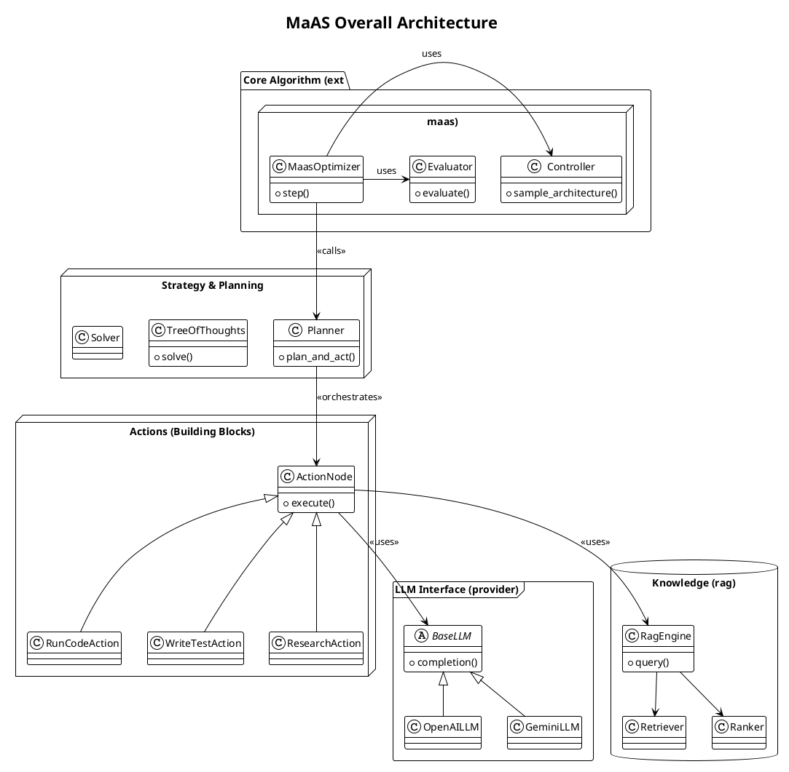
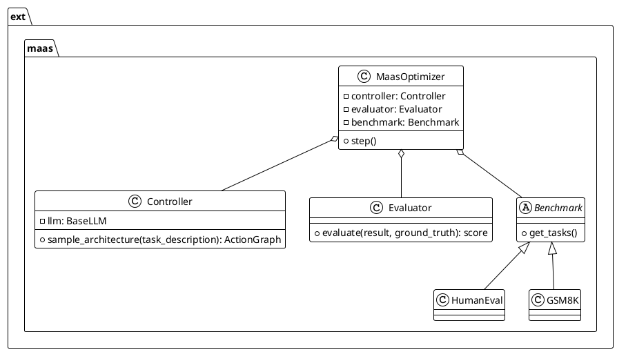
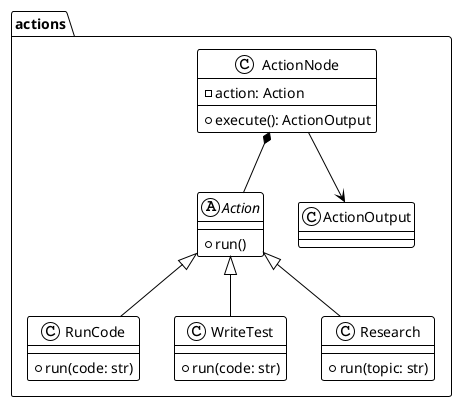

# MaAS (Multi-agent Architecture Search) 项目解读报告

## 0. 项目概览

### 项目名称与简介
- **项目名称**: MaAS (Multi-agent Architecture Search via Agentic Supernet)
- **简介**: MaAS 是一个旨在通过"智能体超网"（Agentic Supernet）自动进行多智能体系统架构搜索的框架。它将设计多智能体系统的问题，从寻找单一最优解，转变为优化一个概率性的、连续的智能体架构分布。

### 核心理念与设计哲学
- **核心理念**: 项目的基石是 "Agentic Supernet"，一个代表了多智能体系统架构分布的超网络。MaAS 不寻求一个固定的、普适的系统，而是根据用户查询的领域和难度，动态地从超网中采样出一个最合适的子网络（即一个定制化的多智能体系统）来执行任务。
- **设计哲学**: 动态、自适应、性能与效率并重。框架通过环境反馈（任务执行结果）来联合优化超网的参数化分布和智能体算子（Agentic Operators），从而实现对不同任务的自适应架构搜索，以达到性能和成本（Token效率）的最佳平衡。

### "Agentic Supernet" 工作机制
根据其核心思想，"Agentic Supernet" 的工作机制可以分解为以下几个步骤：
1.  **智能体超网 (Agentic Supernet)**: 这是一个包含多种基础算子（如 CoT, ReAct, Debate, Reflexion 等）的概率分布网络，覆盖了大量可能的智能体架构组合。每个算子都对应一个可训练的参数化概率分布。
2.  **动态采样与资源分配**: 当接收到一个用户查询时，一个`控制器网络 (Controller)`会首先分析查询的特征（如领域、难度）。然后，它从超网中采样出一个最匹配的子架构。这意味着，简单的查询（如算术题）可能仅激活基础的I/O算子并提前退出（Early-exit），而复杂的查询（如抽象代数）则可能激活一个由"Debate + Reflexion"等多层算子组成的复杂协作流程。这种机制使得资源分配（如LLM调用次数、Token成本）能随查询难度动态调整，避免了资源浪费。
3.  **训练与优化**: 采样出的智能体系统执行任务后，框架会收集环境反馈（如任务成功率、代码执行结果）。利用这些反馈，系统采用强化学习等方法来联合优化超网中算子的参数和它们的分布概率，其核心目标是**最大化任务效用 (Utility) 并最小化资源成本 (Cost)**。

### 技术栈与主要依赖
- **语言**: Python
- **核心框架**: 项目自身实现了一套完整的 Agentic 框架，未强依赖于 LangChain 或 LlamaIndex 等第三方框架，但从代码结构上看借鉴了 MetaGPT 的部分思想。
- **主要依赖**:
    - `openai`: 与 OpenAI 模型交互。
    - `PyYAML`: 解析配置文件。
    - `numpy`: 数值计算。
    - `tenacity`: 用于重试逻辑。
    - `faiss-cpu` / `elasticsearch` / `chromadb`: RAG 后端的向量存储和检索。
    - `playwright` / `selenium`: 浏览器自动化工具。

### 完整目录结构概览
```
MaAS/maas/
├── __init__.py
├── _compat.py
├── actions/
│   ├── __init__.py
│   ├── action.py
│   ├── action_graph.py
│   ├── action_node.py
│   ├── action_outcls_registry.py
│   ├── action_output.py
│   ├── add_requirement.py
│   ├── debug_error.py
│   ├── design_api.py
│   ├── di/
│   │   ├── __init__.py
│   │   ├── ask_review.py
│   │   ├── execute_nb_code.py
│   │   ├── write_analysis_code.py
│   │   └── write_plan.py
│   ├── execute_task.py
│   ├── fix_bug.py
│   ├── run_code.py
│   ├── search_and_summarize.py
│   └── ... (大量其他具体 a ction)
├── config2.py
├── configs/
│   ├── __init__.py
│   ├── browser_config.py
│   ├── embedding_config.py
│   ├── llm_config.py
│   └── ... (其他配置)
├── const.py
├── context.py
├── context_mixin.py
├── document.py
├── ext/
│   └── maas/
│       ├── benchmark/
│       │   ├── benchmark.py
│       │   ├── gsm8k.py
│       │   ├── humaneval.py
│       │   └── math.py
│       ├── models/
│       │   ├── controller.py
│       │   └── utils.py
│       ├── optimizer.py
│       └── scripts/
│           ├── evaluator.py
│           ├── optimizer.py
│           └── utils.py
├── llm.py
├── logs.py
├── provider/
│   ├── __init__.py
│   ├── base_llm.py
│   ├── bedrock/
│   ├── openai_api.py
│   ├── google_gemini_api.py
│   ├── zhipuai_api.py
│   └── ... (大量其他 LLM provider)
├── prompts/
│   ├── __init__.py
│   ├── di/
│   ├── generate_skill.md
│   └── ...
├── rag/
│   ├── __init__.py
│   ├── engines/
│   ├── factories/
│   ├── parsers/
│   ├── rankers/
│   └── retrievers/
├── repo_parser.py
├── schema.py
├── strategy/
│   ├── __init__.py
│   ├── base.py
│   ├── planner.py
│   ├── solver.py
│   └── tot.py
└── tools/
    ├── __init__.py
    ├── search_engine.py
    ├── tool_registry.py
    └── web_browser_engine.py
```

---

## 1. 实验流程详解 (以 HumanEval 为例)

根据 `README.md` 和 `examples/maas/optimize.py` 文件，复现一个完整的实验流程如下。

### 1.1 环境与数据集准备
1.  **克隆代码库**: 首先获取项目代码。
2.  **安装依赖**: 安装 `requirements.txt` (项目中未直接提供，需自行根据 `imports` 生成) 中所需的库。
3.  **下载数据集**: 根据 `README.md` 指引，下载 `HumanEval` 数据集。`HumanEval` 数据集通常是一个 `jsonl` 文件。
4.  **放置数据集**: 在 `MaAS/maas/` 目录下创建一个路径 `ext/maas/data`，并将数据集文件（如 `humaneval.jsonl`）放入其中。项目代码会从该路径加载数据。

### 1.2 API 密钥配置
MaAS 需要一个配置文件来设置 LLM 的 API Key。
1.  **创建配置文件**: 在用户主目录下的 `.metagpt/` 文件夹中创建一个 `config2.yaml` 文件（例如 `C:\Users\YourUser\.metagpt\config2.yaml`）。
2.  **填写配置**: 按照 `examples/maas/config2.example.yaml` 的格式填入你的 API Key。
    ```yaml
    llm:
      api_type: "openai" 
      model: "gpt-4o-mini" # 执行模型的名称
      base_url: "" # 如果使用Agent，填写Agent地址
      api_key: "sk-..."
    ```

### 1.3 运行命令
打开终端，进入 `MaAS` 项目根目录，执行以下命令：
```bash
# 运行优化/训练流程
python -m examples.maas.optimize --dataset HumanEval --round 1 --sample 4 --exec_model_name "gpt-4o-mini"
```

### 1.4 命令与代码解析
- **`python -m examples.maas.optimize`**: 运行位于 `examples/maas` 下的 `optimize.py` 脚本。
- **`--dataset HumanEval`**: 指定使用 `HumanEval` 基准测试。代码会加载 `ext/maas/benchmark/humaneval.py` 来处理数据。
- **`--round 1`**: 优化的轮次。
- **`--sample 4`**: 在每一轮中，从"超网"中采样的架构数量。
- **`--exec_model_name "gpt-4o-mini"`**: 指定执行具体任务的LLM模型。

`optimize.py` 脚本的核心逻辑是：
1.  **加载基准测试**: 根据 `--dataset` 参数初始化一个 `Benchmark` 对象（如 `HumanEval`）。
2.  **初始化优化器**: 创建 `MaasOptimizer` 实例，这是 `MaAS` 算法的核心。
3.  **运行优化循环**:
    - 调用 `optimizer.step()` 方法，该方法会：
        - 使用 `controller` 模型（在 `ext/maas/models/controller.py` 中定义）来决定（采样）当前任务最适合的 `agentic architecture`（智能体架构）。
        - 执行采样出的架构来解决 `HumanEval` 中的问题。
        - 使用 `evaluator` 评估执行结果。
        - 根据评估反馈，更新 `controller` 的参数/策略。
4.  **保存结果**: 优化完成后，将最佳的架构和结果保存下来。

---

## 2. 项目架构设计

### 2.1. 系统整体架构
MaAS 项目是一个事件驱动、策略可组合的 Agent 框架。其架构可以分为以下几个层次：

- **核心算法层 (`ext/maas`)**: 这是 MaAS 的大脑，包含了 `MaasOptimizer`、`Controller` 模型和 `Evaluator`。它负责实现 "Agentic Supernet" 的核心思想，即动态采样、评估和优化多智能体架构。
- **能力执行层 (`actions`)**: 定义了 Agent 可以执行的原子能力，如 `run_code`, `write_test`, `research` 等。这些 Action 是构成不同智能体架构的基本算子/构件。`action_node.py` 表明这些能力可以被组织成图（Graph）。
- **策略与规划层 (`strategy`)**: 提供了高层的任务解决策略，如 `Planner`（规划）和 `ToT`（Tree of Thoughts）。这一层决定了如何组织和调用 `actions` 来完成复杂任务。
- **外部接口层 (`provider`, `tools`)**:
    - `provider`: 封装了对各种大型语言模型（LLM）的调用，实现了与 OpenAI, Gemini, ZhipuAI 等多种服务的解耦。
    - `tools`: 集成了如搜索引擎、网页浏览器等外部工具，为 Agent 提供与外界交互的能力。
- **数据与知识层 (`rag`, `document`)**: 提供了完整的 RAG (Retrieval-Augmented Generation) 流程，包括文档解析、向量化、检索和排序，使 Agent 具备利用外部知识库的能力。
- **配置与上下文层 (`configs`, `context`, `schema`)**: 负责管理整个系统的配置、运行时上下文和统一的数据结构。

### 2.2. 整体架构PlantUML类图


### 2.3. 核心组件交互
1.  **启动**: `optimize.py` 启动 `MaasOptimizer`。
2.  **采样**: `MaasOptimizer` 请求 `Controller` 根据当前任务从"超网"中采样一个最优的智能体架构。这个架构本质上是一个由多个 `ActionNode` 组成的图（或序列）。
3.  **执行**: `Planner` 或 `Solver` 等 `strategy` 模块负责执行这个`Action`图。
4.  **动作执行**: 每个 `ActionNode` 在执行时，可能会调用 `provider` 中的 LLM 来生成代码/文本，或使用 `tools` 中的工具来获取外部信息，或通过 `rag` 模块检索知识。
5.  **评估**: `Evaluator` 对 `Action` 的执行结果进行评估（例如，代码是否能运行，测试是否通过）。
6.  **反馈与优化**: 评估结果反馈给 `MaasOptimizer`，用于更新 `Controller` 的参数，使其在下一轮能够采样出更好的架构。这个过程不断循环，从而实现架构的自动搜索和优化。

---

## 3. 核心模块详细分析

### 3.1 `ext/maas` - 核心算法模块
- **核心职责**: 实现 MaAS 算法的核心逻辑，包括架构的搜索、优化、控制和评估。
- **关键文件**:
    - `optimizer.py`: `MaasOptimizer` 类，驱动整个优化流程。
    - `models/controller.py`: `Controller` 类，智能体超网的核心，负责决策和采样。
    - `scripts/evaluator.py`: `Evaluator` 类，评估采样架构的性能。
    - `benchmark/*.py`: 定义了各项评测基准的数据加载和处理。
- **模块PlantUML类图**:


### 3.2 `actions` - 原子能力模块
- **核心职责**: 定义构成智能体架构的、可复用的基本能力单元（Action）。
- **关键文件**:
    - `action.py`: `Action` 基类，定义了所有 Action 的通用接口。
    - `action_node.py`: `ActionNode` 类，将 `Action` 封装成图中的节点，使其可以被编排和执行。
    - `run_code.py`, `write_test.py` 等: 大量的具体 `Action` 实现。
- **模块PlantUML类图**:


### 3.3 `provider` - LLM 接口模块
- **核心职责**: 提供一个统一的、与具体 LLM 服务解耦的接口层。
- **关键文件**:
    - `base_llm.py`: `BaseLLM` 抽象基类，定义了 `completion`, `acompletion` 等标准接口。
    - `openai_api.py`, `google_gemini_api.py` 等: 针对不同 LLM 服务的具体实现。
    - `llm_provider_registry.py`: `LLMProviderRegistry`，使用注册器模式管理所有可用的 LLM provider。
- **设计模式**: **工厂模式** 和 **注册器模式 (Registry Pattern)**。用户可以通过配置指定 `api_type`，工厂方法会从注册器中获取并实例化对应的 LLM Provider。

---

## 4. 设计模式与项目亮点

### 4.1 设计模式
- **注册器模式 (Registry Pattern)**: 在 `provider`, `tools`, `actions` 中广泛使用。例如 `LLMProviderRegistry` 允许系统在运行时动态地发现和使用不同的 LLM，极大地增强了扩展性。
- **策略模式 (Strategy Pattern)**: 在 `strategy` 模块中体现。`Planner`, `Solver`, `ToT` 等可以被视为不同的任务解决策略，可以根据任务类型进行切换。
- **工厂模式 (Factory Pattern)**: 在 `rag/factories` 中非常明显。`RetrieverFactory`, `RankerFactory` 等根据配置创建不同类型的 RAG 组件，实现了创建过程和具体实现的解耦。
- **责任链模式 (Chain of Responsibility)**: `Action` 的执行流程，尤其是当它们被组织成图时，可以看作是责任链的一种变体，一个节点的输出是下一个节点的输入。

### 4.2 项目亮点
- **Agentic Supernet**: 这是项目最核心的创新。将多智能体系统设计问题转化为一个可优化的架构搜索问题，使得系统能够根据任务动态自适应，是 Agent 领域的一个重要探索。
- **高度模块化与可扩展性**: 项目结构清晰，层级分明。通过注册器和工厂模式，添加一个新的 LLM provider、一个新工具或一个新 Action 都变得非常简单，只需实现接口并注册即可。
- **内置完整的 RAG 和 Tooling**: 项目自包含了从数据处理、检索、到工具使用的全套能力，使其成为一个功能完备的 Agent 框架，而不仅仅是一个算法原型。

### 4.3 与 AFlow 的详细对比
尽管 MaAS 和 AFlow 都致力于自动化多智能体工作流，但它们的设计哲学和技术路径存在显著不同。

| 维度 | MaAS (多智能体架构搜索) | AFlow (自动化工作流) |
| :--- | :--- | :--- |
| **核心目标** | 动态生成**查询定制化**的架构 | 搜索单一**静态最优**工作流 |
| **架构形式** | **概率化超网**，按需采样子架构 | **固定工作流** (如MCTS生成的路径) |
| **资源效率** | **显式优化**资源成本 (Token, API调用) | **隐含优化**，侧重任务完成度 |
| **灵活性** | 支持跨领域/跨难度查询的**自适应调整** | 工作流固定，难以适配新任务 |
| **关键技术** | 控制器网络 + 概率分布 + 强化学习 | 启发式搜索 (MCTS) + 规则优化 |

**总结来说**：
- **MaAS** 是架构生成范式的革命。它将多智能体设计从“静态架构”转向“动态概率分布”，通过超网实现按需资源分配和架构调整，显著提升了效率与跨领域泛化能力。
- **AFlow** 是一个工作流优化工具。它在固定的架构内搜索最优的执行路径，更适合特定且任务模式单一的场景，但缺乏对未知任务的动态适应性。

---

## 5. 总结与建议

### 5.1 总结
MaAS 是一个设计精良、思想前沿的 Agentic AI 研究项目。它不仅提出了创新的 "Agentic Supernet" 理论，还在工程上实现了一个健壮、可扩展、功能完备的框架来验证其理论。它代表了多智能体系统设计范式的一次重要演进：**从追求静态的最优架构，转向了对动态、自适应的架构概率分布的优化**。代码质量高，模块化清晰，为多智能体系统的自动化设计和研究提供了宝贵的参考。

从更宏观的视角看，MaAS 和 AFlow 这样的工作流优化工具本质上是互补的。AFlow 可以被看作是 MaAS 某一个特定子架构（workflow）的内部优化策略，而 MaAS 则为 AFlow 提供了动态生成和扩展架构基础的能力。

### 5.2 建议
- **文档完善**: 项目中的代码注释相对较少，核心算法的实现细节需要通过阅读源码来理解。增加更详细的开发者文档和代码注释，将有助于社区理解和贡献。
- **依赖管理**: 项目缺少 `requirements.txt` 或 `pyproject.toml` 这样的标准依赖管理文件，给初次使用者带来了一定的不便。
- **可视化工具**: "Agentic Supernet" 和动态生成的 `Action` 图是项目的核心，如果能提供一个可视化工具来展示每一轮采样的架构图以及优化的过程，将极大地增强项目的易用性和吸引力。
