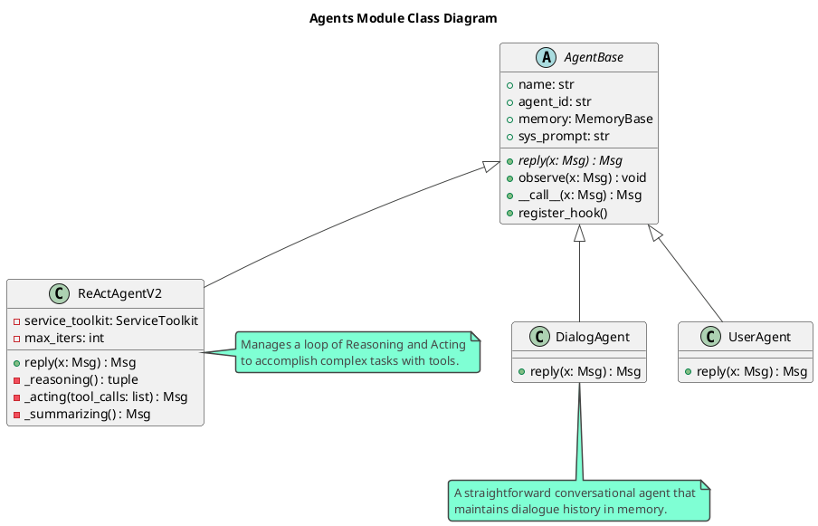
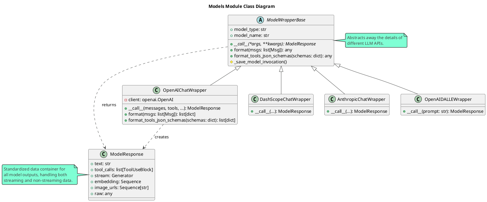
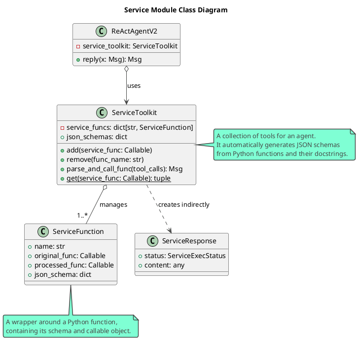

# AgentScope 项目解读报告 - 总览

## 0. 项目概览

### 项目名称与简介
- **项目名称**: AgentScope
- **简介**: 一个为构建大型语言模型（LLM）应用而生的、面向智能体编程（Agent-Oriented Programming）的开发平台。它旨在为开发者提供一个从开发、调试到部署多智能体应用的全栈式解决方案。

### 核心理念与设计哲学
AgentScope 的设计哲学围绕以下几个核心原则：
- **对开发者透明**: 这是 AgentScope 的首要原则。框架力求所有组件和流程，从提示工程到工作流编排，对开发者都是可见和可控的，避免过度封装和"魔法操作"。
- **模型无关**: 实现"一次编程，适配所有模型"的目标。AgentScope 内置了对超过17种主流 LLM API 的支持，允许开发者轻松切换和使用不同的模型。
- **乐高式模块化构建**: 框架的所有组件（如智能体、工具、记忆）都保持高度模块化和独立性，开发者可以像搭积木一样按需选用和组合。
- **面向多智能体架构**: 框架原生为多智能体应用设计，提供了显式的消息传递机制(`msghub`)和灵活的工作流编排能力，而非将多智能体交互隐藏在复杂的封装背后。
- **原生分布式与并行化**: AgentScope 从设计之初就考虑了分布式场景，通过 RPC 模块支持智能体的跨进程/跨设备部署、自动并行化和中心化编排。
- **高度可定制**: 鼓励开发者对框架的各个层面进行定制，包括工具、提示、智能体、流程和可视化界面。

### 技术栈与主要依赖
AgentScope 使用 Python 作为主要开发语言，其功能依赖于一个精心挑选的库组合：
- **核心依赖**:
  - `pydantic`: 用于数据校验和设置管理。
  - `loguru`: 提供强大而简洁的日志记录功能。
  - `tiktoken`: 用于精确计算 `token` 数量。
  - `networkx`: 用于构建和管理复杂的工作流图。
  - `openai`, `dashscope`: 默认支持两个主流的模型服务商。
- **分布式通信**:
  - `grpcio` & `protobuf`: 构建高性能的 RPC 框架，实现智能体的分布式通信。
  - `redis`: 作为可选的消息中间件，支持更可靠的分布式消息分发。
- **Web与可视化**:
  - `gradio` & `modelscope_studio`: 快速构建用于调试和演示的 Web UI 界面。
- **服务与工具集**:
  - `playwright`: 支持与浏览器进行交互，实现网页自动化操作。
  - `docker`: 用于执行隔离的代码环境。
  - `bs4` (BeautifulSoup): 用于解析 HTML 和 XML 内容。
  - 数据库驱动 (`pymongo`, `pymysql`): 支持与各类数据库交互。
- **RAG (检索增强生成)**:
  - `llama-index`: 集成业界领先的 RAG 框架，快速构建知识库问答应用。
- **其他模型支持**:
  - `google-generativeai`, `litellm`, `zhipuai`, `ollama`, `anthropic` 等，提供了广泛的模型兼容性。

### 目录结构概览
`agentscope` 的核心源码位于 `src/agentscope` 目录下，其结构清晰，职责分明：

```
agentscope/
├── agents/           # 核心：定义了各种类型的智能体 (Agent)
├── models/           # 核心：封装了对不同LLM的调用
├── rpc/              # 核心：实现分布式通信 (RPC)
├── service/          # 核心：提供给Agent使用的工具集 (Toolkit)
├── message/          # 定义Agent间通信的消息(Message)结构
├── memory/           # 为Agent提供记忆(Memory)功能
├── pipelines/        # 支持将多个操作组合成流水线(Pipeline)
├── server/           # Agent服务的服务端实现
├── environment/      # 定义Agent运行的环境
├── rag/              # 检索增强生成 (RAG) 相关功能
├── prompt/           # Prompt管理与优化
├── manager/          # 统一管理模型、文件等资源
├── formatters/       # 适配不同模型API的输入输出格式
├── parsers/          # 解析模型输出的特定格式（如JSON）
├── strategy/         # 定义多智能体协作策略
├── web/              # Web UI (Gradio) 相关代码
├── utils/            # 通用工具函数
├── exception.py      # 自定义异常
├── constants.py      # 全局常量
└── msghub.py         # 消息中心，用于多智能体通信
```

## 1. 项目架构设计

### 1.1. 系统整体架构
AgentScope 采用了分层、模块化的架构，自下而上可以分为以下几个核心层次：

1.  **模型层 (`models`)**: 这是与底层大语言模型直接交互的接口层。它将不同厂商（如 OpenAI, Dashscope, Google, Anthropic）的 API 封装成统一的 `ModelWrapper` 接口，实现了模型无关性。
2.  **消息层 (`message`)**: 定义了系统中最基本的数据单元——`Msg`。所有智能体之间的交互、记忆存储、与用户的沟通都通过标准化的消息对象来完成。
3.  **智能体层 (`agents`)**: 这是框架的核心。`AgentBase` 定义了智能体的基本行为（`reply` 方法）。基于此，框架派生出 `DialogAgent` (对话型)、`UserAgent` (用户代理)、`ReActAgent` (使用 ReAct 范式) 等多种具体实现。开发者可以轻松定制自己的智能体。
4.  **服务/工具层 (`service`)**: 为智能体提供与外部世界交互的能力。通过 `ServiceToolkit`，智能体可以调用代码执行、文件操作、网页搜索、数据库查询等一系列预置或自定义的工具。
5.  **记忆层 (`memory`)**: 赋予智能体长期和短期记忆。`Memory` 模块负责存储和检索对话历史，支持多种记忆管理策略。
6.  **通信与编排层 (`msghub`, `pipelines`, `rpc`)**:
    *   `MsgHub`: 一个强大的消息总线，用于管理多智能体之间的消息广播和订阅，是实现群聊、协作等复杂交互模式的关键。
    *   `Pipelines`: 提供了 `sequential`, `parallel`, `conditional` 等多种方式来编排智能体或操作的执行流程，构建复杂的工作流。
    *   `RPC`: 框架的分布式核心，允许将智能体作为服务部署在不同节点，实现大规模、高性能的多智能体系统。
7.  **应用/UI层 (`web`)**: 通过 `Gradio` 和 `ModelScope Studio`，为开发者提供了可视化的调试工具和应用展示界面，降低了开发和验证的门槛。

整个架构的设计体现了"高内聚、低耦合"的原则，使得每一部分都可以独立演进和扩展，同时也为开发者提供了极大的灵活性。

### 1.2. 模块划分与职责
以下是 `agentscope` 项目核心模块的职责划分：

-   **`agents`**: 定义不同类型的智能体，是框架的核心执行单元。
-   **`models`**: 封装对多种大语言模型（LLM）的调用接口，实现模型无关性。
-   **`rpc`**: 实现远程过程调用，支持分布式智能体通信。
-   **`service`**: 提供一系列工具（Toolkits），如文件读写、网页浏览、代码执行等。
-   **`memory`**: 为智能体提供记忆功能。
-   **`message`**: 定义智能体之间通信的消息格式。
-   **`pipelines`**: 支持将多个操作串联成工作流。
-   **`server`**: 提供了启动和管理Agent服务的服务端能力。
-   **`environment`**: 定义智能体运行和交互的环境。
-   **`rag`**: 实现检索增强生成（RAG）相关功能。
-   **`prompt`**: 管理和优化提示词。
-   **`manager`**: 负责模型、文件等资源的管理。
-   **`formatters`**: 适配不同模型输入输出格式。
-   **`parsers`**: 用于解析模型返回的特定格式内容。
-   **`strategy`**: 定义了多智能体协作策略。
-   **`utils`**: 通用工具函数。
-   **`web`**: Gradio实现的Web UI界面。

---

接下来，我将开始对核心模块进行深度分析。

## 2. 核心模块分析: `agents`

`agents` 模块是 AgentScope 框架的灵魂，它定义了所有智能体（Agent）的行为和类型。

### 2.1 模块概述
- **模块路径**: `src/agentscope/agents`
- **核心职责**: 提供智能体的基类，并在此基础上实现多种具体的智能体类型，如对话型、用户输入型、以及强大的 ReAct 型智能体。它是整个框架的执行核心。
- **主要组件**:
  - `AgentBase`: 所有智能体的抽象基类。
  - `DialogAgent`: 一个通用的、可用于对话的智能体。
  - `UserAgent`: 代表人类用户，用于接收命令行输入。
  - `ReActAgentV2`: 实现了 ReAct (Reasoning and Acting) 范式的智能体，能够与工具交互以完成复杂任务。

### 2.2 文件结构与实现分析

#### `_agent.py`: `AgentBase` 基类
这是所有智能体的基础，其设计精妙，体现了框架的核心思想：

- **核心方法**:
  - `reply(x)`: **抽象核心方法**。每个子类必须实现此方法，定义了智能体如何响应输入消息 `x`。这是智能体的主要逻辑所在。
  - `observe(x)`: 使智能体能够"观察"消息而不必立即回复，通常用于更新其内部记忆。
  - `__call__(x)`: `reply(x)` 的语法糖，使得智能体对象可以直接被调用。
- **钩子系统 (Hook System)**:
  - 通过元类 `_HooksMeta` 实现，允许在 `reply` 和 `observe` 等关键方法的执行前后挂载自定义函数（`pre-reply`, `post-reply`）。
  - 这个设计极大地增强了框架的可扩展性，开发者可以在不修改基类的情况下，注入日志记录、性能监控、数据预处理等逻辑。
- **分布式支持**:
  - `AgentBase` 继承自 `RpcMeta`，使其天生具备了分布式能力。在初始化时通过 `to_dist=True` 参数，可以轻松地将一个本地智能体"服务化"，部署到远程节点上。
- **状态管理**: 每个智能体实例都拥有唯一的 `agent_id` 和一个 `memory` 对象（默认为 `TemporaryMemory`），用于维护其状态和对话历史。

#### `_dialog_agent.py`: `DialogAgent`
`DialogAgent` 是对 `AgentBase` 的一个直接且经典的实现，它封装了标准对话机器人的核心流程：

1.  **记忆**: 将收到的消息 `x` 存入记忆。
2.  **构建提示**: 将系统提示 (`sys_prompt`) 和记忆中的历史对话记录组合成完整的提示。
3.  **调用模型**: 将格式化后的提示发送给 LLM 并获取回复。
4.  **输出与更新**: "说出"回复内容，并将自己的回复也存入记忆，形成完整的对话上下文。

这个智能体实现清晰，是构建单轮或多轮对话应用的基础。

#### `_react_agent_v2.py`: `ReActAgentV2`
`ReActAgentV2` 是框架中最强大和复杂的智能体之一，它为智能体赋予了使用工具来解决问题的能力。其工作流程遵循 ReAct 范式：

1.  **初始化**: `ReActAgentV2` 在创建时需要绑定一个 `ServiceToolkit` 对象，该对象包含了它能使用的所有工具（函数）。框架会自动为其添加一个名为 `generate_response` 的特殊"终结工具"。
2.  **推理 (Reasoning)**: 在 `_reasoning` 步骤中，智能体向 LLM 发出请求。这个请求不仅包含对话历史，还包含了所有可用工具的函数签名（JSON Schema）。LLM 被要求进行"思考"，并决定下一步是调用某个工具，还是直接回答。
3.  **行动 (Acting)**: 如果 LLM 决定调用工具，`_acting` 方法会被触发。它会：
    - 解析 LLM 返回的工具调用请求（函数名和参数）。
    - 使用 `ServiceToolkit` 执行该函数。
    - 将函数的执行结果（作为一次"观察"）存入记忆。
4.  **迭代循环**: 智能体将带着新的观察结果，回到第 2 步，开始新一轮的"推理"。这个"推理-行动-观察"的循环会持续进行，直到满足以下任一条件：
    - LLM 决定调用 `generate_response` 工具，代表它认为已经收集到足够信息，可以生成最终答案。
    - 循环次数达到了预设的上限 (`max_iters`)。

这个机制使得 `ReActAgentV2` 能够处理需要信息检索、数据计算、API 调用等复杂步骤的任务，极大地扩展了智能体的应用场景。

### 2.3 模块PlantUML类图


## 3. 核心模块分析: `models`
`models` 模块是 AgentScope 与外部大语言模型（LLM）沟通的桥梁。它通过一个强大的抽象层，将不同厂商的、多样化的 API 封装成统一的接口，是实现"模型无关"特性的基石。

### 3.1 模块概述
- **模块路径**: `src/agentscope/models`
- **核心职责**: 提供一个统一的、标准化的方式来调用各种 LLM，无论是用于生成文本、函数调用、还是生成图像和向量。
- **主要组件**:
  - `ModelWrapperBase`: 所有模型封装器的抽象基类。
  - `ModelResponse`: 标准化的模型输出对象。
  - `OpenAIChatWrapper`, `DashScopeChatWrapper`, `AnthropicChatWrapper`, 等: 针对不同服务商（OpenAI, Alibaba, Anthropic, Google, ZhipuAI等）和功能（聊天、图像生成、向量化）的具体实现。

### 3.2 文件结构与实现分析

#### `model.py`: `ModelWrapperBase` 抽象基类
`ModelWrapperBase` 定义了所有模型封装器必须遵守的"契约":
- **`__call__(...)`**: **核心抽象方法**。每个子类必须实现它，负责调用具体的模型 API，并返回一个标准化的 `ModelResponse` 对象。
- **`format(...)`**: 核心方法，负责将 AgentScope 内部的 `Msg` 对象列表转换成特定模型 API 所需的输入格式（例如，OpenAI 的 `[{"role": "user", ...}]` 格式）。这是实现上层智能体代码复用的关键。
- **`format_tools_json_schemas(...)`**: 为 `ReActAgent` 等需要使用工具的智能体服务，此方法将框架内通用的工具函数定义（JSON Schema）转换成特定模型（如OpenAI, Anthropic）"Tools API"所要求的格式。
- **日志与重试**:
  - `_save_model_invocation`: 内置了调用记录的保存机制，可以自动记录每次 API 调用的输入、输出和 token 使用量，对于成本控制和调试至关重要。
  - `_response_parse_decorator`: 一个强大的装饰器，为 API 调用提供了自动重试和响应解析的能力，增强了系统的鲁棒性。

#### `response.py`: `ModelResponse` 标准化输出
这个类抹平了不同模型 API 返回结果的差异。无论原始 API 的输出是什么结构，最终都会被解析并封装成一个 `ModelResponse` 对象。
- **关键属性**:
  - `text`: 模型返回的主要文本内容。
  - `tool_calls`: 模型请求调用的工具列表，供 `ReActAgent` 使用。
  - `stream`: 一个生成器，用于优雅地处理流式响应。
  - `embedding`, `image_urls`: 分别用于处理向量和图像生成的结果。
  - `raw`: 保留了未经处理的原始 API 响应，便于调试。
- **流式处理**: 该类巧妙地处理了流式输出。外部代码只需简单地访问 `response.stream`，即可在消耗流的同时自动更新 `response.text` 属性，极大地简化了上层代码对流式和非流式响应的处理逻辑。

#### `openai_model.py`: `OpenAIChatWrapper` 实现示例
这个文件是 `ModelWrapperBase` 的一个典型实现，展示了如何将一个具体的 API 接入 AgentScope 体系：
1.  **初始化 (`__init__`)**: 负责初始化 `openai` 的官方 Python 客户端，并处理 API Key 等认证信息。
2.  **实现 `__call__`**:
    - 接收 `messages`, `tools`, `tool_choice` 等参数，这些参数与 OpenAI 的 API 高度对应。
    - 内部处理流式和非流式两种情况。对于流式请求，它会创建一个生成器，逐块（chunk）地从 API 读取数据；对于非流式请求，则是一次性调用。
    - **最关键的一步**：将 OpenAI API 返回的原始数据（无论是单个 JSON 还是数据流）解析，并用其内容填充一个 `ModelResponse` 对象后返回。
3.  **实现 `format`**: 调用 `OpenAIFormatter`，将 `Msg` 列表转换成 OpenAI API 的 `messages` 格式。
4.  **实现 `format_tools_json_schemas`**: 将通用的工具 Schema 转换成 OpenAI API 的 `tools` 参数格式。

通过这套机制，AgentScope 成功地将智能体的核心逻辑与具体模型的实现细节解耦。开发者可以轻松地通过更换配置文件中的 `model_type` 来切换不同的 LLM，而无需改动智能体的代码。

### 3.3 模块PlantUML类图


## 4. 核心模块分析: `service`
`service` 模块为智能体提供了与外部世界交互的"手臂"和"感官"。它通过一个强大而灵活的工具包（Toolkit）机制，让开发者可以轻松地将任意 Python 函数转换为智能体能够理解和调用的工具。

### 4.1 模块概述
- **模块路径**: `src/agentscope/service`
- **核心职责**: 管理和执行智能体可用的工具集。它负责将普通 Python 函数转换成包含 JSON Schema 的标准化格式，处理来自智能体的工具调用请求，并返回执行结果。
- **主要组件**:
  - `ServiceToolkit`: 核心类，一个用于注册、管理和调用工具的工具箱。
  - `ServiceFunction`: 一个数据类，用于封装单个工具的元信息。
  - `ServiceResponse`: 标准化的工具执行结果。
  - 各子目录 (`_code`, `browser`, `file`, `sql_query`): 包含了一系列预置的、开箱即用的工具实现。

### 4.2 文件结构与实现分析

#### `service_toolkit.py`: `ServiceToolkit` 核心实现
`ServiceToolkit` 的设计目标是最大化地降低工具开发的门槛，同时保证类型安全和调用的规范性。

- **`add(service_func)`**: 这是向工具包注册新工具的核心方法。其背后依赖静态方法 `get()` 完成大部分魔法般的工作。
- **`get(service_func)` (静态方法)**: 这是工具"自动化封装"的核心。
  1.  **代码内省与文档解析**: 它接收一个普通的 Python 函数，然后通过 `inspect` 模块获取其函数签名（参数名、类型、默认值），并通过 `docstring-parser` 库解析其 **Google 风格的文档字符串**。
  2.  **动态生成 JSON Schema**: 结合从函数签名和文档字符串中获取的信息，它能**自动地**为这个函数生成一份详尽的 JSON Schema。这份 Schema 清晰地描述了函数的用途、所有参数的名称、类型、描述以及是否必需。这正是 `ReActAgent` 提供给 LLM 的"工具使用说明书"。
  3.  **动态创建 Pydantic 模型**: 为了在实际执行前校验参数，它甚至会利用 `pydantic.create_model` 在运行时为该函数动态创建一个 Pydantic 模型，确保 LLM 提供的参数是类型安全的。
- **`parse_and_call_func(tool_calls)`**: 这是 `ReActAgent` 在"行动"阶段调用的方法。
  1.  它接收来自 LLM 的工具调用请求（一个 `ToolUseBlock` 对象）。
  2.  在工具库中查找同名函数。
  3.  使用前面动态创建的 Pydantic 模型来验证 LLM 提供的参数。
  4.  执行实际的 Python 函数。
  5.  捕获函数的返回值或异常，并将其封装在一个 `ToolResultBlock` 中返回给智能体，作为其下一步推理的"观察"结果。

- **预置工具**: `service` 模块下的子目录提供了大量即用型工具，例如：
  - `service._code.exec_python`: 执行 Python 代码。
  - `service.browser.web_browser`: 浏览网页。
  - `service.file.common`: 读写文件。
  - `service.web.search`: 调用搜索引擎。

这个设计对开发者极为友好。开发者只需用 Python 编写一个功能函数，并为它写好标准格式的文档，AgentScope就能自动将其无缝集成到智能体的工具集中，无需手动编写任何胶水代码或 Schema 定义。

### 4.3 模块PlantUML类图


## 5. 核心模块分析: `message`, `msghub`, `pipelines`
这三个模块共同构成了 AgentScope 的通信与编排层。它们定义了信息的基本单元，并提供了智能体之间进行交互和协作的机制。

### 5.1 模块概述
- **`message`**: 定义了框架中信息流动的基本载体——`Msg` 类及其内容组件。
- **`msghub`**: 提供了一个"消息总线"或"聊天室"，用于实现多智能体之间的广播式通信。
- **`pipelines`**: 提供了一系列工具，用于将多个智能体或操作编排成一个有序的工作流。

### 5.2 文件结构与实现分析

#### `message`: 消息——系统的血液
`message` 模块的设计兼具结构化与灵活性，是支撑多模态和工具使用的关键。

- **`Msg` 类**: 这是一个基于 Pydantic 的数据类，定义了一条消息的核心属性：
  - `name`: 发送者名称。
  - `role`: 角色（"system", "user", 或 "assistant"），与主流 LLM API 保持一致。
  - `content`: **消息的核心内容**。它可以是一个简单的字符串，也可以是一个 `ContentBlock` 列表。
- **`ContentBlock`**: `content` 的灵活性来源于其基于"块"的结构。每个块是一个 `TypedDict`，代表一种特定类型的内容：
  - `TextBlock`: 纯文本。
  - `ImageBlock`, `AudioBlock`, `VideoBlock`: 多媒体内容。
  - `ToolUseBlock`: **工具调用请求**。当 `ReActAgent` 决定使用工具时，它会在消息中包含一个这样的块，其中指明了工具的 `name` 和 `input`（参数）。
  - `ToolResultBlock`: **工具执行结果**。当工具被执行后，其结果会被包装在这个块里，并返回给智能体。

这种基于块的结构使得单条消息可以承载复杂、异构的信息（例如，同时包含文本指令和工具调用结果），这对于构建高级智能体至关重要。

#### `msghub`: 多智能体通信的"聊天室"
`msghub` 提供了一种极其简洁优雅的方式来实现多智能体之间的群组通信。

- **上下文管理器**: `msghub` 被设计成一个 Python 的上下文管理器（`with` 语句）。
  - `with msghub(participants=[agent1, agent2, ...]) as hub:`
- **工作机制**:
  1.  **进入时**: 当进入 `with` 代码块时，`msghub` 会自动为列表中的每一个 `participant`（参与者）设置"观众"（audience），即列表中的所有其他智能体。
  2.  **广播**: 在 `with` 代码块内部，任何一个智能体的输出（`reply` 的返回值）都会被**自动广播**给它的所有观众（即被观众的 `observe` 方法接收）。
  3.  **退出时**: 当离开 `with` 代码块时，所有智能体的"观众"设置会被自动清除，广播停止。

这个设计巧妙地利用了智能体自身的 `observe` 方法，避免了引入复杂的发布/订阅模式。它直观地模拟了"将一群智能体拉入一个聊天室共同讨论"的场景，极大简化了多智能体协作应用的开发。

#### `pipelines`: 声明式的工作流编排
`pipelines` 模块提供了将多个操作（主要是智能体调用）串联起来的能力，使得复杂的交互流程可以用一种声明式的方式来定义。

- **`sequential_pipeline`**: 这是最基础也是最常用的流水线。
  - `sequential_pipeline([agent1, agent2, agent3], initial_input)`
- **执行流程**: 它接收一个"算子"（operator）列表和一个初始输入。算子可以是任何可调用对象，比如智能体实例。它会按顺序执行列表中的算子，并将上一个算子的输出作为下一个算子的输入。
- **作用**: 这等同于 `agent3(agent2(agent1(initial_input)))`，但代码可读性更强，更易于维护。对于链式思考或多步任务处理的场景非常有用。
- **高级流水线**: 除了顺序执行，框架还提供了更复杂的基于类的流水线，支持并行执行（`ParallelPipeline`）和条件分支（`ConditionalPipeline`），以满足更高级的编排需求。

### 5.3 模块PlantUML类图
```plantuml
@startuml
!theme vibrant
title Communication and Orchestration Diagram

class Msg {
  + name: str
  + role: str
  + content: Union[str, list[ContentBlock]]
}

class TextBlock {}
class ToolUseBlock {}
class ToolResultBlock {}
note "and other media blocks" as N1
(TextBlock, ToolUseBlock, ToolResultBlock) .. N1

' Define ContentBlock as a union
package ContentBlock <<Union>> {
  TextBlock --|> ContentBlock
  ToolUseBlock --|> ContentBlock
  ToolResultBlock --|> ContentBlock
}
Msg *-- "1" ContentBlock

class AgentBase {
 + reply(x: Msg): Msg
 + observe(x: Msg)
}

class MsgHubManager {
  - participants: list[AgentBase]
  + __enter__()
  + __exit__()
  + broadcast(msg: Msg)
}
MsgHubManager o-- "*" AgentBase

class "sequential_pipeline()" as SeqPipeline <<function>> {
  + operators: list[Callable]
}
SeqPipeline ..> AgentBase : "calls"

note right of Msg
  The fundamental data unit,
  can contain multi-modal content
  via ContentBlocks.
end note

note bottom of MsgHubManager
  A context manager that creates a
  "chat room" for a group of agents,
  enabling broadcast communication.
end note

note bottom of SeqPipeline
  A functional way to define
  a linear chain of agent
  interactions.
end note

@enduml
```

## 6. 核心模块分析: `rpc` 与分布式支持
`rpc` 模块是 AgentScope 实现大规模、分布式多智能体系统的核心，也是其区别于许多其他智能体框架的关键特性。它使得智能体可以跨进程、跨机器进行通信和协作。

### 6.1 模块概述
- **模块路径**: `src/agentscope/rpc`, `src/agentscope/server`
- **核心职责**: 提供将本地智能体"服务化"的能力。它定义了客户端和服务端之间的通信协议，并处理对象的序列化、远程方法调用和生命周期管理。
- **主要组件**:
  - `rpc_agent.proto`: 使用 Protocol Buffers 定义的 gRPC 服务契约。
  - `RpcClient` (`rpc_client.py`): 客户端存根，为本地代码提供与远程智能体交互的接口。
  - `RpcAgentServicer` (`servicer.py`): 服务端的 gRPC 服务实现，负责托管和执行智能体。
  - `as_server` (`launcher.py`): 用于启动智能体服务端的命令行工具。

### 6.2 实现分析：透明的远程调用

AgentScope 的分布式实现对开发者来说是高度透明的。其工作流程如下：

1.  **启动服务端**: 用户在服务器上通过 `as_server --host 0.0.0.0 --port 12345` 命令启动一个 gRPC 服务。这个服务内部维护着一个智能体实例的注册表。

2.  **声明远程智能体**: 在客户端代码中，开发者像往常一样实例化一个智能体，但会额外传入一个 `to_dist` 参数：
    ```python
    from agentscope.agents import DialogAgent
    from agentscope.rpc import DistConf

    # This agent will actually live on the remote server
    remote_agent = DialogAgent(
        name="server_agent",
        sys_prompt="I am running on a server.",
        model_config_name="my_model",
        to_dist=DistConf(host="x.x.x.x", port=12345)
    )
    ```

3.  **"魔法"发生**: `AgentBase` 的元类 `RpcMeta` 会拦截这个实例化过程。它并**不会**在本地创建一个 `DialogAgent` 对象。取而代之的是：
    a. 创建一个 `RpcClient`，连接到指定的服务端。
    b. 将 `DialogAgent` 的初始化参数（`name`, `sys_prompt` 等）通过 `cloudpickle` 序列化。
    c. 调用服务端的 `create_agent` RPC 方法，将序列化后的参数发送过去。
    d. 服务端接收到请求，反序列化参数，并在**其自身进程中**创建一个真实的 `DialogAgent` 实例，并用其 `agent_id` 作为键存入注册表。
    e. `RpcMeta` 在**本地**返回一个轻量级的**代理对象 (Proxy Object)**。

4.  **无感的远程调用**: 从开发者的角度看，`remote_agent` 就像一个普通的本地对象。但是，当调用 `remote_agent.reply(x)` 时：
    a. 本地的代理对象会拦截这个方法调用。
    b. 它使用 `RpcClient` 调用服务端的 `call_agent_func` RPC 方法，并传递 `agent_id`、方法名 `"reply"` 以及序列化后的输入 `x`。
    c. 服务端根据 `agent_id` 找到真实的智能体实例，并执行其 `reply(x)` 方法。
    d. 执行结果被序列化后返回给客户端，客户端的代理对象再将其反序列化，并作为 `reply` 方法的返回值。

通过这套精巧的元编程和 RPC 机制，AgentScope 成功地将一个远程对象的操作封装得如同本地调用一样自然，极大地降低了开发分布式智能体应用的复杂度。开发者可以专注于业务逻辑，而将网络通信、序列化等底层细节交由框架处理。

### 6.3 模块PlantUML类图
```plantuml
@startuml
!theme vibrant
title RPC and Distributed Architecture

package "Client Side" {
  class "Local Script" as Client
  class "AgentProxy" as Proxy {
    - rpc_client: RpcClient
    + reply(x: Msg): Msg
  }
  class RpcClient {
    + create_agent(args): bool
    + call_agent_func(id, func, args): any
  }
  Client o--> Proxy : "interacts with"
  Proxy o--> RpcClient : "uses"
}

package "Server Side" {
  class "RpcAgentServicer" as Servicer {
    + CreateAgent(request)
    + CallAgentFunc(request)
  }
  class "AgentRegistry" <<dict>> as Registry
  class "RealDialogAgent" as RealAgent {
    + reply(x: Msg): Msg
  }
  Servicer o-- Registry : "manages"
  Registry o-- "*" RealAgent : "holds"
}

RpcClient ..> Servicer : "gRPC call"

note right of Proxy
  A lightweight proxy object that
  mimics the real agent's interface.
  Method calls are forwarded via RPC.
end note

note right of Servicer
  The gRPC server implementation that
  receives requests, finds the real agent
  in the registry, and executes its methods.
end note

@enduml
```

## 7. 整体架构与总结

### 7.1 项目整体架构 PlantUML 类图
这张图综合了前面所有模块的分析，展示了 AgentScope 框架中核心组件之间的高层交互关系。

```plantuml
@startuml
!theme vibrant
title AgentScope Overall Architecture

package "Core Concepts" {
  class Msg {
    + name: str
    + role: str
    + content: any
  }
  class AgentBase {
    + reply(x: Msg): Msg
  }
}

package "Agent Implementations" {
  class DialogAgent
  class ReActAgentV2
  AgentBase <|-- DialogAgent
  AgentBase <|-- ReActAgentV2
}

package "Model Layer" {
  abstract class ModelWrapperBase {
    + __call__(...): ModelResponse
  }
  class ModelResponse
  ModelWrapperBase ..> ModelResponse
  ReActAgentV2 o--> ModelWrapperBase
  DialogAgent o--> ModelWrapperBase
}

package "Service & Tools" {
  class ServiceToolkit {
    + parse_and_call_func(call)
  }
  ReActAgentV2 o--> ServiceToolkit
}

package "Communication & Orchestration" {
  class MsgHubManager
  class "sequential_pipeline()" as Pipeline

  MsgHubManager o-- "*" AgentBase
  Pipeline ..> AgentBase
}

package "Distributed Layer" {
  class RpcClient
  class "AgentProxy"
  AgentProxy o--> RpcClient
  Client o--> AgentProxy
  note "Local Script" as Client
}

AgentBase -> Msg : uses/produces
ModelResponse --> Msg : is converted to

@enduml
```

### 7.2 设计模式与项目亮点

AgentScope 的代码中体现了多种优秀的设计模式和架构思想：

- **模板方法模式 (Template Method Pattern)**: `AgentBase` 和 `ModelWrapperBase` 是典型的模板方法应用。它们定义了算法的骨架（`reply` 和 `__call__` 的调用流程），同时允许子类在不改变结构的情况下，重写特定的步骤（如 `reply` 的具体逻辑，或特定模型的 API 调用方式）。
- **代理模式 (Proxy Pattern)**: `rpc` 模块是代理模式的绝佳范例。本地的 `AgentProxy` 对象作为远程真实智能体对象的代理，将方法调用无缝地转发到服务端，对用户屏蔽了所有网络通信细节。
- **观察者模式 (Observer Pattern)**: `msghub` 的实现可以看作是观察者模式的一种应用。当一个智能体（主题）"发言"时，所有在 `msghub` 中的其他智能体（观察者）都会通过 `observe` 方法收到通知。
- **上下文管理器模式 (Context Manager Pattern)**: `msghub` 通过 `with` 语句提供了一个清晰的、有生命周期的"聊天室"环境，确保了资源的正确设置和清理（添加/移除观众）。
- **元编程 (Metaprogramming)**: 框架在 `AgentBase` 中使用元类 `_HooksMeta` 和 `RpcMeta`，在不侵入基类代码的情况下，动态地为 `reply`, `observe` 等方法添加了钩子功能和 RPC 功能，这是一种非常高级和灵活的技巧。
- **依赖注入 (Dependency Injection)**: 智能体（如 `DialogAgent`, `ReActAgentV2`）在创建时会接收它们所依赖的组件（如 `ModelWrapper` 实例，`ServiceToolkit` 实例），而不是在内部创建它们。这降低了耦合度，使得组件更易于测试和替换。

**项目亮点**:
- **对开发者透明**: 这是项目最值得称赞的设计哲学。无论是工具的自动生成，还是 `msghub` 的直观设计，亦或是分布式的透明代理，框架始终努力避免不必要的复杂度和"黑魔法"，让开发者能清晰地理解发生了什么。
- **强大的可扩展性**: 钩子系统、模块化的模型层和服务层，使得向框架中添加新功能、新模型、新工具都变得非常容易。
- **原生分布式设计**: 与许多在后期才考虑分布式的框架不同，AgentScope 从底层设计（`RpcMeta`）就融入了分布式能力，使其在处理大规模智能体协作任务时具有天然优势。
- **自动化与易用性**: `ServiceToolkit` 从函数文档自动生成工具 Schema 的功能，极大地提升了开发效率，降低了出错的可能性。

### 7.3 总结与建议

**总结**:
AgentScope 是一个设计精良、功能全面且高度可扩展的多智能体框架。它通过一系列巧妙的设计（透明度、模块化、元编程、原生分布式），成功地平衡了易用性与功能的强大性。其核心优势在于为开发者提供了一个从简单对话机器人到复杂的、分布式的、具备工具使用能力的多智能体系统的全栈式解决方案。

**潜在改进建议**:
- **状态持久化**: 当前智能体的默认记忆是临时的 (`TemporaryMemory`)。虽然可以自定义实现，但框架层面可以提供更完善的状态持久化方案（如与 Redis 或数据库集成），方便智能体在重启或迁移后恢复状态。
- **安全性**: `service._code.exec_python` 等工具非常强大，但也带来了安全风险。可以考虑引入更完善的沙箱机制（如使用 Docker 容器执行代码）来增强安全性。
- **文档完善**: 尽管代码注释和文档字符串质量很高，但对于一些高级用法（如自定义复杂的 Pipeline），提供更多的示例和教程会更有帮助。

**二次开发指南**:
- **添加新工具**: 最常见的二次开发需求。只需编写一个符合 Google 风格文档的 Python 函数，然后将其添加到 `ServiceToolkit` 即可。这是扩展智能体能力最直接的方式。
- **添加新模型**: 在 `models` 目录下，参照 `openai_model.py` 创建一个新的 `ModelWrapper` 子类，实现 `__call__` 和 `format` 方法，然后在配置文件中引用即可。
- **自定义新智能体**: 继承 `AgentBase` 或其他现有智能体，重写 `reply` 方法以实现独特的行为逻辑。
- **探索最佳路径**: 建议从 `examples` 目录入手，从简单的 `conversation_basic` 开始，逐步理解 `conversation_with_react_agent`，最后到 `game_werewolf` 或 `distributed_debate`，这样能循序渐进地掌握框架的核心功能。

---
## 8. 复杂示例分析

为了更好地展示 AgentScope 的能力，我们选取 [game_werewolf](https://github.com/modelscope/agentscope/tree/main/examples/game_werewolf) 这个复杂的多智能体协作示例进行分析。

### 8.1 `game_werewolf` 示例

这个示例模拟了一个经典的社交推理游戏——狼人杀。它完美地展示了 AgentScope 在处理以下问题上的能力：
- **复杂的多智能体通信**: 游戏中的多个角色（狼人、村民、预言家、守卫等）需要在不同阶段进行公共讨论和私下交流（如狼人夜间讨论）。
- **角色扮演与状态管理**: 每个智能体都需要有明确的角色设定（通过 `sys_prompt`）和记忆（谁是狼人、谁被怀疑等）。
- **中心化的游戏逻辑控制**: 需要一个"主持人"（Moderator）智能体来控制游戏流程（白天、黑夜、投票、宣布结果等），并根据游戏规则向不同角色分发信息。

**实现方式**:
1.  **主持人 (`Moderator`)**: 这是一个核心的控制智能体。它的 `reply` 方法中包含了整个游戏的状态机。它不调用 LLM，而是根据当前游戏阶段（如 `ANNOUNCEMENT_WEREWOLF`）来生成指令性消息。
2.  **玩家智能体 (`Player`)**: 所有玩家都继承自一个自定义的 `WerewolfAgent`。这个智能体在初始化时被赋予了不同的角色 `profile` 和系统提示。
3.  **`msghub` 的巧妙运用**:
    - **白天讨论**: 主持人将所有存活的玩家放入一个 `msghub`，实现公开的自由讨论。
    - **狼人夜话**: 主持人**只将所有狼人角色**放入一个 `msghub`，这样它们的夜间战术讨论就只对狼人内部可见。
    - **预言家验人**: 这是一个点对点的交互，主持人单独调用预言家的 `reply` 方法，并将结果单独返回。
4.  **结构化输出**: 玩家在投票或执行技能时，被要求以特定的格式（如 JSON）输出，主持人通过 `parser` 来解析这些结构化输出，以保证游戏逻辑的准确执行。

这个例子充分证明了 AgentScope 通过 `msghub` 和灵活的 `reply` `observe` 机制，能够以一种非常清晰和模块化的方式，构建出具有复杂通信模式和中心化控制逻辑的多智能体应用。