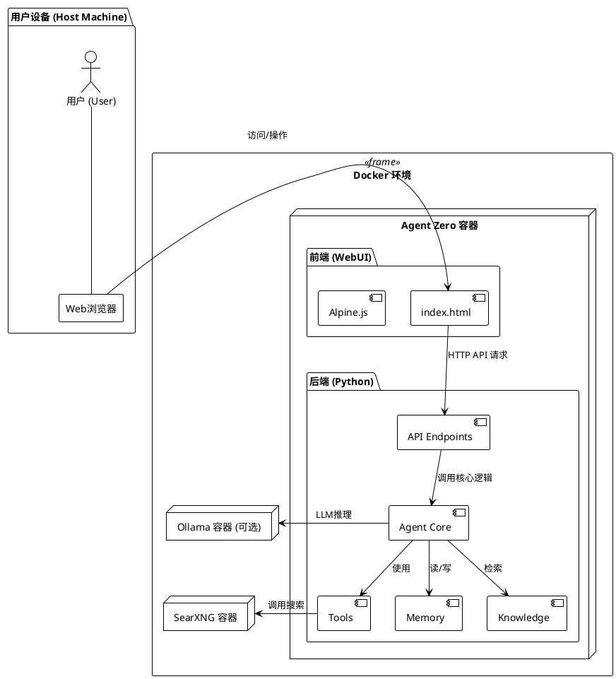
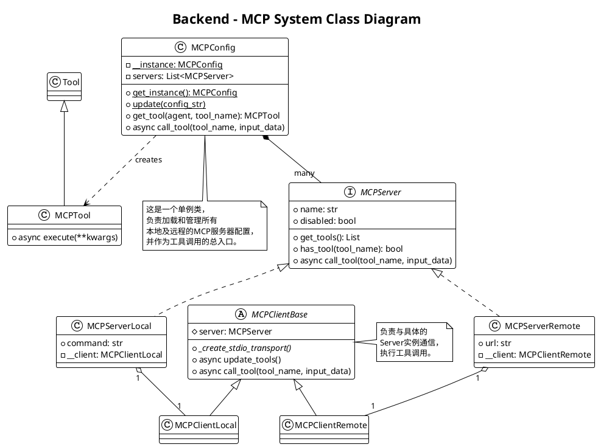
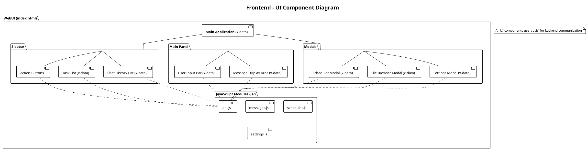

# Agent Zero 项目解读报告 - 总览

## 0. 项目概览

- **项目名称:** Agent Zero
- **项目简介:** Agent Zero 是一个基于 Docker 的、灵活且高度可扩展的AI智能体框架。它允许用户构建、管理和与能够执行复杂任务（如代码执行、网页浏览、文件管理）的AI智能体进行交互。项目强调隐私、模块化和用户定制，通过分层的智能体结构和强大的工具集，实现了复杂任务的自动化处理。
- **核心理念:** 隐私优先（通过本地部署和 SearXNG）、模块化设计（组件清晰分离）、高度可扩展（通过自定义工具、提示词和扩展）。
- **技术栈:**
  - **后端:** Python (推测使用 FastAPI 框架)
  - **前端:** JavaScript (使用 Alpine.js)
  - **部署:** Docker, Docker Compose
  - **核心依赖:** Ollama (用于本地LLM), SearXNG (用于隐私搜索)

## 1. 项目架构设计

### 1.1. 系统整体架构

Agent Zero 采用经典的**前后端分离**架构，并整体运行在 **Docker 容器**中，极大地简化了部署和环境依赖。

1.  **用户接口 (Frontend):** 用户通过基于 Alpine.js 的 WebUI 与系统交互。前端负责呈现聊天界面、设置、文件浏览器等，并将用户请求发送到后端。
2.  **后端服务 (Backend):** 后端是项目的核心，负责处理所有业务逻辑。它接收前端请求，管理智能体的生命周期，调用大型语言模型（LLM）进行推理，并通过工具执行具体任务。
3.  **智能体核心 (Agent Core):** 这是后端内部的核心。一个层级式的智能体系统能够将复杂任务分解并委派给下级智能体。每个智能体都拥有记忆（Memory）和知识（Knowledge），并能使用工具（Tools）。
4.  **外部服务 (Services):**
    - **LLM 服务:** 通过 API 与本地（如 Ollama）或云端的大型语言模型连接，获取推理能力。
    - **SearXNG:** 作为默认的搜索引擎，为 `knowledge_tool` 提供隐私保护的网页搜索能力。
5.  **数据持久化 (Persistence):** 项目的关键数据，如记忆、知识库、日志、用户工作目录等，都通过 Docker Volume 挂载到宿主机，确保容器重启后数据不丢失。

这种以 Docker 为中心的架构，使得 Agent Zero 成为一个自包含、跨平台的应用，用户只需安装 Docker 即可获得完整的体验。

### 1.2. 整体架构PlantUML类图



### 1.3. 模块划分与职责

| 核心模块 | 路径 | 主要职责 |
|---|---|---|
| **文档 (Documentation)** | `docs/` | 提供项目安装、使用、架构和贡献指南。 |
| **后端 (Backend)** | `python/` | 项目核心逻辑。处理API请求，管理智能体，与LLM交互，执行工具。 |
| - API | `python/api/` | 定义了所有与前端交互的HTTP接口，设计上每个文件对应一个功能点，非常模块化。 |
| - 核心辅助 | `python/helpers/` | 包含智能体核心逻辑（`mcp_handler.py`）、记忆、历史、设置管理等关键实现。 |
| - 工具集 | `python/tools/` | 定义了智能体可以使用的各种能力，如代码执行、浏览器代理、知识检索等。 |
| - 扩展机制 | `python/extensions/` | 提供了一套基于事件钩子的扩展系统，允许在智能体运行的不同阶段注入自定义逻辑。 |
| **前端 (Frontend)** | `webui/` | 提供用户操作界面，基于Alpine.js构建，实现了与后端的实时通信。 |
| **Docker配置** | `docker/` | 包含 Dockerfile 和相关脚本，用于构建和管理项目的容器化环境。 |
| **数据目录** | `memory/`, `knowledge/`, `logs/`, `work_dir/` | 通过Docker Volume挂载，用于持久化存储智能体的记忆、知识、日志和工作文件。 |

## 2. 分析文件索引

- @核心模块-后端(Python)详细分析
- @核心模块-前端(WebUI)详细分析
- @使用案例与总结

---
*报告生成中...*

## 核心模块-后端(Python)详细分析

### 1. 模块概述

- **模块路径:** `/python/`
- **核心职责:** 作为 Agent Zero 的大脑和神经系统，后端模块负责处理所有核心逻辑。它不仅包含了与前端通信的 API 服务，更重要的是，它实现了智能体的"思考"循环、记忆管理、工具调用以及与外部 LLM 的交互。其设计高度模块化，并将不同的功能清晰地划分到 `api`, `helpers`, `tools`, 和 `extensions` 等子目录中。
- **主要组件:**
    - **API层 (`api/`):** 提供细粒度的HTTP接口，供前端调用。
    - **核心逻辑层 (`helpers/`):** 实现了项目最核心的机制，如 MCP（Master Control Program）处理器、记忆系统、历史管理、任务调度等。
    - **工具层 (`tools/`):** 定义了智能体可以使用的具体能力，是智能体与外部世界交互的"手臂"。
    - **扩展层 (`extensions/`):** 一套创新的钩子系统，允许开发者在智能体工作流的关键节点注入自定义行为。

### 2. 文件结构与实现分析

#### 2.1 关键文件列表与功能

- **`helpers/mcp_handler.py`**: **项目的脉搏**。该文件实现了一个主控程序（MCP）协议，用于管理和执行工具。它定义了本地 (`MCPServerLocal`) 和远程 (`MCPServerRemote`) 两种工具服务器，并通过客户端 (`MCPClient`) 进行调用。这种设计将工具的定义与执行完全解耦，使得 Agent Zero 可以调用在另一台机器上运行的工具，具备极高的灵活性和分布式能力。
- **`helpers/task_scheduler.py`**: 一个功能强大的任务调度器。它允许创建、管理和执行定时或触发式的后台任务，使智能体能够处理异步和长周期的工作流。
- **`helpers/memory.py` & `helpers/history.py`**: 实现了复杂的记忆和历史管理系统。它不仅能存储对话，还能自动进行摘要和压缩，以在有限的上下文窗口内保留最重要的信息。
- **`tools/` 目录**: 包含了所有即插即用的工具，如 `code_execution_tool.py`（执行Python、Node.js、Shell代码）、`browser_agent.py`（控制无头浏览器进行网页操作）和 `knowledge_tool.py`（使用SearXNG进行知识检索）。
- **`extensions/` 目录**: 这是 Agent Zero 最具创新性的设计之一。通过在不同子目录（如 `monologue_start`, `message_loop_end`）中放置脚本，开发者可以"挂钩"到智能体思考过程的特定阶段，修改提示词或执行特定操作，从而在不修改核心代码的情况下改变智能体的行为。

#### 2.2 核心算法与数据流

Agent Zero 的核心工作流程可以概括如下：

1.  **接收请求:** 前端通过 `api/message.py` 发送用户指令。
2.  **思考循环 (Inference Loop):** 智能体核心（可能在 `agent.py` 或由 `mcp_handler` 协调）接收到指令。
3.  **上下文构建:** 系统从 `history` 和 `memory` 中检索相关信息，并结合 `prompts` 和 `extensions` 构建出最终发送给 LLM 的上下文。
4.  **LLM 调用:** 将构建好的上下文发送给 LLM（如 Ollama）进行推理。
5.  **意图解析:** LLM 返回的结果通常包含"想法"（Thoughts）和要调用的"工具"（Tool）。
6.  **工具执行:** 系统解析出工具名称和参数。如果该工具是 MCP 工具，`mcp_handler.py` 接管，通过对应的客户端（Local/Remote）执行工具，并获取结果。
7.  **结果反馈:** 工具执行的结果被添加回对话历史中。
8.  **循环/响应:** 系统将工具结果作为新的上下文，再次进入思考循环，或生成最终响应返回给用户。

这个流程体现了经典的 **ReAct (Reason + Act)** 模式，即智能体通过"思考"来决定"行动"（使用工具），并根据行动结果进行下一步思考。

### 3. 模块PlantUML类图

下图展示了后端 MCP 系统的核心类及其关系，揭示了其分布式工具调用的设计。



## 核心模块-前端(WebUI)详细分析

### 1. 模块概述

- **模块路径:** `/webui/`
- **核心职责:** 作为用户与 Agent Zero 系统交互的唯一窗口，前端负责提供一个直观、响应迅速且功能丰富的用户界面。它不仅要清晰地展示与智能体的对话流，还要提供对系统各种功能的控制，如设置管理、任务调度、文件浏览等。
- **技术选型:** 前端的核心是 **Alpine.js**，一个轻量级的 JavaScript 框架。这个选择体现了项目务实的设计哲学：在不引入 React/Vue 等大型框架的复杂性的前提下，实现动态和响应式的UI组件。

### 2. 文件结构与实现分析

#### 2.1 关键文件列表与功能

- **`index.html`**: 项目的单页入口。它定义了整个应用的 HTML 骨架，包括侧边栏、主聊天窗口、模态框等主要区域。通过在 HTML 标签上使用 `x-data`, `x-for`, `@click` 等 Alpine.js 指令，直接在模板中赋予了页面动态行为。
- **`index.js` & `js/` 目录**:
    - `index.js` 是主要的逻辑入口。
    - `js/` 目录下的文件遵循模块化的思想，将不同功能的客户端逻辑分离开来，例如：
        - `js/api.js`: 封装了所有与后端通信的 `fetch` 调用，提供了一个统一的 `callJsonApi` 函数，简化了网络请求。
        - `js/messages.js`: 管理消息的显示、渲染（包括Markdown、代码、数学公式）和滚动。
        - `js/scheduler.js`: 负责处理任务调度器页面的所有逻辑，如获取任务列表、创建/编辑任务等。
        - `js/settings.js`: 管理设置模态框的状态和与后端的交互。
        - `js/speech.js`: 实现了语音识别和文字转语音的功能，提升了交互体验。
- **`index.css` & `css/` 目录**: 提供了应用的样式。项目使用了清晰的 BEM（Block Element Modifier）命名风格，并为不同组件（如 toast, modal, file_browser）组织了独立的 CSS 文件。

#### 2.2 核心实现与交互模式

前端的交互核心是 **数据驱动** 和 **事件驱动**。

- **数据驱动:** Alpine.js 通过 `x-data` 定义了各个UI"组件"的状态。当这些状态（如消息列表、任务列表）发生变化时，`x-for` 和其他指令会自动更新DOM，重新渲染界面。例如，当收到新的聊天消息时，只需将消息添加到 `messages` 数组中，页面就会自动显示新消息。
- **事件驱动:** 用户的操作（如点击按钮 `@click`）或系统事件会触发相应的 JavaScript 函数。这些函数通常会调用 `api.js` 中的 `callJsonApi` 与后端通信。
- **与后端通信:** 所有通信都是通过异步的 HTTP POST 请求完成的。前端发送 JSON 数据到后端特定的 API 端点（如 `/api/message`），后端处理后返回 JSON 格式的响应。这种无状态的 RESTful 交互模式使得前后端可以独立开发和部署。
- **富文本渲染:** 前端集成了多个库来增强显示效果：
    - **Showdown:** 将后端返回的 Markdown 格式的文本转换为 HTML。
    - **KaTeX:** 用于渲染专业的数学公式。
    - **Ace Editor:** 用于高亮显示代码块。

### 3. 模块组件图

下图展示了前端UI的主要组件及其关系。



## 4. 设计模式与亮点分析

### 4.1 设计模式

- **单例模式 (Singleton):** `MCPConfig` 类被实现为单例，确保在整个应用中只有一个 MCP 服务器配置和管理实例，避免了配置不一致和重复加载的问题。
- **策略模式 (Strategy):** `mcp_handler.py` 中通过 `MCPServerLocal` 和 `MCPServerRemote` 实现了策略模式。对于工具调用，系统可以根据配置在"本地执行"和"远程执行"这两种策略之间动态切换，而调用方（智能体）无需关心其具体实现。
- **门面模式 (Facade):** `js/api.js` 中的 `callJsonApi` 函数为前端提供了一个简单的接口来与复杂的后端API系统进行交互，隐藏了 `fetch`、请求头设置、JSON序列化等实现细节。
- **ReAct (Reason + Act) 模式:** 正如前文所述，智能体的核心工作流遵循"思考+行动"的模式，这是当前主流 Agent 设计的基础模式。

### 4.2 项目亮点

- **容器化优先架构:** 项目彻底拥抱 Docker，将整个框架（包括WebUI、后端、依赖）打包成一个镜像。这使得安装部署异常简单，完美解决了跨平台的环境依赖问题，是项目工程上的一大亮点。
- **分布式工具执行 (MCP):** MCP协议的设计是技术上最大的创新。它不仅将工具与智能体核心解耦，还允许工具以分布式的方式运行在不同机器上，为系统的水平扩展和异构计算（如在带GPU的服务器上运行特定工具）提供了无限可能。
- **高度可扩展的Hook系统 (`extensions/`):** 提供了非侵入式的定制能力。开发者无需修改核心代码，只需在特定目录中添加脚本，就能在智能体思考过程的关键节点注入自定义逻辑。这是一种极其强大和灵活的扩展机制。
- **务实的前端技术选型 (Alpine.js):** 在功能需求复杂（需要支持富文本、模态框、响应式列表等）的情况下，选择 Alpine.js 而非更重的框架，体现了对项目复杂度和维护成本的精准把控，实现了"恰到好处"的工程实践。
- **完善的记忆与上下文管理:** 自动化的对话历史摘要和压缩机制，是解决大模型上下文窗口限制的关键技术，能有效支持长对话和复杂任务。

## 5. 重要使用案例：市场新闻分析与数据可视化

这个案例将展示如何引导 Agent Zero ① 使用知识工具搜索网络信息 -> ② 使用代码执行工具处理数据并生成图表 -> ③ 将结果保存在工作目录中。

### 5.1 准备工作：安装与启动

1.  **安装 Docker Desktop:** 根据你的操作系统（Windows/macOS/Linux），从 [Docker官网](https://www.docker.com/products/docker-desktop/) 下载并安装 Docker Desktop。
2.  **拉取 Agent Zero 镜像:** 打开终端或 PowerShell，运行以下命令：
    ```bash
    docker pull frdel/agent-zero-run
    ```
3.  **创建数据目录:** 在你电脑上选择一个位置，创建一个用于存放 Agent Zero 数据的文件夹，例如 `D:\agent-zero-data`。
4.  **运行容器:** 在终端中运行以下命令，将你创建的目录挂载到容器中。
    ```bash
    # 将 D:\agent-zero-data 替换为你的实际路径
    docker run -d -p 50080:80 -v D:\agent-zero-data:/a0 --name agent-zero frdel/agent-zero-run
    ```
    - `-d` 表示在后台运行。
    - `-p 50080:80` 将容器的80端口映射到你电脑的50080端口。你可以换成其他未被占用的端口。
    - `-v` 用于挂载数据目录。
    - `--name agent-zero` 为容器指定一个方便记忆的名称。

5.  **访问 Web UI:** 打开浏览器，访问 `http://localhost:50080`。

### 5.2 核心配置：设置LLM

1.  **进入设置:** 在 Agent Zero 界面的左侧栏，点击齿轮状的"Settings"按钮。
2.  **配置大模型:**
    - **如果你有本地Ollama:**
        - **Chat Model Provider:** 选择 `ollama`。
        - **Chat Model Name:** 填入你已下载的模型，例如 `llama3`。
        - **Utility Model Provider:** 也可选择 `ollama`。
        - **Utility Model Name:** 可以选择一个较小的模型以提高效率，如 `phi3`。
    - **如果你使用云端API (以OpenAI为例):**
        - 在 `API Keys` 部分填入你的 `OPENAI_API_KEY`。
        - **Chat Model Provider:** 选择 `openai`。
        - **Chat Model Name:** 填入模型名称，如 `gpt-4o-mini`。
3.  **保存设置:** 点击页面底部的 `Save` 按钮。Agent Zero 会自动应用配置。

### 5.3 执行复杂任务

现在，向 Agent Zero 发出以下指令。这个指令明确地要求它成为一个特定角色，并指导它使用特定工具来完成分步任务。

```text
你现在是一名专业的金融市场分析师。
你的任务是：
1.  使用 `knowledge_tool` 工具，搜索过去一个月（例如，2024年5月）关于"人工智能（AI）行业"的重大新闻事件。
2.  同时，使用 `knowledge_tool` 查找同期纳斯达克指数（IXIC）的每日收盘价数据。
3.  使用 `code_execution_tool` 工具，编写一个 Python 脚本来完成以下工作：
    a. 使用 `matplotlib` 和 `pandas` 库。
    b. 将纳斯达克指数的每日价格绘制成一条折线图。
    c. 在图表上，根据你找到的重大新闻的日期，在对应日期的位置用红色圆点进行标记，并添加简短的事件标注。
    d. 将最终生成的图表保存为 `nasdaq_ai_news_analysis.png` 文件到 `/work_dir/` 目录中。
4.  完成所有操作后，使用 `response_tool` 告诉我图表已生成完毕。
```

**预期执行流程：**

1.  Agent Zero 会首先调用 `knowledge_tool`，在网络上搜索 AI 行业新闻和纳斯达克指数数据。
2.  接着，它会调用 `code_execution_tool`。你会在聊天窗口中看到它生成的 Python 代码。
3.  代码执行工具会在容器内的沙盒环境中运行该脚本，安装必要的库（pandas, matplotlib），处理数据并生成图表。
4.  最后，它会返回一个消息，告诉你任务已完成，图表已保存。
5.  你可以通过左侧栏的"文件浏览器"图标进入文件系统，在 `work_dir` 目录下找到并下载 `nasdaq_ai_news_analysis.png` 查看结果。

这个案例充分展示了 Agent Zero 整合不同工具、处理多步指令并最终产出有价值结果的核心能力。

## 6. 总结与建议

### 6.1 项目优势总结

Agent Zero 是一个设计精良、工程实践出色的开源AI智能体框架。其核心优势在于：

- **极低的上手门槛:** 彻底的容器化方案，让非专业开发者也能在几分钟内完成部署并开始使用。
- **强大的扩展能力:** 分布式工具执行协议（MCP）和独特的Hook扩展系统，为二次开发和功能集成提供了巨大的想象空间。
- **对隐私的重视:** 默认集成 SearXNG，并以本地化部署为核心，充分尊重用户的数据隐私。
- **稳定与成熟:** 从任务调度器到记忆管理，再到前后端的交互设计，项目处处体现出对稳定性和用户体验的深度思考，完成度非常高。

### 6.2 潜在改进建议

- **文档与代码同步:** 在分析中发现 `architecture.md` 中提到的 `agent.py` 文件在当前目录结构中不易找到，建议保持文档与代码结构的严格同步，方便新贡献者理解。
- **前端组件化:** 虽然 Alpine.js 已足够胜任，但 `index.html` 文件较为庞大。未来可考虑将大的UI块（如Scheduler界面、Settings界面）拆分成独立的HTML模板文件，在构建时或由后端动态加载，以提升可维护性。
- **可视化调试工具:** 当前依赖 `Context` 和 `History` 的JSON输出来进行调试。未来如果能提供一个可视化的界面来展示智能体的思考链（Chain of Thought）、工具调用流程和上下文构建过程，将会极大地提升开发和调试效率。
