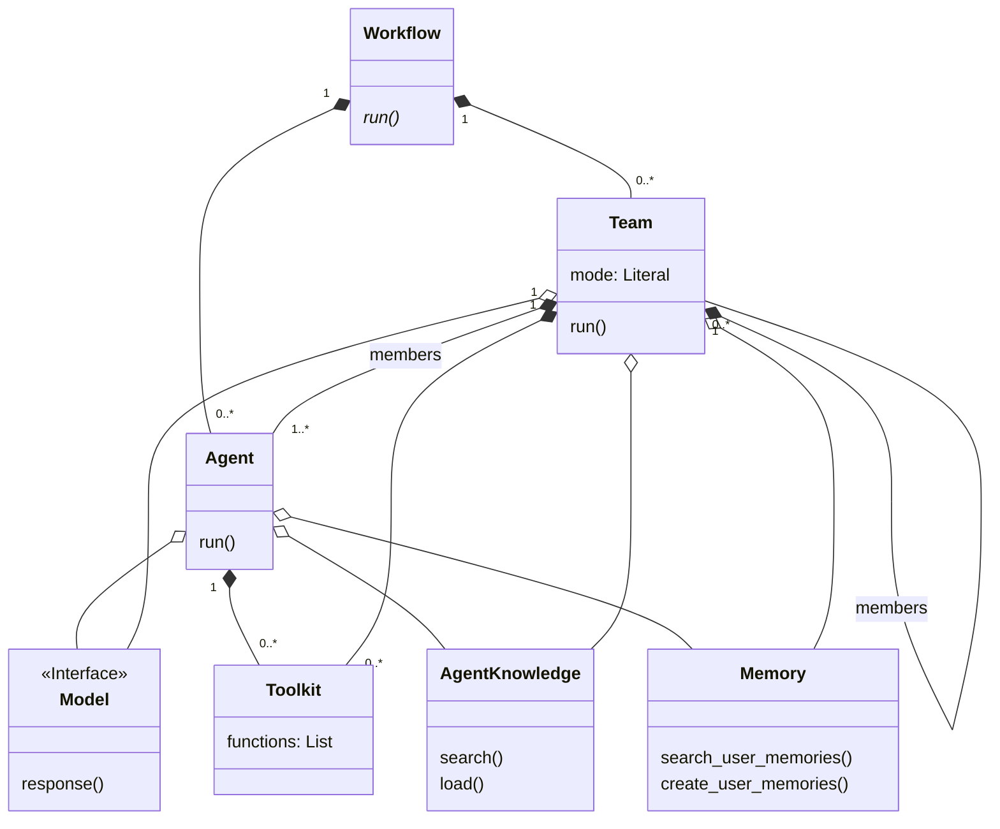

# Agno 框架深度解析报告

## 0. 项目概览

- **项目名称**: Agno
- **核心理念与设计哲学**: `agno` 是一个功能全面、高度模块化的 Python 框架，旨在构建从简单的单一智能体到复杂的分层多智能体系统的各种应用。其设计哲学围绕着**组合优于继承**、**万物皆工具**和**关注点分离**的核心原则，为开发者提供了极大的灵活性和可扩展性。
- **技术栈与主要依赖**:
  - Python 3.8+
  - Pydantic: 用于核心数据模型的定义和验证。
  - 各类大语言模型（LLM）SDK（如 `openai`, `anthropic` 等）。
  - 各类工具和数据源库（如 `duckduckgo-search`, `yfinance`, `lancedb` 等）。
- **目录结构概览**:
  - `agno/libs/agno/agno/`: 框架核心源代码。
    - `agent/`: 核心 `Agent` 类定义。
    - `team/`: `Team` 类定义，用于多智能体协作。
    - `workflow/`: `Workflow` 类定义，用于编排复杂任务流。
    - `models/`: 抽象并集成各类 LLM。
    - `tools/`: 提供给智能体的工具和能力。
    * `memory/`: 记忆系统，包括 v2 版本的长期记忆和会话历史。
    - `knowledge/`: RAG 知识库，用于信息检索。
    - `storage/`: 持久化存储接口。
  - `agno/cookbook/`: 包含大量示例代码，展示框架的各项功能。

## 1. 项目架构设计

### 1.1. 系统整体架构

`agno` 的架构设计以 `Agent` 为中心。`Agent` 是执行任务的基本单位，它通过组合不同的模块来获得能力：
- **`Model`**: 为 Agent 提供推理能力。
- **`Toolkit`**: 为 Agent 提供执行具体操作的能力。
- **`AgentKnowledge`**: 为 Agent 提供从外部知识库检索信息的能力（RAG）。
- **`Memory`**: 为 Agent 提供短期和长期记忆。

多个 `Agent` 可以被组织成一个 `Team`，由一个作为"领导者"的智能体进行协调。`Team` 自身也像一个 `Agent`，可以拥有自己的模型、工具和记忆，甚至可以包含其他的 `Team`，从而形成分层的、复杂的组织结构。

最后，`Workflow` 类提供了一个最高层次的编排机制，开发者可以通过继承 `Workflow` 并实现 `run` 方法，来定义一个由多个 `Agent` 和 `Team` 协作完成的复杂业务流程。

### 1.2. 整体架构 Mermaid 类图



### 1.3. 模块划分与职责

- **`agent`**: 定义了框架的基本执行单元 `Agent`，负责处理单个任务。
- **`models`**: 抽象了与大语言模型的交互，支持多种 LLM 提供商。
- **`tools`**: 提供了智能体的能力库，将 Python 函数封装为 LLM 可调用的工具。
- **`memory`**: 管理智能体的记忆，包括短期对话历史和长期知识。
- **`knowledge`**: 实现 RAG 功能，从外部数据源提取知识。
- **`team`**: 定义了多智能体协作的模式，允许 `Agent` 组成团队。
- **`workflow`**: 提供了任务流编排的能力，用于组合和执行复杂的业务逻辑。

## 2. 核心模块详细分析

### 2.1 Agent 模块

- **核心职责**: 提供框架的核心执行单元 `Agent` 类。这是一个高度可配置的"上帝对象"，通过组合模型、工具、记忆和知识库来执行任务并管理其生命周期。
- **设计分析**: `Agent` 类的设计充分利用了组合模式，使其极为灵活。开发者通过在构造函数中传入不同的组件来定制 Agent 的行为，而不是通过继承来扩展。它封装了与 LLM 交互、解析响应、调用工具、更新记忆等一系列复杂逻辑。
- **模块 Mermaid 类图**:
  ```mermaid
  classDiagram
    class Agent {
        +name: str
        +agent_id: str
        +model: Model
        +memory: Memory
        +knowledge: AgentKnowledge
        +storage: Storage
        +tools: List
        +team: List
        +reasoning: bool
        +run()
        +arun()
        +continue_run()
        +reason()
    }

    class Model
    class Memory
    class AgentKnowledge
    class Storage
    class Toolkit
    class Function
    class RunResponse

    Agent --o Model
    Agent --o Memory
    Agent --o AgentKnowledge
    Agent --o Storage
    Agent "1" *-- "0..*" Agent : forms team
    Agent "1" *-- "0..*" Toolkit
    Agent "1" *-- "0..*" Function
    Agent ..> RunResponse : returns
  ```

### 2.2 Models 模块

- **核心职责**: 抽象与不同大语言模型的交互过程。它定义了一个统一的 `Model` 接口，并为 OpenAI, Anthropic, Google, HuggingFace 等数十个 LLM 供应商提供了具体的实现。
- **设计分析**: 该模块是策略模式和工厂模式的典型应用。`Model` 抽象基类定义了 `invoke`、`ainvoke`、`response` 等核心方法，而每个子类则负责将这些标准调用转换为特定供应商的 API 请求。这种设计使得更换或增加新的 LLM 变得非常简单。
- **模块 Mermaid 类图**:
  ```mermaid
  classDiagram
    class Model {
        <<Abstract>>
        id: str
        provider: str
        invoke(messages)*: any
        ainvoke(messages)*: any
        invoke_stream(messages)*: Iterator
        ainvoke_stream(messages)*: AsyncIterator
        parse_provider_response(response)*: ModelResponse
        parse_provider_response_delta(chunk)*: ModelResponse
        response(messages): ModelResponse
        aresponse(messages): ModelResponse
        response_stream(messages): Iterator
        aresponse_stream(messages): AsyncIterator
    }

    class Message {
      role: str
      content: str
      tool_calls: List
    }

    class ModelResponse {
      content: str
      tool_executions: List
      event: str
    }
    
    class OpenAIChat {
      invoke(messages): any
      ainvoke(messages): any
    }

    class AnthropicChat {
      invoke(messages): any
      ainvoke(messages): any
    }

    Model <|-- OpenAIChat
    Model <|-- AnthropicChat
    Model "1" o-- "many" Message : uses
    Model ..> ModelResponse : creates

    note for Model "And 20+ other provider implementations..."
  ```

### 2.3 Tools 模块

- **核心职责**: 为 Agent 提供超越文本生成的能力。它负责定义外部工具的接口，将 Python 函数包装成 LLM 可调用的 `Function`，并提供了一个包含大量预构建工具的 `Toolkit` 库。
- **设计分析**: `Function` 类是该模块的核心，它通过自省函数签名和文档字符串来自动生成 LLM 进行函数调用所需的 JSON Schema。`Toolkit` 类则作为 `Function` 的容器，方便地对一组工具进行管理和配置。这是"函数即工具"理念的优秀实现。
- **模块 Mermaid 类图**:
  ```mermaid
  classDiagram
    class Toolkit {
        name: str
        tools: List
        functions: Dict
        register(callable)
    }

    class Function {
        name: str
        description: str
        parameters: Dict
        entrypoint: Callable
        from_callable(callable): Function
    }

    class FunctionCall {
        function: Function
        arguments: Dict
        result: any
        execute(): FunctionExecutionResult
        aexecute(): FunctionExecutionResult
    }

    class FunctionExecutionResult {
      status: str
      result: any
      error: str
    }

    Toolkit "1" *-- "many" Function : contains
    FunctionCall ..> Function : invokes
    FunctionCall ..> FunctionExecutionResult : returns

    note for Toolkit "Example toolkits in other files:\n- YoutubeToolkit\n- GithubToolkit\n- SlackToolkit"
  ```

### 2.4 Memory 模块 (v2)

- **核心职责**: 为 Agent 提供一个复杂的、可持久化的记忆系统。它清晰地区分了不同类型的记忆：长期事实 (`UserMemory`)、会话摘要 (`SessionSummary`) 和原始对话历史 (`RunResponse`)。
- **设计分析**: 这是一个非常成熟的记忆系统。`Memory` 类作为外观，协调 `MemoryManager`（负责 agentic 地创建和更新记忆）、`SessionSummarizer`（负责生成摘要）和 `MemoryDb`（负责持久化存储）三个核心组件。这种设计分离了数据存储、记忆加工和高层访问的关注点。
- **模块 Mermaid 类图**:
  ```mermaid
  classDiagram
    class Memory {
      model: Model
      memory_manager: MemoryManager
      summary_manager: SessionSummarizer
      db: MemoryDb
      memories: Dict
      summaries: Dict
      runs: Dict
      create_user_memories()
      create_session_summary()
      search_user_memories()
      add_run()
      get_messages_from_last_n_runs()
    }

    class MemoryManager {
      model: Model
      create_or_update_memories()
    }

    class SessionSummarizer {
      model: Model
      run(conversation): Summary
    }

    class MemoryDb {
      <<Interface>>
      read_memories()
      upsert_memory()
      delete_memory()
    }
    
    class UserMemory
    class SessionSummary
    class RunResponse

    Memory o-- MemoryManager
    Memory o-- SessionSummarizer
    Memory o-- MemoryDb
    Memory o-- Model
    Memory "1" *-- "many" UserMemory
    Memory "1" *-- "many" SessionSummary
    Memory "1" *-- "many" RunResponse
  ```

### 2.5 Knowledge 模块

- **核心职责**: 实现 Retrieval-Augmented Generation (RAG) 的"检索"部分。它负责从各种数据源（文件、URL、YouTube等）中提取信息，将其处理成可搜索的 `Document`，并根据查询检索相关内容。
- **设计分析**: `AgentKnowledge` 类是典型的 RAG 管道实现，它作为外观，编排了 `Reader`（读取数据）、`ChunkingStrategy`（分块）和 `VectorDb`（向量化存储和搜索）三个核心组件。这种清晰的划分使得整个 RAG 流程易于理解和扩展。
- **模块 Mermaid 类图**:
  ```mermaid
  classDiagram
    class AgentKnowledge {
        +reader: Reader
        +vector_db: VectorDb
        +chunking_strategy: ChunkingStrategy
        +num_documents: int
        +load()
        +aload()
        +search(query): List~Document~
        +async_search(query): List~Document~
    }

    class Reader {
        <<Interface>>
        +load_data(): List~Document~
    }

    class VectorDb {
        <<Interface>>
        +insert(documents)
        +search(query): List~Document~
    }

    class ChunkingStrategy {
        <<Interface>>
        +chunk(document): List~Document~
    }

    class Document {
        +text: str
        +meta_data: Dict
    }

    AgentKnowledge o-- Reader
    AgentKnowledge o-- VectorDb
    AgentKnowledge o-- ChunkingStrategy
    AgentKnowledge ..> Document : searches & returns
    Reader ..> Document : creates
    ChunkingStrategy ..> Document : chunks
    VectorDb "1" *-- "many" Document : stores
  ```

### 2.6 Workflow & Team 模块

- **核心职责**: `Team` 和 `Workflow` 共同构成了 `agno` 的多智能体协作与编排系统。`Team` 将多个 Agent 组织起来，以不同的协作模式（`route`, `coordinate`, `collaborate`）共同完成任务。`Workflow` 则在更高层次上定义了一个由多个 Agent 或 Team 构成的、端到端的业务流程。
- **设计分析**: `Team` 的设计是该框架的一大亮点，它本身就像一个 Agent，拥有自己的模型、工具和记忆，并能够递归地包含其他 `Team`，形成了强大的分层结构（组合模式）。`Workflow` 的设计则采用了模板方法模式，开发者通过继承并实现 `run` 方法来定义具体的业务逻辑，而基类则负责处理会话、存储等通用事务。
- **Team 模块 Mermaid 类图**:
  ```mermaid
  classDiagram
    class Team {
        +name: str
        +members: List~Agent | Team~
        +mode: Literal['route', 'coordinate', 'collaborate']
        +model: Model
        +memory: Memory
        +knowledge: AgentKnowledge
        +tools: List
        +run(message): TeamRunResponse
        +arun(message): TeamRunResponse
    }

    class Agent {
      +name: str
      +run(message): RunResponse
    }

    class Model
    class Memory
    class AgentKnowledge
    
    Team "1" o-- "1..*" Agent : has
    Team "1" o-- "0..*" Team : has
    Team o-- Model
    Team o-- Memory
    Team o-- AgentKnowledge
  ```

## 3. Cookbook 示例分析

### 示例 1: `startup_idea_validator.py` - 序贯工作流

这个示例完美展示了 `Workflow` 的能力。它定义了一个 `StartupIdeaValidator` 工作流，其中包含四个独立的 Agent：
1.  **Idea Clarifier**: 澄清和构建初始想法。
2.  **Market Researcher**: 使用 `GoogleSearchTools` 进行市场研究。
3.  **Competitor Analyzer**: 进行竞争对手分析。
4.  **Report Agent**: 汇总所有信息生成最终报告。

工作流的 `run` 方法按顺序调用这些 Agent，将前一个 Agent 的输出作为后一个 Agent 的输入，形成一个经典的"责任链"或"流水线"模式。这表明 `agno` 非常适合构建需要多个步骤、每个步骤由不同角色的 AI 完成的复杂任务。

### 示例 2: `reasoning_multi_purpose_team.py` - 推理协作团队

这个例子展示了 `Team` 的强大之处。它创建了一个"多功能团队"，由 7 个各怀绝技的 Agent 组成（网页搜索、金融、写作、计算、代码、GitHub等）。
- **协作模式**: 团队模式为 `coordinate`，意味着有一个领导者 Agent 负责规划和委派任务。
- **推理能力**: 最关键的是，领导者 Agent 被赋予了 `ReasoningTools`。指令要求它在委派任务前先进行"推理"。这意味着当面对一个复杂问题时（例如"研究苹果的财报并写一篇博客"），领导者会先进行思考，将任务分解（"第一步，调用金融 Agent 获取数据；第二步，调用写作 Agent 来撰写文章"），然后有条不紊地将子任务分配给最合适的团队成员。

这个例子 showcase 了如何通过组合具有不同工具的专家 Agent，并赋予领导者推理能力，来构建一个能够解决复杂、多方面问题的通用 AI 助手。

## 4. 设计模式与总结

### 4.1 设计模式分析汇总

- **外观模式 (Facade)**: `Agent`, `Team`, `Memory`, `AgentKnowledge` 等核心类都扮演了外观角色。
- **策略模式 (Strategy)**: `Team` 的 `mode` 和 `knowledge` 的 `ChunkingStrategy`。
- **工厂模式 (Factory)**: `Model` 模块和 `Function.from_callable` 方法。
- **组合模式 (Composite)**: `Team` 类可以递归地包含 `Agent` 或其他 `Team`。
- **装饰器模式 (Decorator)**: `Function` 的 `tool_hooks` 机制。

### 4.2 项目亮点

- **分层团队**: `Team` 可包含 `Team`，允许构建复杂的智能体组织结构。
- **多种协作模式**: `route`, `coordinate`, `collaborate` 模式为多智能体交互提供了极大的灵活性。
- **广泛的开箱即用集成**: 内置了大量的 LLM、工具和数据源集成。
- **成熟的记忆系统**: V2 版本的记忆系统设计精良，功能强大。
- **统一的 `Workflow` 编排**: `Workflow` 为定义端到端应用提供了清晰的顶层抽象。

### 4.3 潜在改进与建议

- **降低复杂度**: `Agent` 和 `Team` 类的配置项极多，虽然灵活但对新手不友好。可以考虑提供一些预设的、简化的类来降低上手门槛。
- **加强文档和可视化**: 鉴于框架的复杂性，提供更详尽的文档和用于追踪多智能体交互的可视化调试工具将大有裨益。

### 4.4 二次开发指南

1.  从 `agno.agent.Agent` 入手，学习创建单个智能体。
2.  通过 `agno.tools` 和 `agno.knowledge` 为智能体添加能力和知识。
3.  学习 `agno.team.Team`，从 `route` 模式开始，逐步理解多智能体协作。
4.  最后，使用 `agno.workflow.Workflow` 将所有组件粘合起来，构建完整的应用。
