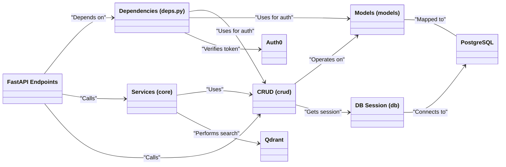
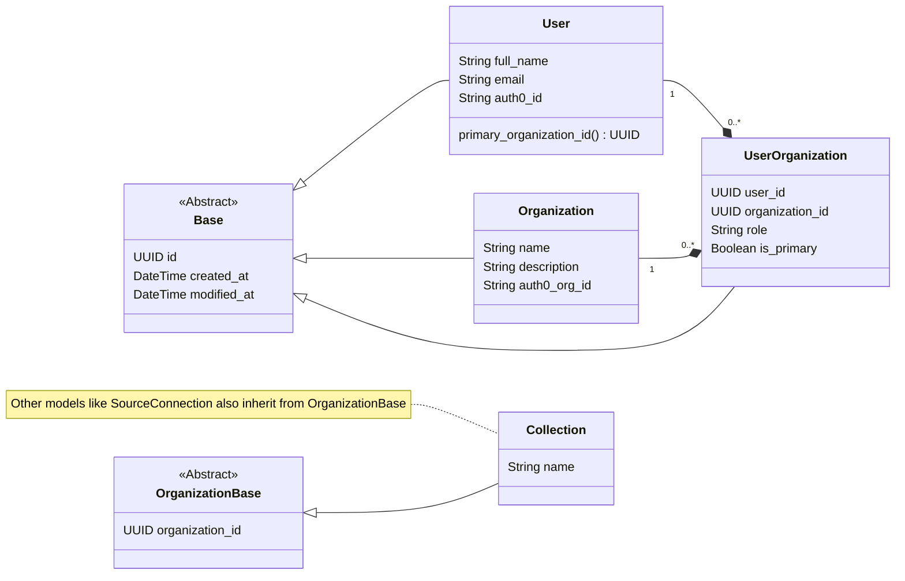
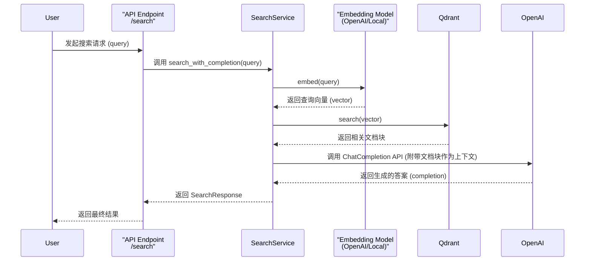
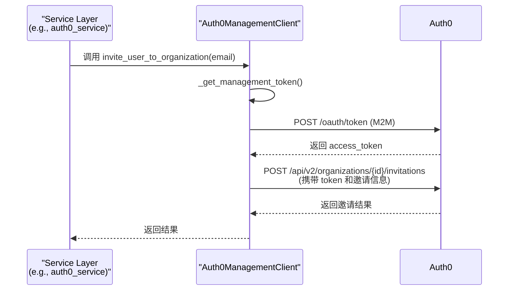
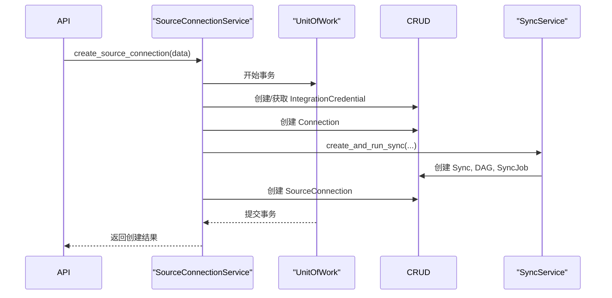

# Airweave 项目解读报告

## 0. 项目概览

- **项目名称**: Airweave
- **项目简介**: Airweave 是一个开源工具，旨在让 AI Agent 能够搜索任何应用。它通过连接到各类应用、生产力工具、数据库或文档存储，将其内容转化为可通过标准化接口（REST API 或 MCP）访问的可搜索知识库。其核心价值在于，它为 AI Agent 提供了一个统一的、语义化的数据访问层，解决了异构数据源的访问难题。
- **核心理念**: 让任何应用的数据都能被 Agent "编织" (weave) 到一个统一的、可搜索的知识网络中。
- **技术栈**:
    - **后端**: FastAPI (Python)
    - **前端**: React/TypeScript, ShadCN
    - **数据库**: PostgreSQL (元数据), Qdrant (向量存储)
    - **部署**: Docker Compose, Temporal (工作流)
- **目录结构概览**:
    - `backend/airweave`: 核心后端 FastAPI 应用代码。
    - `frontend/`: React 前端代码。
    - `docker/`: Docker Compose 配置。
    - `docs/`: 项目文档。

---

## 1. 项目架构设计

### 1.1. 系统整体架构

Airweave 采用经典的前后端分离架构，并通过容器化技术进行部署。其后端设计遵循了现代化的分层架构理念，层次清晰，职责分明。

1.  **表示层 (API)**: 基于 FastAPI 构建，负责处理 HTTP 请求。它通过一个精心设计的依赖注入系统 (`deps.py`) 来处理认证、授权和组织上下文，是整个系统的安全门户。
2.  **服务层 (Core)**: 封装了更复杂的业务逻辑和工作流编排，例如 `search_service` 结合了数据库查询和向量搜索，`collection_service` 则处理了超越简单 CRUD 的业务规则。
3.  **数据访问层 (CRUD)**: 实现了仓储模式，将业务逻辑与数据持久化细节解耦。通过泛型基类 `CRUDBaseOrganization`，以一种优雅且安全的方式实现了多租户数据隔离。
4.  **数据模型层 (Models)**: 使用 SQLAlchemy 定义数据模型，并通过 `User`/`Organization` 的多对多关系，构建了灵活的多租户体系。
5.  **集成层 (Integrations)**: 包含了与第三方服务（如 Auth0）的集成代码，将外部服务的复杂性封装起来。
6.  **持久化层 (DB)**: 使用 PostgreSQL 存储核心元数据，使用 Qdrant 存储用于语义搜索的向量数据。

### 1.2. 整体架构类图

这张图展示了后端各核心模块之间的依赖关系和交互方式。



### 1.3. 模块划分与职责

- **`api`**: 定义所有 HTTP 端点。它作为系统的入口，职责是解析请求、调用依赖项进行安全校验，并将请求分派给 `crud` 或 `core` 层的服务。
- **`core`**: 包含核心业务逻辑和服务。当一个操作涉及多个 CRUD 调用、与外部服务（如 Qdrant）交互或需要编排时，逻辑会放在这里。
- **`crud`**: 数据访问层。为每个数据模型提供原子化的增删改查操作，并内建了强制的组织范围限定，是数据安全的核心保障。
- **`models`**: 定义 SQLAlchemy 数据模型，是系统数据的结构化表示。
- **`schemas`**: 定义 Pydantic 模型，用于 API 的请求/响应校验和序列化，确保了接口数据的类型安全。
- **`db`**: 数据库配置和会话管理。
- **`integrations`**: 封装与第三方 API（主要是 Auth0）的交互。

---

## 2. 核心模块详细分析

### 2.1 数据模型层 (Models & DB)

- **核心职责**: 定义应用的持久化数据结构，并通过 `db` 模块提供异步数据库会话管理。
- **关键实现**:
    - **多租户模型**: 通过 `User`, `Organization`, `UserOrganization` (关联表) 实现了灵活的多对多关系。用户可以属于多个组织，并拥有不同的角色 (`role`) 和一个主组织 (`is_primary`)。
    - **数据隔离基类**: 抽象基类 `OrganizationBase` 要求所有继承它的模型都必须包含 `organization_id`，从数据库层面奠定了多租户数据安全的基础。
    - **用户追踪**: `UserMixin` 提供了 `created_by_email` 和 `modified_by_email` 字段，并且设计为可空，以兼容非用户操作（如 API 密钥）的场景。
    - **异步会话**: `db/session.py` 中配置了健壮的异步数据库引擎和连接池，为高并发场景提供了性能保障。
- **模块PlantUML类图**:


### 2.2 数据访问层 (CRUD & Schemas)

- **核心职责**: 提供一个安全、抽象的数据访问层，解耦业务逻辑与数据库操作。`schemas` 则定义了严格的 API 数据契约。
- **关键实现**:
    - **仓储模式**: CRUD 类作为仓储（Repository），封装了对特定模型的所有数据库操作。
    - **泛型基类**: `CRUDBaseOrganization` 是一个泛型基类，它为所有归属于组织的资源提供了统一的、自带安全校验的 CRUD 方法。
    - **统一安全上下文**: 所有方法都依赖 `AuthContext` 对象。在基类中，所有查询都自动通过 `auth_context.organization_id` 进行过滤，从而杜绝了数据越权访问的可能。
    - **继承与扩展**: 具体的 CRUD 类（如 `CRUDCollection`）继承基类，并可以重写或添加特定于业务的方法，同时在自定义方法中依然遵循安全校验规则。

### 2.3 服务层 (Core)

- **核心职责**: 将多个数据访问操作或与外部系统的交互编排成单一的业务功能。它作为 `api` 层和 `crud` 层之间的桥梁，处理更复杂的业务逻辑。
- **关键实现 (以 `SearchService` 为例)**:
    - **RAG 模式**: `SearchService` 是一个典型的检索增强生成 (Retrieval-Augmented Generation) 模式的实现。它首先从向量数据库（Qdrant）中"检索"与用户查询最相关的信息，然后将这些信息作为上下文"增强"给大语言模型（OpenAI），由 LLM 生成最终的自然语言回答。
    - **可插拔依赖**: 该服务可以根据系统配置，在 `OpenAIText2Vec`（云端）和 `LocalText2Vec`（本地）之间切换，用于将文本查询转换为向量。这种设计增强了系统的灵活性和可部署性。
    - **质量控制**: 在调用昂贵的 LLM API 之前，服务会检查检索结果的数量和相关性分数。如果结果质量不高，它会提前返回一个友好的提示，从而节省了成本并改善了用户体验。
- **模块交互图**:


### 2.4 轻量级端点

- **轻量级端点**: 端点函数本身非常"薄"，只负责接收请求、调用依赖、分发给 `crud` 或 `service`，然后返回结果。这使得代码清晰、易于维护和测试。

### 2.5 集成层 (Integrations)

- **核心职责**: 隔离并封装与所有第三方服务（如 Auth0）的通信细节，为上层应用提供简洁、稳定的接口。
- **关键实现 (以 `Auth0ManagementClient` 为例)**:
    - **客户端封装**: 此类将所有与 Auth0 Management API 的交互（如获取 M2M 令牌、构造请求、处理响应）都封装起来。
    - **安全认证**: 通过 `client_credentials` 流程，以安全的方式获取后端服务所需的管理权限令牌，与用户认证流程完全分离。
    - **语义化接口**: 对外提供如 `create_organization`, `invite_user_to_organization` 等与业务逻辑紧密相关的方法，隐藏了底层 REST API 的复杂性。
    - **配置驱动**: 所有凭据和域名信息均从统一的配置模块加载，实现了代码与配置的分离。
- **交互图**:


### 2.6 应用入口 (main.py)

- **核心职责**: 作为 FastAPI 应用的入口，负责组装所有组件，包括路由、中间件、配置和生命周期事件。
- **关键实现**:
    - **生命周期管理**: 使用现代的 `lifespan` 上下文管理器，在应用启动时执行数据库迁移、数据同步和启动后台调度器等任务，并在关闭时优雅地停止它们。
    - **中间件注册**: 通过注册一系列中间件，以非侵入的方式为所有请求添加了通用功能，如日志记录、请求ID注入、异常捕获和动态CORS处理。
    - **集中式异常处理**: 为自定义的业务异常（如 `PermissionException`）和框架的验证异常注册了专门的处理器，这使得错误处理逻辑与业务逻辑分离，代码更加整洁。
    - **路由聚合**: 通过 `app.include_router` 将所有版本化的 API 端点统一挂载到主应用上。

### 2.7 核心服务编排 (Core Services)

- **核心职责**: 在 `core` 目录中，除了像 `SearchService` 这样的功能性服务外，还存在着一类更核心的服务，它们负责编排复杂的、涉及多个数据模型的原子性业务事务。`SourceConnectionService` 是其中的典范。
- **关键实现 (以 `SourceConnectionService` 为例)**:
    - **事务编排**: 创建一个"源连接"需要同时创建或关联 `IntegrationCredential`, `Connection`, `Collection`, `Sync`, 和 `DAG` 等多个模型。`SourceConnectionService` 的 `create_source_connection` 方法将所有这些数据库操作包裹在一个"工作单元" (`UnitOfWork`) 中，确保了整个过程的原子性：要么全部成功，要么全部回滚。
    - **服务间协作**: 它清晰地展示了服务间的依赖关系，例如它会调用 `collection_service` 来创建集合，调用 `sync_service` 来创建同步任务和工作流。
    - **动态验证**: 它能够根据数据库中为数据源（Source）定义的配置类名，动态加载对应的 Pydantic 模型，对用户传入的 `auth_fields` 和 `config_fields` 进行验证。这是一个高度可扩展的设计，使得添加新的数据源变得更加容易，而无需修改核心服务代码。
- **创建源连接的简化序列图**:


---

## 3. 设计模式与亮点分析

### 3.1 设计模式应用

Airweave 项目中运用了多种现代软件设计模式，这些模式的巧妙应用使得系统具有高度的可维护性、可扩展性和安全性。

#### 3.1.1 仓储模式 (Repository Pattern)

- **实现**: 通过 `crud` 模块中的各种 CRUD 类实现，如 `CRUDBaseOrganization`、`CRUDCollection` 等。
- **优势**: 
  - 将数据访问逻辑与业务逻辑分离
  - 提供统一的数据访问接口，隐藏数据源的具体实现
  - 便于单元测试，可以轻松模拟数据层
- **实现亮点**: 泛型基类 `CRUDBaseOrganization<ModelType>` 通过类型参数实现了对不同模型的统一处理，同时强制执行组织级数据隔离。

#### 3.1.2 依赖注入模式 (Dependency Injection)

- **实现**: 通过 FastAPI 的依赖系统和 `deps.py` 模块实现。
- **优势**:
  - 解耦组件，提高代码的模块化程度
  - 便于测试，可以轻松替换依赖项
  - 集中管理共享资源（如数据库会话）
- **实现亮点**: `get_current_user_auth_context` 依赖函数不仅验证了用户身份，还构建了一个包含用户权限和组织上下文的完整 `AuthContext` 对象，为后续操作提供了统一的安全上下文。

#### 3.1.3 工作单元模式 (Unit of Work)

- **实现**: 在 `core/source_connection_service.py` 中的事务管理。
- **优势**:
  - 确保复杂操作的原子性
  - 简化事务管理，避免显式的提交/回滚调用
  - 提高代码可读性，使业务逻辑更加清晰
- **实现亮点**: 使用 Python 的上下文管理器 (`with` 语句) 优雅地处理事务边界，确保即使在异常情况下也能正确回滚。

#### 3.1.4 策略模式 (Strategy Pattern)

- **实现**: 通过可插拔的嵌入模型 (`OpenAIText2Vec` 和 `LocalText2Vec`)。
- **优势**:
  - 运行时切换算法实现
  - 避免条件语句的复杂性
  - 增强系统的可配置性
- **实现亮点**: 通过共同的接口，系统可以无缝地在云端和本地嵌入模型之间切换，适应不同的部署环境和成本需求。

### 3.2 架构亮点

#### 3.2.1 多租户安全架构

Airweave 的多租户安全架构是其最显著的亮点之一，它通过多层次的安全措施确保了数据隔离：

1. **数据库层**: 所有组织相关的模型都继承自 `OrganizationBase`，强制包含 `organization_id` 字段。
2. **数据访问层**: `CRUDBaseOrganization` 在所有查询中自动添加组织 ID 过滤条件。
3. **API 层**: 通过 `deps.py` 中的依赖函数，确保每个请求都带有正确的组织上下文。
4. **服务层**: 服务方法接受 `AuthContext` 参数，并将其传递给底层 CRUD 操作。

这种多层次的防御策略确保了即使在代码出现逻辑错误的情况下，也不会导致跨租户数据泄露。

#### 3.2.2 可扩展的插件架构

Airweave 采用了可扩展的插件架构来支持不同类型的数据源：

1. **动态配置验证**: 通过动态加载 Pydantic 模型来验证不同数据源的配置字段。
2. **统一的同步接口**: 所有数据源都通过相同的 `Sync` 和 `DAG` 模型进行管理，使得系统可以统一处理不同类型的数据源。
3. **元数据驱动**: 数据源的配置信息存储在数据库中，而不是硬编码在代码中，便于动态添加新的数据源类型。

#### 3.2.3 异步优先设计

项目全面采用了 Python 的异步编程模型：

1. **异步 ORM**: 使用 SQLAlchemy 2.0 的异步 API。
2. **异步 HTTP 客户端**: 使用 `httpx` 进行异步 HTTP 请求。
3. **异步端点**: 所有 FastAPI 端点都是异步函数。

这种设计使得系统能够高效处理大量并发请求，特别是在涉及 I/O 密集型操作（如数据库查询和外部 API 调用）时。

## 4. 总结与建议

### 4.1 总体评价

Airweave 是一个设计精良的现代化 AI 基础设施项目，它成功地解决了 AI Agent 访问异构数据源的复杂问题。项目具有以下突出优点：

1. **架构清晰**: 采用分层架构，职责划分明确，代码组织合理。
2. **安全可靠**: 多层次的安全设计确保了多租户环境下的数据隔离。
3. **技术先进**: 采用了现代化的技术栈和最佳实践，如异步编程、类型提示和依赖注入。
4. **可扩展性强**: 插件化架构使得添加新的数据源和功能变得简单。
5. **代码质量高**: 代码风格一致，命名规范，注释充分，易于理解和维护。

### 4.2 改进建议

尽管 Airweave 已经是一个设计良好的系统，但仍有一些可能的改进空间：

1. **缓存层引入**: 考虑添加一个缓存层（如 Redis）来缓存频繁访问的数据和查询结果，减轻数据库负担并提高响应速度。
2. **批量操作优化**: 对于大规模数据处理，可以考虑实现批量操作 API，减少数据库交互次数。
3. **监控与可观测性**: 增强系统的监控和日志记录功能，添加更详细的性能指标和追踪信息，便于问题诊断和性能优化。
4. **更细粒度的权限控制**: 当前的权限模型基于角色，可以考虑实现更细粒度的基于资源的权限控制。
5. **自动化测试覆盖**: 增加单元测试和集成测试的覆盖率，特别是对核心业务逻辑和安全相关代码的测试。
6. **文档自动生成**: 利用代码注释自动生成更详细的 API 文档，减少文档维护的工作量。

## 5. 典型使用案例

以下是一个典型的使用案例，展示了如何使用 Airweave 让 AI Agent 能够搜索企业内部知识库：

### 5.1 场景描述

一家企业有多种内部文档和数据源，包括：
- Notion 知识库
- Google Drive 文档
- Slack 对话历史
- 内部 PostgreSQL 数据库

企业希望构建一个 AI 助手，能够回答员工关于公司政策、产品信息和历史数据的问题。

### 5.2 实施步骤

#### 步骤 1: 配置数据源连接

首先，管理员通过 Airweave 的 Web 界面或 API 配置各个数据源的连接：

```python
# 使用 Airweave API 配置 Notion 数据源
notion_connection = {
    "name": "公司 Notion",
    "source_id": "notion",
    "auth_fields": {
        "integration_token": "secret_token..."
    },
    "config_fields": {
        "database_ids": ["db1", "db2"],
        "page_ids": ["page1", "page2"]
    }
}

response = requests.post(
    "https://airweave-instance/api/v1/source-connections",
    json=notion_connection,
    headers={"Authorization": f"Bearer {token}"}
)
```

对其他数据源（Google Drive、Slack、PostgreSQL）重复类似的配置过程。

#### 步骤 2: 数据同步与索引

配置完成后，Airweave 会自动：
1. 连接到各个数据源并提取内容
2. 将内容分块并生成向量嵌入
3. 将向量存储到 Qdrant 中
4. 建立元数据索引

这个过程可以设置为定期自动运行，确保索引数据的及时更新。

#### 步骤 3: AI Agent 集成

企业的 AI Agent 可以通过 Airweave 的 API 或 MCP 接口进行语义搜索：

```python
# AI Agent 代码示例
def answer_question(question: str) -> str:
    # 调用 Airweave 搜索 API
    search_response = requests.post(
        "https://airweave-instance/api/v1/search/completion",
        json={"query": question},
        headers={"Authorization": f"Bearer {token}"}
    ).json()
    
    # 返回 AI 生成的答案
    return search_response["completion"]

# 示例使用
answer = answer_question("我们公司的远程工作政策是什么？")
print(answer)
```

### 5.3 效果与优势

通过这种方式，企业获得了以下优势：

1. **统一访问**: AI Agent 无需了解各种数据源的 API 细节，只需通过 Airweave 的统一接口即可访问所有数据。
2. **语义搜索**: 基于向量的搜索能够理解问题的语义，而不仅仅是关键词匹配。
3. **实时更新**: 定期同步确保 AI 助手能够访问最新的企业数据。
4. **安全可控**: 多租户架构和细粒度的权限控制确保数据安全。
5. **可扩展性**: 随着企业新增数据源，只需在 Airweave 中添加新的连接配置，无需修改 AI Agent 代码。

这个案例展示了 Airweave 如何成为 AI Agent 与企业数据之间的桥梁，使 AI 能够安全、高效地访问和利用企业内部知识。