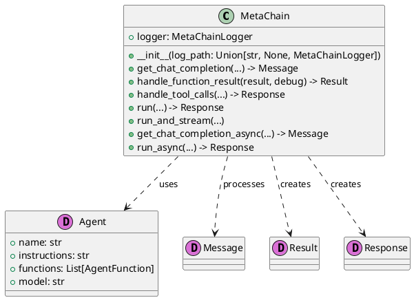
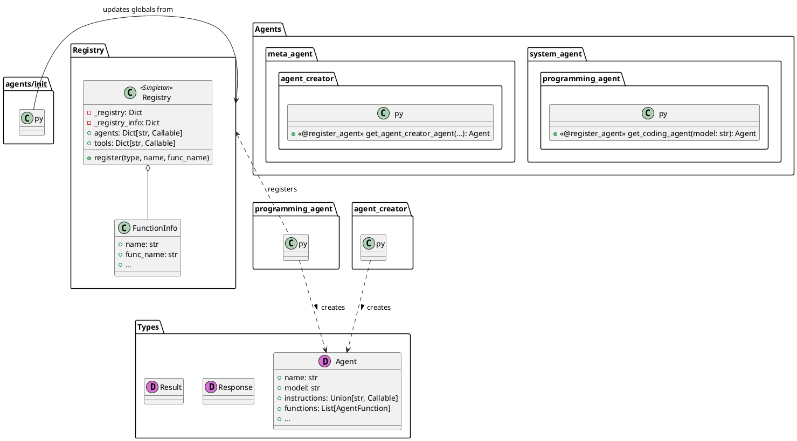
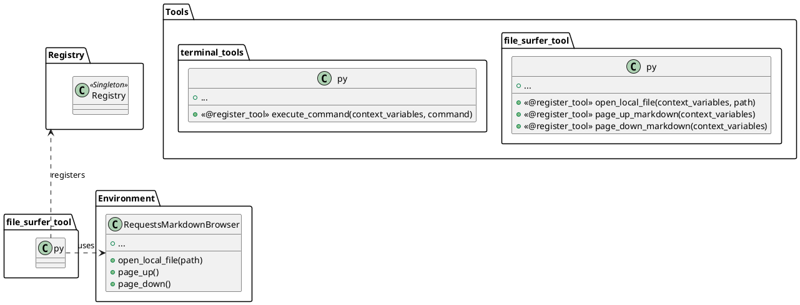
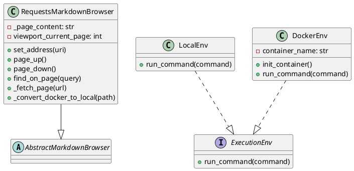

# AutoAgent 项目解读报告

## 0. 项目概览

- **项目名称:** AutoAgent
- **核心理念:** 一个能够自主进行问题分解、工具选择、代码生成和执行的智能体框架。
- **技术栈:** Python
- **目录结构概览:** 
  ```
  autoagent/
  ├── agents/
  ├── cli_utils/
  ├── environment/
  ├── flow/
  ├── memory/
  ├── repl/
  ├── tools/
  ├── workflows/
  ├── core.py
  ├── ... (其他核心文件)
  ```

## 1. 项目架构设计

### 1.1. 系统整体架构

AutoAgent 是一个高度模块化、事件驱动的智能体（Agent）框架。其架构设计的核心思想是**将智能体的"意图"与"能力"以及"执行环境"彻底分离**，并通过一个可插拔的注册表机制和先进的事件流引擎将它们灵活地组合在一起。

其核心工作流程如下：

1.  **启动与配置 (`cli.py`)**: 用户通过命令行界面启动一个任务。`cli.py` 负责解析用户意图，配置相应的**执行环境**（`Environment`），并选定一个初始的**智能体**（`Agent`）或**工作流**（`Workflow`）。
2.  **核心循环 (`core.py:MetaChain`)**: `MetaChain` 类接管控制权。它根据当前 `Agent` 的`instructions`和历史消息，向大语言模型（LLM）发起请求。
3.  **工具选择与执行**: LLM根据提示和问题，决定调用一个或多个**工具**（`Tool`）。`MetaChain` 解析LLM的响应，找到对应的工具函数。
4.  **环境交互**: 工具函数本身是无状态的，它从上下文中获取一个**环境**（`Environment`）实例（如`DockerEnv`或`RequestsMarkdownBrowser`），并调用该实例的方法来执行具体操作（如运行命令、读写文件、浏览网页）。
5.  **结果反馈**: 环境将执行结果返回给工具，工具再返回给`MetaChain`。`MetaChain`将工具的输出格式化后，加入到消息历史中，形成新一轮的LLM输入。
6.  **高级流程控制 (`flow`)**: 对于复杂任务，框架不使用简单的循环，而是通过`flow`模块定义的**事件图（DAG）**来驱动。一个智能体的执行可以是一个"事件"，它可以触发其他多个智能体并行执行，最终由一个聚合智能体收集结果。

这个架构使得框架的每一部分都高度内聚且低耦合，具有极强的灵活性和可扩展性。

### 1.2. 整体架构PlantUML类图
```plantuml
@startuml
!define pydantic(T) class T <<(D,orchid)>>
!define module(N) package N <<Rectangle>>

skinparam classAttributeIconSize 0

module "CLI / Entrypoint" {
    class "cli.py" {
        + main()
        + agent()
        + workflow()
    }
}

module "Core Engine" {
    class MetaChain {
        + run(agent, messages)
        + run_async(agent, messages)
    }
}

module "Event-Driven Workflow" {
    class EventEngineCls {
        + invoke_event(event)
    }
    class BaseEvent
    "workflows/*.py" -- EventEngineCls : uses
    EventEngineCls o-- BaseEvent
}

module "Registry (Singleton)" {
    class Registry {
        + register()
        + agents: Dict
        + tools: Dict
        + workflows: Dict
    }
}

module "Definitions (Pydantic)" {
    pydantic(Agent) {
      name: str
      instructions: str
      functions: List[Callable]
    }
    "agents/*.py" -- Agent : creates
}

module "Tools (Functions)" {
     class "tools/*.py" {
        + <<@register_tool>> my_tool()
     }
}

module "Environments (Stateful)" {
    interface ExecutionEnv {
        + run_command()
    }
    class DockerEnv implements ExecutionEnv
    class LocalEnv implements ExecutionEnv

    class RequestsMarkdownBrowser {
        + page_up()
        + page_down()
    }
}

module "Memory (RAG)" {
    class Memory {
        - client: chromadb
        + add_query()
        + query()
    }
}


"cli.py" --> MetaChain
"cli.py" --> EventEngineCls
"cli.py" --> DockerEnv : configures
"cli.py" --> LocalEnv : configures

MetaChain --> Agent : uses
MetaChain --> "tools/*.py" : executes

"tools/*.py" ..> ExecutionEnv : uses
"tools/*.py" ..> RequestsMarkdownBrowser : uses
"tools/*.py" ..> Memory : uses

"agents/*.py" ..> Registry : registers
"tools/*.py" ..> Registry : registers
"workflows/*.py" ..> Registry : registers

@enduml
```

### 1.3. 模块划分与职责

| 模块 | 核心职责 |
|---|---|
| `core.py` | 包含了项目的核心类 `Core`, 负责驱动整个智能体工作流的生命周期管理。 |
| `agents` | 定义了各种类型的智能体，包括负责任务分派的系统智能体和执行具体任务的工具智能体。 |
| `flow` | 管理和定义了智能体执行任务的工作流，实现了任务的流转和状态管理。 |
| `tools` | 提供了智能体可以使用的各种工具，如文件操作、网页浏览、代码搜索等。 |
| `memory` | 为智能体提供了记忆功能，用于存储和检索信息，例如代码、知识库等。 |
| `environment` | 提供了代码和工具执行的环境，例如本地Shell、Docker容器等。 |
| `repl` | 提供了一个交互式的命令行界面（Read-Eval-Print Loop）。 |
| `workflows` | 包含预定义的、可复用的工作流。 |
| `cli.py` | 项目的命令行接口入口。 |

## 2. 核心模块详细分析

*本节将逐一分析每个核心模块*

---

### 2.1 `core.py` - 核心调度器

**模块概述**

- **模块路径**: `autoagent/core.py`
- **核心职责**: `core.py` 文件定义了 `MetaChain` 类，它是整个 AutoAgent 框架的核心调度器和执行引擎。它负责管理与语言模型的交互、工具（函数）的调用、执行流程的控制以及状态的维护。

**文件结构与实现分析**

- **`MetaChain` 类**:
    - **初始化**: 构造函数主要初始化日志记录器。
    - **`get_chat_completion` / `get_chat_completion_async`**: 这两个方法是与大语言模型（LLM）通信的接口。它们使用 `litellm` 库来发送请求。关键功能包括：
        - 动态构建 `messages` 列表，包含系统指令（instructions）、示例（examples）和历史对话。
        - 将Python函数（`AgentFunction`）转换为LLM能理解的JSON格式（工具）。
        - 支持两种模式：
            1. **函数调用模式 (`FN_CALL=True`)**: 针对支持原生函数调用的模型（如GPT），直接使用模型的`tools`和`tool_choice`参数。
            2. **非函数调用模式 (`FN_CALL=False`)**: 对于不支持函数调用的模型，它会将工具的描述注入到系统提示中，然后解析模型的文本输出来模拟函数调用。这是一个重要的兼容性设计。
        - 包含针对API错误的重试逻辑 (`tenacity`库)。
        - 对特定模型（如Gemini）的工具定义进行适配。
    - **`handle_tool_calls`**: 当LLM返回一个或多个工具调用请求时，此方法负责：
        - 解析工具调用的名称和参数。
        - 从`Agent`的函数列表中查找并执行对应的Python函数。
        - 将函数的执行结果封装成`tool`角色的消息，以便下一轮对话。
    - **`run` / `run_async` / `run_and_stream`**: 这些是高级执行方法，驱动整个智能体的运行循环。它们以一个初始的`Agent`和消息列表开始，循环调用 `get_chat_completion` 和 `handle_tool_calls`，直到达到最大对话轮次、没有工具可调用或返回一个特定的`Agent`作为最终结果。
    - **`handle_function_result`**: 负责将工具函数的任意返回值统一处理成 `Result` 对象。

**模块PlantUML类图**



---

### 2.2 `agents` 模块 - 智能体定义与注册

**模块概述**

- **模块路径**: `autoagent/agents/`
- **核心职责**: `agents` 模块是所有智能体（Agent）的定义中心。它采用了一种高度可扩展的插件式架构，通过动态导入和注册机制来管理不同的智能体。

**文件结构与实现分析**

- **动态发现与注册 (`__init__.py` & `registry.py`)**:
    - AutoAgent 不使用静态导入来管理智能体，而是采用了一套优雅的动态发现机制。
    - 核心是 `registry.py` 中的 `Registry` 单例类，它充当了项目中所有可注册组件（包括智能体、工具、工作流等）的中央登记处。
    - 开发者通过 `@register_agent` 或 `@register_plugin_agent` 装饰器来标记一个智能体工厂函数。
    - `agents/__init__.py` 在被加载时，会递归地扫描其目录下的所有 `.py` 文件，导入它们以触发装饰器逻辑，从而将所有发现的智能体自动注册到 `Registry` 中。
    - 这种设计使得添加新智能体变得非常简单：只需在 `agents` 目录下或其子目录中创建一个新文件，并使用相应的装饰器即可，无需修改任何现有代码。

- **智能体定义 (e.g., `system_agent/programming_agent.py`)**:
    - 每个智能体通常都在自己的文件中定义。
    - 定义的核心是一个**工厂函数**（例如 `get_coding_agent`），而不是一个类。
    - 这个工厂函数负责创建一个 `Agent` 类型的实例。
    - **`Agent` (`types.py`)**: 这是一个 Pydantic 模型，它封装了定义一个智能体所需的所有信息：
        - `name`: 智能体的名称。
        - `model`: 该智能体应使用的语言模型。
        - `instructions`: 给语言模型的系统提示（System Prompt），详细描述了智能体的角色、能力和行事准则。
        - `functions`: 一个Python函数列表，这些是该智能体被授权使用的工具。
        - `examples`: (可选) few-shot示例，用于引导模型输出更符合期望的格式。
        - `tool_choice`: 控制模型如何使用工具（例如`"required"`强制使用工具）。

**模块PlantUML类图**



---

### 2.3 `tools` 模块 - 可供智能体使用的工具集

**模块概述**

- **模块路径**: `autoagent/tools/`
- **核心职责**: `tools` 模块提供了所有可供智能体使用的函数（工具）。它与 `agents` 模块共享相同的动态注册架构，确保了工具的灵活性和可扩展性。

**文件结构与实现分析**

- **动态发现与注册 (`__init__.py`)**:
    - `tools/__init__.py` 的工作原理与 `agents/__init__.py` 完全相同。
    - 它递归地扫描并导入所有子目录中的Python文件。
    - 文件中被 `@register_tool` 或 `@register_plugin_tool` 装饰的函数会被自动添加到 `registry` 中，从而对整个应用程序可用。

- **工具定义 (e.g., `file_surfer_tool.py`)**:
    - 每个工具都是一个独立的Python函数。
    - **`@register_tool` 装饰器**: 用于命名工具并将其注册。这个名字是LLM在请求使用工具时将使用的标识符。
    - **函数签名与文档字符串**: 工具函数的参数列表定义了LLM需要提供的输入。其文档字符串（docstring）至关重要，因为它被用作工具的描述，LLM依靠这个描述来理解工具的功能、用途和所需参数。
    - **`context_variables` 依赖注入**: 许多工具的第一个参数是 `context_variables`。这是一种依赖注入模式，用于向工具传递运行时上下文，最常见的是**环境实例**（如`file_env`）。
    - **与 `environment` 模块的交互**: 工具通常是无状态的，它们通过从 `context_variables` 获取的环境对象来执行有状态的操作。例如，`file_surfer_tool.py` 中的工具（如`page_up_markdown`, `find_on_page_ctrl_f`）并不自己管理文件内容或视口位置，而是调用 `file_env` 对象（一个 `RequestsMarkdownBrowser` 实例）的方法来完成。工具本身只是一个暴露环境能力的薄封装层。

**模块PlantUML类图**



---

### 2.4 `environment` 模块 - 执行环境抽象

**模块概述**

- **模块路径**: `autoagent/environment/`
- **核心职责**: `environment` 模块提供了智能体执行操作（如运行代码、浏览文件、访问网页）所需的状态化、隔离的环境。这是连接无状态的`tools`和有状态的操作之间的关键桥梁。

**文件结构与实现分析**

该模块提供了几种不同类型的环境，每种都有其特定的用途：

1.  **`RequestsMarkdownBrowser` - 文本化浏览器环境**:
    - 这是为文件和网页"浏览"功能提供支持的核心类。它并不是一个真正的图形化浏览器。
    - **核心功能**:
        - **内容获取**: 使用 `requests` 库获取网页HTML，或直接读取本地文件/目录。
        - **Markdown转换**: 其最关键的特性是将获取的HTML内容通过 `MarkdownConverter` 转换为干净的Markdown格式。这极大地简化了LLM对页面内容的理解。
        - **视口管理 (Viewport)**: 为了避免将大量文本一次性抛给LLM，它将内容分割成多个大小可控的"视口"（或页面）。智能体可以通过`page_up`、`page_down`等工具来"滚动"浏览，这模拟了人类的阅读行为，并有效管理了模型的上下文窗口。
        - **状态维持**: 实例本身是有状态的，它会记录浏览历史、当前地址、页面内容、视口位置等。
    - **与工具的关联**: `file_surfer_tool.py` 和 `web_tools.py` 中的工具，本质上是该类公共方法的简单封装。工具从`context_variables`中获取`RequestsMarkdownBrowser`的实例，并调用其方法。

2.  **`LocalEnv` - 本地命令执行环境**:
    - 提供在宿主机上直接执行shell命令的能力。
    - 它使用Python的 `subprocess` 模块来运行命令。
    - 设计上与 `conda` 环境集成，会在执行命令前尝试激活指定的conda环境，以保证依赖的正确性。

3.  **`DockerEnv` - 隔离的Docker执行环境**:
    - 提供了更强大、更安全的沙箱环境。
    - **容器管理**: 它可以自动化地处理Docker容器的整个生命周期，包括创建、启动、停止和检查。它会将本地的工作目录挂载到容器内部，使得文件操作可以同步。
    - **TCP通信**: 与传统的`docker exec`不同，`DockerEnv`的命令执行是通过一个在容器内运行的`tcp_server.py`来完成的。`run_command`方法通过套接字连接到这个服务器，发送命令并接收结构化的JSON响应流。这种方法为实时、流式输出提供了很好的支持。
    - **高度隔离**: 这是最安全的执行方式，因为它将智能体的所有操作都限制在容器内部，有效防止了对宿主系统的意外更改。

**设计模式与亮点**

- **策略模式**: `LocalEnv` 和 `DockerEnv` 实现了相似的接口（如`run_command`方法），允许上层（如`terminal_tools`）在不知道具体实现的情况下使用它们。根据应用的配置，可以策略性地选择使用本地环境还是更安全的Docker环境。
- **关注点分离**: 将工具的"意图"（如`execute_command`）与执行的"环境"（`LocalEnv`/`DockerEnv`）分离，是一个非常清晰的架构设计。

**模块PlantUML类图**



---

### 2.5 `flow`, `memory`, `repl`, `cli`, `workflows` - 其他模块

**模块概述**

这些模块提供了框架的辅助功能、高级流程控制和用户接口。

**文件结构与实现分析**

- **`flow` 模块 (e.g., `flow/core.py`)**:
    - **核心职责**: 提供了比 `core.py` 中基本循环更高级、更强大的工作流控制机制。
    - **实现**: 它实现了一个**事件驱动架构**。开发者可以将函数（通常是调用一个智能体）封装成一个"事件"（`BaseEvent`），然后定义事件之间的依赖关系。
    - **`listen_group`**: 这个装饰器是核心，它允许一个事件"监听"一组其他事件。监听事件只有在其依赖的所有（或任一）事件完成后才会被触发。
    - **设计模式**: 这实际上是在代码中定义一个**有向无环图（DAG）**。这使得实现并行执行（多个事件同时监听同一个前置事件）和结果聚合（一个事件监听多个并行事件）等复杂模式成为可能。`workflows/math_solver_workflow_flow.py`中的"多数投票"实现就是这种能力的完美展示。

- **`memory` 模块 (e.g., `rag_memory.py`)**:
    - **核心职责**: 为智能体提供长期记忆。
    - **实现**: 它基于`chromadb`向量数据库实现了一个经典的**检索增强生成（RAG）**系统。
    - **工作流程**: 可以将文本（如过去的对话、文档、代码片段）存入记忆中。`Memory`类会使用一个嵌入模型（支持OpenAI或本地SentenceTransformer）将文本转换为向量。在查询时，它会根据语义相似性检索最相关的记忆，以供智能体参考。

- **`repl` 和 `cli` 模块**:
    - **核心职责**: 提供用户与AutoAgent框架交互的命令行界面（CLI）。
    - **`repl/repl.py`**: 实现了一个简单的读取-求值-打印循环（Read-Eval-Print Loop），用于交互式对话。
    - **`cli.py`**: 使用`click`库构建了一个功能丰富的CLI主入口。它负责解析命令行参数，设置环境（如选择`LocalEnv`或`DockerEnv`），并启动不同的模式（如单智能体测试、交互式主循环、工作流编辑器等）。它是整个应用程序的"启动器"。

- **`workflows` 模块 (e.g., `math_solver_workflow_flow.py`)**:
    - **核心职责**: 包含一系列使用`flow`模块构建的、预定义的、可复用的复杂工作流。
    - **实现**: 每个工作流文件都定义了一个由事件和依赖组成的图，并通过一个用`@register_workflow`装饰的函数暴露出来，使其可以被`cli`模块调用。

---

## 3. 设计模式与亮点分析

### 3.1 设计模式
- **单例模式**: `registry.py` 中的 `Registry` 类，确保了全局只有一个组件（智能体、工具等）注册中心。
- **工厂模式**: `agents` 模块中的 `get_..._agent` 函数充当了工厂的角色，它们不返回一个"活"的智能体实例，而是根据配置创建一个`Agent`数据对象。
- **策略模式**: `environment` 模块中的 `LocalEnv` 和 `DockerEnv` 提供了可互换的执行策略，上层代码（工具）无需关心命令究竟是在本地执行还是在Docker中执行。
- **插件/注册表模式**: 整个框架的核心设计。通过装饰器（`@register_...`）和动态导入，实现了高度可扩展的插件式架构。添加新的智能体、工具或工作流都无需修改核心代码。
- **事件驱动架构/有向无环图 (DAG)**: `flow` 模块允许定义复杂、非线性的、并行的任务流，这是框架最强大的功能之一。

### 3.2 项目亮点
- **高度的模块化和解耦**: `agents` (意图), `tools` (能力), `environment` (执行上下文) 之间的关注点分离得非常清晰。
- **强大的可扩展性**: 插件式架构使得二次开发变得非常容易。
- **灵活的执行环境**: 同时支持本地和Docker环境，兼顾了易用性和安全性。
- **先进的工作流控制**: 基于事件的DAG执行引擎远比传统的顺序或循环控制更为强大和灵活。
- **为LLM优化的IO**: `RequestsMarkdownBrowser` 将HTML转为Markdown并进行视口分页，这表明开发者深刻理解如何为LLM提供易于处理的输入。
- **元编程能力**: 框架内建了`agent_editor`和`workflow_editor`等"元智能体"，让AI能够辅助开发和修改自身，展现了项目的远大目标。

## 4. 总结与建议

### 4.1 潜在改进建议
- **错误处理与韧性**: 虽然核心的API调用有重试机制，但在工具或环境层面，可以引入更精细的错误处理和回退策略。
- **状态管理**: 当前主要通过`global_ctx`在`flow`中传递状态，对于非常复杂的工作流，可以考虑引入更结构化的状态管理对象，以提高可维护性。
- **文档与类型提示**: 项目代码质量很高，但增加更详尽的文档和更严格的类型提示，能进一步降低新开发者的入门门槛。

### 4.2 二次开发指南
1.  **添加新工具**:
    - 在 `tools` 目录下创建一个新的 `my_tool.py` 文件。
    - 编写你的Python函数，确保其第一个参数是`context_variables`（如果需要访问环境）。
    - 在函数上添加 `@register_tool("my_awesome_tool")` 装饰器。
    - 在需要使用该工具的智能体的 `functions` 列表中加入这个新工具的函数引用。
2.  **添加新智能体**:
    - 在 `agents` 目录下创建一个新的 `my_agent.py` 文件。
    - 创建一个工厂函数 `get_my_agent(model, ...)`。
    - 在函数上添加 `@register_agent("My Agent")` 装饰器。
    - 在函数体内，创建一个 `Agent` 实例，为其指定`instructions`和它能使用的`functions`列表。
    - 返回这个 `Agent` 实例。
3.  **创建新工作流**:
    - 在 `workflows` 目录下创建一个新的 `my_workflow.py` 文件。
    - 使用 `flow` 模块的 `make_event` 和 `listen_group` 来定义你的事件图。
    - 创建一个主函数，用 `@register_workflow("my_workflow")` 装饰它。
    - 在主函数内，调用 `default_drive.invoke_event` 来启动整个工作流。

---
