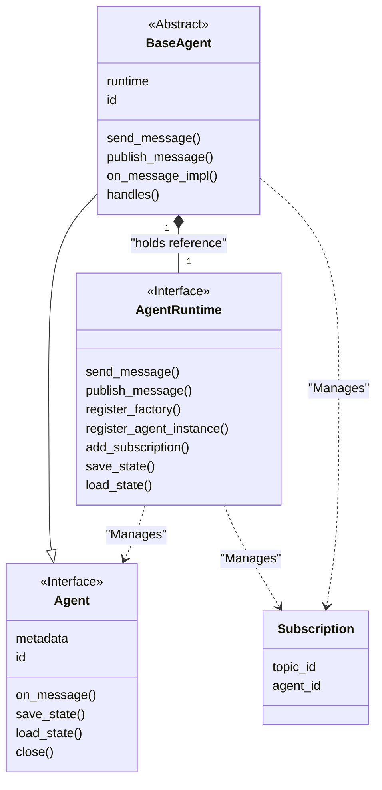
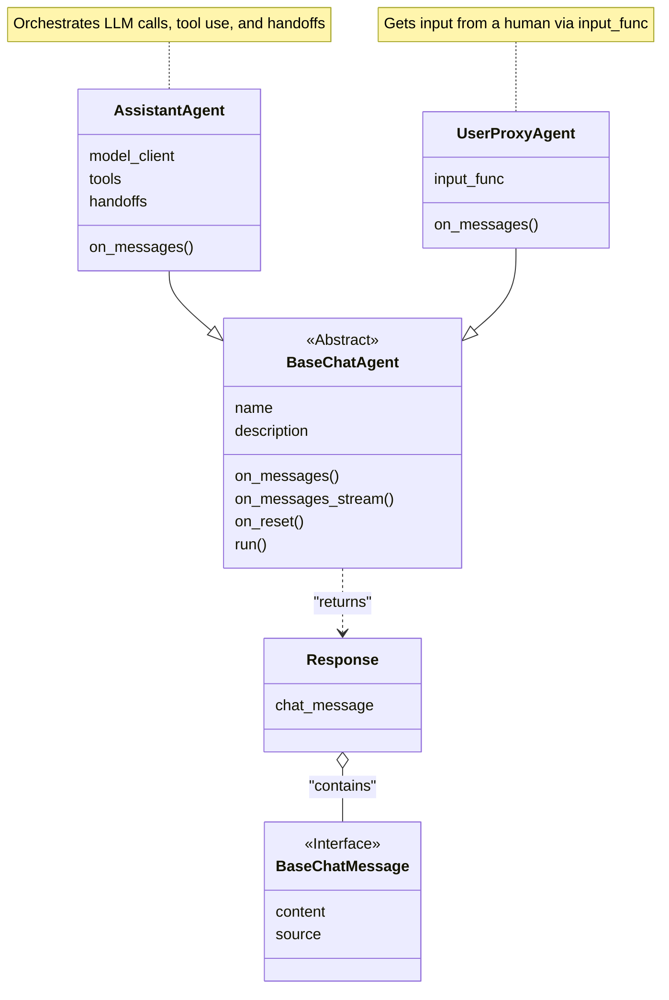
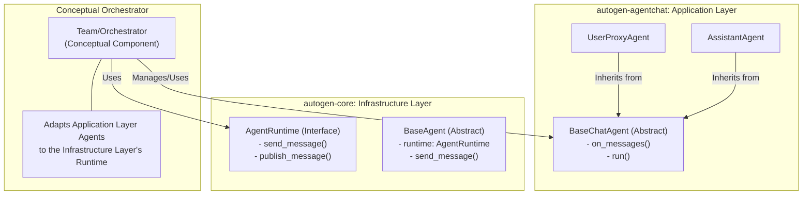

# AutoGen 项目解读报告 - 总览

## 0. 项目概览
- **项目名称**: AutoGen (Automated Agent Generation)
- **核心理念**: 一个旨在简化和标准化多智能体（Multi-Agent）应用程序开发的框架。它提供了一套构建模块，用于定义、管理和协调能够相互通信以完成复杂任务的智能体。
- **设计哲学**: AutoGen 的核心是事件驱动和面向协议的。通过定义清晰的接口（如 `Agent` 和 `AgentRuntime`），框架实现了高度的解耦和可扩展性。开发者可以轻松创建自定义的 Agent 和运行时环境，而无需修改核心代码。
- **技术栈**: Python, an asyncio-based event loop.

## 1. 模块分析

### 1.1. `autogen-core` 模块分析

`autogen-core` 是整个 AutoGen 框架的基石。它定义了 Agent、运行时（Runtime）和它们之间通信的基本抽象和核心逻辑，不涉及具体的 Agent 应用（如聊天机器人）。

#### a. 模块核心职责
- **Agent 抽象定义**: 定义了 `Agent` 的标准接口（`Protocol`），规定了所有 Agent 必须具备的基本行为，如消息处理、状态管理和生命周期方法。
- **运行时环境**: 定义了 `AgentRuntime` 接口，它是一个 Agent 的"生存空间"，负责管理 Agent 的注册、生命周期，并充当 Agent 之间的消息Agent。
- **通信机制**: 建立了一套基于"直接消息"（Send）和"发布-订阅"（Pub/Sub）的通信模式。Agent 之间不直接通信，而是通过运行时进行解耦的异步消息传递。
- **基础组件**: 提供了 `BaseAgent` 等基础类，开发者可以继承这些类来快速创建自己的 Agent，而无需从头实现所有接口。

#### b. 关键组件与实现分析

1.  **`Agent` (Protocol)**:
    - 这是一个接口定义，非常灵活，任何实现了其方法的类都可以被视为一个 Agent。
    - 关键方法 `on_message` 是 Agent 处理消息的入口。
    - `save_state`/`load_state` 为 Agent 的持久化提供了标准接口。

2.  **`BaseAgent` (Abstract Class)**:
    - `Agent` 接口的抽象基类，是创建新 Agent 的推荐起点。
    - 它封装了与运行时的交互逻辑，提供了如 `send_message` 和 `publish_message` 的便捷方法。
    - 通过 `@handles` 装饰器，实现了声明式的消息类型订阅，非常优雅。
    - 采用了模板方法模式，将 `on_message` 的通用逻辑固化，让子类只专注于实现具体的 `on_message_impl`。

3.  **`AgentRuntime` (Protocol)**:
    - 框架的"中枢神经系统"，同样是一个接口定义，允许未来实现不同的运行时（如分布式运行时）。
    - **核心功能**:
        - **消息派发**: `send_message` 用于点对点通信，`publish_message` 用于主题广播。
        - **Agent管理**: `register_factory` 和 `register_agent_instance` 用于注册 Agent。
        - **状态管理**: 负责整个运行时及所有 Agent 的状态保存与恢复。

#### c. 模块 PlantUML 类图

### 1.2. `autogen-agentchat` 模块分析

`autogen-agentchat` 是构建在 `autogen-core` 之上的应用层，专门用于实现对话式、具备工具使用能力的智能体。它将核心层定义的通用 Agent 模型具体化为我们通常理解的"聊天机器人"。

#### a. 模块核心职责
- **对话 Agent 实现**: 提供了具体的、面向聊天的 Agent 实现，如 `AssistantAgent`（连接LLM）和 `UserProxyAgent`（代表人类用户）。
- **会话流程管理**: 定义了更高层次的交互逻辑，包括工具调用（Function Calling）、对工具使用的"反思"（Reflection）以及在不同 Agent 间"移交任务"（Handoff）。
- **人机交互**: 通过 `UserProxyAgent` 抽象了人类的输入，使其可以灵活地集成到各种UI中。
- **状态管理**: 明确了对话 Agent 是有状态的，并由 Agent 自身负责维护对话历史，而非依赖外部调用者传递完整历史。

#### b. 关键组件与实现分析

1.  **`BaseChatAgent` (Abstract Class)**:
    - 这是 `agent-chat` 模块中所有 Agent 的基类，但它并**不直接继承** `autogen-core` 的 `BaseAgent`。这是一个重要的分层设计，`BaseChatAgent` 更关注对话应用的生命周期（`run`, `on_reset`, `on_pause`）和消息流，将底层的运行时通信细节解耦。
    - 它强制子类实现 `on_messages` 方法，作为处理新消息的核心逻辑。

2.  **`AssistantAgent`**:
    - **模块的主力**。它封装了与大语言模型（LLM）的所有交互。
    - **核心能力是工具使用**：它能解析 LLM 返回的工具调用指令，执行相应的工具（Python函数），然后将结果返回给LLM进行"反思"，最终生成更完善的回复。
    - **支持任务移交 (Handoff)**：当满足特定条件时，可以将控制权交给另一个 Agent，这是实现复杂多 Agent 协作的关键。
    - 采用**配置驱动**设计，可以通过 `AssistantAgentConfig` 模型从文件加载配置，易于管理。

3.  **`UserProxyAgent`**:
    - **人机交互的桥梁**。它代表了系统中的人类用户。
    - 它的核心是一个可定制的 `input_func` 函数，用于从外部（如命令行、Web界面）获取用户输入。这种设计使其具备极高的灵活性和可扩展性。
    - 它本质上是一个"阻塞"的 Agent，会暂停整个流程以等待人类的响应。

#### c. 模块 PlantUML 类图

## 2. 整体架构分析

AutoGen 的架构设计精良，通过明确的分层将通用的 Agent 基础设施与具体的应用逻辑清晰地分离开来。

### 2.1. 核心抽象与分层设计

AutoGen 的架构可以被视为两个主要层次和一个概念性的"协调者"：

1.  **`autogen-core` (基础设施层)**:
    - 这一层提供了最基础、最通用的构建模块。它定义了 `Agent` 是什么（一个通过 `on_message` 接收消息的实体）和 `AgentRuntime` 是什么（一个负责管理和路由消息的"操作系统"）。
    - 它的通信模型（`send` 和 `publish`）是完全通用的，不关心消息的具体内容，只负责传递。
    - 这一层为整个系统提供了稳定性和可扩展性的基础。

2.  **`autogen-agentchat` (应用层)**:
    - 这一层建立在核心层之上，专注于"对话"这一具体应用场景。
    - 它定义了 `BaseChatAgent`，一个更贴近应用需求的抽象，它处理的是具体的 `BaseChatMessage` 序列，而不是任意类型的消息。
    - `AssistantAgent` 和 `UserProxyAgent` 是这一层的具体实现，它们封装了与 LLM 交互、工具使用、人类输入等复杂但常见的逻辑。
    - **关键点**：`agentchat` 的 Agent **并不直接**在 `core` 的运行时中注册。这是一个精妙的解耦设计。

3.  **协调者 (Conceptual Orchestrator / Team)**:
    - 存在一个概念上的"协调者"（在实际应用中通常由 `Team` 或自定义的循环逻辑扮演），它充当了应用层和基础设施层之间的桥梁。
    - 这个协调者负责运行 `agentchat` 中的 Agent（调用它们的 `run` 或 `on_messages` 方法），获取它们的响应（如 `TextMessage` 或 `HandoffMessage`），然后根据响应的意图，决定下一步该调用哪个 Agent。
    - 如果需要，这个协调者可以将高层的 `ChatAgent` 包装成底层的 `Agent` 并注册到 `AgentRuntime` 中，或者直接使用运行时来传递消息，从而驱动整个工作流。

### 2.2. 项目整体架构图

## 3. 设计模式与项目亮点

- **协议/接口驱动开发 (Protocol-Oriented)**: `Agent` 和 `AgentRuntime` 都被定义为协议（`Protocol`），而不是具体的类。这使得任何符合接口规范的自定义实现都可以无缝地集成到系统中，极大地提高了框架的灵活性和可扩展性。
- **模板方法模式 (Template Method Pattern)**: `BaseAgent` 和 `BaseChatAgent` 都巧妙地运用了此模式。基类定义了核心的执行流程（如 `on_message` 调用 `on_message_impl`），而将具体的、可变的行为（`on_message_impl`）留给子类去实现。
- **声明式设计 (Declarative Design)**: `BaseAgent` 的 `@handles` 装饰器和 `AssistantAgent` 的配置驱动模型（`AssistantAgentConfig`）都体现了声明式设计的思想。开发者可以通过简单的"声明"来定义 Agent 的能力和行为，而不是编写冗长的过程式代码。
- **关注点分离 (Separation of Concerns)**: 基础设施（`autogen-core`）与应用逻辑（`autogen-agentchat`）的清晰分离是本项目最大的亮点。这使得底层框架可以独立、稳定地演进，而上层应用可以快速地迭代和扩展。

## 4. 总结与建议

- **总结**: AutoGen 是一个设计精良、高度工程化的多智能体框架。它通过分层抽象和巧妙的设计模式，成功地平衡了通用性、灵活性和易用性。它不仅仅是一个聊天机器人库，更是一个通用的、可用于构建各种自动化工作流的 Agent 基础设施。
- **潜在改进建议**:
    - **文档增强**: 虽然代码中的文档很详细，但更高层级的架构文档和关于"协调者"如何工作的官方示例可以帮助新用户更快地理解其核心设计理念。
    - **调试工具**: 为多 Agent 的交互提供更直观的调试和可视化工具（如消息流的可视化跟踪），可以极大地简化复杂工作流的开发和调试过程。
- **二次开发指南**:
    - **简单应用**: 对于构建聊天机器人或简单的工具使用 Agent，直接使用 `autogen-agentchat` 中的 `AssistantAgent` 和 `UserProxyAgent` 是最快的方式。
    - **自定义 Agent**: 如果需要自定义 Agent 的核心行为，应当继承 `BaseChatAgent` 并实现其抽象方法。
    - **深入底层**: 如果需要构建完全不同类型的 Agent 系统（例如，非对话式、用于后台任务处理的 Agent），可以考虑直接基于 `autogen-core` 的 `BaseAgent` 和 `AgentRuntime` 进行开发，这将获得最大的灵活性。
