# AutoGen Agent核心架构分析报告

## 📊 执行摘要

AutoGen是一个功能强大的多智能体框架，提供了灵活的智能体通信、团队协作和工具集成能力。该框架采用模块化设计，支持多种智能体类型、消息系统和团队管理策略。

## 🏗️ 架构概览

### 核心系统设计

- **模块化智能体系统**：支持多种智能体类型（Assistant、UserProxy、CodeExecutor等）
- **灵活的消息系统**：支持结构化消息、多模态消息和事件驱动通信
- **团队协作机制**：支持多种团队策略（轮询、选择器、Swarm等）
- **工具集成**：支持函数调用、工作台和MCP协议
- **状态管理**：智能体和团队的状态保存与恢复

### 关键组件

#### 1. 消息系统 (messages.py)

- **BaseMessage**：所有消息的抽象基类
- **BaseChatMessage**：聊天消息基类，用于智能体间通信
- **BaseAgentEvent**：智能体事件基类，用于信号通知
- **StructuredMessage**：结构化消息，支持Pydantic模型
- **TextMessage**：文本消息
- **MultiModalMessage**：多模态消息
- **HandoffMessage**：交接消息
- **ToolCallSummaryMessage**：工具调用摘要消息

#### 2. 智能体系统 (agents/)

- **ChatAgent**：智能体协议接口
- **BaseChatAgent**：智能体基类，提供状态管理
- **AssistantAgent**：助手智能体，支持工具调用和结构化输出
- **UserProxyAgent**：用户代理智能体，支持人工输入
- **CodeExecutorAgent**：代码执行智能体
- **MessageFilterAgent**：消息过滤智能体
- **SocietyOfMindAgent**：思维社会智能体

#### 3. 团队系统 (teams/)

- **BaseGroupChat**：群聊团队基类
- **RoundRobinGroupChat**：轮询群聊
- **SelectorGroupChat**：选择器群聊
- **Swarm**：Swarm群聊
- **MagenticOneGroupChat**：Magentic One群聊

#### 4. 工具系统 (tools/)

- **BaseTool**：工具基类
- **FunctionTool**：函数工具
- **Workbench**：工作台
- **MCP工具**：Model Context Protocol工具

#### 5. 状态管理 (state/)

- **BaseState**：状态基类
- **AssistantAgentState**：助手智能体状态
- **TeamState**：团队状态

## 📊 系统架构类图

```plantuml
@startuml AutoGen系统架构类图

!theme plain
skinparam backgroundColor #FFFFFF
skinparam classBackgroundColor #F8F9FA
skinparam classBorderColor #6C757D
skinparam arrowColor #495057

' 消息系统
package "消息系统" {
    abstract class BaseMessage {
        + id: str
        + source: str
        + models_usage: RequestUsage
        + metadata: Dict[str, str]
        + created_at: datetime
        + {abstract} to_text(): str
        + dump(): Mapping[str, Any]
        + load(data: Mapping[str, Any]): Self
    }
    
    abstract class BaseChatMessage {
        + id: str
        + source: str
        + models_usage: RequestUsage
        + metadata: Dict[str, str]
        + created_at: datetime
        + {abstract} to_model_text(): str
        + {abstract} to_model_message(): UserMessage
    }
    
    abstract class BaseAgentEvent {
        + id: str
        + source: str
        + models_usage: RequestUsage
        + metadata: Dict[str, str]
        + created_at: datetime
        + {abstract} to_text(): str
    }
    
    class TextMessage {
        + content: str
        + type: Literal["TextMessage"]
        + to_text(): str
        + to_model_text(): str
        + to_model_message(): UserMessage
    }
    
    class MultiModalMessage {
        + content: List[str | Image]
        + type: Literal["MultiModalMessage"]
        + to_text(): str
        + to_model_text(): str
        + to_model_message(): UserMessage
    }
    
    class StructuredMessage {
        + content: StructuredContentType
        + format_string: Optional[str]
        + type: str
        + to_text(): str
        + to_model_text(): str
        + to_model_message(): UserMessage
    }
    
    class HandoffMessage {
        + target: str
        + context: List[LLMMessage]
        + type: Literal["HandoffMessage"]
    }
    
    class ToolCallSummaryMessage {
        + tool_calls: List[FunctionCall]
        + results: List[FunctionExecutionResult]
        + type: Literal["ToolCallSummaryMessage"]
    }
    
    class StopMessage {
        + type: Literal["StopMessage"]
    }
    
    class ToolCallRequestEvent {
        + content: List[FunctionCall]
        + type: Literal["ToolCallRequestEvent"]
    }
    
    class ToolCallExecutionEvent {
        + content: List[FunctionExecutionResult]
        + type: Literal["ToolCallExecutionEvent"]
    }
    
    class CodeGenerationEvent {
        + retry_attempt: int
        + content: str
        + code_blocks: List[CodeBlock]
        + type: Literal["CodeGenerationEvent"]
    }
    
    class CodeExecutionEvent {
        + retry_attempt: int
        + result: CodeResult
        + type: Literal["CodeExecutionEvent"]
    }
    
    class UserInputRequestedEvent {
        + request_id: str
        + content: Literal[""]
        + type: Literal["UserInputRequestedEvent"]
    }
    
    class MemoryQueryEvent {
        + content: List[MemoryContent]
        + type: Literal["MemoryQueryEvent"]
    }
    
    class ModelClientStreamingChunkEvent {
        + content: str
        + full_message_id: str
        + type: Literal["ModelClientStreamingChunkEvent"]
    }
    
    class ThoughtEvent {
        + content: str
        + type: Literal["ThoughtEvent"]
    }
    
    class SelectSpeakerEvent {
        + content: List[str]
        + type: Literal["SelectSpeakerEvent"]
    }
    
    class SelectorEvent {
        + content: str
        + type: Literal["SelectorEvent"]
    }
    
    class MessageFactory {
        - _message_types: Dict[str, type]
        + register(message_type: type): None
        + create(data: Mapping[str, Any]): BaseMessage
        + is_registered(message_type: type): bool
    }
    
    class StructuredMessageFactory {
        + component_config_schema: StructureMessageConfig
        + component_provider_override: str
        + component_type: str
        + StructuredMessage: type
        + ContentModel: type
        + format_string: str
        + dump_component(): StructureMessageConfig
        + load_component(config: StructureMessageConfig): StructuredMessageFactory
    }
}

' 智能体系统
package "智能体系统" {
    abstract class ChatAgent {
        + {abstract} name: str
        + {abstract} description: str
        + {abstract} produced_message_types: Sequence[type[BaseChatMessage]]
        + {abstract} on_messages(messages, cancellation_token): Response
        + {abstract} on_messages_stream(messages, cancellation_token): AsyncGenerator
        + {abstract} on_reset(cancellation_token): None
        + {abstract} on_pause(cancellation_token): None
        + {abstract} on_resume(cancellation_token): None
        + {abstract} save_state(): Mapping[str, Any]
        + {abstract} load_state(state: Mapping[str, Any]): None
        + {abstract} close(): None
    }
    
    abstract class BaseChatAgent {
        - _name: str
        - _description: str
        + name: str
        + description: str
        + {abstract} produced_message_types: Sequence[type[BaseChatMessage]]
        + {abstract} on_messages(messages, cancellation_token): Response
        + on_messages_stream(messages, cancellation_token): AsyncGenerator
        + run(task, cancellation_token, output_task_messages): TaskResult
        + run_stream(task, cancellation_token, output_task_messages): AsyncGenerator
        + {abstract} on_reset(cancellation_token): None
        + on_pause(cancellation_token): None
        + on_resume(cancellation_token): None
        + save_state(): Mapping[str, Any]
        + load_state(state: Mapping[str, Any]): None
        + close(): None
    }
    
    class AssistantAgent {
        + name: str
        + description: str
        + model_client: ChatCompletionClient
        + tools: List[BaseTool]
        + workbench: List[Workbench]
        + handoffs: List[HandoffBase]
        + model_context: ChatCompletionContext
        + memory: List[Memory]
        + system_message: str
        + model_client_stream: bool
        + reflect_on_tool_use: bool
        + max_tool_iterations: int
        + output_content_type: type[BaseModel]
        + produced_message_types: Sequence[type[BaseChatMessage]]
        + on_messages(messages, cancellation_token): Response
        + on_messages_stream(messages, cancellation_token): AsyncGenerator
        + on_reset(cancellation_token): None
        + save_state(): Mapping[str, Any]
        + load_state(state: Mapping[str, Any]): None
        + close(): None
    }
    
    class UserProxyAgent {
        + name: str
        + description: str
        + input_func: InputFuncType
        + produced_message_types: Sequence[type[BaseChatMessage]]
        + on_messages(messages, cancellation_token): Response
        + on_messages_stream(messages, cancellation_token): AsyncGenerator
        + on_reset(cancellation_token): None
        + _get_input(prompt, cancellation_token): str
        + _get_latest_handoff(messages): Optional[HandoffMessage]
    }
    
    class CodeExecutorAgent {
        + name: str
        + description: str
        + code_execution_config: CodeExecutionConfig
        + produced_message_types: Sequence[type[BaseChatMessage]]
        + on_messages(messages, cancellation_token): Response
        + on_messages_stream(messages, cancellation_token): AsyncGenerator
        + on_reset(cancellation_token): None
        + execute_code(code: str): CodeResult
    }
    
    class MessageFilterAgent {
        + name: str
        + description: str
        + filter_func: Callable
        + produced_message_types: Sequence[type[BaseChatMessage]]
        + on_messages(messages, cancellation_token): Response
        + on_messages_stream(messages, cancellation_token): AsyncGenerator
        + on_reset(cancellation_token): None
    }
    
    class SocietyOfMindAgent {
        + name: str
        + description: str
        + model_client: ChatCompletionClient
        + system_message: str
        + max_thoughts: int
        + produced_message_types: Sequence[type[BaseChatMessage]]
        + on_messages(messages, cancellation_token): Response
        + on_messages_stream(messages, cancellation_token): AsyncGenerator
        + on_reset(cancellation_token): None
        + _generate_thoughts(messages): List[str]
    }
}

' 团队系统
package "团队系统" {
    abstract class Team {
        + {abstract} run(task, cancellation_token, output_task_messages): TaskResult
        + {abstract} run_stream(task, cancellation_token, output_task_messages): AsyncGenerator
        + {abstract} reset(): None
        + {abstract} pause(): None
        + {abstract} resume(): None
        + {abstract} save_state(): Mapping[str, Any]
        + {abstract} load_state(state: Mapping[str, Any]): None
    }
    
    abstract class BaseGroupChat {
        - _participants: List[ChatAgent]
        - _termination_condition: TerminationCondition
        - _max_turns: int
        - _message_factory: MessageFactory
        - _team_id: str
        - _group_chat_manager_name: str
        - _participant_names: List[str]
        - _participant_descriptions: List[str]
        - _group_topic_type: str
        - _group_chat_manager_topic_type: str
        - _participant_topic_types: List[str]
        - _output_topic_type: str
        - _output_message_queue: asyncio.Queue
        - _runtime: AgentRuntime
        - _initialized: bool
        - _is_running: bool
        + run(task, cancellation_token, output_task_messages): TaskResult
        + run_stream(task, cancellation_token, output_task_messages): AsyncGenerator
        + reset(): None
        + pause(): None
        + resume(): None
        + save_state(): Mapping[str, Any]
        + load_state(state: Mapping[str, Any]): None
        + {abstract} _create_group_chat_manager_factory(): Callable
    }
    
    class RoundRobinGroupChat {
        + run(task, cancellation_token, output_task_messages): TaskResult
        + run_stream(task, cancellation_token, output_task_messages): AsyncGenerator
        + _create_group_chat_manager_factory(): Callable
    }
    
    class SelectorGroupChat {
        + selector_agent: ChatAgent
        + run(task, cancellation_token, output_task_messages): TaskResult
        + run_stream(task, cancellation_token, output_task_messages): AsyncGenerator
        + _create_group_chat_manager_factory(): Callable
    }
    
    class Swarm {
        + run(task, cancellation_token, output_task_messages): TaskResult
        + run_stream(task, cancellation_token, output_task_messages): AsyncGenerator
        + _create_group_chat_manager_factory(): Callable
    }
    
    class MagenticOneGroupChat {
        + run(task, cancellation_token, output_task_messages): TaskResult
        + run_stream(task, cancellation_token, output_task_messages): AsyncGenerator
        + _create_group_chat_manager_factory(): Callable
    }
    
    class ChatAgentContainer {
        + agent: ChatAgent
        + parent_topic_type: str
        + output_topic_type: str
        + on_message(message): None
        + on_reset(): None
        + on_pause(): None
        + on_resume(): None
        + save_state(): Mapping[str, Any]
        + load_state(state: Mapping[str, Any]): None
        + close(): None
    }
    
    class SequentialRoutedAgent {
        + name: str
        + description: str
        + participants: List[ChatAgent]
        + termination_condition: TerminationCondition
        + max_turns: int
        + message_factory: MessageFactory
        + on_messages(messages, cancellation_token): Response
        + on_messages_stream(messages, cancellation_token): AsyncGenerator
        + on_reset(cancellation_token): None
        + save_state(): Mapping[str, Any]
        + load_state(state: Mapping[str, Any]): None
        + close(): None
    }
}

' 工具系统
package "工具系统" {
    abstract class BaseTool {
        + name: str
        + description: str
        + parameters: Dict[str, Any]
        + {abstract} execute(**kwargs): Any
    }
    
    class FunctionTool {
        + func: Callable
        + name: str
        + description: str
        + parameters: Dict[str, Any]
        + strict: bool
        + execute(**kwargs): Any
    }
    
    abstract class Workbench {
        + name: str
        + description: str
        + tools: List[BaseTool]
        + {abstract} execute_tool(name: str, arguments: dict): ToolResult
    }
    
    class StaticStreamWorkbench {
        + tools: List[BaseTool]
        + execute_tool(name: str, arguments: dict): ToolResult
    }
    
    class ToolResult {
        + content: Any
        + is_error: bool
        + error_message: Optional[str]
    }
}

' 状态管理
package "状态管理" {
    abstract class BaseState {
        + {abstract} save(): Mapping[str, Any]
        + {abstract} load(state: Mapping[str, Any]): None
    }
    
    class AssistantAgentState {
        + model_context: ChatCompletionContext
        + save(): Mapping[str, Any]
        + load(state: Mapping[str, Any]): None
    }
    
    class TeamState {
        + messages: List[BaseChatMessage]
        + current_agent: Optional[str]
        + turn_count: int
        + save(): Mapping[str, Any]
        + load(state: Mapping[str, Any]): None
    }
}

' 基础组件
package "基础组件" {
    class Response {
        + chat_message: BaseChatMessage
        + inner_messages: Sequence[BaseAgentEvent | BaseChatMessage]
    }
    
    class TaskResult {
        + messages: List[BaseChatMessage]
        + stop_reason: Optional[str]
    }
    
    class TerminationCondition {
        + {abstract} should_terminate(messages: List[BaseChatMessage]): bool
    }
    
    class Handoff {
        + target: str
        + condition: Callable
        + context: List[LLMMessage]
    }
}

' 关系定义
BaseMessage --> BaseChatMessage : 继承
BaseMessage --> BaseAgentEvent : 继承
TextMessage --> BaseChatMessage : 继承
MultiModalMessage --> BaseChatMessage : 继承
StructuredMessage --> BaseChatMessage : 继承
HandoffMessage --> BaseChatMessage : 继承
ToolCallSummaryMessage --> BaseChatMessage : 继承
StopMessage --> BaseChatMessage : 继承

ToolCallRequestEvent --> BaseAgentEvent : 继承
ToolCallExecutionEvent --> BaseAgentEvent : 继承
CodeGenerationEvent --> BaseAgentEvent : 继承
CodeExecutionEvent --> BaseAgentEvent : 继承
UserInputRequestedEvent --> BaseAgentEvent : 继承
MemoryQueryEvent --> BaseAgentEvent : 继承
ModelClientStreamingChunkEvent --> BaseAgentEvent : 继承
ThoughtEvent --> BaseAgentEvent : 继承
SelectSpeakerEvent --> BaseAgentEvent : 继承
SelectorEvent --> BaseAgentEvent : 继承

MessageFactory --> BaseMessage : 创建
StructuredMessageFactory --> StructuredMessage : 创建

ChatAgent --> BaseChatAgent : 继承
BaseChatAgent --> AssistantAgent : 继承
BaseChatAgent --> UserProxyAgent : 继承
BaseChatAgent --> CodeExecutorAgent : 继承
BaseChatAgent --> MessageFilterAgent : 继承
BaseChatAgent --> SocietyOfMindAgent : 继承

Team --> BaseGroupChat : 继承
BaseGroupChat --> RoundRobinGroupChat : 继承
BaseGroupChat --> SelectorGroupChat : 继承
BaseGroupChat --> Swarm : 继承
BaseGroupChat --> MagenticOneGroupChat : 继承

BaseGroupChat --> ChatAgentContainer : 包含
BaseGroupChat --> SequentialRoutedAgent : 使用
BaseGroupChat --> MessageFactory : 使用

BaseTool --> FunctionTool : 继承
BaseTool --> Workbench : 使用
Workbench --> StaticStreamWorkbench : 继承
Workbench --> ToolResult : 返回

BaseState --> AssistantAgentState : 继承
BaseState --> TeamState : 继承

AssistantAgent --> AssistantAgentState : 使用
BaseGroupChat --> TeamState : 使用

@enduml
```

## 🔍 架构特点分析

### 1. 消息系统设计
- **分层消息架构**：BaseMessage作为根类，BaseChatMessage和BaseAgentEvent分别处理通信和事件
- **结构化消息支持**：StructuredMessage支持Pydantic模型，提供类型安全
- **多模态支持**：MultiModalMessage支持文本和图像内容
- **事件驱动**：丰富的AgentEvent类型支持细粒度的事件通知

### 2. 智能体系统设计
- **协议抽象**：ChatAgent定义智能体协议接口
- **基类实现**：BaseChatAgent提供通用实现
- **专用智能体**：AssistantAgent、UserProxyAgent等针对特定场景
- **状态管理**：智能体维护自己的状态，支持保存和恢复

### 3. 团队系统设计
- **抽象团队**：Team接口定义团队行为
- **群聊基类**：BaseGroupChat提供群聊基础功能
- **多种策略**：轮询、选择器、Swarm等不同协作策略
- **容器模式**：ChatAgentContainer封装智能体实例

### 4. 工具系统设计
- **工具抽象**：BaseTool定义工具接口
- **函数工具**：FunctionTool将函数包装为工具
- **工作台模式**：Workbench提供工具集合管理
- **结果标准化**：ToolResult统一工具执行结果

### 5. 状态管理设计
- **状态抽象**：BaseState定义状态接口
- **智能体状态**：AssistantAgentState管理助手状态
- **团队状态**：TeamState管理团队状态
- **持久化支持**：状态可保存和恢复

## 🎯 设计模式

### 1. 抽象工厂模式
- MessageFactory创建不同类型的消息
- StructuredMessageFactory创建结构化消息

### 2. 策略模式
- 不同的团队策略（轮询、选择器、Swarm）
- 不同的终止条件

### 3. 观察者模式
- 事件系统通过BaseAgentEvent通知状态变化

### 4. 容器模式
- ChatAgentContainer封装智能体实例
- Workbench管理工具集合

### 5. 状态模式
- 智能体和团队的状态管理

## 📈 架构优势

### 1. 模块化设计
- 清晰的关注点分离
- 可插拔的组件架构
- 标准化的接口定义

### 2. 类型安全
- 全面的类型提示
- Pydantic模型验证
- 结构化消息支持

### 3. 异步支持
- 全面的async/await模式
- 流式处理支持
- 并发执行能力

### 4. 可扩展性
- 插件化工具系统
- 自定义消息类型
- 自定义团队策略

### 5. 状态管理
- 智能体状态持久化
- 团队状态保存恢复
- 运行时状态跟踪

## 🔧 使用建议

### 1. 智能体选择
- **AssistantAgent**：适用于需要工具调用和结构化输出的场景
- **UserProxyAgent**：适用于需要人工干预的场景
- **CodeExecutorAgent**：适用于代码执行场景
- **MessageFilterAgent**：适用于消息过滤和转换场景

### 2. 团队策略选择
- **RoundRobinGroupChat**：适用于顺序协作场景
- **SelectorGroupChat**：适用于动态选择智能体场景
- **Swarm**：适用于并行协作场景
- **MagenticOneGroupChat**：适用于复杂推理场景

### 3. 消息类型选择
- **TextMessage**：适用于简单文本通信
- **StructuredMessage**：适用于结构化数据交换
- **MultiModalMessage**：适用于多模态内容
- **HandoffMessage**：适用于智能体交接

### 4. 工具集成
- **FunctionTool**：适用于函数调用
- **Workbench**：适用于工具集合管理
- **MCP工具**：适用于外部服务集成

## 🎯 总结

AutoGen提供了一个功能完整、架构清晰的多智能体框架，具有以下核心优势：

1. **灵活的消息系统**：支持多种消息类型和事件通知
2. **丰富的智能体类型**：针对不同场景的专用智能体
3. **多样的团队策略**：支持不同的协作模式
4. **强大的工具集成**：支持函数调用和工作台模式
5. **完善的状态管理**：支持状态保存和恢复

该框架为企业级多智能体应用提供了坚实的基础，具有良好的可扩展性和可维护性。
