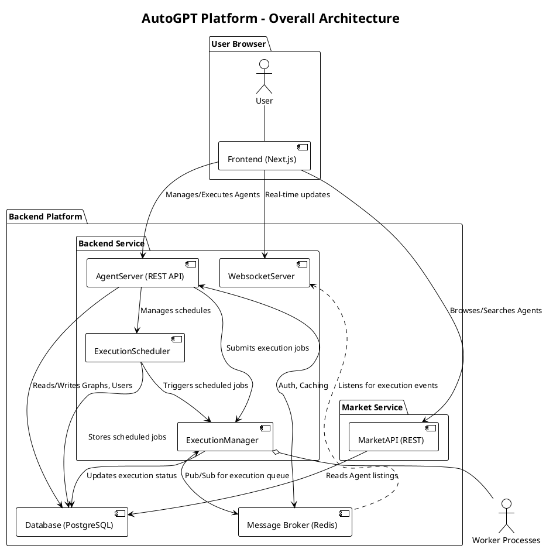
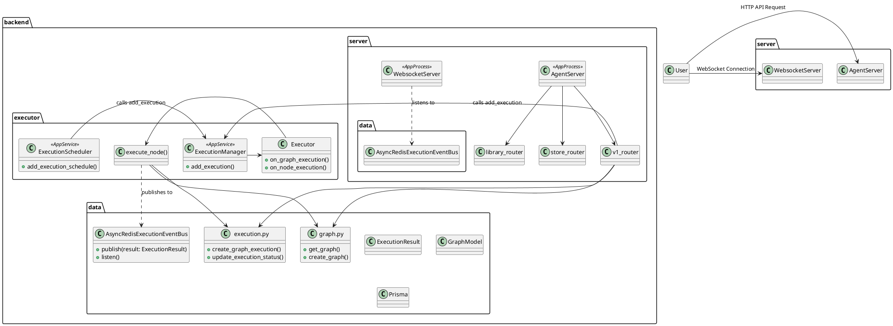
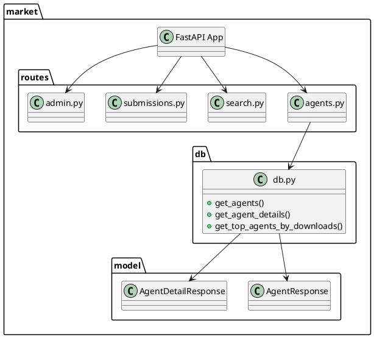

```plantuml
@startuml
package autogpt_libs {

  package auth {
    class User {
      +user_id: str
      +email: str
      +role: str
      +from_payload(payload): User
    }
    class Settings {
      +JWT_SECRET_KEY: str
      +ENABLE_AUTH: bool
    }
    class "jwt_utils" as jwt_utils {
      +parse_jwt_token(token: str): dict
    }
    class "middleware" as auth_middleware {
      +auth_middleware(request: Request)
    }
    class "depends" as auth_depends {
      +requires_user(payload: dict): User
      +requires_admin_user(payload: dict): User
    }
    auth_depends --> auth_middleware
    auth_depends --> User
    auth_middleware -> jwt_utils
    jwt_utils --> Settings
  }

  package api_key {
    class APIKeyManager {
      +generate_api_key(): APIKeyContainer
      +verify_api_key(provided_key, stored_hash): bool
    }
    class APIKeyContainer {
      +raw: str
      +hash: str
    }
    APIKeyManager --> APIKeyContainer
  }

  package feature_flag {
    class "client" as feature_flag_client {
      +initialize_launchdarkly()
      +feature_flag(flag_key, default): decorator
    }
    class Settings {
       +launch_darkly_sdk_key: str
    }
    feature_flag_client --> Settings
  }

  package logging {
    class LoggingConfig
    class "config" as logging_config {
      +configure_logging()
    }
    class AGPTFormatter
    class StructuredLoggingFormatter
    logging_config --> LoggingConfig
    logging_config --> AGPTFormatter
    logging_config --> StructuredLoggingFormatter
  }

  package rate_limit {
    class RateLimiter {
      -redis: Redis
      +check_rate_limit(api_key_id): tuple
    }
    class RateLimitSettings {
      +redis_host: str
      +requests_per_minute: int
    }
    class "middleware" as rate_limit_middleware {
        +rate_limit_middleware(request, call_next)
    }
    rate_limit_middleware --> RateLimiter
    RateLimiter --> RateLimitSettings
  }

  package utils {
    class "synchronize" as synchronize {
      +RedisKeyedMutex
    }
    class "cache" as cache {
      +thread_cached(func): decorator
    }
  }
}
@enduml
```

# AutoGPT 项目解读报告

## 0. 项目概览

- **项目名称与简介**: AutoGPT Platform，一个用于创建和运行 AI Agent以解决业务问题的强大系统。
- **核心理念与设计哲学**: "Agent as a Graph" (Agent即图)。Agent被定义为由相互连接的节点（称为 "Blocks"）组成的图，允许创建复杂、模块化和可重用的工作流。系统采用高度异步和事件驱动的设计，以支持多个Agent的并发执行。
- **技术栈与主要依赖**:
  - **后端**: Python, FastAPI, Prisma, PostgreSQL, Redis, `apscheduler`
  - **前端**: Next.js, TypeScript, Tailwind CSS, React
  - **DevOps**: Docker, Docker Compose
- **目录结构概览**: 项目由多个独立的组件构成，分别位于不同的目录中，核心代码包括：
  - `autogpt_platform/backend`: 核心后端服务，负责 Agent 的执行、调度和数据管理。
  - `autogpt_platform/frontend`: Next.js 前端应用，提供用户交互界面。
  - `autogpt_platform/market`: 独立的市场服务，提供公开的 Agent 浏览和搜索 API。
  - `autogpt_platform/autogpt_libs`: 为后端服务提供通用功能的共享 Python 库。

## 1. 项目架构设计

### 1.1. 系统整体架构
AutoGPT 平台采用基于事件驱动的分布式架构。其核心由以下几个主要部分组成：
- **Frontend**: 一个基于 Next.js 的单页应用，是用户与系统交互的入口。
- **Backend Service**: 核心业务逻辑服务。它不是一个单一的进程，而是由多个协同工作的子服务（`AppProcess`）组成，包括：
    - `AgentServer`: 提供主要的 REST API，用于管理 Agent (Graph) 的生命周期。
    - `WebsocketServer`: 提供 WebSocket API，用于向前端实时推送 Agent 的执行状态。
    - `ExecutionManager`: 系统的执行引擎，负责管理一个工作进程池来异步执行 Agent 图中的节点。
    - `ExecutionScheduler`: 负责管理和触发定时的 Agent 执行任务。
- **Market Service**: 一个独立的微服务，专门提供面向公开浏览的"Agent 商店"API，如搜索、排行和筛选。
- **数据库 (PostgreSQL)**: 使用 Prisma 作为 ORM，持久化存储所有核心数据，包括用户、Agent 定义 (Graphs)、执行历史和定时任务等。
- **消息队列/缓存 (Redis)**: 作为系统的神经中枢，主要用于两个方面：
    1.  **事件总线**: `ExecutionManager` 在执行节点后，将执行结果发布到 Redis，`WebsocketServer` 和 `ExecutionScheduler` 订阅这些事件以触后继操作。
    2.  **任务队列**: `ExecutionManager` 使用进程间共享的队列（`multiprocessing.Manager().Queue()`，但其工作流也依赖Redis进行通信）来分发节点执行任务给工作进程。

### 1.2. 模块划分与职责
- **`autogpt_libs`**: **共享核心库**。提供通用的基础功能，如认证、API密钥管理、功能开关、日志和速率限制，供其他后端服务调用。
- **`backend`**: **核心业务后端**。实现了 Agent 的执行、调度、数据持久化和需要用户认证的社区交互功能（如提交 Agent、发表评论）。
- **`market`**: **市场数据服务**。提供公开的、无需认证的 Agent 浏览、搜索和排行 API，主要服务于前端的"商店"页面。
- **`frontend`**: **用户界面**。负责渲染操作界面，允许用户通过图形化方式创建和管理 Agent，并实时查看执行过程。

### 1.3. 整体架构 PlantUML 类图

## 2. 核心模块详细分析

### 模块 `autogpt_libs` 详细分析

#### 1. 模块概述

- **模块路径**: `thirdparty/AutoGPT/autogpt_platform/autogpt_libs/autogpt_libs`
- **核心职责**: 这是一个共享库，为 AutoGPT 平台中的其他 Python 服务提供通用的基础功能，包括认证、授权、API密钥管理、功能开关(Feature Flag)、日志记录、速率限制和缓存等。它旨在将这些横切关注点从核心业务逻辑中分离出来，实现代码复用。
- **主要组件**:
    - `auth`: 处理基于 JWT 的用户认证和授权。
    - `api_key`: 生成和验证 API 密钥。
    - `feature_flag`: 集成 LaunchDarkly 实现功能开关。
    - `logging`: 提供可配置的、支持控制台、文件和云端的结构化日志系统。
    - `rate_limit`: 基于 Redis 的速率限制器。
    - `utils`: 提供缓存和同步等通用工具函数。

#### 2. 文件结构与实现分析

- **`auth/`**:
    - `middleware.py`: 定义了一个 FastAPI 中间件 `auth_middleware`，它从请求头中提取 Bearer Token，使用 `jwt_utils.py` 进行解析和验证。如果认证关闭 (`ENABLE_AUTH=false`)，则跳过验证。
    - `depends.py`: 提供了 FastAPI 的依赖项，如 `requires_user` 和 `requires_admin_user`，这些依赖项利用 `auth_middleware` 来保护需要特定权限的 API 端点。
- **`api_key/`**:
    - `key_manager.py`: `APIKeyManager` 类负责生成和验证 API 密钥。生成时，它会创建一个带前缀的密钥，并计算其 SHA256 哈希值用于存储；验证时，它会比较传入密钥的哈希值与存储的哈希值。
- **`feature_flag/`**:
    - `client.py`: 使用 `ldclient`（LaunchDarkly SDK）来管理功能开关。它提供了 `feature_flag` 装饰器，可以方便地保护特定路由。
- **`logging/`**:
    - `config.py`: `configure_logging` 函数是核心，它根据 `LoggingConfig` 的设置来配置 Python 的原生 `logging` 模块。支持输出到控制台、文件和 Google Cloud Logging。
- **`rate_limit/`**:
    - `limiter.py`: `RateLimiter` 类使用 Redis 的 sorted set 数据结构来实现一个滑动窗口速率限制算法。
    - `middleware.py`: `rate_limit_middleware` 是一个 FastAPI 中间件，它对 `/api` 路径下的请求进行速率限制检查。
- **`utils/`**:
    - `cache.py`: `thread_cached` 是一个装饰器，提供了一个简单的、基于线程本地存储的内存缓存。
    - `synchronize.py`: `RedisKeyedMutex` 实现了一个基于 Redis 的分布式锁。

#### 3. 模块 PlantUML 类图

---
### 模块 `backend` 详细分析

#### 1. 模块概述

- **模块路径**: `thirdparty/AutoGPT/autogpt_platform/backend/backend`
- **核心职责**: 作为 AutoGPT 平台的核心后端，负责管理、执行和调度 Agent (表示为 "Graph")。它提供了一套完整的 RESTful API 和 WebSocket 服务，用于 Agent 的生命周期管理、执行监控、用户数据处理以及与社区商店的交互。
- **架构设计**: 采用基于事件驱动和微服务理念的异步架构。
    - **多进程模型**: `app.py` 启动多个独立的 `AppProcess`，如 API 服务、执行管理器和调度器，实现了组件的解耦。
    - **异步执行**: Agent 的执行被分解为一系列节点的执行，通过进程间共享的队列和 Redis 事件总线进行通信和调度，实现了高并发和可扩展性。
    - **分层结构**: 代码按功能清晰地分为 `server` (API层), `executor` (执行层), `data` (数据访问层) 等。

#### 2. 关键组件与实现分析

- **`server/` (API 层)**:
    - **`rest_api.py`**: 定义了 FastAPI 应用的入口，整合了 v1 和 v2 的路由。
    - **`ws_api.py`**: 实现 WebSocket 服务。通过 `AsyncRedisExecutionEventBus` 监听 Redis 上的节点执行事件，并将 `ExecutionResult` 实时推送给客户端。
    - **`routers/v1.py`**: 核心的 v1 API，提供了对 Graph、Block、Template、Schedule 和 API Key 的完整 CRUD 操作。`POST /graphs/{graph_id}/execute` 是触发 Agent 执行的关键端点。
    - **`v2/store/routes.py`**: "商店" 功能的 API，允许用户发布、搜索、浏览和评价社区分享的 Agent。
    - **`v2/library/routes.py`**: 用户个人"库"的 API，允许用户将商店中的 Agent 添加到自己的工作区。

- **`data/` (数据访问层)**:
    - **`db.py`**: 使用 `Prisma` 作为 ORM，管理与 PostgreSQL 数据库的连接和事务。
    - **`graph.py`**: 定义了 `Graph`, `Node`, `Link` 等核心 Pydantic 模型，并封装了所有对 Agent 工作流的数据库操作。
    - **`execution.py`**: 定义了 `ExecutionResult` 模型，负责将节点执行的状态、输入、输出持久化到数据库。同时定义了基于 Redis Pub/Sub 的 `AsyncRedisExecutionEventBus`，这是组件间异步通信的关键。

- **`executor/` (执行层)**:
    - **`manager.py`**: **系统的核心引擎**。`ExecutionManager` 服务管理一个进程池来并发执行 Agent 节点。它通过一个共享队列接收执行任务，在子进程中调用 `execute_node` 来运行节点的业务逻辑，然后将后续节点重新入队，并将执行结果发布到 Redis。
    - **`scheduler.py`**: `ExecutionScheduler` 服务使用 `apscheduler` 库来管理定时任务。它将任务持久化到数据库，并在预定时间通过调用 `ExecutionManager` 的接口来提交执行请求。

#### 3. 模块 PlantUML 类图

---
### 模块 `market` 详细分析

#### 1. 模块概述

- **模块路径**: `thirdparty/AutoGPT/autogpt_platform/market`
- **核心职责**: 这是一个独立的 FastAPI 微服务，专门为 AutoGPT 的"市场"（Marketplace）前端提供公开的数据查询 API。它负责处理 Agent 的搜索、过滤、排行、详情展示和下载，并集成了分析功能来追踪用户行为。
- **主要组件**:
    - `app.py`: FastAPI 应用入口，配置中间件并整合所有路由。
    - `routes/`: 包含了 `agents`、`search`、`submissions`、`admin` 和 `analytics` 的路由。
    - `db.py`: 封装了所有使用 Prisma 与市场数据库的交互逻辑。
    - `model.py`: 定义了市场 API 使用的 Pydantic 数据模型。

#### 2. 与 `backend` 服务的关系

`market` 服务与 `backend` 中的 `server/v2/store` 功能互补。`backend` 处理需要用户认证的写操作（如提交、评论），而 `market` 处理不需要认证的读操作（如公开浏览、搜索、排行）。它们共同构成了完整的"Agent 商店"功能。

#### 3. 模块 PlantUML 类图

---
### 模块 `frontend` 详细分析

*(注：由于前端代码库较大，此处仅进行高层级分析)*

#### 1. 模块概述
- **模块路径**: `thirdparty/AutoGPT/autogpt_platform/frontend`
- **核心职责**: 提供一个完整的 Web 用户界面，允许用户以图形化的方式设计、构建、管理和监控他们的 AI Agent。
- **技术栈**: Next.js (App Router), TypeScript, React, Tailwind CSS, shadcn/ui (组件库), React Flow (用于图形化编辑器)。

#### 2. 核心功能与页面结构 (基于目录推断)
- **`/src/app/(creator)/`**:
    - `(agent-editor)/[...agent]`: **Agent 编辑器**核心页面。这是用户构建 Agent (Graph) 的地方，很可能使用了 `React Flow` 或类似的库来提供拖放式的节点编辑体验。
    - `my-agents/`: **我的 Agent** 页面，列出用户创建或保存的所有 Agent。
- **`/src/app/(market)/`**:
    - `agent/[...agent]`: **Agent 详情页**，展示从 `market` 服务获取的社区 Agent 的详细信息、评论等。
    - `creators/`: **创作者市场**，展示社区中的 Agent 创作者。
    - `search/`: **搜索页面**，用于在市场中搜索 Agent 和创作者。
- **`/src/lib/`**:
    - `api/`: 封装了与 `backend` 和 `market` 服务的 API 通信逻辑。
    - `hooks/`: 存放与 WebSocket 连接、认证状态管理等相关的自定义 React Hooks。
- **`/src/components/`**:
    - `ui/`: `shadcn/ui` 提供的基础 UI 组件。
    - `agent/`: 与 Agent 编辑器和展示相关的可重用组件，如节点、边、工具栏等。

---

## 3. 设计模式与亮点分析

- **事件驱动架构 (Event-Driven Architecture)**: 系统高度依赖 Redis Pub/Sub 作为事件总线。节点的执行结果被发布为事件，其他组件（如 WebSocket 服务器、调度器）通过订阅这些事件来解耦并异步地执行各自的逻辑。这大大提高了系统的响应能力和可伸缩性。
- **多进程并发模型 (Multi-Process Concurrency)**: `ExecutionManager` 使用 Python 的 `multiprocessing` 模块创建了一个进程池来执行计算密集型的节点任务。这充分利用了多核 CPU 的处理能力，实现了真正的并行计算。
- **服务解耦 (Service Decoupling)**: 核心业务（`backend`）和公开市场（`market`）被拆分为两个独立的微服务。这种设计降低了系统的复杂度，使得每个服务都可以独立开发、部署和扩展。
- **配置即代码 (Configuration as Code) / Agent as a Graph**: 将复杂的 Agent 逻辑抽象为由节点和连接组成的图（Graph），并以 JSON 格式存储。这使得 Agent 的定义变得直观、可移植且易于版本控制。
- **依赖注入 (Dependency Injection)**: FastAPI 的依赖注入系统被广泛使用（例如在 `autogpt_libs/auth/depends.py` 中），以优雅地处理认证、授权和资源管理。

## 4. 总结与建议

### 4.1. 潜在改进建议
- **数据一致性**: `backend` 和 `market` 服务似乎操作不同的数据库或表，需要确保两者之间数据（特别是 Agent 定义）的同步和一致性，这可能会成为一个复杂点。可以考虑使用数据同步管道或统一数据源。
- **错误处理与可观测性**: 虽然已经集成了 Sentry 和 Prometheus，但在复杂的分布式系统中，端到端的请求追踪尤为重要。可以考虑引入更全面的分布式追踪系统（如 Jaeger、OpenTelemetry），以方便调试跨服务的请求。
- **状态管理**: `ExecutionManager` 中使用了 `multiprocessing.Manager().Queue()`，在某些高负载场景下，可以考虑替换为更健壮的、完全基于 Redis 的分布式任务队列（如 Celery、RQ），以提高系统的可靠性和可扩展性。

### 4.2. 二次开发指南
- **添加新的 Agent 节点 (Block)**:
  1. 在 `backend/backend/blocks/` 目录下创建一个新的 Python 文件。
  2. 继承 `backend.data.block.Block` 类，并实现 `execute` 方法。
  3. 在 `backend/backend/data/block.py` 的 `get_blocks` 函数中注册你的新 Block。
  4. （可选）在前端 `frontend/src/components/agent/nodes` 目录中为新节点创建自定义的 React 组件以获得更好的 UI 效果。
- **扩展 API**:
  1. 如果是与 Agent 核心功能相关的 API，应在 `backend/server/routers/v1.py` 或 `v2` 中添加新的端点。
  2. 如果是与数据模型相关的操作，应先在 `backend/data/` 目录下对应的文件中添加数据访问函数。
- **理解执行流程**:
  - 对于任何与 Agent 执行相关的问题，调试的起点应该是 `executor/manager.py` 中的 `execute_node` 函数和 `on_graph_execution` 方法。通过在这些地方添加日志，可以清晰地看到节点的执行顺序和数据流动。
