# CAMEL Agents 核心架构分析

## 概述

CAMEL (Context-Aware Multi-Agent Language Model) 是一个多智能体框架，提供了丰富的Agent类型来支持不同的AI应用场景。本文档分析了CAMEL Agents的核心架构设计。

## 核心架构图

```plantuml
@startuml CAMEL_Agents_Architecture

!define RECTANGLE class

package "CAMEL Agents Core" {
    abstract class BaseAgent {
        + {abstract} reset(*args, **kwargs): Any
        + {abstract} step(*args, **kwargs): Any
    }
    
    class ChatAgent {
        - system_message: BaseMessage
        - model: BaseModelBackend
        - memory: AgentMemory
        - tools: List[FunctionTool]
        - external_tools: List[FunctionTool]
        + step(input_message, response_format): ChatAgentResponse
        + astep(input_message, response_format): ChatAgentResponse
        + reset(): None
        + add_tool(tool): None
        + remove_tool(tool_name): bool
        + update_memory(message, role, timestamp): None
        + load_memory(memory): None
        + save_memory(path): None
    }
}

package "Task Management Agents" {
    class TaskSpecifyAgent {
        - task_specify_prompt: TextPrompt
        - word_limit: int
        + run(task_prompt, meta_dict): TextPrompt
    }
    
    class TaskPlannerAgent {
        - task_planner_prompt: TextPrompt
        + run(task_prompt): TextPrompt
    }
    
    class TaskCreationAgent {
        - role_name: str
        - objective: TextPrompt
        - max_task_num: int
        + run(task_list): List[str]
    }
    
    class TaskPrioritizationAgent {
        - objective: TextPrompt
        + run(task_list): List[str]
    }
}

package "Specialized Agents" {
    class CriticAgent {
        - options_dict: Dict[str, str]
        - retry_attempts: int
        - verbose: bool
        + get_option(input_message): str
        + parse_critic(critic_msg): Optional[str]
        + reduce_step(input_messages): ChatAgentResponse
    }
    
    class SearchAgent {
        + summarize_text(text, query): str
        + continue_search(query, answer): bool
    }
    
    class KnowledgeGraphAgent {
        + run(element, parse_graph_elements, prompt): Union[str, GraphElement]
        - _validate_node(node): bool
        - _validate_relationship(relationship): bool
        - _parse_graph_elements(input_string): GraphElement
    }
    
    class MCPAgent {
        - registry_configs: List[BaseMCPRegistryConfig]
        - mcp_toolkit: MCPToolkit
        + connect(): None
        + disconnect(): None
        + add_registry(registry_config): None
    }
    
    class RepoAgent {
        - vector_retriever: VectorRetriever
        - repo_paths: List[str]
        - processing_mode: ProcessingMode
        - max_context_tokens: int
        + load_repositories(repo_urls): List[RepositoryInfo]
        + search_by_file_path(file_path): str
        + check_switch_mode(): bool
    }
    
    class EmbodiedAgent {
        - tool_agents: List[BaseToolAgent]
        - code_interpreter: BaseInterpreter
        - verbose: bool
        + _set_tool_agents(system_message): BaseMessage
        + get_tool_agent_names(): List[str]
    }
    
    class RoleAssignmentAgent {
        - role_assignment_prompt: TextPrompt
        + run(task_prompt, num_roles): Dict[str, str]
    }
}

package "Tool Agents" {
    abstract class BaseToolAgent {
        + name: str
        + description: str
        + reset(): None
        + step(): None
    }
    
    class HuggingFaceToolAgent {
        + model_name: str
        + task_type: str
        + execute(input_data): Any
    }
}

package "Supporting Components" {
    class BaseMessage {
        + role_name: str
        + role_type: RoleType
        + content: str
        + meta_dict: Dict
    }
    
    class ChatAgentResponse {
        + msg: BaseMessage
        + terminated: bool
        + info: Dict[str, Any]
    }
    
    class AgentMemory {
        + add_record(record): None
        + get_records(): List[MemoryRecord]
        + clear(): None
    }
    
    class FunctionTool {
        + name: str
        + description: str
        + parameters: Dict
        + execute(*args, **kwargs): Any
    }
}

' 继承关系
BaseAgent <|-- ChatAgent
BaseAgent <|-- BaseToolAgent

ChatAgent <|-- TaskSpecifyAgent
ChatAgent <|-- TaskPlannerAgent
ChatAgent <|-- TaskCreationAgent
ChatAgent <|-- TaskPrioritizationAgent
ChatAgent <|-- CriticAgent
ChatAgent <|-- SearchAgent
ChatAgent <|-- KnowledgeGraphAgent
ChatAgent <|-- MCPAgent
ChatAgent <|-- RepoAgent
ChatAgent <|-- EmbodiedAgent
ChatAgent <|-- RoleAssignmentAgent

BaseToolAgent <|-- HuggingFaceToolAgent

' 组合关系
ChatAgent *-- BaseMessage
ChatAgent *-- AgentMemory
ChatAgent *-- FunctionTool
ChatAgent *-- ChatAgentResponse

EmbodiedAgent *-- BaseToolAgent
EmbodiedAgent *-- BaseInterpreter

RepoAgent *-- VectorRetriever
RepoAgent *-- RepositoryInfo

MCPAgent *-- MCPToolkit

@enduml
```

## 架构特点分析

### 1. 分层设计
- **基础层**: `BaseAgent` 提供抽象接口
- **核心层**: `ChatAgent` 实现基础对话功能
- **专业层**: 各种专业Agent实现特定功能

### 2. 继承体系
- 所有Agent都继承自 `BaseAgent`
- 大部分Agent继承自 `ChatAgent`，复用对话能力
- 工具Agent有独立的继承体系

### 3. 功能模块化

#### 3.1 任务管理类 (Task Management Agents)
**设计目的**: 实现复杂任务的分解、规划和执行管理，遵循"分而治之"的软件工程原则。

- **TaskSpecifyAgent**: 任务细化代理
  - **用途**: 将模糊的任务描述转化为具体、可执行的任务规格
  - **设计原理**: 解决用户需求表达不清晰的问题，通过交互式对话明确任务边界和具体要求
  - **应用场景**: 需求分析、项目规划、任务定义

- **TaskPlannerAgent**: 任务规划代理  
  - **用途**: 将复杂任务分解为可执行的子任务序列
  - **设计原理**: 采用"自上而下"的分解策略，将大任务拆分为小任务，便于并行执行和资源分配
  - **应用场景**: 项目管理、工作流程设计、系统架构规划

- **TaskCreationAgent**: 任务创建代理
  - **用途**: 基于角色和目标自动生成具体的任务列表
  - **设计原理**: 结合角色能力和目标要求，智能生成符合角色特征的任务
  - **应用场景**: 团队协作、角色分配、工作流程自动化

- **TaskPrioritizationAgent**: 任务优先级代理
  - **用途**: 对任务列表进行智能排序和优先级分配
  - **设计原理**: 基于目标导向和资源约束，使用多维度评估模型确定任务执行顺序
  - **应用场景**: 项目管理、资源调度、时间管理

#### 3.2 专业功能类 (Specialized Agents)
**设计目的**: 针对特定领域和功能需求提供专业化的智能体服务，体现"专业分工"的设计理念。

- **CriticAgent**: 批判性思维代理
  - **用途**: 提供决策支持、质量评估和选项选择功能
  - **设计原理**: 模拟人类批判性思维过程，通过多角度分析提供客观评价
  - **应用场景**: 决策支持、质量检查、方案评估、A/B测试

- **SearchAgent**: 智能搜索代理
  - **用途**: 提供语义搜索、内容摘要和相关性评估
  - **设计原理**: 结合向量检索和自然语言处理，实现智能化的信息检索和内容理解
  - **应用场景**: 知识检索、文档分析、信息筛选、研究辅助

- **KnowledgeGraphAgent**: 知识图谱代理
  - **用途**: 从非结构化数据中提取实体和关系，构建结构化知识
  - **设计原理**: 运用NLP技术识别实体、关系和属性，将文本转换为可查询的知识图谱
  - **应用场景**: 知识管理、数据挖掘、关系发现、智能问答

- **MCPAgent**: 模型调用协议代理
  - **用途**: 集成和管理多种外部工具和服务，提供统一的工具调用接口
  - **设计原理**: 采用适配器模式，将不同的工具和服务统一封装，实现工具的动态发现和调用
  - **应用场景**: 工具集成、服务编排、API管理、系统集成

- **RepoAgent**: 代码仓库代理
  - **用途**: 结合代码仓库上下文进行代码生成、理解和分析
  - **设计原理**: 采用RAG(检索增强生成)技术，将代码库作为知识库，提供上下文感知的代码服务
  - **应用场景**: 代码生成、代码审查、重构建议、文档生成

#### 3.3 工具集成类 (Tool Integration Agents)
**设计目的**: 实现智能体与外部工具和环境的深度集成，体现"人机协作"的设计理念。

- **EmbodiedAgent**: 具身智能代理
  - **用途**: 集成多种工具和代码解释器，实现复杂任务的自动化执行
  - **设计原理**: 采用"工具使用"范式，将AI的推理能力与工具的执行能力相结合
  - **应用场景**: 自动化测试、数据处理、系统监控、工作流自动化

- **RoleAssignmentAgent**: 角色分配代理
  - **用途**: 根据任务需求自动分配和定义合适的角色
  - **设计原理**: 基于任务分析和角色建模，实现智能的角色匹配和职责分配
  - **应用场景**: 团队组建、角色设计、协作规划、组织架构

#### 3.4 工具扩展类 (Tool Extension Agents)
**设计目的**: 提供可扩展的工具框架，支持自定义工具的开发和使用。

- **BaseToolAgent**: 工具代理基类
  - **用途**: 定义工具代理的标准接口和基础功能
  - **设计原理**: 采用抽象基类模式，为工具代理提供统一的接口规范
  - **应用场景**: 工具开发框架、接口标准化、扩展性设计

- **HuggingFaceToolAgent**: HuggingFace工具代理
  - **用途**: 集成HuggingFace生态系统的模型和工具
  - **设计原理**: 作为具体实现，展示如何集成第三方AI服务和模型
  - **应用场景**: 模型调用、AI服务集成、功能扩展

### 4. 核心特性
- **多模型支持**: 支持多种LLM后端
- **内存管理**: 内置AgentMemory支持对话历史
- **工具调用**: 支持FunctionTool和外部工具
- **异步支持**: 提供同步和异步接口
- **可扩展性**: 易于添加新的Agent类型

### 5. 设计模式与架构优势

#### 5.1 核心设计模式

- **模板方法模式**: BaseAgent定义接口，子类实现具体逻辑
  - **优势**: 确保所有Agent具有一致的基础接口，便于统一管理和扩展
  - **应用**: 所有Agent都实现reset()和step()方法，保证接口一致性

- **策略模式**: 不同的Agent实现不同的处理策略
  - **优势**: 支持运行时策略切换，提高系统的灵活性和可扩展性
  - **应用**: 不同Agent可以根据任务类型选择最适合的处理策略

- **组合模式**: EmbodiedAgent组合多个工具Agent
  - **优势**: 实现功能的模块化组合，支持复杂功能的构建
  - **应用**: 将多个简单工具组合成复杂的智能体系统

- **适配器模式**: MCPAgent适配不同的MCP注册表
  - **优势**: 统一不同工具的接口，降低系统耦合度
  - **应用**: 将各种外部工具和服务统一封装为可调用的接口

#### 5.2 架构设计优势

**1. 模块化设计**
- **优势**: 每个Agent职责单一，便于独立开发、测试和维护
- **体现**: 不同功能模块可以独立演进，不影响其他模块

**2. 可扩展性**
- **优势**: 基于继承和组合的设计，便于添加新的Agent类型
- **体现**: 新Agent只需继承BaseAgent或ChatAgent，即可融入现有架构

**3. 可复用性**
- **优势**: ChatAgent提供的基础功能可以被多个专业Agent复用
- **体现**: 减少代码重复，提高开发效率

**4. 可组合性**
- **优势**: 不同Agent可以组合使用，构建复杂的智能体系统
- **体现**: 支持多智能体协作，实现更复杂的应用场景

**5. 可配置性**
- **优势**: 通过参数配置可以调整Agent的行为和特性
- **体现**: 支持不同场景下的灵活配置和优化

#### 5.3 设计哲学

**1. 单一职责原则**
- 每个Agent专注于特定功能，避免功能耦合
- 便于理解、维护和扩展

**2. 开闭原则**
- 对扩展开放，对修改封闭
- 新功能通过添加新Agent实现，而非修改现有代码

**3. 依赖倒置原则**
- 高层模块不依赖低层模块，都依赖抽象
- BaseAgent作为抽象接口，具体实现可以灵活替换

**4. 接口隔离原则**
- 提供最小化的接口，避免不必要的依赖
- 每个Agent只暴露必要的公共接口

## 使用场景与最佳实践

### 1. 对话系统 (Conversation Systems)
**核心Agent**: ChatAgent
- **应用场景**: 客服机器人、智能助手、教育辅导
- **优势**: 支持多轮对话、上下文记忆、工具调用
- **最佳实践**: 结合CriticAgent进行质量评估，使用SearchAgent增强知识检索

### 2. 任务分解与规划 (Task Decomposition & Planning)
**核心Agent**: TaskSpecifyAgent, TaskPlannerAgent, TaskCreationAgent, TaskPrioritizationAgent
- **应用场景**: 项目管理、工作流程设计、系统架构规划
- **优势**: 将复杂任务分解为可执行的子任务，支持并行处理
- **最佳实践**: 四类Agent协同工作，形成完整的任务管理流水线

### 3. 代码生成与理解 (Code Generation & Understanding)
**核心Agent**: RepoAgent
- **应用场景**: 代码生成、代码审查、重构建议、文档生成
- **优势**: 结合代码仓库上下文，提供准确的代码服务
- **最佳实践**: 结合EmbodiedAgent的工具调用能力，实现代码的自动执行和测试

### 4. 知识图谱构建 (Knowledge Graph Construction)
**核心Agent**: KnowledgeGraphAgent
- **应用场景**: 知识管理、数据挖掘、关系发现、智能问答
- **优势**: 从非结构化数据中提取结构化知识
- **最佳实践**: 结合SearchAgent进行知识检索，使用MCPAgent集成外部知识源

### 5. 工具集成与自动化 (Tool Integration & Automation)
**核心Agent**: EmbodiedAgent, MCPAgent
- **应用场景**: 自动化测试、数据处理、系统监控、工作流自动化
- **优势**: 集成多种工具，实现复杂任务的自动化执行
- **最佳实践**: 使用RoleAssignmentAgent进行角色分配，实现多角色协作

### 6. 智能搜索与信息检索 (Intelligent Search & Information Retrieval)
**核心Agent**: SearchAgent
- **应用场景**: 知识检索、文档分析、信息筛选、研究辅助
- **优势**: 提供语义搜索和内容摘要功能
- **最佳实践**: 结合KnowledgeGraphAgent构建知识图谱，提升搜索质量

### 7. 多智能体协作 (Multi-Agent Collaboration)
**核心Agent**: 所有Agent类型的组合
- **应用场景**: 复杂系统设计、大规模项目管理、智能决策支持
- **优势**: 不同Agent各司其职，协同完成复杂任务
- **最佳实践**: 使用CriticAgent进行质量评估，确保协作效果

## 架构设计总结

这个架构设计体现了CAMEL框架的以下核心价值：

### 1. 灵活性 (Flexibility)
- 支持多种Agent类型的自由组合
- 可以根据具体需求选择合适的Agent
- 支持自定义Agent的开发和集成

### 2. 可扩展性 (Extensibility)
- 基于继承和组合的设计模式
- 新功能通过添加新Agent实现
- 支持第三方工具和服务的集成

### 3. 可维护性 (Maintainability)
- 模块化设计，职责清晰
- 单一职责原则，便于理解和维护
- 标准化接口，降低耦合度

### 4. 可复用性 (Reusability)
- ChatAgent提供的基础功能可被复用
- 工具和组件可以在不同Agent间共享
- 支持配置化，适应不同场景

### 5. 可组合性 (Composability)
- 不同Agent可以组合使用
- 支持复杂系统的构建
- 实现功能的模块化组合

这种设计使得CAMEL框架能够适应各种AI应用场景的需求，从简单的对话系统到复杂的多智能体协作系统，都能提供有效的支持。
