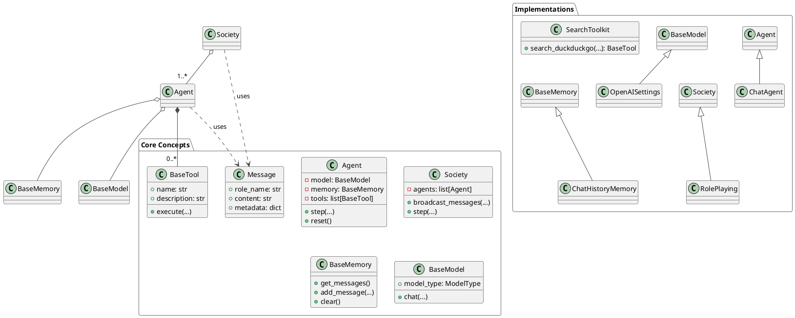
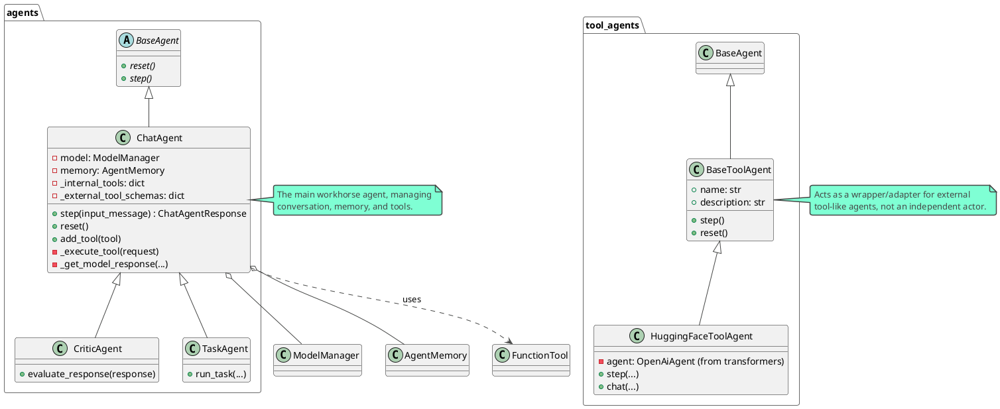
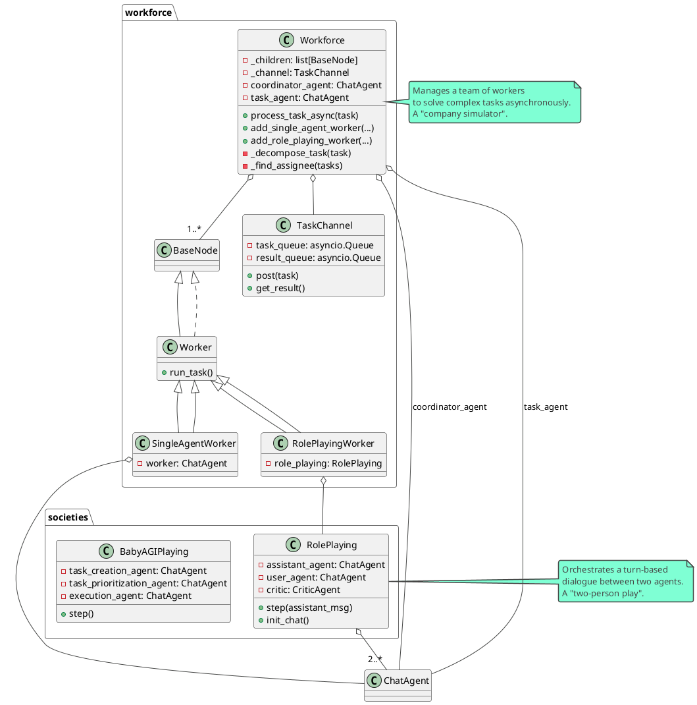

# CAMEL (Communicative Agents for "Mind" Exploration of Large Language Model Society) 项目解读报告

## 0. 项目概览

- **项目名称**: CAMEL (Communicative Agents for "Mind" Exploration of Large Language Model Society)
- **核心理念**: CAMEL 是一个开源社区，致力于研究AI智能体（Agent）的规模化定律（Scaling Laws）。它认为大规模研究这些智能体能够为我们提供关于其行为、能力和潜在风险的宝贵见解。
- **设计哲学**:
    - **可演化性 (Evolvability)**: 框架使多智能体系统能够通过生成数据和与环境交互来持续进化。
    - **可扩展性 (Scalability)**: 框架设计支持百万级别的智能体系统，确保大规模下的高效协调和通信。
    - **状态性 (Statefulness)**: 智能体维持状态记忆，使其能够执行多步骤交互并解决复杂任务。
    - **代码即提示 (Code-as-Prompt)**: 每一行代码和注释都作为智能体的提示，强调代码的可读性。
- **技术栈与主要依赖**:
    - **核心依赖**: `openai`, `pydantic`, `httpx`, `tiktoken`, `pillow`。
    - **模块化依赖**: 项目通过 `optional-dependencies` 提供了极其丰富的可选功能包，涵盖了 RAG (`qdrant-client`, `pymilvus`), Web工具 (`duckduckgo-search`, `playwright`), 文档处理 (`PyMuPDF`, `unstructured`), 通信集成 (`slack-sdk`, `discord.py`), 多样的模型平台 (`litellm`, `mistralai`, `anthropic`) 和存储方案 (`redis`, `neo4j`) 等。这种设计极大地提高了框架的灵活性和可扩展性。
    - **开发工具**: `ruff`, `mypy`, `pytest`，保证了代码的高质量和一致性。
- **目录结构概览**:
    - `camel/`: 核心源代码目录，包含了所有模块化功能的实现。
    - `docs/`: 项目文档。
    - `examples/`: 大量的使用示例，展示了框架的各种能力。
    - `pyproject.toml`: 项目配置文件，定义了依赖和项目元数据。
    - `README.md`: 项目的入口介绍文档。

## 1. 项目架构设计

### 1.1. 系统整体架构

CAMEL 作为一个多智能体框架，其架构围绕着几个核心概念构建：

- **Agent (智能体)**: 是系统的基本行动单元。它封装了与大语言模型（LLM）的交互逻辑，并能利用记忆（Memory）和工具（Tools）来完成任务。
- **Society (社会)**: 定义了多个智能体如何进行交互、协作或对抗的规则和环境。例如，`RolePlaying` 让两个智能体扮演不同角色进行对话，而 `Workforce` 则组织多个智能体协同完成一个复杂任务。
- **Model (模型)**: 对底层语言模型（如 GPT-4, Mistral）的API进行了统一的抽象，使得上层应用可以无缝切换不同的模型提供商。
- **Memory (记忆)**: 为智能体提供存储和检索对话历史、任务信息等状态的能力，是实现复杂长期任务的关键。
- **Toolkit (工具箱)**: 将外部功能（如网页搜索、代码执行、文件读写）封装成智能体可以调用的工具，极大地扩展了智能体的能力边界。
- **Message (消息)**: 是智能体之间通信的标准数据结构，承载着内容、角色信息和元数据。

系统的工作流程通常如下：用户定义一个任务和一个智能体社会（Society），社会中的一个或多个智能体（Agent）开始协作。每个智能体在自己的回合（turn）中，根据任务目标、历史消息（从Memory中获取）和自身角色（由Prompt定义），生成下一步行动。如果需要，它可以调用工具箱（Toolkit）中的工具与外部世界交互。所有这些行为都通过底层的模型（Model）抽象层驱动，最终完成用户指定的任务。

### 1.2. 整体架构PlantUML类图



### 1.3. 模块划分与职责

CAMEL 的核心源码位于 `camel/` 目录下，其子目录结构清晰地反映了系统的模块化设计。主要模块及其职责如下：

- **`agents`**: 定义了不同类型的智能体，是框架的核心执行者。
- **`societies`**: 实现了不同的多智能体协作模式和环境。
- **`models`**: 封装了对各种大语言模型API的调用。
- **`prompts`**: 存储和管理用于指导智能体行为的提示词模板。
- **`messages`**: 定义了智能体间通信的消息格式。
- **`memories`**: 提供了多种记忆机制的实现。
- **`toolkits`**: 提供了丰富的即用型工具集。
- **`storages`**: 抽象了向量数据库、键值存储等多种后端存储。
- **`types`**: 定义了系统中使用的各种枚举和数据类型。
- **`utils`**: 包含项目范围内的通用工具函数。

接下来，我们将对其中最核心的几个模块进行深入分析。

## 2. 核心模块详细分析

### 2.1 模块: `agents`

- **模块路径**: `camel/agents/`
- **核心职责**: 定义框架中所有智能体（Agent）的基类和具体实现。这是系统的核心执行单元，封装了智能体的思考（LLM调用）、记忆和行动（工具调用）逻辑。

#### 2.1.1 关键文件与类分析

- **`base.py` -> `BaseAgent`**:
    - 定义了所有智能体的抽象基类。
    - 强制所有子类必须实现 `step()` 和 `reset()` 两个核心方法，确立了智能体的基本行为规范。`step()` 用于驱动智能体执行一步操作，`reset()` 用于重置其内部状态。

- **`chat_agent.py` -> `ChatAgent`**:
    - 这是框架中最核心、最复杂的智能体实现，是 `BaseAgent` 的主要子类。
    - **高度可配置**: 初始化时可以配置系统提示、模型后端、记忆模块、工具列表等，非常灵活。
    - **核心循环**: 其 `step()` 方法是智能体的"心跳"，包含一个驱动智能体与模型、工具交互的复杂循环。它能处理模型的文本回复和工具调用请求。当收到工具调用请求时，它会执行相应的工具，并将结果反馈给模型，进行下一步思考，直到任务完成。
    - **记忆管理**: 拥有复杂的记忆管理机制，特别是能够将超长消息自动切片（Chunking）以适应模型上下文窗口，这是保证长对话稳定性的关键技术。
    - **工具管理**: 能够动态地添加、移除工具，并区分内部工具（自己执行）和外部工具（交由外部处理）。

- **`tool_agents/base.py` -> `BaseToolAgent`**:
    - 为"工具智能体"定义的基类。与 `BaseAgent` 不同，它的 `step` 方法是空的。
    - 它更像一个标准化的**工具容器或适配器**，主要作用是封装外部工具（如HuggingFace模型），并提供统一的 `name` 和 `description`，以便被 `ChatAgent` 发现和调用。

- **`tool_agents/hugging_face_tool_agent.py` -> `HuggingFaceToolAgent`**:
    - `BaseToolAgent` 的一个具体实现，它封装了 `transformers` 库中的 `OpenAiAgent`。
    - 它本身不进行推理，而是将 `step()` 调用直接委托给内部的 `transformers` Agent，充当了外部工具进入CAMEL生态的"桥梁"。

- **其他专用智能体**:
    - `critic_agent.py`: 扮演"批评家"角色，可以对其他智能体的输出进行评估和打分。
    - `task_agent.py`: 专注于任务的分解和执行。
    - `search_agent.py`: 专用于执行搜索任务的智能体。
    - 这些类通常也继承自 `ChatAgent` 或类似的基类，但在提示词、配置或 `step` 逻辑上有特定的优化，以适应其专门的角色。

#### 2.1.2 模块PlantUML类图



### 2.2 模块: `societies`

- **模块路径**: `camel/societies/`
- **核心职责**: 提供多种多智能体协作的模式和环境。如果说 `agents` 模块定义了"演员"，那么 `societies` 模块就定义了"剧本"和"舞台"，负责编排一个或多个智能体如何协同工作以完成更宏大的目标。

#### 2.2.1 关键文件与类分析

- **`role_playing.py` -> `RolePlaying`**:
    - **职责**: 这是一个"双人剧"的编排器。它负责管理两个 `ChatAgent`（通常扮演"助手"和"用户"角色）之间的回合制对话。
    - **工作流**:
        1.  **任务细化**: 在对话开始前，它可以选择性地使用 `TaskSpecifyAgent` 和 `TaskPlannerAgent` 来将一个模糊的任务变得具体化和结构化。
        2.  **系统提示生成**: 使用 `SystemMessageGenerator` 为两个角色生成量身定制的系统提示，明确它们的身份、目标和行为准则。
        3.  **回合制对话**: 在 `step()` 方法中，严格按照"助手发言 -> 用户回应 -> 助手再发言"的顺序驱动对话。
        4.  **引入"评论家"**: 可以选择性地在循环中加入一个 `CriticAgent`，对每一步的对话质量进行评估和筛选，以提升最终输出的质量。
    - **定位**: 适用于模拟两个实体间的对话、协作解决问题、生成高质量的对话数据等场景。

- **`workforce/workforce.py` -> `Workforce`**:
    - **职责**: 这是一个"公司"或"项目团队"的模拟器，是一个功能强大的异步任务处理系统，用于管理由多个"工人"智能体组成的团队。
    - **核心组件**:
        - **Worker (工人)**: `workforce/worker.py` 中定义的 `Worker` 是基本的工作单元，可以是 `SingleAgentWorker`（单个智能体）或 `RolePlayingWorker`（一个角色扮演小组）。
        - **Coordinator Agent (协调员)**: `Workforce` 内置的一个 `ChatAgent`，负责接收任务，并根据任务内容和所有工人的能力描述，将任务分配给最合适的工人。
        - **Task Planner Agent (任务规划师)**: 另一个内置的 `ChatAgent`，负责在任务开始时将其分解为更小的、可执行的子任务。
        - **TaskChannel (任务通道)**: 一个基于 `asyncio.Queue` 的消息队列，用于在 `Workforce` 和 `Worker` 之间传递任务和结果。
    - **工作流**:
        1.  **任务分解**: 接收到一个主任务后，首先由"任务规划师"将其分解为子任务队列。
        2.  **任务分配**: "协调员"从队列中取出任务，决定哪个"工人"最适合执行，然后通过 `TaskChannel` 将任务派发出去。
        3.  **并行执行**: 多个"工人"可以并行地从 `TaskChannel` 接收并执行任务。
        4.  **结果回收与失败处理**: `Workforce` 异步地监听 `TaskChannel` 以回收任务结果。如果任务失败，它有重试和动态创建新工人的能力。
    - **定位**: 适用于执行需要多个不同技能的智能体协作完成的复杂项目，例如"编写一个软件，需要产品经理、程序员、测试员协同工作"。

#### 2.2.2 模块PlantUML类图



## 3. 复杂使用案例：构建一个AI交易机器人

为了更好地理解 CAMEL 框架如何通过多智能体协作解决复杂问题，我们来深入分析一个官方提供的经典案例：**让一个扮演"股票交易员"的AI和一个扮演"Python程序员"的AI进行对话，合作开发一个股票交易机器人**。

这个案例完美地展示了 CAMEL 的核心价值：不同角色的AI专家如何通过对话和协作，将一个模糊的想法转化为具体的、可执行的方案。

- **案例源码路径**: `examples/ai_society/role_playing.py`

### 3.1 案例目标

本案例旨在演示如何使用 `RolePlaying` "社会"模式来：
1.  启动一个由两个不同角色的AI智能体组成的协作会话。
2.  利用框架的 `TaskSpecifyAgent` 将一个高层次的任务（"开发交易机器人"）自动具体化。
3.  观察两个AI如何通过多轮对话，一步步明确需求、设计方案、实现代码。

### 3.2 环境安装与配置

在运行此案例前，请确保您已完成以下步骤：

1.  **安装CAMEL库**:
    ```bash
    pip install camel-ai
    ```
    这个命令会安装 CAMEL 框架的核心组件。

2.  **配置大模型API密钥**:
    CAMEL 默认使用 OpenAI 的模型。您需要获取您的 OpenAI API 密钥，并将其设置为环境变量。
    - **Linux / macOS**:
      ```bash
      export OPENAI_API_KEY='sk-Your-API-Key'
      ```
    - **Windows (CMD)**:
      ```cmd
      set OPENAI_API_KEY=sk-Your-API-Key
      ```
    - **Windows (PowerShell)**:
      ```powershell
      $env:OPENAI_API_KEY="sk-Your-API-Key"
      ```

### 3.3 代码解读

让我们逐行分析 `role_playing.py` 的核心代码：

```python
from colorama import Fore
from camel.societies import RolePlaying
from camel.utils import print_text_animated

def main(model=None, chat_turn_limit=50) -> None:
    # 1. 定义一个高层次、略显模糊的任务
    task_prompt = "Develop a trading bot for the stock market"

    # 2. 初始化 RolePlaying 会话
    role_play_session = RolePlaying(
        assistant_role_name="Python Programmer",
        assistant_agent_kwargs=dict(model=model),
        user_role_name="Stock Trader",
        user_agent_kwargs=dict(model=model),
        task_prompt=task_prompt,
        with_task_specify=True,  # 关键！激活任务具体化功能
        task_specify_agent_kwargs=dict(model=model),
    )

    # 3. 打印AI智能体的"内心思想"（系统提示）和任务演变过程
    print(Fore.GREEN + f"AI Assistant sys message:\n{role_play_session.assistant_sys_msg}\n")
    print(Fore.BLUE + f"AI User sys message:\n{role_play_session.user_sys_msg}\n")
    print(Fore.YELLOW + f"Original task prompt:\n{task_prompt}\n")
    print(Fore.CYAN + "Specified task prompt:" + f"\n{role_play_session.specified_task_prompt}\n")
    print(Fore.RED + f"Final task prompt:\n{role_play_session.task_prompt}\n")

    # 4. 初始化对话并开始循环
    n = 0
    input_msg = role_play_session.init_chat() # 获取开场白
    while n < chat_turn_limit:
        n += 1
        # 5. 驱动对话进行一步
        assistant_response, user_response = role_play_session.step(input_msg)

        # ... [处理终止条件和打印输出] ...

        # 6. 将助理的回复作为用户下一轮的输入
        input_msg = assistant_response.msg
```

1.  **定义任务**: `task_prompt` 只是一个简单的想法。
2.  **初始化 `RolePlaying`**: 这是最关键的一步。
    - 我们定义了两个角色："Python程序员"（助手）和"股票交易员"（用户）。
    - `with_task_specify=True` 是一个非常强大的功能开关。当它开启时，`RolePlaying` 在内部会先启动一个 `TaskSpecifyAgent`。这个智能体会接收原始的 `task_prompt`，并输出一个更详细、更具可操作性的新任务描述。例如，它可能会将任务细化为："设计一个能够连接到实时数据源、应用技术指标（如移动平均线）并根据预设规则执行买卖订单的Python交易机器人。"
3.  **打印信息**: 脚本会打印出框架为两个角色生成的不同系统消息（System Message），这决定了它们的性格和行为方式。同时，它也展示了任务从原始 -> 具体化 -> 最终的全过程。
4.  **获取开场白**: `init_chat()` 方法会生成一个引导性的初始消息，通常是类似"任务已明确，请开始给我指令"的内容，从而启动整个对话。
5.  **驱动对话**: `role_play_session.step(input_msg)` 是对话的核心。它接收上一轮的消息作为输入，然后协调内部的两个 `ChatAgent` 各自"思考"并生成回复，完成一轮完整的"你问我答"。
6.  **形成闭环**: 将"程序员"的回复作为下一轮"交易员"的输入，对话 thus 得以持续进行。

### 3.4 如何运行与预期输出

1.  **运行脚本**:
    确保您在 `camel` 目录下，然后执行：
    ```bash
    python examples/ai_society/role_playing.py
    ```

2.  **预期输出**:
    您将在终端看到彩色的输出流，生动地展示了两个AI之间的对话。

    - **首先**，您会看到初始化信息，包括为"程序员"和"交易员"量身定制的系统提示，以及任务是如何被具体化的。

    - **接着**，对话开始，您可能会看到类似下面的内容（内容由大模型生成，每次都可能不同）：

    > **AI User (Stock Trader):**
    >
    > Great, let's start. First, what data source do you propose we use for real-time stock data? We need something reliable and with a Python-friendly API.
    >
    > **AI Assistant (Python Programmer):**
    >
    > For real-time data, I suggest using the Alpaca API. It's well-documented, provides a good free tier, and has an official Python SDK which makes integration straightforward. I will start by writing a Python script to connect to Alpaca and fetch the current price for a given stock symbol. Here is the first instruction.
    > Instruction: Write a Python function that takes a stock symbol as input and uses the Alpaca API to return its latest price.

    对话会这样持续下去，直到达到 `chat_turn_limit` 或者某一方输出包含 `CAMEL_TASK_DONE` 的特殊指令，标志着任务完成。

## 4. 设计模式与项目总结

### 4.1 设计模式分析

CAMEL 框架的源码中体现了多种经典的设计模式，这些模式共同构建了其灵活、可扩展的架构。

- **策略模式 (Strategy Pattern)**: 这是框架中最核心的设计模式。`ChatAgent` 在其 `step` 循环中，将具体的"思考"逻辑委托给外部的 `BaseModel` 实现。用户可以轻松地插入不同的模型（OpenAI, Anthropic, local models）作为不同的策略，而无需修改 `ChatAgent` 的核心代码。同样，`AgentMemory` 也运用了此模式，允许替换不同的记忆和上下文管理策略。

- **工厂模式 (Factory Pattern)**: `ModelFactory` 是一个典型的工厂类，它根据用户提供的平台和模型类型（如 `ModelPlatformType.OPENAI`, `ModelType.GPT_4O`）来创建具体的 `BaseModelBackend` 实例。这大大简化了模型的创建过程，并将具体实例化逻辑与业务代码分离。

- **编排器模式 (Orchestrator Pattern)**: `RolePlaying` 和 `Workforce` 类本身就是编排器模式的体现。它们不亲自执行任务，而是作为"指挥中心"，负责初始化、协调和管理一组智能体（`ChatAgent`），并定义它们之间的交互流程和规则。

- **适配器模式 (Adapter Pattern)**: `HuggingFaceToolAgent` 是一个完美的适配器。它将 `transformers` 库中 Agent 的接口适配成了 CAMEL 框架内部统一的 `BaseToolAgent` 接口，使得外部组件能够无缝地集成到 CAMEL 的生态中。

- **模板方法模式 (Template Method Pattern)**: `BaseAgent` 定义了智能体的骨架（`step` 和 `reset`），而 `ChatAgent` 等子类则填充了这些方法的具体实现。这为创建新类型的智能体提供了一个清晰的模板和规范。

### 4.2 项目亮点

- **极致的模块化与可扩展性**: 这是 CAMEL 最大的亮点。从模型、记忆、工具到存储，几乎所有核心组件都是可插拔的。通过 `pyproject.toml` 中丰富的可选依赖，用户可以按需构建一个从轻量级对话机器人到功能全面的"AI公司"模拟器的任何系统。
- **多样化的协作模式**: 框架不仅提供了简单的双人对话模式（`RolePlaying`），还实现了一套复杂的、可扩展的异步工作流系统（`Workforce`）。这使得 CAMEL 能够模拟从简单协作到复杂项目管理的多种社会交互，为研究"智能体社会学"提供了强大的工具。
- **对研究的专注**: 项目的设计理念、丰富的示例和详细的日志系统都表明其核心目标是服务于AI智能体的学术研究。例如，`TaskSpecifyAgent` 的设计、对多智能体交互的精细控制等，都是为了更好地进行受控实验。
- **强大的核心智能体 (`ChatAgent`)**: `ChatAgent` 的设计非常成熟。其内部的 `step` 循环逻辑、对工具调用的处理、对长上下文的自动切片管理，都体现了作者在构建实用型智能体方面的深厚经验。

### 4.3 潜在改进建议

- **文档与现实的同步性**: 虽然项目文档很丰富，但在快速迭代的过程中，部分高级功能（尤其是 `Workforce` 内部复杂的交互逻辑）的文档可能略显滞后。为新开发者提供更详细的内部工作流图和序列图会非常有帮助。
- **开发者体验**: 对于想要自定义 `Workforce` 行为的开发者来说，其内部的异步和多层回调逻辑可能稍显复杂。可以考虑提供更高层次的API或更简洁的入口来简化自定义工作流的创建。
- **错误处理与调试**: 在复杂的 `Workforce` 流程中，当某个子任务失败时，追踪错误的根源可能需要深入研究日志。增强错误信息的可读性，提供更清晰的失败回溯路径，将改善调试体验。

### 4.4 二次开发指南

对于希望在 CAMEL 基础上进行二次开发的开发者，以下是一些建议路径：

1.  **从 `RolePlaying` 开始**: 这是理解智能体交互最简单的入口。尝试修改 `examples/ai_society/role_playing.py`，比如更换角色、修改任务、或者给 `ChatAgent` 添加一个自定义工具，是熟悉框架基本盘的最佳方式。
2.  **实现自定义工具**: 创建一个新的 `FunctionTool` 并将其添加到 `ChatAgent` 中。这能帮助你理解工具的生命周期以及智能体是如何决定调用它的。
3.  **探索 `Workforce`**: 如果你的目标是构建复杂的应用，请深入研究 `workforce` 目录。尝试运行 `examples/workforce/basic_usage.py`，然后尝试自定义一个 `Worker`，并将其添加到 `Workforce` 中，观察协调员是如何发现并给它分配任务的。
4.  **贡献新的 `Society`**: 如果你构思了一种新的多智能体协作模式，可以模仿 `RolePlaying` 或 `Workforce` 的结构，创建自己的编排器。这是对框架贡献价值最大的方式之一。

## 5. 总结

CAMEL 是一个设计精良、架构灵活且功能强大的多智能体框架。它不仅仅是一个让AI对话的工具，更是一个用于严肃研究AI智能体社会行为的"虚拟实验室"。其通过策略、工厂、编排器等设计模式构建的高度模块化系统，使其在学术研究和复杂应用开发方面都具有巨大的潜力。

对于希望理解当前多智能体系统（MAS）前沿技术的研究者和开发者来说，CAMEL 的源码无疑是一个值得深入学习的宝库。
