# crewAI 源码分析报告

## 0. 项目概览

crewAI 是一个帮助开发者构建和编排多个 AI 代理（Agent）的框架。它旨在让代理能够协同工作，完成复杂的任务。

### 0.1. 技术栈

- 主要语言: Python
- 核心依赖: LangChain, Pydantic

### 0.2. 目录结构概览

简化的目录结构，以突出核心组件：
```
crewai/
├── __init__.py
├── agent.py                # Agent 的核心定义
├── task.py                 # Task 的核心定义
├── crew.py                 # Crew 的核心定义，用于编排 Agent 和 Task
├── process.py              # 定义 Crew 的执行流程
├── llm.py                  # 与大语言模型的交互
├── agents/                 # Agent 相关的高级功能，如执行器和工具处理
│   ├── crew_agent_executor.py
│   └── ...
├── tasks/                  # Task 相关的组件
│   └── ...
├── tools/                  # 工具的定义和使用
│   └── ...
├── memory/                 # 为 Agent 提供记忆功能
│   └── ...
├── knowledge/              # 为 Agent 提供知识库功能
│   └── ...
└── flow/                   # 定义和可视化任务流
    └── ...
```
> *注：为简洁起见，省略了 `cli` 等非核心运行时的文件夹和一些辅助性文件。*

## 1. 核心概念与模块分析

crewAI 的核心概念包括 `Agent`, `Task`, `Crew`, `Tools`, `Memory`, `Knowledge`, 和 `Flow`。我将逐一分析这些模块。

### 1.1. Agent (`agent.py`, `agents/`)

Agent 是执行任务的基本单位。每个 Agent 都有自己的角色 (Role)、目标 (Goal)、背景故事 (Backstory) 和可使用的工具 (Tools)。

`agent.py` 中的 `Agent` 类是核心实现，它继承自 `BaseAgent` 并使用 Pydantic 进行数据验证。

#### 1.1.1. 核心属性

- **`role`**: Agent 的角色，例如"高级软件工程师"。
- **`goal`**: Agent 的具体目标，例如"为新的移动应用开发票据管理功能"。
- **`backstory`**: Agent 的背景故事，为 Agent 提供个性和上下文。
- **`llm`**: Agent 使用的大语言模型。框架对此做了很好的封装，可以直接传入一个 `LLM` 对象，也可以传入一个字符串（如 `'gpt-4o-mini'`），框架会自动初始化。
- **`tools`**: Agent 可以使用的工具列表。
- **`memory`**: 是否为 Agent 启用记忆功能。
- **`allow_delegation`**: 是否允许 Agent 将任务委派给其他 Agent。
- **`knowledge_sources`**: 为 Agent 配置的知识库源。

#### 1.1.2. 关键方法

- **`execute_task(task, context, tools)`**: 这是 Agent 执行任务的入口点。它会构建完整的提示 (Prompt)，整合记忆 (Memory) 和知识库 (Knowledge) 的内容，然后调用 `agent_executor` 来执行。
- **`create_agent_executor()`**: 创建一个 `CrewAgentExecutor` 实例。这个执行器是实际运行 Agent 的核心，它管理着与 LLM 的交互、工具的调用以及整个执行循环。
- **`_set_knowledge()`**: 从 `knowledge_sources` 初始化 Agent 的知识库。
- **`_training_handler()` / `_use_trained_data()`**: 这两个方法表明 crewAI 支持一种训练机制，允许 Agent 从人类反馈或已有的训练数据中学习，以改进其未来的表现。

总的来说，`Agent` 类是一个高度可配置的实体，它封装了 AI 代理所需的所有元素：身份、目标、工具和执行逻辑。

### 1.2. Task (`task.py`)

`Task` 是 crewAI 中定义工作单元的类。它详细说明了一个需要被完成的任务。

`task.py` 中的 `Task` 类同样是基于 Pydantic 的模型。

#### 1.2.1. 核心属性

- **`description`**: 任务的详细描述，支持使用 `{}` 占位符进行输入插值。
- **`expected_output`**: 对任务期望输出的清晰定义，同样支持插值。
- **`agent`**: 负责执行此任务的 `Agent` 实例。
- **`context`**: 一个 `Task` 列表。这些前置任务的输出将作为当前任务的上下文，从而构成任务依赖关系。
- **`tools`**: 限定当前任务可用的工具列表，可以覆盖 `Agent` 自身的工具集。
- **`async_execution`**: 是否异步执行任务。
- **`output_json` / `output_pydantic`**: 可以指定一个 Pydantic 模型，以确保输出是结构化的 JSON 或 Pydantic 对象。
- **`output_file`**: 可以指定一个文件路径，将任务的最终输出保存到文件中。
- **`callback`**: 任务完成后调用的回调函数。

#### 1.2.2. 关键方法

- **`execute_sync()` / `execute_async()`**: 同步/异步执行任务的入口。它们内部都调用 `_execute_core`。
- **`_execute_core()`**: 任务执行的核心逻辑。它会获取负责人 `Agent`，并调用其 `execute_task` 方法来完成任务。
- **`prompt()`**: 根据 `description` 和 `expected_output` 生成最终要传递给 Agent 的提示。
- **`interpolate_inputs()`**: 将动态数据插入到 `description` 和 `expected_output` 的占位符中。
- **`_export_output()`**: 将 LLM 返回的原始文本结果，根据 `output_json` 或 `output_pydantic` 的定义，转换为结构化数据。

`Task` 类为定义具体工作提供了非常灵活和强大的方式，特别是任务依赖和结构化输出两大特性。

接下来分析 `Crew` 的定义，它是如何将 Agent 和 Task 组合在一起的。

### 1.3. Crew (`crew.py`)

`Crew` 是整个框架的"指挥官"，它负责组织 `Agent` 并编排 `Task` 的执行。

`crew.py` 中的 `Crew` 类是整个流程的入口和核心控制器。

#### 1.3.1. 核心属性

- **`agents`**: 加入到当前 Crew 的 `Agent` 实例列表。
- **`tasks`**: 需要被执行的 `Task` 实例列表。
- **`process`**: Crew 的执行流程。这是一个枚举类型，目前支持 `sequential` (顺序) 和 `hierarchical` (层级) 两种流程。
- **`manager_llm` / `manager_agent`**: 在 `hierarchical` 流程中，可以指定一个"经理" Agent 来协调其他 Agent 的工作。
- **`memory`**: 是否为整个 Crew 启用记忆功能。Crew 可以统一管理短期、长期和实体记忆。
- **`verbose`**: 控制日志输出的详细程度。

#### 1.3.2. 关键方法

- **`kickoff(inputs)`**: 这是启动整个 Crew 开始工作的入口方法。它会根据 `process` 的设定，开始执行任务。
- **`_run_sequential_process()`**: 按照 `tasks` 列表中的顺序，依次执行每一个任务。
- **`_run_hierarchical_process()`**: 创建一个"经理" Agent，由它来决定任务的分配和执行顺序，实现更复杂的协作。
- **`_execute_tasks()`**: 真正执行任务列表的私有方法，它会处理同步和异步任务的执行、上下文传递等。
- **`train()`**: 和 `Agent` 类似，`Crew` 也支持训练模式，可以通过多轮迭代和人类反馈来优化协作流程。
- **`replay(task_id)`**: 一个非常实用的调试功能，允许从任意一个失败或指定的 `task_id` 开始，重新执行后续流程。

`Crew` 类将 Agent 和 Task 有机地结合在一起，通过不同的 `process` 提供了灵活的协作模式。它不仅是执行器，还提供了训练、调试等高级功能，是构建复杂多代理系统的关键。

接下来将概览性地分析一下其他辅助模块，包括 `Tools`, `Memory`, `Knowledge`, 和 `Flow`。

### 1.4. 其他核心模块概览

#### 1.4.1. Tools (`tools/`)

`Tools` 是 Agent 执行具体操作的"手臂"。crewAI 提供了一个 `BaseTool` 基类，开发者可以继承它来创建自己的工具。这些工具可以是从简单的数学计算，到调用外部 API，再到与其他 Agent 交互的任何功能。`tools/agent_tools` 子目录中就提供了 Agent 之间互相委派和提问的内置工具。

#### 1.4.2. Memory (`memory/`)

`Memory` 模块为 Agent 提供了记忆能力。这个模块设计得非常精细，分成了多种类型：
- **`short_term`**: 短期记忆，用于存储当前任务执行过程中的信息。
- **`long_term`**: 长期记忆，可以让 Agent "记住"跨任务、跨会话的信息。
- **`entity`**: 实体记忆，专门用于记住关于特定实体（如人、地点、概念）的信息。
- **`storage`**: 提供了多种记忆存储的后端，如 `ltm_sqlite_storage` (长期记忆的 SQLite 存储) 和 `rag_storage` (用于 RAG 的存储)。

#### 1.4.3. Knowledge (`knowledge/`)

`Knowledge` 模块允许你为 Agent 或 Crew 提供一个知识库。你可以从多种来源加载知识：
- **`source`**: 支持从文本文件、PDF、CSV、JSON 等多种格式的文件中加载知识。
- **`embedder`**: 使用嵌入模型（如 `fastembed`）来处理和索引知识。
- **`storage`**: 将处理过的知识存储起来，以供 Agent 在执行任务时查询。

这个模块让 Agent 能够基于你提供的私有数据来完成任务，极大地扩展了其能力。

#### 1.4.4. Flow (`flow/`)

`flow` 目录下的功能似乎是为了更复杂的任务流程控制和可视化。从 `flow.py`、`flow_visualizer.py` 等文件名可以看出，它可能支持定义一个比 `sequential` 或 `hierarchical` 更灵活的、基于图的任务流程，并能将其可视化地展示出来。这是一个高级功能，适用于需要非常精细地控制任务流转的场景。

## 2. 核心模块类图 (PlantUML)

为了更直观地展示核心模块的内部结构和关系，以下是使用 PlantUML 生成的类图。

### 2.1. Agents 模块

`agents` 模块负责代理的执行逻辑，包括与 LLM 的交互、工具的使用和输出的解析。`CrewAgentExecutor` 是该模块的核心。
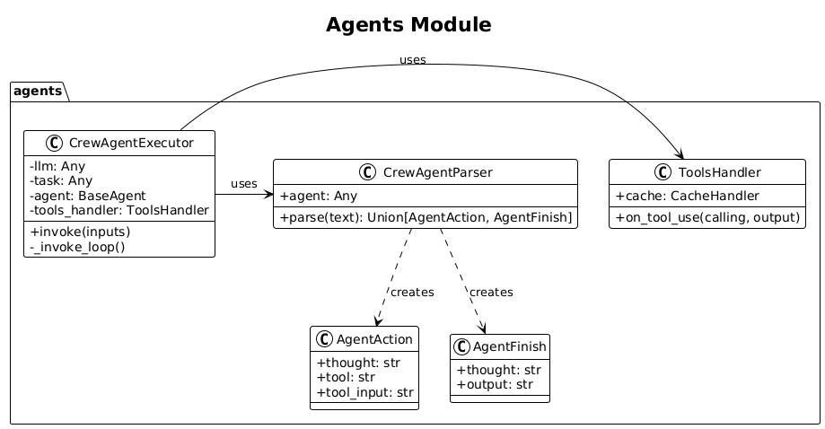
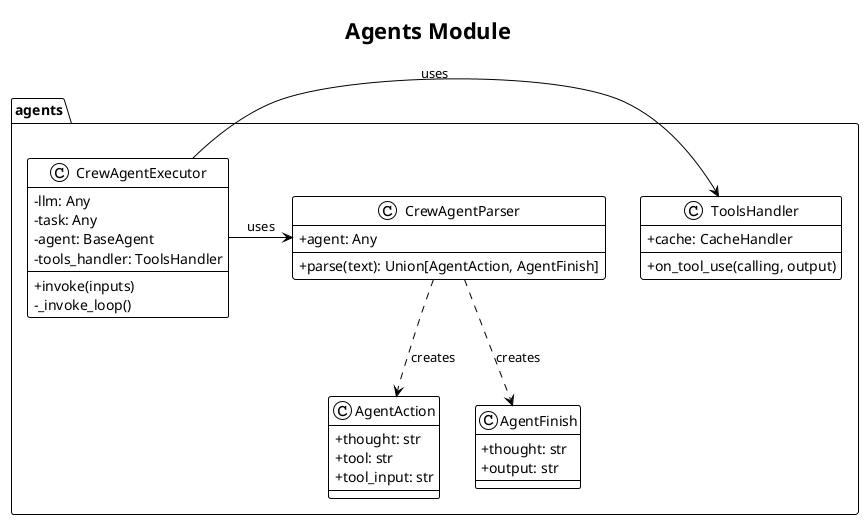

### 2.2. Crews 模块

`crews` 模块相对简单，主要定义了 `Crew` 执行完成后的输出数据结构 `CrewOutput`。

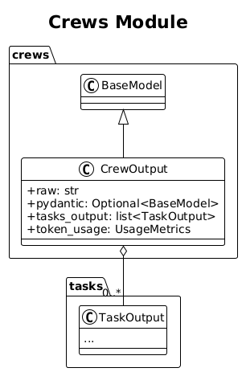

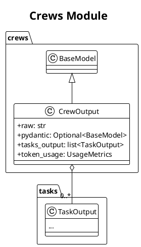

### 2.3. Tasks 模块

`tasks` 模块定义了工作的基本单元。`Task` 是所有任务的基类，而 `ConditionalTask` 等子类则提供了更丰富的流程控制能力。

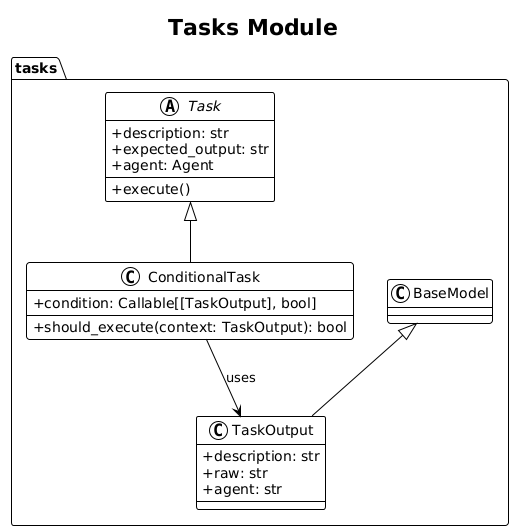

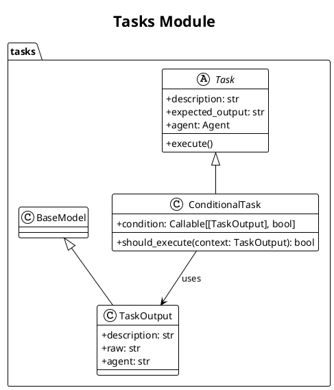

### 2.4. Tools 模块

`tools` 模块是框架的"手臂"，定义了代理可以执行的具体操作。`BaseTool` 是所有工具的基类，`ToolUsage` 负责整个工具的调用生命周期。

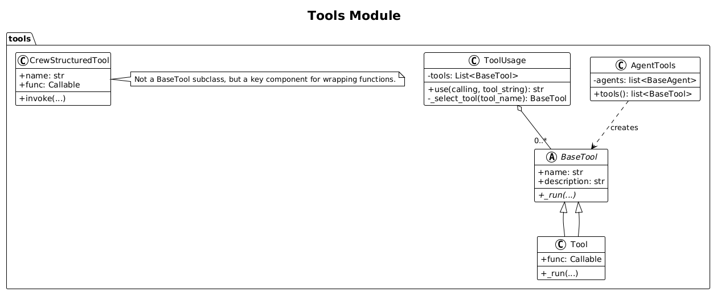

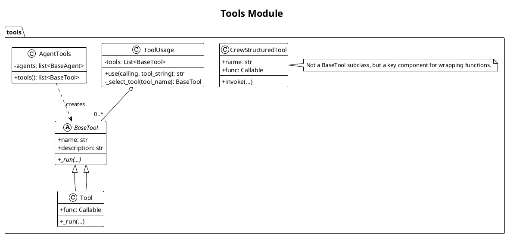

### 2.5. Memory 模块

`memory` 模块为代理提供了记忆能力。它被精心设计为多种类型（短期、长期、实体），并由 `ContextualMemory` 统一管理和调用，为代理提供丰富的上下文。

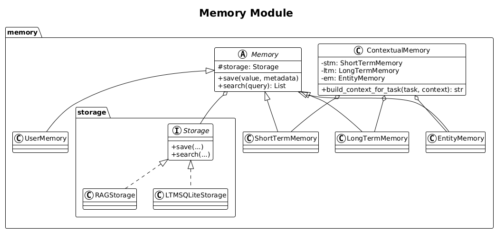

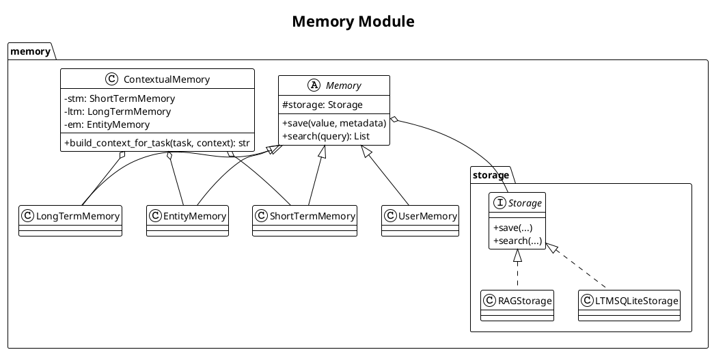

### 2.6. Knowledge 模块

`knowledge` 模块允许你为代理提供外部知识库。它通过 `Source` -> `Storage` -> `Embedder` 的清晰流水线，将外部文档处理成可供检索的向量化知识。

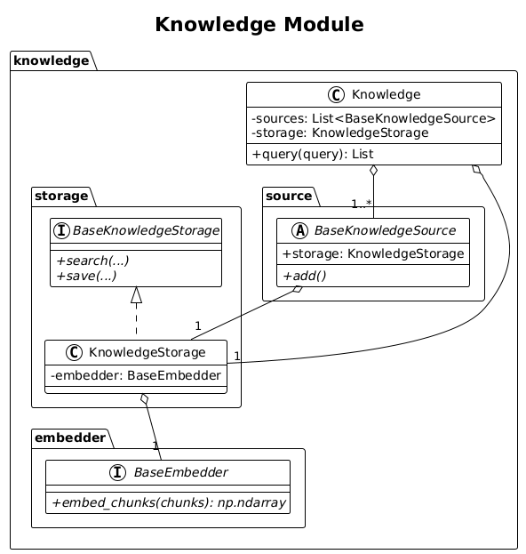

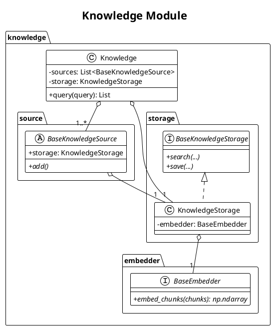

### 2.7. Flow 模块

`flow` 模块提供了一种先进的、基于图的工作流定义方式。通过 `@start`、`@listen` 和 `@router` 等装饰器，开发者可以构建出复杂的、事件驱动的任务流程，并能将其可视化。

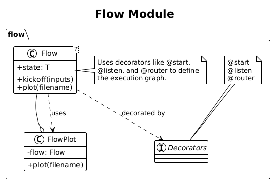

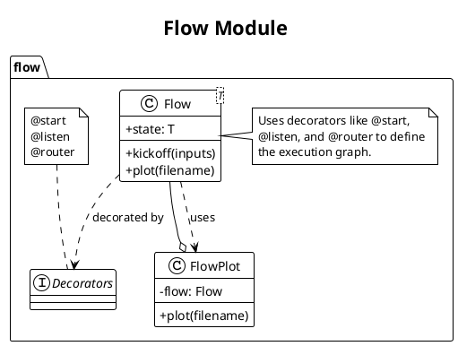

### 2.8. 架构设计

crewAI 的架构是典型的**"组合与编排" (Composition and Orchestration)** 模式。
- **组合 (Composition)**: `Agent`、`Task`、`Tools` 这些基本组件都是可独立定义、可复用的模块。你可以像搭乐高一样，自由组合它们来构建一个有特定能力的"工作人员"。
- **编排 (Orchestration)**: `Crew` 扮演了编排者的角色。它将组合好的 `Agent` 和 `Task` 按照预设的 `Process` (流程) 组织起来，管理它们的协作和生命周期。

这种分层、解耦的设计使得框架非常灵活和可扩展。

### 2.9. 设计模式

crewAI 在实现中运用了多种经典的设计模式：
- **策略模式 (Strategy Pattern)**: `Crew` 中的 `process` (sequential vs hierarchical) 是策略模式的典型应用。用户可以选择不同的策略来执行任务流，而 `Crew` 的主干逻辑 (`kickoff`) 无需改变。
- **模板方法模式 (Template Method Pattern)**: `BaseTool` 和 `BaseAgent` 等基类可以看作是模板方法模式的体现。它们定义了核心的、不可变的方法（如工具的执行接口），同时允许子类去实现具体的业务逻辑。
- **回调模式 (Callback Pattern)**: `Task` 中的 `callback` 属性，以及 `Crew` 中的 `task_callback` 和 `step_callback`，都是回调模式的应用。这使得用户可以在任务执行的不同阶段注入自定义逻辑，增强了框架的钩子 (Hooks) 能力。
- **Pydantic 模型即接口**: 整个框架大量使用 Pydantic 模型来定义数据结构。这不仅提供了强大的数据验证能力，实际上也起到了一种"接口定义语言"的作用，使得各个组件之间的契约非常清晰。

## 3. 总结与展望

### 3.1. 项目亮点

- **高度的灵活性与可扩展性**: 通过组件化的设计，用户可以轻松地自定义 Agent、Task 和 Tool。
- **强大的流程控制**: 支持顺序和层级两种协作模式，并提供了 `Flow` 这一高级选项，足以应对从简单到复杂的各种应用场景。
- **完善的周边能力**: 内置了记忆、知识库、工具缓存、训练、调试 (replay) 等一系列高级功能，为构建生产级的 Agent 应用提供了坚实的基础。
- **清晰的抽象**: `Agent`, `Task`, `Crew` 的概念划分非常清晰，符合人类组织工作的直觉，降低了上手门槛。

### 3.2. 使用建议

对于新用户，建议从以下路径探索和使用 crewAI：
1. **从单个 Agent 开始**: 先创建一个 `Agent`，为其配备一两个简单的 `Tool`，并让它执行一个 `Task`。
2. **构建顺序型 Crew**: 将多个 `Agent` 和 `Task` 组织到一个 `Crew` 中，使用 `sequential` 模式，理解任务如何串联执行。
3. **尝试层级型 Crew**: 对于需要决策和分发的场景，尝试 `hierarchical` 模式，设置一个 `manager_agent` 来协调工作。
4. **深入高级功能**: 在掌握了基本用法后，再逐步探索 `Memory`, `Knowledge`, `output_pydantic` 等高级功能，以满足更复杂的需求。

这份报告到此结束。

## 4. 安装与使用指南

### 4.1. 安装流程

crewAI 要求 Python 版本 >=3.10 且 <3.13。安装过程非常简单：

```shell
# 基础安装
pip install crewai

# 安装带额外工具的版本
pip install 'crewai[tools]'
```

其中 `crewai[tools]` 包含了额外的工具组件，可以增强代理的能力，但需要更多的依赖项。

### 4.2. 使用 YAML 配置创建 Crew

crewAI 提供了便捷的 CLI 命令来创建新项目：

```shell
crewai create crew <项目名称>
```

这将创建一个具有以下结构的项目文件夹：

```
my_project/
├── .gitignore
├── pyproject.toml
├── README.md
├── .env
└── src/
    └── my_project/
        ├── __init__.py
        ├── main.py
        ├── crew.py
        ├── tools/
        │   ├── custom_tool.py
        │   └── __init__.py
        └── config/
            ├── agents.yaml
            └── tasks.yaml
```

要自定义项目，你可以：
- 修改 `src/my_project/config/agents.yaml` 定义你的代理
- 修改 `src/my_project/config/tasks.yaml` 定义你的任务
- 修改 `src/my_project/crew.py` 添加自定义逻辑、工具和特定参数
- 修改 `src/my_project/main.py` 添加代理和任务的自定义输入
- 在 `.env` 文件中添加环境变量

### 4.3. 运行 Crew

在运行之前，确保在 `.env` 文件中设置了必要的 API 密钥：
- OpenAI API 密钥：`OPENAI_API_KEY=sk-...`
- Serper.dev API 密钥（如果使用搜索工具）：`SERPER_API_KEY=YOUR_KEY_HERE`

然后，在项目根目录下运行：

```shell
crewai run
```

或者：

```shell
python src/my_project/main.py
```

## 5. 使用案例示例

crewAI 官方提供了多个实际案例，展示了不同场景下的应用：

### 5.1. 职位描述生成器

这个案例展示了如何使用 crewAI 自动生成详细的职位描述。代理会分析职位要求，并生成专业、吸引人的职位描述文本。

### 5.2. 旅行规划师

这个例子使用多个代理协作，为用户规划旅行。包括：
- 本地专家代理：了解目的地的文化、景点和隐藏宝藏
- 旅行规划师代理：根据用户偏好和预算创建行程
- 住宿专家代理：推荐最佳住宿选择

这些代理协同工作，生成一个全面的旅行计划，包括每日行程、住宿建议和当地体验。

### 5.3. 股票分析

这个案例展示了如何使用 crewAI 进行金融分析：
- 研究分析师代理：收集公司和行业数据
- 财务分析师代理：分析财务报表和指标
- 投资顾问代理：整合信息并提供投资建议

最终输出是一份详细的股票分析报告，包括公司概况、财务健康状况和投资建议。

## 6. 二次开发建议流程

如果你想为 crewAI 项目贡献代码或进行二次开发，以下是建议的流程：

### 6.1. 环境设置

1. 克隆仓库并安装开发依赖：
```bash
# 安装依赖
uv lock
uv sync

# 创建虚拟环境
uv venv

# 安装 pre-commit 钩子
pre-commit install
```

### 6.2. 测试与验证

开发过程中应该定期运行测试和类型检查：
```bash
# 运行测试
uv run pytest .

# 运行静态类型检查
uvx mypy src
```

### 6.3. 打包与本地安装

如果你想测试你的修改：
```bash
# 构建包
uv build

# 本地安装
pip install dist/*.tar.gz
```

### 6.4. 贡献指南

1. Fork 仓库
2. 为你的功能创建一个新分支
3. 添加你的功能或改进
4. 发送 pull request

### 6.5. 开发建议

基于 crewAI 的架构特点，二次开发时可以考虑以下几个方向：

1. **自定义工具开发**：为特定领域创建专用工具，扩展 `BaseTool` 类
2. **流程扩展**：除了现有的 `sequential` 和 `hierarchical` 流程，可以开发新的协作流程模式
3. **记忆与知识库增强**：改进或扩展记忆和知识库模块，以支持更复杂的场景
4. **可视化组件**：增强 `Flow` 模块的可视化能力，提供更直观的任务流程展示

开始开发时，建议从单个代理和简单任务开始，逐步扩展到更复杂的多代理协作系统。