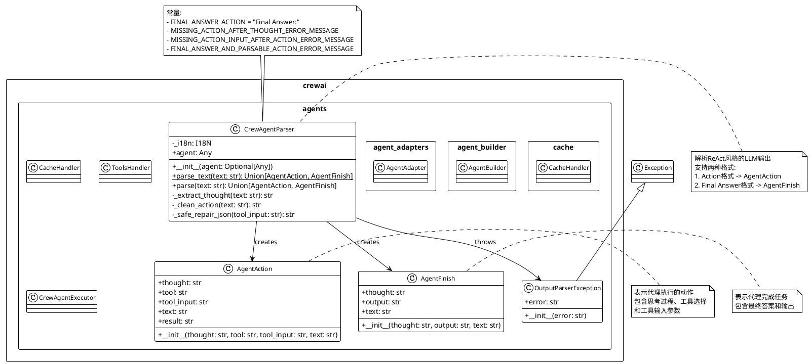

# CrewAI Agents 架构类图

基于对 CrewAI agents 模块的分析，以下是详细的 PlantUML 类图：



## 架构说明

### 核心组件

1. **CrewAgentParser**: 
   - 核心解析器，负责解析LLM的ReAct风格输出
   - 支持静态方法 `parse_text()` 进行文本解析
   - 包含JSON修复和错误处理机制

2. **AgentAction**: 
   - 表示代理需要执行的动作
   - 包含思考过程、工具名称、工具输入和原始文本

3. **AgentFinish**: 
   - 表示代理任务完成
   - 包含最终思考、输出结果和原始文本

4. **OutputParserException**: 
   - 解析异常处理类
   - 用于处理格式错误和解析失败的情况

### 解析流程

1. **输入**: LLM生成的ReAct格式文本
2. **解析**: CrewAgentParser分析文本结构
3. **输出**: 根据内容返回AgentAction或AgentFinish对象

### 支持的格式

#### Action格式:
```
Thought: agent thought here
Action: search
Action Input: what is the temperature in SF?
```

#### Final Answer格式:
```
Thought: agent thought here
Final Answer: The temperature is 100 degrees
```

### 模块导出

从 `__init__.py` 可以看出，主要导出的类包括：
- `CacheHandler`: 缓存处理
- `CrewAgentParser`: 核心解析器
- `ToolsHandler`: 工具处理

### 错误处理

解析器包含完善的错误处理机制：
- 缺少Action的错误
- 缺少Action Input的错误
- 同时包含Action和Final Answer的错误
- JSON修复功能

这个架构体现了CrewAI对代理行为解析的精细化处理，确保了LLM输出的正确解析和执行。
