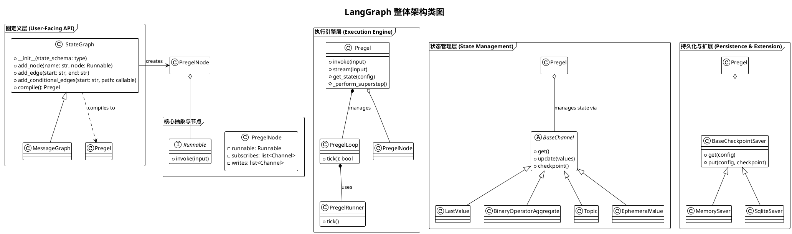
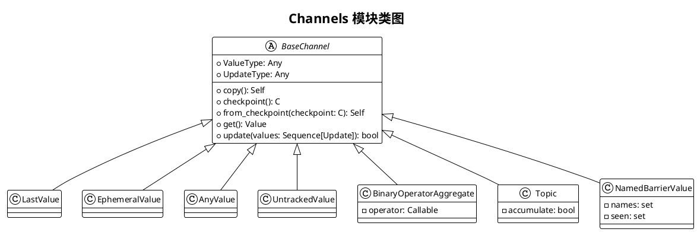
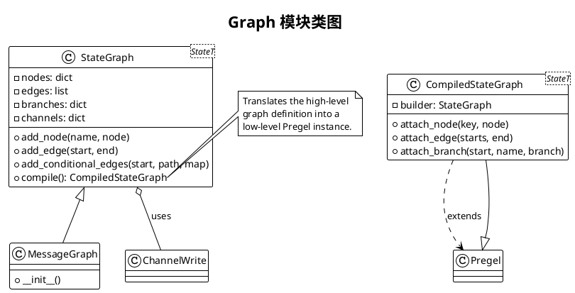
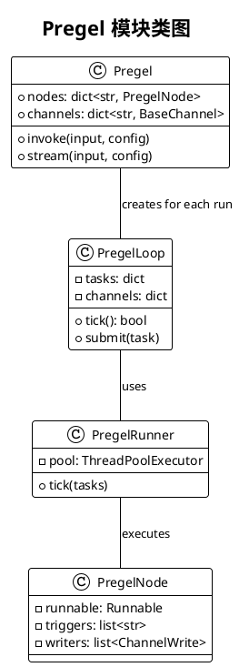

# LangGraph 项目源码分析报告

## 0. 项目概览

- **项目名称**: LangGraph
- **核心理念**: LangGraph 是一个用于构建持久化、有状态、多参与者（multi-agent）应用的库。它将流程建模为循环图（cyclic graph），其中节点（actors）在共享的状态（state）上进行操作。其核心设计哲学源自 Google 的 Pregel 论文和 Apache Beam，强调了将图的定义、状态管理和执行引擎清晰分离的原则。
- **技术栈与主要依赖**:
  - Python 3.8+
  - `langchain-core`: 作为 LangChain 生态的一部分，紧密依赖其核心的可组合（runnable）协议。
  - `pydantic`: 用于数据模型校验和配置。
  - `fastapi` & `uvicorn` (在 `cli` 和 `sdk` 中): 用于提供和调用 LangGraph API。
- **目录结构概览**: `langgraph` 是一个 monorepo，包含多个独立的 Python 包：
  - `langgraph`: 核心的图构建和执行引擎。
  - `checkpoint`: 检查点（持久化）机制的抽象基类和内存实现。
  - `checkpoint-sqlite`, `checkpoint-postgres`: 针对 SQLite 和 PostgreSQL 的检查点后端实现。
  - `cli`: 用于部署和管理 LangGraph 应用的命令行工具。
  - `sdk-py`: 用于与 LangGraph API 交互的 Python SDK。

## 1. 项目架构设计

### 1.1. 系统整体架构

LangGraph 的架构设计精良，层次分明，体现了高度的模块化和可扩展性。其核心可以分为四个主要层次：

1.  **图定义层 (Graph Definition API - `StateGraph`)**: 这是用户直接交互的最高层 API。开发者使用 `StateGraph` 来定义图的结构：
    *   **状态模式 (State Schema)**: 使用 `TypedDict`, `pydantic.BaseModel`, 或 `dataclass` 定义图的共享状态的结构。
    *   **节点 (Nodes)**: 定义为可调用对象（`Runnable`），代表图中的计算单元或 "actor"。
    *   **边 (Edges)**: 定义节点之间的有向连接，可以是静态的，也可以是基于当前状态动态计算的条件边。

2.  **状态管理层 (State Management - `Channels`)**: 这是 LangGraph 状态管理的核心。`StateGraph` 在编译时，会根据用户定义的状态模式，将状态的每一个键（key）映射到一个具体的 `Channel` 实例。`Channel` 决定了该部分状态的更新行为：
    *   `LastValue`: 存储最新的值（默认行为）。
    *   `BinaryOperatorAggregate`: 使用二元操作符（如加法）来聚合更新。
    *   `Topic`: 实现发布/订阅模式，允许多个节点向其写入，一个节点读取所有写入。
    *   `EphemeralValue`: 值仅在单步内有效，用于传递临时数据。
    *   `NamedBarrierValue`: 用于同步，等待多个上游节点完成后再继续。

3.  **执行引擎层 (Execution Engine - `Pregel`)**: 这是图的运行时核心，它实现了 Google Pregel 的"批量同步并行"（Bulk Synchronous Parallel）计算模型。`StateGraph.compile()` 方法会将用户定义的图转换为一个可执行的 `Pregel` 实例。
    *   执行流程遵循 **Plan -> Execute -> Update** 的超级步骤（superstep）。
    *   **Plan**: 确定当前步骤需要执行哪些节点。
    *   **Execute**: 并行执行所有被激活的节点。
    *   **Update**: 将所有节点的写入操作应用到对应的 `Channel` 中，完成状态更新。
    *   这个过程循环往复，直到图中没有更多的活动节点。

4.  **持久化与扩展层 (Persistence & Extension)**:
    *   **Checkpointer**: 提供了强大的状态持久化能力，允许图的执行被暂停、恢复和回溯。支持内存、SQLite、PostgreSQL 等多种后端。
    *   **Streaming**: 提供了丰富的流式输出能力，可以实时观察图的状态更新、任务执行、调试信息甚至 LLM 的 token 输出。
    *   **CLI & SDK**: 提供了将图作为服务部署和远程调用的能力。

### 1.2. 整体架构PlantUML类图

### 1.3. 模块划分与职责

-   **`langgraph.graph`**: 面向用户的图构建API，核心是 `StateGraph`。
-   **`langgraph.channels`**: 定义了各种状态通道（Channel）的实现，是状态管理的核心。
-   **`langgraph.pregel`**: 核心执行引擎的实现，包含了 `Pregel` 主类、执行循环和任务运行器。
-   **`langgraph.checkpoint`**: 检查点机制的接口和具体实现。
-   **`langgraph.cli`**: 命令行工具，用于服务的部署。
-   `langgraph.managed`: 托管值的实现，例如通过`Context`管理的资源。
-   `langgraph.sdk`: Python SDK，用于客户端与服务的交互。

## 2. 核心模块详细分析

现在，我们将深入分析每个核心模块。

### 2.1 `langgraph.channels` 模块

这是 `langgraph` 最具创新性的部分之一。它没有采用传统的、单一的可变状态对象，而是将状态分解为一组**通道（Channels）**。每个通道都是一个独立的对象，拥有自己的更新逻辑。

- **核心职责**: 定义不同类型的状态更新和存储行为。
- **关键文件**:
    - `base.py`: 定义了所有通道都必须实现的 `BaseChannel` 抽象基类。接口包括 `get`、`update`、`checkpoint` 等。
    - `last_value.py`: 实现 `LastValue` 通道，这是最简单的通道，总是存储最后一次写入的值。它是 `StateGraph` 中未指定聚合器的字段的默认通道。
    - `binop.py`: 实现 `BinaryOperatorAggregate` 通道，它接收一个二元操作符（如 `operator.add`），并用它来聚合所有写入的值。这对于处理消息列表等场景至关重要。
    - `topic.py`: 实现 `Topic` 通道，一个发布/订阅主题，可以选择性地累积所有接收到的值。
    - `ephemeral_value.py`: 实现 `EphemeralValue`，其值在每个步骤之后都会被清除，非常适合传递瞬时数据。
    - `named_barrier_value.py`: 实现 `NamedBarrierValue`，一种同步机制，在所有预期的发布者都写入值之前，通道的值是不可用的。

#### `channels` 模块 PlantUML 类图

### 2.2 `langgraph.graph` 模块

该模块提供了用户用于构建图的高级 API，主要是 `StateGraph` 类。

- **核心职责**: 提供一个易于使用的、声明式的接口来定义图的结构和状态。
- **关键文件**:
    - `state.py`: 包含了 `StateGraph` 和 `CompiledStateGraph` 的定义。
        - `StateGraph`: 一个**构建器（Builder）**类。用户通过其实例方法 `add_node`、`add_edge` 等来描述图的拓扑结构。它最重要的职责是在 `compile()` 方法中，将用户定义的图转换为一个可执行的 `Pregel` 实例。它通过解析状态类的类型注解来自动选择和配置合适的 `Channel`。
        - `CompiledStateGraph`: `compile()` 方法的返回结果，是 `Pregel` 的一个子类。这是一个可执行的、被完全配置好的图实例。
    - `message.py`: 定义了 `MessageGraph`，它是 `StateGraph` 的一个便捷子类，专门用于构建聊天机器人。它预先配置了包含 `messages` 列表的状态，并使用 `add_messages` (即 `operator.add`) 作为聚合器。
    - `branch.py`: 定义了 `Branch` 类，用于内部表示条件边。

#### `graph` 模块 PlantUML 类图

### 2.3 `langgraph.pregel` 模块

这是 LangGraph 的"引擎室"，实现了图的实际执行逻辑。

- **核心职责**: 根据 Pregel 模型执行图，管理执行循环、任务调度、状态更新和持久化。
- **关键文件**:
    - `__init__.py`: 定义了 `Pregel` 主类。这个类是整个执行的核心。它接收 `nodes` 和 `channels` 的低级表示，并实现了 `invoke` 和 `stream` 方法来驱动图的执行。`stream` 方法中的主循环 (`while loop.tick()`) 是 Pregel 算法的核心实现。
    - `loop.py`: 包含 `SyncPregelLoop` 和 `AsyncPregelLoop`。这些类封装了单次图执行的完整状态，`tick()` 方法代表了 Pregel 中的一个"超级步骤"（superstep）。
    - `runner.py`: 定义了 `PregelRunner`，负责在每个步骤中实际执行被激活的节点（`Runnable`）。它使用线程池来并行执行任务。
    - `algo.py`: 包含一些核心算法，例如 `apply_writes`，它负责将节点执行的结果写入到相应的通道中。
    - `io.py`: 处理图的输入和输出映射。
    - `checkpoint.py`: 处理检查点的创建和恢复逻辑。

#### `pregel` 模块 PlantUML 类图

## 3. 设计模式与项目亮点

### 3.1. 设计模式

-   **构建器模式 (Builder Pattern)**: `StateGraph` 是一个典型的构建器。它将一个复杂对象（一个可执行的图）的构建过程与其表示分离，使得同样的构建过程可以创建不同的表示。用户可以链式调用 `add_node`, `add_edge` 等方法，最后通过 `compile()` 得到最终产品 `CompiledStateGraph`。
-   **策略模式 (Strategy Pattern)**: `Channel` 的设计是策略模式的绝佳体现。`BaseChannel` 定义了一个公共接口，而 `LastValue`, `BinaryOperatorAggregate` 等具体类则封装了不同的状态更新算法（策略）。`StateGraph` 在编译时根据用户的类型注解动态地选择和注入相应的策略。
-   **模板方法模式 (Template Method Pattern)**: `Pregel` 类中的 `stream` 方法可以看作一个模板方法。它定义了算法的骨架（`while loop.tick()`），而将一些具体的步骤（如节点的执行、通道的更新）委托给辅助类（`PregelRunner`, `BaseChannel`）。
-   **发布/订阅模式 (Publish/Subscribe Pattern)**: `Topic` 通道和整个 Pregel 的执行模型都基于此模式。节点作为发布者向通道写入数据，而其他节点作为订阅者，在通道更新时被激活。
-   **外观模式 (Facade Pattern)**: `StateGraph` 和 `MessageGraph` 为底层的复杂 Pregel 执行引擎提供了一个简单、统一的接口。

### 3.2. 项目亮点

-   **声明式状态管理**: 通过 Python 的类型注解来声明复杂的状态聚合行为，是 LangGraph 的一大创新。这使得代码非常直观且易于理解。例如，`Annotated[list, operator.add]` 明确地表达了"这个字段是一个列表，所有对它的更新都应该通过加法来合并"。
-   **可回溯与持久化**: 内置的 Checkpointer 机制非常强大。它不仅能让 Agent 应用从中断处恢复，还能查询和回溯到任意历史状态，这对于调试、分析和实现"时间旅行"等高级功能至关重要。
-   **高度可观测性**: `stream` 方法提供了多种模式，可以实时洞察图的内部运作，从高级的状态变化到低级的任务执行和 LLM token 流，为调试和监控提供了极大的便利。
-   **灵活性与可扩展性**: 核心组件（如 Channel, Checkpointer）都基于清晰的抽象基类构建，用户可以轻松地自定义新的通道行为或检查点后端，以适应不同的业务需求。
-   **与 LangChain 生态无缝集成**: 作为 LangChain 的一部分，它天然支持 LangChain 的 `Runnable` 协议，使得任何 LangChain 组件（Chains, LLMs, Retrievers, Tools）都可以被无缝地用作图中的一个节点。

## 4. 复杂示例分析: `multi_agent` 协作

为了更好地理解 LangGraph 的实际应用，我们分析 [multi-agent-collaboration.ipynb](https://github.com/langchain-ai/langgraph/blob/main/docs/docs/tutorials/multi_agent/multi-agent-collaboration.ipynb) 中的一个复杂示例。这个例子构建了一个多智能体协作研究团队。

### 4.1. 示例概述

该示例模拟了一个研究团队，包括一个"研究主管"（Supervisor）和多个"研究员"（Researcher）。流程如下：

1.  用户提出一个研究主题。
2.  主管将主题分解为多个子任务。
3.  主管将每个子任务分派给一个研究员（通过 `Send` 实现并行执行）。
4.  每个研究员独立地执行其子任务（例如，进行网络搜索）。
5.  所有研究员完成后，将他们的发现报告给主管。
6.  主管整合所有报告，形成最终的综合报告。

### 4.2. 关键实现分析

-   **State (`AgentState`)**: 状态是一个 `TypedDict`，包含了 `task`, `plan`, `draft`, `critique`, `content` 等字段，并且 `messages` 字段使用了 `Annotated[list[AnyMessage], add_messages]` 来累积对话历史。

-   **`create_agent` 函数**: 这是一个关键的辅助函数，它接收一个 LLM 和一组工具，返回一个 Agent `Runnable`。这体现了代码的复用性。

-   **`agent_node` 函数**: 这是一个通用的节点函数，它接收当前状态和特定的 agent，然后调用 agent 来处理状态，并返回更新。

-   **主管节点 (`supervisor`)**:
    -   这是一个核心的条件边。它首先判断任务是否完成，如果未完成，则决定下一步是"重新规划"、"分配任务"还是"整合报告"。
    -   **并行分发任务**: 当主管决定分配任务时，它会返回一个 `Send` 对象列表，例如 `[Send('researcher', {"task": sub_task_1}), Send('researcher', {"task": sub_task_2})]`。这是 LangGraph **动态并行执行** 的核心机制。`Pregel` 引擎看到这个输出后，会为每个 `Send` 对象创建一个并行的 `researcher` 任务。

-   **研究员节点 (`researcher`)**:
    -   这个节点代表了并行的研究工作。由于主管可以 `Send` 多个任务给它，这个节点会并行地为每个子任务执行一次。
    -   它的返回值会通过 `BinaryOperatorAggregate`（在 `messages` 字段上）被聚合回主状态。

-   **图的构建**:
    -   代码中清晰地定义了各个节点：`supervisor`, `researcher`。
    -   `add_conditional_edges(START, "supervisor", ...)` 设置主管为图的入口和主要决策者。
    -   `add_edge('researcher', 'supervisor')` 将所有研究员的输出都送回给主管，形成一个循环。

### 4.3. 从示例中学到的

这个例子完美地展示了 LangGraph 的几个核心优势：

1.  **动态拓扑**: 图的执行路径不是静态的，而是由 `supervisor` 节点在运行时根据当前状态动态决定的。
2.  **并行执行 (Map-Reduce)**: `supervisor` 使用 `Send` 将任务"Map"到多个并行的 `researcher` 节点，然后再将结果"Reduce"回来进行整合。这对于需要并行处理多个子任务的场景非常高效。
3.  **清晰的状态管理**: 所有的协作都通过修改共享的 `AgentState` 来完成，状态的流动和更新逻辑清晰可见。
4.  **Agent as a Node**: LangChain 的 Agent 可以被直接用作图中的一个节点，体现了生态的无缝集成。

## 5. 总结与建议

### 5.1. 潜在改进建议

-   **可视化**: 虽然 `get_graph().draw_ascii()` 提供了基本的文本可视化，但对于复杂的、尤其是带有条件边的图，一个交互式的、能实时展示状态流动的图形化界面将会极大地提升开发和调试体验。
-   **分布式执行的简化**: 目前分布式执行需要用户对 `checkpoint` 和 `runner` 有较深的理解。如果能提供更高级的抽象或工具来简化图在多台机器上的部署和执行，将会更有吸引力。

### 5.2. 二次开发指南

-   **从 `MessageGraph` 开始**: 对于构建聊天机器人或简单的 agent，`MessageGraph` 是最佳的起点。
-   **深入理解 `Channel`**: 要构建复杂的、自定义的状态行为，关键在于理解并善用不同的 `Channel`，甚至可以自定义新的 `Channel`。
-   **利用 `interrupt` 和 `Command`**: 要实现人机协作（Human-in-the-loop）或外部系统控制，`interrupt()` 函数和 `Command` 对象是必须掌握的工具。
-   **调试技巧**: 充分利用 `stream(..., stream_mode='debug')` 和 `stream(..., stream_mode='tasks')` 来观察图的每一步执行细节。当遇到问题时，检查每个节点的输入和输出是最有效的调试方法。

总而言之，LangGraph 是一个设计精良、功能强大且高度可扩展的 agentic 应用框架。它通过创新的 `Channel` 机制和对 Pregel 计算模型的坚实实现，为构建复杂的、有状态的、并行的 AI 系统提供了坚实的基础。
