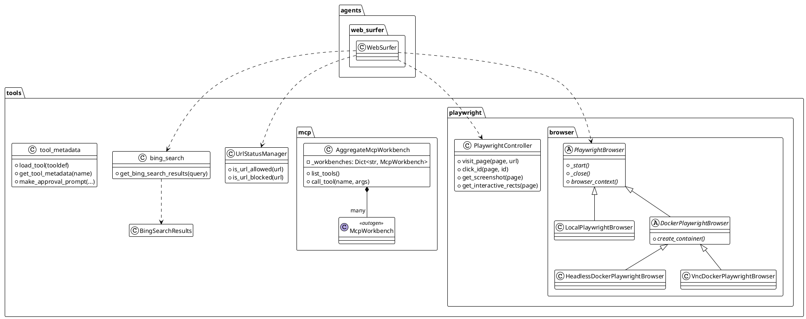
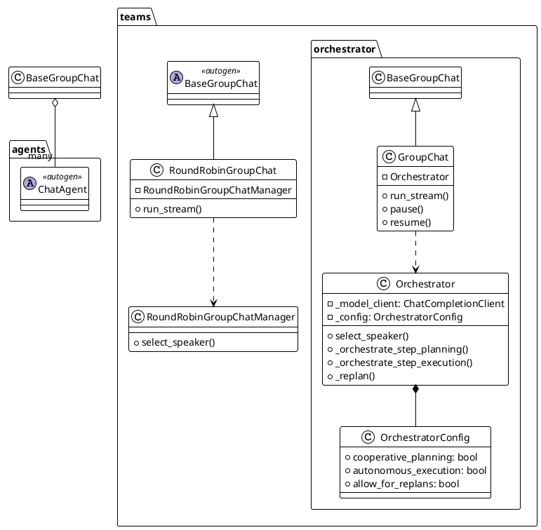
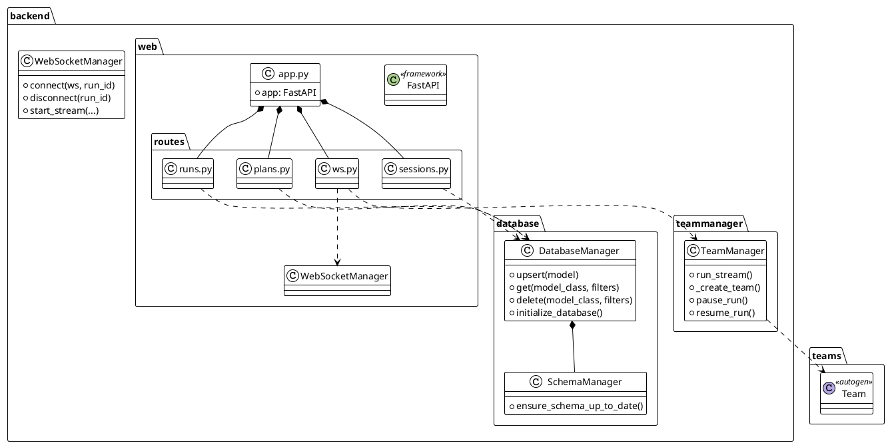
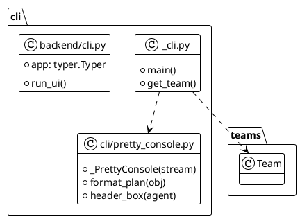
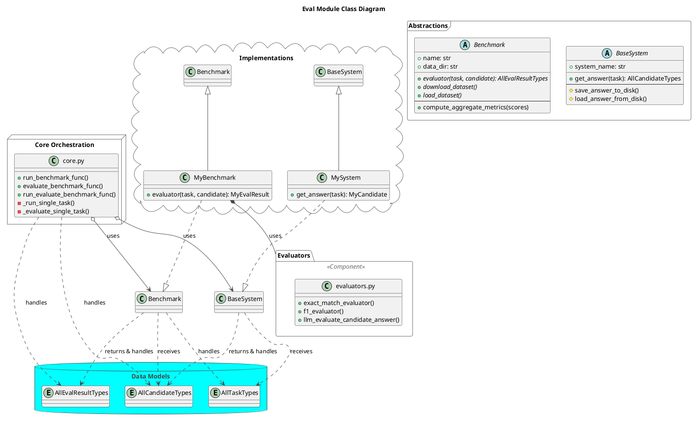

# Magentic UI 项目解读报告

## 0. 项目概览

- **项目名称**: Magentic UI
- **核心理念**: 一个用于构建、测试和运行多智能体（Multi-Agent）系统的框架，提供了包括Web浏览、文件操作、编码等能力的Agent，并通过Web UI进行交互和管理。
- **技术栈**: Python, FastAPI, Playwright, Typer
- **目录结构概览**:
  ```
  magentic_ui/
  ├── agents/         # 各类Agent的核心实现
  ├── backend/        # FastAPI后端服务
  ├── cli/            # 命令行接口工具
  ├── docker/         # Docker相关配置
  ├── eval/           # Agent评估框架
  ├── learning/       # 学习与记忆模块
  ├── teams/          # Agent团队与编排
  ├── tools/          # Agent可使用的工具集
  ├── ... (其他核心文件)
  ```

## 1. 项目架构设计

### 1.1. 系统整体架构

Magentic UI 采用了一个分层的架构，主要包括：

- **表示与交互层 (UI & CLI)**: `_cli.py` 和 `backend/web` 提供了命令行和Web两种交互方式。Web后端使用FastAPI构建，实现了RESTful API和WebSocket通信，用于实时展示Agent的运行状态和接收用户指令。
- **Agent核心层 (`agents`, `teams`)**: 这是系统的核心，定义了不同角色的Agent（如`Coder`, `WebSurfer`）以及如何将它们组织成一个`Team`。`teams`模块中的`Orchestrator`负责协调Agent之间的协作流程（如轮询、群聊）。
- **能力层 (`tools`)**: 为Agent提供了与外部世界交互的工具，例如使用`Playwright`进行Web自动化操作的`tools/playwright`，以及文件操作、搜索引擎等工具。
- **评估层 (`eval`)**: 提供了一套完整的基准测试和评估框架，用于衡量Agent在特定任务上的表现。
- **支撑层 (`database`, `docker`, `config`)**: 提供数据库管理、运行环境容器化和项目配置等基础支持。

### 1.2. 模块划分与职责

- `agents`: 定义了具体Agent的行为和能力，是任务执行的实体。
- `teams`: 负责将多个Agent组织起来，并定义它们的协作模式。
- `tools`: 实现了Agent可以调用的具体功能，是Agent能力的延伸。
- `backend`: 提供了Web UI的后端支持，是用户与系统交互的桥梁。
- `eval`: 用于对Agent的能力进行量化评估。
- `cli`: 提供了无需UI的纯命令行交互模式。

接下来将对核心模块进行逐一分析。

## 2. 核心模块详细分析: `agents`

### 2.1 模块概述

- **模块路径**: `magentic_ui/agents/`
- **核心职责**: 定义了框架中所有自主Agent（Agent）的核心实现。这些Agent是执行任务的基本单位，各自拥有特定的技能，如编码、网页浏览或文件操作。该模块大量使用了 `autogen` 框架作为底层支持，实现了组件化、可插拔的Agent架构。

### 2.2 关键文件与组件分析

- **`CoderAgent` (`_coder.py`)**:
  - **功能**: 核心的编码Agent。能够根据任务需求编写Python代码，并在安全的环境（本地或Docker容器）中执行。
  - **实现**: 内置了一个"编码-执行-调试"的循环。如果代码执行出错，它会尝试分析错误并自动修正，最多重试指定次数。在执行代码前，可以通过 `ApprovalGuard` 机制请求用户批准，确保安全性。

- **`FileSurfer` (`file_surfer/`)**:
  - **功能**: 只读的文件系统浏览Agent。它能像人一样"阅读"文件和目录，但不能修改它们。
  - **实现**: 通过一个巧妙的 `CodeExecutorMarkdownFileBrowser` 组件实现。该组件将文件（甚至是图片、文档等）和目录列表转换为Markdown格式的文本，然后提供分页、搜索等类似浏览器的操作。所有底层文件操作都通过安全的 `CodeExecutor` 完成。

- **`WebSurfer` (`web_surfer/`)**:
  - **功能**: 强大的网页浏览Agent，是与外部世界信息交互的主要入口。
  - **实现**: 这是一个多模态Agent，它会截取当前网页的屏幕截图，在可交互的元素（如按钮、输入框）上标记数字，然后将这张"带标记的截图"连同任务指令一起发送给大语言模型。模型通过"看图"来决定下一步操作，例如回复"点击第7个元素"。这种"看图操作"的模式极大地增强了其在复杂网页上的操作能力。底层使用 Playwright 进行浏览器自动化。

- **User Proxies (`users/`)**:
  - **功能**: 模拟人类用户在多Agent协作中的角色。
  - **`DummyUserProxy`**: 一个简单的"哑"用户，主要用于自动化测试，例如自动批准计划或在被提问时给出通用回复。
  - **`MetadataUserProxy`**: 一个由语言模型驱动的"智能"模拟用户。它可以被赋予关于任务的"内部信息"（如提示或最终答案），并根据这些信息在计划阶段提供有价值的反馈，或在执行阶段提供帮助。这对于可复现地评估（Eval）多Agent系统的性能至关重要。

- **`McpAgent` (`mcp/`)**:
  - **功能**: 一个通用的工具调用Agent。
  - **实现**: 它可以连接到多个远程的"MCP服务器"，并将这些服务器上提供的工具聚合起来，供自己在解决任务时调用。这为框架提供了一种可扩展的、分布式的工具架构。

### 2.3 设计模式与亮点

- **组件化设计**: 所有Agent都遵循了 `autogen` 的组件化规范，将配置（`Config`）与实现分离，便于管理和复用。
- **关注点分离 (SoC)**: 不同Agent职责清晰，`CoderAgent` 负责写代码，`FileSurfer` 负责读文件，`WebSurfer` 负责上网，体现了良好的架构设计。
- **策略模式**: `CoderAgent` 和 `FileSurfer` 都依赖于 `CodeExecutor` 抽象。用户可以根据安全需求和环境，选择使用 `LocalCommandLineCodeExecutor` 或 `DockerCommandLineCodeExecutor` 作为具体的执行策略。
- **安全沙箱**: 通过 `CodeExecutor`（特别是Docker实现），将不授信的代码执行限制在隔离的环境中，保证了系统的安全性。
- **人机交互的抽象**: `WebSurfer` 的"截图+标记"和 `FileSurfer` 的"文件转Markdown"都是将复杂的图形化界面或二进制文件抽象为语言模型可以理解的文本/图像格式的优秀实践。

### 2.4 模块PlantUML类图

```plantuml
@startuml
!theme plain

package "agents" {
    class BaseChatAgent <<(A, #B4A7E5) autogen>>
    class Component <<(A, #B4A7E5) autogen>>

    abstract class FileSurfer {
        - _browser: CodeExecutorMarkdownFileBrowser
        - _code_executor: CodeExecutor
        + on_messages_stream()
    }
    FileSurfer --|> BaseChatAgent
    FileSurfer --|> Component

    class CodeExecutorMarkdownFileBrowser {
        - _code_executor: CodeExecutor
        + open_path()
        + page_down()
        + find_files()
    }
    FileSurfer "1" *-- "1" CodeExecutorMarkdownFileBrowser

    abstract class CoderAgent {
        - _code_executor: CodeExecutor
        - _approval_guard: BaseApprovalGuard
        + on_messages_stream()
        + _coding_and_debug()
    }
    CoderAgent --|> BaseChatAgent
    CoderAgent --|> Component

    package "web_surfer" {
        abstract class WebSurfer {
            - _browser: PlaywrightBrowser
            - _playwright_controller: PlaywrightController
            + on_messages_stream()
            + _execute_tool()
        }
        WebSurfer --|> BaseChatAgent
        WebSurfer --|> Component

        class WebSurferCUA extends WebSurfer {
            + on_messages_stream()
        }
    }

    package "users" {
        class DummyUserProxy {
            + on_messages_stream()
        }
        DummyUserProxy --|> BaseChatAgent

        class MetadataUserProxy {
            - _model_client: ChatCompletionClient
            + on_messages_stream()
        }
        MetadataUserProxy --|> BaseChatAgent
    }
    
    class AssistantAgent <<(A, #B4A7E5) autogen>>
    class McpAgent {
        - workbench: AggregateMcpWorkbench
    }
    McpAgent --|> AssistantAgent

}

package "tools" {
    interface CodeExecutor <<(I, #B4A7E5) autogen>>
    interface PlaywrightBrowser <<(I, #B4A7E5)>>
    class AggregateMcpWorkbench <<(C, #B4A7E5)>>
}

FileSurfer ..> CodeExecutor
CoderAgent ..> CodeExecutor
WebSurfer ..> PlaywrightBrowser
McpAgent ..> AggregateMcpWorkbench

@enduml
```



## 3. 核心模块详细分析: `tools`

### 3.1 模块概述

- **模块路径**: `magentic_ui/tools/`
- **核心职责**: 提供Agent（Agents）用以与外部世界交互的具体能力和底层设施。它包含了从浏览器自动化、网页搜索到定义、加载和管理这些工具的完整机制。这里是驱动Agent执行实际操作的"引擎室"。

### 3.2 关键文件与组件分析

- **`playwright/`**: 这是该模块最核心的部分，是 `WebSurfer` Agent的能力来源。
  - **`PlaywrightController`**: 一个外观（Facade）模式的实现，它将Agent的指令（如"点击第5个元素"）翻译成具体的 Playwright API 调用。它通过向页面注入一个名为 `page_script.js` 的脚本来查找和标记网页上的所有可交互元素。
  - **Browser Implementations (`browser/`)**: 提供了一系列可供选择的浏览器环境策略。`LocalPlaywrightBrowser` 直接在主机上运行浏览器；`HeadlessDockerPlaywrightBrowser` 和 `VncDockerPlaywrightBrowser` 则在隔离的 Docker 容器中运行。其中，VNC 版本尤为出色，因为它允许开发者通过 Web 界面实时观察Agent的操作。

- **`bing_search.py`**: 提供了一个高级函数 `get_bing_search_results`。它不仅执行搜索，还会访问排名靠前的几个链接并汇总其内容，为调用Agent提供了一个信息丰富的摘要。

- **`tool_metadata.py`**: 一个关键的基础设施组件。它提供了标准化的方式（`load_tool`）来定义工具及其元数据（例如，某个操作是否需要用户批准）。

- **`url_status_manager.py`**: 一个必要的安全功能，它允许精细地控制 `WebSurfer` Agent可以访问的网站URL，支持白名单、黑名单和阻止列表。

- **`mcp/`**: 定义了 `AggregateMcpWorkbench`。这是一个强大的抽象，允许一个Agent连接到多个工具服务器，并通过统一的、带命名空间的接口来使用它们提供的所有工具。

### 3.3 设计模式与亮点

- **外观模式 (Facade)**: `PlaywrightController` 是外观模式的典型应用，它将复杂的 `playwright` 库简化为一个对 `WebSurfer` Agent来说易于使用的接口。
- **策略模式 (Strategy)**: `PlaywrightBrowser` 抽象基类及其具体实现（`Local`, `Docker`, `VNC`）允许系统在不修改Agent代码的情况下，切换整个浏览器环境策略。这是一种实现灵活性和可测试性的强大设计。
- **依赖注入 (DI)**: `WebSurfer` Agent依赖于 `PlaywrightBrowser` 抽象，而不是具体的实现。要使用的具体浏览器是在运行时注入的。
- **JavaScript 桥接**: 通过注入 `page_script.js` 来分析 DOM 并将可交互元素的信息传回 Python 控制器，是解决浏览器世界和Agent世界之间鸿沟的一个巧妙方案。
- **分布式架构支持**: `AggregateMcpWorkbench` 的设计具有前瞻性，它使系统能够通过将工具作为微服务分布在多个服务器上进行扩展。

### 3.4 模块PlantUML类图



## 4. 核心模块详细分析: `teams`

### 4.1 模块概述

- **模块路径**: `magentic_ui/teams/`
- **核心职责**: 定义了如何将单个Agent组织和协调起来以共同完成一项任务。它提供了Agent框架的"神经系统"，控制对话的流程，并决定"谁在什么时候做什么"。该模块提供了从简单到高度智能的不同编排策略。

### 4.2 关键文件与组件分析

- **`Orchestrator` (`orchestrator/_orchestrator.py`)**: 这是"智能"的团队管理器。它不仅仅是传递消息，其本身也是一个由大语言模型驱动的Agent，主动地指导整个团队。其核心职责包括：
  - **规划 (Planning)**: 为用户的任务创建一个分步计划。
  - **Agent-任务路由 (Agent-Task Routing)**: 为计划中的每一步动态选择最合适的Agent。
  - **重新规划 (Re-planning)**: 如果团队在执行中遇到困难或意外障碍，它可以修改计划。
  - **状态追踪 (State Tracking)**: 维护一个关于任务进度的详细"账本"。

- **`GroupChat` (`orchestrator/_group_chat.py`)**: 这是包装了 `Orchestrator` 的高级组件。用户创建一个 `GroupChat` 实例，向其中添加一系列 `participants`（参与者，即Agent），并提供 `OrchestratorConfig` 来定义团队的行为。

- **`RoundRobinGroupChat` (`roundrobin_orchestrator.py`)**: 这提供了一种更简单的、非大语言模型驱动的编排策略，即每个Agent按固定的顺序轮流发言。这对于简单的任务或创建可预测的工作流很有用。

- **Prompts (`orchestrator/_prompts.py`)**: 这个文件对 `Orchestrator` 的智能至关重要。它包含了详细的系统提示，其中包含少量示例（few-shot examples）和指令，强制大语言模型为计划输出结构化的JSON，从而使编排过程既健壮又可预测。

- **`OrchestratorConfig` (`orchestrator/orchestrator_config.py`)**: 这是 `Orchestrator` 的主要配置对象，提供了数十个选项来控制从规划和执行模式到内存使用和安全护栏的所有方面。

### 4.3 设计模式与亮点

- **编排 (Orchestration) vs. 协同 (Choreography)**: 框架同时支持这两种模式。`RoundRobinGroupChat` 是一种协同模式，交互模式是预先确定的。`Orchestrator` 则实现了编排模式，由一个中心指挥（即Orchestrator自身）动态地决定工作流程。
- **声明式配置**: 整个团队的行为通过 `GroupChatConfig` 和 `OrchestratorConfig` 进行声明式定义。这使得在不更改核心代码的情况下，可以轻松地试验不同的团队构成和策略。
- **提示工程即代码**: `_prompts.py` 文件展示了一种复杂的提示工程方法，将提示视为应用程序核心逻辑的一部分，包含了示例、结构化格式要求和上下文变体。
- **有状态和可恢复操作**: 整个团队的状态，包括 `Orchestrator` 的计划和各个Agent的历史记录，都可以被保存和加载。`pause` 和 `resume` 功能支持长时间运行的交互式任务。

### 4.4 模块PlantUML类图



## 5. 核心模块详细分析: `backend`

### 5.1 模块概述

- **模块路径**: `magentic_ui/backend/`
- **核心职责**: 提供了完整的Web服务器应用程序，为Magentic UI提供服务，并暴露API用于管理Agent团队并与之交互。它处理用户会话、数据库持久化、实时通信以及Agent任务执行的编排。

### 5.2 关键文件与组件分析

- **`web/app.py`**: `FastAPI`应用程序的主入口。它负责设置服务器、管理应用程序生命周期（启动/关闭）、配置CORS以及包含所有的API路由。
- **`web/routes/`**: 此目录定义了所有的HTTP API端点。
  - **`sessions.py`**: 为用户会话提供CRUD（创建、读取、更新、删除）操作，以及检索与会话相关的所有数据（运行和消息）的端点。
  - **`ws.py`**: 定义了关键的WebSocket端点 (`/api/ws/runs/{run_id}`)。这是实时通信的枢纽，前端可以通过它来启动、停止、暂停和恢复Agent运行，并在Agent团队请求时提供输入。
- **`teammanager/teammanager.py`**: `TeamManager` 类是Web API和Agent运行时之间的关键链接。它负责：
  - 从配置文件或对象实例化Agent团队。
  - 设置必要的运行目录和环境。
  - 通过 `run_stream` 执行团队的任务。
  - 捕获所有事件（Agent消息、LLM调用等）并通过WebSocket流式传输回客户端。
- **`database/`**: 此子目录包含一个健壮的数据持久层。
  - **`DatabaseManager`**: 一个通用的存储库，使用 `SQLModel` 为任何数据模型提供 `upsert`/`get`/`delete` 操作。
  - **`SchemaManager`**: `alembic` 的一个包装器，可自动处理数据库模式的创建和迁移。
- **`cli.py`**: 定义了基于 `typer` 的后端命令行界面。它负责检查依赖项（如Docker）、构建必要的镜像，并使用正确的配置启动 `uvicorn` Web服务器。

### 5.3 设计模式与亮点

- **分层架构**: 后端结构清晰，分为不同的层次：Web/API层 (`routes`)、服务/业务逻辑层 (`teammanager`) 和数据访问层 (`database`)。
- **依赖注入**: `FastAPI` 的依赖注入系统被广泛使用（例如 `Depends(get_db)`, `Depends(get_websocket_manager)`），为API端点提供数据库会话等资源，促进了松耦合和可测试性。
- **单例模式**: 各种管理器（`DatabaseManager`, `WebSocketManager`, `TeamManager`）被视为单例，在应用程序启动时初始化一次，并在整个应用程序中可用。
- **异步流式传输**: 在 `TeamManager.run_stream` 和WebSocket端点中异步生成器的使用是应用程序实时特性的关键，允许事件在发生时被推送到UI。
- **稳健的设置与配置**: CLI执行预检并可以构建依赖项，使用户设置更容易。使用环境文件来配置 `uvicorn` 服务器是管理配置的可靠模式。

### 5.4 模块PlantUML类图



## 6. 核心模块详细分析: `cli`

### 6.1 模块概述

- **模块路径**: `magentic_ui/_cli.py`, `magentic_ui/cli/`, `magentic_ui/backend/cli.py`
- **核心职责**: 该项目提供了两个命令行界面（CLI）：
   1. **后端CLI (`backend/cli.py`)**: 其唯一目的是启动、配置和管理运行后端API的`uvicorn` Web服务器。
   2. **主/任务CLI (`_cli.py`)**: 这是直接从命令行运行Agent任务的主要接口，无需Web UI。它允许进行实验、调试，并集成到自动化工作流中（如基准测试）。

### 6.2 关键文件与组件分析

- **`_cli.py`**: 运行Agent任务的主入口点。
  - 它使用 `argparse` 提供了一套全面的命令行标志，以配置Agent运行的各个方面（任务、团队构成、执行模式、安全策略等）。
  - 其核心函数 `get_team` 作为一个工厂，收集所有配置并使用 `get_task_team` 辅助函数来实例化相应的Agent团队。
  - 它设置了一个asyncio事件循环，并将来自团队执行的事件流式传输到控制台渲染器。
- **`cli/pretty_console.py`**: 一个复杂的控制台输出渲染器。
  - 它负责终端中Agent对话的所有"美化"格式。
  - 它使用ANSI颜色代码，为每个Agent分配独特的颜色，并为不同类型的消息（如计划、JSON对象和Agent转换）提供自定义格式化程序。
- **`backend/cli.py`**: Web服务器启动器。
  - 它使用 `typer` 来获得一个清晰的命令界面。
  - 其主要职责是执行预检（例如，Docker是否正在运行？），构建必要的Docker镜像，然后使用正确的环境变量启动 `uvicorn` 服务器。

### 6.3 设计模式与亮点

- **关注点分离**: 项目明智地将用于运行后端服务器的CLI与用于运行Agent任务的CLI分开。这也体现在将渲染逻辑 (`pretty_console.py`) 与执行逻辑 (`_cli.py`) 分开。
- **外观模式**: `_cli.py` 作为复杂Agent团队设置和配置的外观，将其暴露为带各种标志的单个命令。
- **工厂模式**: `get_task_team` 函数被后端的 `TeamManager` 和主 `_cli.py` 同时用作工厂，确保在UI驱动和CLI驱动的运行中一致地创建团队。
- **观察者/事件流**: CLI的主循环订阅团队的 `run_stream` 事件并对其作出反应，这是事件驱动的观察者模式的一个清晰例子。

### 6.4 模块PlantUML类图



### 6. `eval` 模块

`eval` 模块为评估 Agent 系统的性能提供了一个全面且可扩展的框架。它采用了清晰的关注点分离设计，将评估流程、被测系统和基准测试本身解耦。这种模块化设计使得研究人员可以轻松地对不同的 Agent、不同的任务和不同的评估标准进行组合和测试。

#### 6.1. 核心设计

`eval` 模块的核心是三个主要抽象：

1.  **Harness (`core.py`)**: 这是评估流程的编排器。它负责管理整个评估生命周期，包括：
    *   **运行管理**: 启动、并行化（使用 `multiprocessing`）和监控基准测试的运行。
    *   **结果存储**: 以结构化的方式将 Agent 的输出、日志和计时信息保存到磁盘，确保实验的可复现性。
    *   **动态加载**: 通过名称动态加载 `Benchmark` 和 `System` 类，实现了高度的可扩展性。
    *   **流程分离**: 将"运行"（生成 Agent 回答）和"评估"（对回答评分）分为两个独立的阶段，允许在不重新运行耗时任务的情况下，反复进行评估和分析。

2.  **System (`basesystem.py`)**: 这是对被评估 Agent 系统（"System Under Test"）的抽象。任何希望被评估的 Agent 或 Agent Team 都必须实现 `BaseSystem` 接口。
    *   **核心接口**: `get_answer(task)` 是其唯一需要实现的核心方法，它接收一个任务，并返回一个结构化的"回答"对象。
    *   **关注点分离**: `BaseSystem` 的实现者只需要关注其 Agent 的内部逻辑，而不需要关心评估流程、日志记录或文件 I/O 的细节。

3.  **Benchmark (`benchmark.py`)**: 这是对评估任务和标准的抽象。每个 `Benchmark` 类都封装了特定评估所需的一切。
    *   **数据管理**: 负责下载、缓存和加载评估所需的数据集。
    *   **任务定义**: 将数据集解析为一个个独立的 `Task` 对象。
    *   **评估逻辑**: 包含一个 `evaluator` 方法，该方法定义了如何针对单个任务为 Agent 的回答进行打分。
    *   **指标聚合**: 提供计算和汇总多个任务得分以生成最终报告指标（如平均分）的逻辑。

#### 6.2. 评估器 (`evaluators.py`)

为了给 `Benchmark` 的 `evaluator` 方法提供评分能力，模块提供了一个 `evaluators.py` 文件，其中包含多种可重用的评估函数：
*   **简单评估器**: 如 `exact_match_evaluator` 和 `f1_evaluator`，用于进行客观、确定性的评估。
*   **LLM-based 评估器**: `llm_evaluate_candidate_answer` 是一个功能强大的评估器，它利用一个外部的、高性能的 LLM（例如 GPT-4）来对复杂的、主观的任务进行打分。该评估器是多模态的，可以接收截图作为视觉证据，并能够根据是否存在"黄金标准答案"来调整其评估提示。这使得它非常适合评估需要与网页等复杂环境交互的 Agent。

#### 6.3. 架构图

下面的类图展示了 `eval` 模块中关键组件之间的关系。



## 7. 总结与结论

`magentic-ui` 是一个功能强大且设计精良的 Agent aPaaS（Agent Platform as a Service）项目。通过对该项目的代码库进行深入分析，我们可以得出以下结论：

1.  **分层与模块化架构**: 项目在宏观上采用了清晰的前后端分离架构，在微观上（`src/magentic_ui` 内部）则实现了高度的模块化。`agents`, `tools`, `teams`, `backend`, `cli`, 和 `eval` 等核心模块各司其职，并通过定义良好的接口进行交互。这种设计不仅降低了系统的复杂度，也为未来的功能扩展和维护提供了便利。

2.  **强大的 Agent 能力**: 项目的 `agents` 模块基于 `autogen` 构建，但又远不止于此。特别是 `WebSurfer` Agent，它通过 `Playwright` 和创新的截图标注技术，实现了强大的、有状态的 Web 浏览和操作能力。这使得 Agent 能够完成现实世界中复杂的、需要与网页深度交互的任务。

3.  **灵活的工具集成**: `tools` 模块的设计体现了高度的灵活性和可扩展性。通过 `PlaywrightController` 这样的 Facade 模式，它简化了对底层工具的调用。更重要的是，`mcp`（Multi-provider Composable Persona）工具体系结构支持从远程服务器动态聚合工具，为构建分布式、可扩展的 Agent 系统提供了基础。

4.  **智能的团队协作**: `teams` 模块中的 `Orchestrator` 是整个系统的"大脑"。它超越了简单的轮询或静态流程，使用 LLM 来进行动态的任务规划、路由和重新规划。这种智能编排机制使得一组具有不同能力的 Agent 能够协同工作，解决单一 Agent 无法完成的复杂问题。

5.  **全面的评估框架**: `eval` 模块是该项目的另一大亮点。它提供了一个完整的、可扩展的基准测试框架，能够对 Agent 系统的性能进行严格、可复现的评估。通过将"被测系统"、"基准"和"评估流程"三个核心概念解耦，并支持从简单的精确匹配到复杂的多模态 LLM 评估，该框架为 Agent 的迭代优化提供了强大的数据支持。

6.  **工程最佳实践**: 整个项目广泛应用了现代软件工程的最佳实践。例如，使用 `FastAPI` 和 `SQLModel` 构建健壮的后端，利用 `Typer` 和 `argparse` 创建用户友好的 CLI，通过 `alembic` 管理数据库迁移，并采用 `pytest` 进行单元测试。这确保了代码的质量、可维护性和可靠性。

综上所述，`magentic-ui` 不仅仅是一个 Agent 执行框架，更是一个完整的、端到端的 Agent 应用开发、部署、管理和评估平台。其先进的设计理念和强大的功能使其成为 Agentic AI 领域一个值得关注和学习的开源项目。
