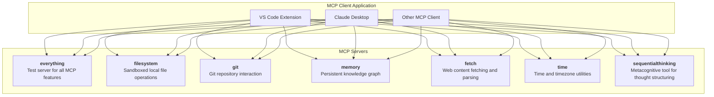
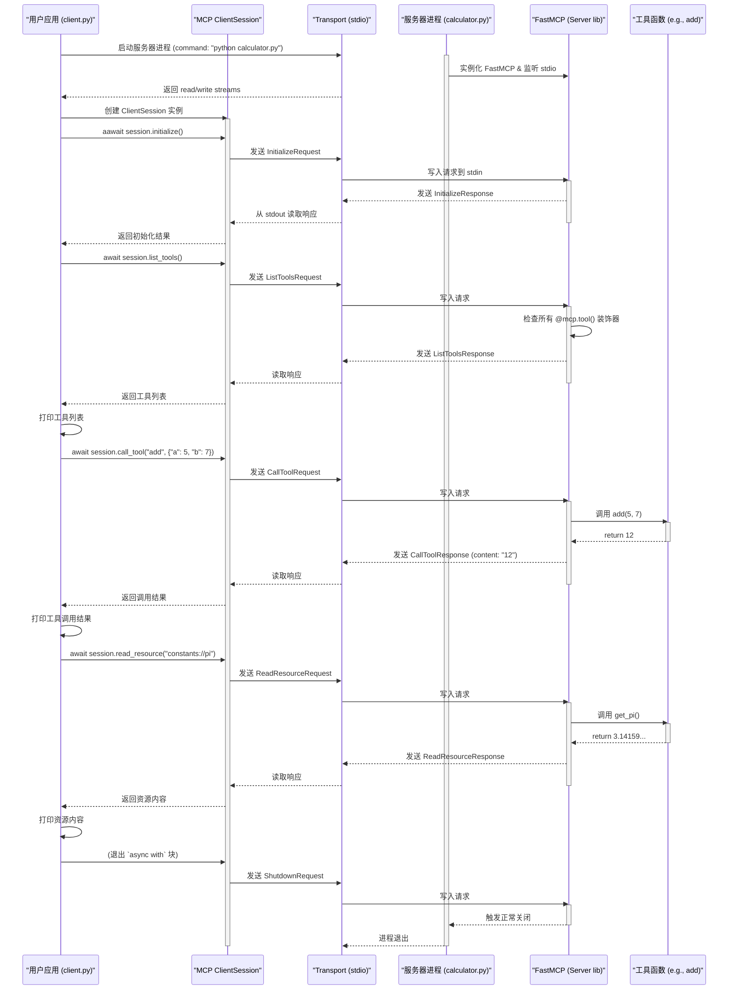

# MCP-Server 项目解读报告

## 0. 项目概览

- **项目名称**: MCP-Server
- **核心理念**: 提供一套实现了模型上下文协议（Model Context Protocol, MCP）的专业化、可独立运行的微服务。这些服务充当了大型语言模型（LLM）与各种外部工具和环境之间的桥梁，使模型能够安全、结构化地与文件系统、版本控制、web内容等进行交互。
- **技术栈**: TypeScript/Node.js 和 Python。
- **目录结构**: 项目由多个独立的微服务包组成，每个包位于 `src/` 下的一个子目录中。

## 1. 项目架构设计

### 1.1. 系统整体架构

MCP-Server 采用典型的**微服务架构**。每个服务都是一个独立的进程，通过标准输入/输出（stdio）或HTTP与其他进程通信，并遵循模型上下文协议（MCP）。这种设计具有以下优点：

- **解耦与独立性**: 每个服务都可以独立开发、部署和更新，互不影响。
- **技术栈灵活性**: 允许为特定任务选择最合适的技术（例如，文件系统操作使用Node.js，Git操作使用Python）。
- **安全沙箱**: 将具有潜在风险的操作（如文件访问）隔离在专门的、受限的服务中，客户端可以根据需要选择性地启用它们。
- **可扩展性**: 可以轻松添加新的服务来提供新功能，而无需修改现有服务。

客户端应用程序（如 VS Code 扩展、Claude Desktop）充当这些微服务的"宿主"或"协调器"，根据用户配置启动所需的服务，并Agent模型与这些服务之间的MCP通信。

### 1.2. 整体架构图



### 1.3. 模块划分与职责

`mcp-server` 项目包含七个核心服务模块，每个模块职责清晰：

- **`everything`**: **(TypeScript)** 一个全面的MCP功能演示和测试服务器，实现了协议的所有方面，是开发客户端的宝贵参考。
- **`filesystem`**: **(TypeScript)** 提供对本地文件系统的安全、沙箱化的访问。其 `edit_file` 工具的智能编辑能力是亮点。
- **`git`**: **(Python)** 封装了 `GitPython` 库，将常见的Git命令作为MCP工具暴露给模型。
- **`memory`**: **(TypeScript)** 实现了一个基于文件的持久化知识图谱，使模型能够跨会话记忆实体和关系。
- **`fetch`**: **(Python)** 提供了强大的网页抓取和内容提取功能，能够将HTML转换为对模型友好的Markdown格式，并遵守 `robots.txt` 规则。
- **`time`**: **(Python)** 一个简单的时间和时区转换工具。
- **`sequentialthinking`**: **(TypeScript)** 一个创新的元认知工具，帮助模型"思考"和结构化其解决问题的过程。

---

## 2. 核心模块详细分析

### 2.1. `everything` 服务

- **核心职责**: 作为MCP协议的"活文档"和参考实现，展示如何实现包括工具、资源、提示、日志记录、自动完成和流式响应在内的所有功能。
- **实现分析**: 使用 `@modelcontextprotocol/sdk` (TS) 构建。代码结构清晰地展示了如何为每种MCP请求类型(`ListTools`, `CallTool`, `GetPrompt` 等)设置处理器。它在内存中模拟了资源(带分页)、实现了带进度更新的长时间运行工具，并演示了服务器如何反向请求客户端的能力(`requestSampling`)。
- **亮点**: `longRunningOperation` 工具是实现带进度反馈任务的绝佳示例。`annotatedMessage` 工具展示了如何利用注解为模型提供更丰富的元数据。

### 2.2. `filesystem` 服务

- **核心职责**: 提供对本地文件系统的一系列增删改查(CRUD)操作工具，同时确保安全性。
- **实现分析**: (TypeScript) 启动时接收一组"允许访问的目录"作为参数。其核心安全机制在于 `validatePath` 函数，该函数在执行任何文件操作前都会校验目标路径是否位于允许的目录内，并正确处理符号链接以防沙箱逃逸。
- **亮点**: `edit_file` 工具非常强大。它不仅是简单的文本替换，还能在匹配时忽略缩进和空白差异，并在替换后努力保持原有的缩进风格，这对于代码编辑非常有用。此外，`read_file` 的 `head` 和 `tail` 功能采用了内存高效的流式读取，适合处理大文件。

### 2.3. `git` 服务

- **核心职责**: 将Git版本控制功能暴露给LLM。
- **实现分析**: (Python) 使用 `GitPython` 库而非直接调用shell命令，这使得交互更健壮、更安全。服务使用Pydantic定义每个工具的输入模式，并通过简单的`match`语句将工具调用分发到对应的Git操作函数。
- **亮点**: `list_repos` 函数展示了协议的高级用法：如果客户端支持，服务器可以反向从客户端获取工作区根目录列表，并自动发现其中的Git仓库，实现了动态上下文感知。

### 2.4. `memory` 服务

- **核心职责**: 为模型提供一个持久化的、结构化的记忆存储。
- **实现分析**: (TypeScript) 从零开始实现了一个基于知识图谱(实体、关系、观察)的内存系统。所有数据通过 `KnowledgeGraphManager` 类进行管理，并以JSON Lines的格式持久化到本地单个文件中。提供了丰富的工具集来创建、查询和删除图中的节点与关系。
- **亮点**: 这不仅仅是一个键值存储，而是一个真正的知识图谱，允许模型构建关于世界(或用户)的复杂模型，并跨会话保持记忆。

### 2.5. `fetch` 服务

- **核心职责**: 赋予模型访问和理解网页内容的能力。
- **实现分析**: (Python) 使用 `httpx` 进行异步网络请求。核心功能是利用 `readabilipy` 和 `markdownify` 库将杂乱的HTML页面转换为干净、结构化的Markdown文本，极大地方便了模型的处理。
- **亮点**: `check_may_autonomously_fetch_url` 函数体现了对网络礼仪的尊重。它使用 `protego` 库解析网站的 `robots.txt` 文件，以判断是否允许爬取，这在自主Agent场景下至关重要。同时支持分页获取大页面内容。

### 2.6. `time` 服务

- **核心职责**: 提供基础的时间和时区查询功能。
- **实现分析**: (Python) 使用Python标准的 `datetime` 和 `zoneinfo` 库，实现简单、可靠。

### 2.7. `sequentialthinking` 服务

- **核心职责**: 提供一个"元认知"工具，帮助模型规划、执行和反思其自身的思考过程。
- **实现分析**: (TypeScript) 这是最有趣的服务之一。它本身不与任何外部API或文件交互。它的唯一作用就是接收模型发送的"思考步骤"，记录下来，并将其格式化后打印到服务器控制台(供人类观察)。它返回给模型的只是一个简单的状态确认。
- **亮点**: 该服务是"工具辅助推理"(Tool-Augmented Reasoning)的一个绝佳范例。它将模型的内部"思维链"外部化、结构化，使得复杂问题的解决过程更清晰、更可控、更可审计。

---

## 3. 设计模式与总结

### 3.1. 设计模式与亮点

- **微服务架构**: 核心架构模式，提供了出色的模块化和关注点分离。
- **命令模式**: 每个MCP工具调用都可以看作是一个命令对象，封装了操作的所有信息(工具名、参数)。服务器则充当命令的接收者和执行者。
- **沙箱模式**: `filesystem` 和 `git` 服务通过限制操作根目录，实现了安全沙箱，这是与本地环境交互的AI工具的关键安全设计。
- **外观模式**: `git` 服务使用 `GitPython` 库为复杂的Git命令提供了一个更简单的接口。
- **元认知工具**: `sequentialthinking` 是一个非常创新的模式，工具不提供信息，而是辅助模型进行思考。

### 3.2. 总结与建议

MCP-Server 是一个设计精良、功能强大的项目，是构建基于LLM的自主Agent和高级工具的优秀参考。它不仅提供了实用的工具集，更展示了如何围绕一个标准协议(MCP)构建一个安全、可扩展、功能丰富的AI工具生态系统。

对于二次开发者，建议：
1.  从 **`everything`** 服务入手，全面理解MCP协议的各项功能和实现方式。
2.  在开发与本地环境交互的工具时，务必借鉴 **`filesystem`** 服务的沙箱设计模式。
3.  若要为模型增加新的能力，可以参考现有服务的模式，创建一个新的独立微服务。
4.  深入研究 **`sequentialthinking`** 和 **`memory`** 服务，它们为提升模型的推理和记忆能力提供了宝贵的思路。

---

## 4. MCP Python SDK 使用指南

### 安装 SDK

我们推荐使用 `uv` 或 `pip` 来安装此 SDK。安装时建议包含 `[cli]` 选项，这会一同安装非常有用的 `mcp` 命令行工具。

**使用 uv (推荐):**
```bash
uv add "mcp[cli]"
```

**或者使用 pip:**
```bash
pip install "mcp[cli]"
```

---

[mcp-sdk](https://github.com/modelcontextprotocol/python-sdk) 是一个功能强大的 Python 库，用于构建 MCP 客户端和服务器。它提供了两个层次的API：一个高级的、类似 FastAPI 的接口（`FastMCP`）用于快速开发，以及一个低级的 `Server` 接口用于最大化控制。

### 4.1. 构建 MCP 服务器

使用高级的 `FastMCP` 接口可以极其简单地创建一个服务器。

**步骤:**
1.  **实例化 `FastMCP`**: 创建一个服务实例。
2.  **定义工具**: 使用 `@mcp.tool()` 装饰器将一个函数暴露为工具。SDK会自动根据函数的签名和类型注解生成输入模式（inputSchema）。
3.  **定义资源**: 使用 `@mcp.resource()` 装饰器将函数暴露为资源。

**示例: 一个简单的计算器服务器 (`calculator.py`)**
```python
from mcp.server.fastmcp import FastMCP

# 1. 实例化 FastMCP
mcp = FastMCP("CalculatorServer")

# 2. 定义一个加法工具
@mcp.tool()
def add(a: int, b: int) -> int:
    """将两个数字相加。"""
    return a + b

# 3. 定义一个减法工具
@mcp.tool()
def subtract(a: int, b: int) -> int:
    """将两个数字相减。"""
    return a - b

# 定义一个常量资源
@mcp.resource("constants://pi")
def get_pi() -> float:
    """提供 PI 的值。"""
    return 3.1415926535

if __name__ == "__main__":
    # 使用 mcp-sdk 提供的命令行工具运行
    # 或者直接运行此文件 python calculator.py
    mcp.run()
```

**运行服务器:**
可以使用SDK内置的开发工具来运行和测试这个服务器：
```bash
mcp dev calculator.py
```
这会启动服务器并通过一个Web界面（MCP Inspector）让你交互式地调用它的工具。

### 4.2. 构建 MCP 客户端

SDK同样简化了客户端的构建，使其可以连接并与任何MCP服务器交互。

**步骤:**
1.  **定义服务器参数**: 指定如何启动服务器进程（例如，通过命令行）。
2.  **创建客户端Transport**: 使用如 `stdio_client` 来创建一个与服务器进程通信的 transport。
3.  **创建 `ClientSession`**: `ClientSession` 是与服务器交互的核心对象。
4.  **初始化并交互**: 在 `async with` 块中，初始化会话并发起请求（如 `list_tools`, `call_tool`）。

**示例: 调用上述计算器服务器**
```python
import asyncio
from mcp import ClientSession, StdioServerParameters
from mcp.client.stdio import stdio_client

async def main():
    # 1. 定义服务器启动参数
    server_params = StdioServerParameters(
        command="python",
        args=["calculator.py"], # 你的服务器文件名
    )

    print("启动服务器并连接...")
    # 2. 创建 stdio 客户端 transport
    async with stdio_client(server_params) as (read, write):
        # 3. 创建客户端会话
        async with ClientSession(read, write) as session:
            # 4. 初始化会话
            await session.initialize()
            print("会话已初始化。")

            # 列出所有可用的工具
            tools = await session.list_tools()
            print("\n可用工具:")
            for tool in tools.tools:
                print(f"- {tool.name}: {tool.description}")

            # 调用 'add' 工具
            print("\n调用 add(5, 7)...")
            add_result = await session.call_tool("add", {"a": 5, "b": 7})
            print(f"  -> 结果: {add_result.content[0].text}") # 结果是 TextContent 对象列表

            # 调用 'subtract' 工具
            print("\n调用 subtract(10, 4)...")
            subtract_result = await session.call_tool("subtract", {"a": 10, "b": 4})
            print(f"  -> 结果: {subtract_result.content[0].text}")

            # 读取 'pi' 资源
            print("\n读取资源 'constants://pi'...")
            resource_content, mime_type = await session.read_resource("constants://pi")
            print(f"  -> 资源内容: {resource_content}, MIME类型: {mime_type}")


if __name__ == "__main__":
    asyncio.run(main())
```

这个客户端脚本会启动 `calculator.py` 服务器，连接到它，列出其工具，然后调用这些工具并打印结果，最后读取资源并退出。这是构建与MCP服务器交互的自动化脚本或更复杂应用程序的基础。

---

### 4.3. 端到端工作流时序图

为了更直观地理解 MCP 客户端和服务器的交互过程，下面是一个基于上述 `calculator.py` 示例的详细时序图。该图展示了从客户端启动、调用工具到最终关闭的完整生命周期。

