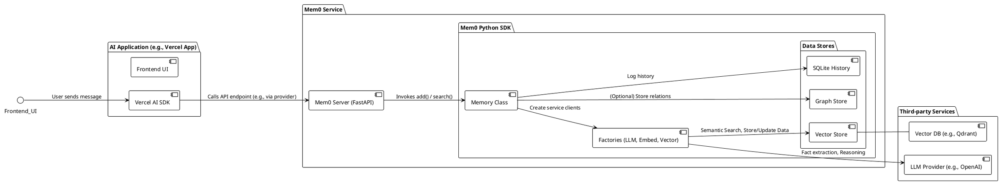
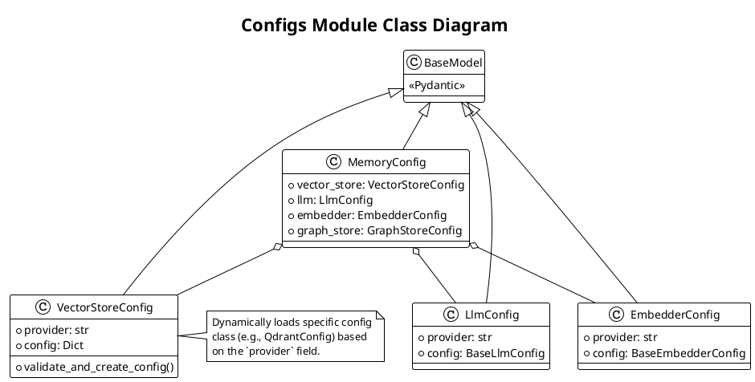
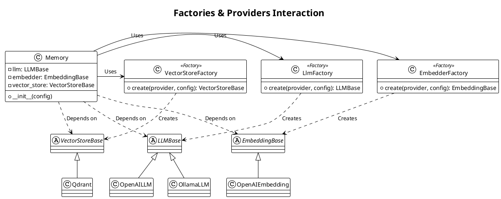

# Mem0 项目解读报告

## 0. 项目概览

- **项目名称**: Mem0
- **项目简介**: Mem0 是一个为个性化 AI 设计的智能记忆层。它使 AI 应用和 Agent 能够记住用户的偏好，适应个体需求，并随着时间的推移持续学习。其核心能力在于通过一个复杂的处理流程，将对话转化为结构化的、可长期存储和检索的记忆。
- **核心理念**: 为 AI 提供一个可扩展的长期记忆大脑，使其交互更具情境感知能力和个性化。
- **技术栈**:
    - **SDK**: Python，提供同步和异步接口。
    - **后端服务**: FastAPI (Python)
    - **数据存储**:
        - **向量存储**: 支持多种后端，如 PgVector, Qdrant, Faiss 等，用于语义记忆。
        - **图存储**: 可选支持 Neo4j, Memgraph，用于实体关系记忆。
        - **历史记录**: SQLite，用于追踪记忆的变更历史。
    - **生态集成**: 提供针对 Vercel AI SDK, LangChain, CrewAI 等流行框架的集成支持。
- **目录结构概览**:
    - `mem0/`: 核心 Python SDK，包含所有记忆处理逻辑。
    - `server/`: 一个独立的 FastAPI 应用，将 SDK 的功能封装为 REST API。
    - `openmemory/`: 一个完整的全栈应用（包含 API 和 UI），可能是 Mem0 平台的开源版本或一个功能完善的演示。
    - `examples/`: 包含了多个集成示例，展示了 Mem0 的不同用法。

---

## 1. 项目架构设计

### 1.1. 系统整体架构

Mem0 采用了模块化、可插拔的架构，主要由三大组件构成：核心 SDK、独立的 API 服务器和上层应用。

1.  **Mem0 SDK (`mem0/`)**: 这是整个系统的核心。它不是一个简单的 CRUD 包装器，而是一个复杂的记忆处理引擎。它内置了对多种 LLM、嵌入模型和向量/图数据库的支持。其核心的 `Memory` 类通过一个"提取-检索-推理-执行"的流程来智能地管理记忆。
2.  **API 服务器 (`server/`)**: 一个轻量级的 FastAPI 服务器，它将 Mem0 SDK 的 `Memory` 对象实例化，并将其核心方法（如 `add`, `search`, `get_all`）通过 RESTful API 端点暴露出来。这个服务可以被容器化并独立部署，作为自托管的记忆中心。
3.  **应用层 (`openmemory/` & `examples/`)**:
    - `openmemory` 是一个功能齐全的Web应用，提供了与记忆交互的用户界面和后端API，很可能是官方托管服务的基石。
    - `examples` 中的应用（如 `vercel-ai-sdk-chat-app`）则展示了开发者如何将 Mem0 SDK 或其提供的集成库（如 `@mem0/vercel-ai-provider`）集成到自己的 AI 应用中。

### 1.2. 整体架构与核心流程图



### 1.3. 模块划分与职责

- **`mem0/mem0` (SDK)**:
    - `memory/main.py`: 实现了核心的 `Memory` 和 `AsyncMemory` 类，是所有功能的编排中心。
    - `utils/factory.py`: 通过工厂模式，根据配置动态创建 LLM、嵌入和向量存储的实例，实现高度解耦。
    - `vector_stores/`, `embeddings/`, `llms/`: 包含对各种第三方服务的具体实现封装，使系统可轻松扩展。
    - `memory/graph_memory.py`: 实现了与图数据库的交互，用于存储和检索实体及其关系。
- **`mem0/server`**:
    - `main.py`: 定义了所有 REST API 端点，并处理请求的序列化和反序列化。是 SDK 与外界通信的门户。
- **`mem0/openmemory`**:
    - `api/`, `ui/`: 分别是后端和前端代码，构成一个完整的应用，用于管理和可视化记忆。

---

## 2. Mem0 SDK 内部架构深度解析

Mem0 的核心 SDK (`mem0/mem0`) 设计精良，遵循了接口-实现分离、依赖注入和工厂模式等现代软件设计原则，实现了高度的模块化和可扩展性。下面我们将深入剖析其内部的关键模块。

### 2.1. 配置模块 (`configs`)

**核心职责**: 使用 Pydantic 模型为整个 SDK 提供类型安全、层次清晰的配置管理。

**关键类与设计**:
- **`MemoryConfig`**: 位于 `configs/base.py`，是所有配置的根节点。它通过对象组合的方式聚合了 `VectorStoreConfig`、`LlmConfig`、`EmbedderConfig` 和 `GraphStoreConfig`，清晰地定义了 `Memory` 实例的完整配置结构。
- **动态配置加载**: `VectorStoreConfig` (`vector_stores/configs.py`) 的设计尤为出色。它利用 Pydantic 的 `@model_validator` 和一个内部的提供商-类名映射字典，实现了配置类的动态加载。当用户指定一个 `provider`（如 `"qdrant"`），它会自动从相应的模块导入并实例化具体的配置类（如 `QdrantConfig`），这使得添加新的向量存储后端变得异常简单。
- **"大而全"的基类**: `BaseEmbedderConfig` 和 `BaseLlmConfig` 将所有支持的提供商的特定参数（如 API URL、区域、模型特定参数等）都集中在各自的基类中。这种策略简化了工厂的实现，但代价是基类构造函数参数较多。

**模块类图**:


### 2.2. 工厂与提供商模块 (`utils/factory.py`, `llms`, `embeddings`, `vector_stores`)

这是实现 Mem0 可插拔架构的核心。`llms`, `embeddings`, 和 `vector_stores` 模块都遵循了完全相同的设计模式。

**核心职责**:
- **提供商模块** (`llms`, `embeddings`, `vector_stores`): 负责将对具体第三方服务（如 OpenAI, Qdrant）的 API 调用封装成标准化的、可互换的组件。
- **工厂模块** (`utils/factory.py`): 充当"装配线"，根据配置信息动态地创建并返回正确的提供商实例。

**关键设计与模式 (工厂模式与接口-实现分离)**:
1.  **定义标准接口**: 每个提供商模块都有一个 `base.py` 文件，其中定义了一个抽象基类（如 `LLMBase`, `EmbeddingBase`, `VectorStoreBase`）。这个基类规定了所有具体实现类都必须遵循的公共方法（如 `generate_response`, `embed`, `search`）。
2.  **具体实现**: 每个提供商（如 `openai.py`, `qdrant.py`）都包含一个继承自相应基类的类，并实现了所有抽象方法。这些类是真正的"工作者"，负责处理与特定 API 的通信。
3.  **动态实例化**: `LlmFactory`, `EmbedderFactory`, 和 `VectorStoreFactory` 内部维护一个从提供商名称到其类路径的字典。其 `create` 方法利用这个字典和 `importlib`，在运行时动态地加载并创建用户指定的提供商实例。
4.  **依赖注入**: `Memory` 类在其构造函数中调用这些工厂来获取所需的 `llm`, `embedder`, 和 `vector_store` 实例，并将它们作为内部依赖项持有。

这种设计使得 `Memory` 核心逻辑与具体的技术实现完全解耦。

**模块交互图**:


### 2.3. 核心内存模块 (`memory`)

**核心职责**: 这是 SDK 的大脑和总指挥，编排所有其他组件以实现智能的记忆管理。

**关键类与设计**:
- **`Memory` & `AsyncMemory`**: 位于 `memory/main.py`，是用户与 SDK 交互的主要入口。它们实现了所有高级逻辑。
- **"提取-检索-推理-执行"循环**: 这是 `add(infer=True)` 方法的核心，是 Mem0 区别于普通 RAG 框架的关键。
    1.  **提取**: 调用 LLM 服务从对话中提取关键事实。
    2.  **检索**: 调用向量存储服务，根据新事实搜索相关旧记忆。
    3.  **推理**: 再次调用 LLM 服务，让其对比新旧信息，生成 `ADD`, `UPDATE`, `DELETE` 的操作计划。
    4.  **执行**: 根据计划，调用向量存储服务执行具体的数据库操作。
- **三重存储策略**:
    - **向量存储**: 用于快速语义检索，是核心记忆库。
    - **图存储** (`graph_memory.py`): 可选模块，用于从文本中提取实体和关系，构建知识图谱，提供结构化的查询能力。
    - **历史数据库** (`storage.py`): 一个简单的 SQLite 数据库，用于记录每一次记忆的变更（`ADD`, `UPDATE`, `DELETE`），提供了记忆的版本控制和可追溯性。

---

## 3. 与 Embedchain 的关系

通过对代码的深入分析，我们得出一个重要结论：**Mem0 并不依赖 `embedchain`**。

尽管两者都由 `mem0ai` 组织维护，且都处理与 RAG (Retrieval-Augmented Generation) 相关的任务，但它们是两个独立的项目。`embedchain` 是一个旨在简化 RAG 应用开发的框架，而 `mem0` 是一个更专注、更深入的"记忆层"解决方案。

Mem0 实现了自己的一整套抽象和实现，包括：
- `EmbedderFactory`: 用于加载不同的嵌入模型。
- `VectorStoreFactory`: 用于与多种向量数据库交互。
- `LlmFactory`: 用于与不同的 LLM 服务提供商通信。

因此，Mem0 不是 `embedchain` 的上层应用或包装器，而是一个功能更强大、设计更复杂的独立系统，它提供了与 `embedchain` 类似但更为精细化的数据处理和存储能力。

---

## 4. 复杂案例分析: `vercel-ai-sdk-chat-app`

这个例子展示了如何将 Mem0 无缝集成到一个基于 Vercel AI SDK 的现代 Web 聊天应用中。

### 4.1. 安装与配置

1.  **环境准备**: 需要安装 Node.js 和 pnpm。
2.  **依赖安装**: 在 `examples/vercel-ai-sdk-chat-app` 目录下运行 `pnpm install`。
3.  **环境变量**:
    *   需要一个 `mem0` 的 API 密钥（来自官方平台或自托管服务）。
    *   需要一个大语言模型提供商的 API 密钥（如 OpenAI）。
    *   这些信息通过应用界面的设置弹窗进行配置，并存储在浏览器的本地存储中。

### 4.2. 运行流程

1.  **启动应用**: 运行 `pnpm dev`，应用启动在本地端口。
2.  **UI 交互**: 用户在聊天输入框中输入消息并点击发送。
3.  **事件触发**: `InputArea` 组件的 `onClick` 事件触发 `handleSendController` 函数。
4.  **上下文调用**: `handleSendController` 调用从 `GlobalContext` 获取的 `handleSend` 函数。
5.  **核心 Hook**: `handleSend` 最终调用了 `useChat` 这个自定义 Hook 中的 `sendMessage` 函数。

### 4.3. 核心代码: `useChat.ts`

这是集成的关键。它不直接调用 Mem0 的 REST API，而是使用了官方提供的 `@mem0/vercel-ai-provider` 辅助库。

```typescript
// src/hooks/useChat.ts

// 1. 导入 Vercel AI Provider
import { createMem0, getMemories } from '@mem0/vercel-ai-provider';
import { streamText } from 'ai';

// ...

// 2. 初始化 Mem0 模型
const mem0 = createMem0({
  provider,      // 'openai' or other LLM provider
  mem0ApiKey,    // Mem0 API Key
  apiKey: openaiApiKey, // LLM API Key
});

// ...

// 3. 发送消息
const sendMessage = async (content: string) => {
  // ...

  // 4. 调用 Vercel AI SDK 的 streamText
  const { textStream } = await streamText({
    // 将 mem0 实例作为模型传入
    model: mem0(AI_MODELS[provider], {
      user_id: user,
    }),
    messages: messagesForPrompt,
  });

  // 5. 处理流式响应
  for await (const textPart of textStream) {
    // ... update UI
  }
}
```

**流程解析**:
- `@mem0/vercel-ai-provider` 的 `createMem0` 函数是一个高阶函数。它创建并返回一个包装了的语言模型实例。
- 当 Vercel AI SDK 的 `streamText` 函数调用这个被包装的 `model` 时，`provider` 的内部逻辑被触发。
- 它会拦截发送给 LLM 的消息，先与 Mem0 后端通信，检索与当前对话相关的记忆。
- 然后，它将这些记忆作为上下文注入到原始提示（Prompt）中。
- 最后，它将这个"增强"后的提示发送给真正的 LLM（如 GPT-4），并将 LLM 返回的流式响应传递回前端。

通过这种方式，`mem0` 对开发者几乎是透明的。开发者只需使用这个特殊的 `provider`，就能自动为他们的聊天机器人赋予长期记忆能力，而无需手动管理记忆的检索和注入。

### 4.4. 案例分析 2: 图数据库集成 (`graph-db-demo`)

这个例子揭示了 `mem0` 最强大的功能之一：在进行向量化语义记忆的同时，自动将非结构化对话构建成结构化的知识图谱。

**核心目的**:
展示 `mem0` 如何通过其"三重存储"策略中的图数据库后端（Neo4j 或 Memgraph），为记忆添加结构化的实体和关系层，从而实现超越纯文本相似性的深度关联查询。

**实验流程**:
1.  **环境准备**:
    *   安装 `mem0` 的图功能依赖: `pip install "mem0ai[graph]"`。
    *   通过 Docker 运行一个 Neo4j 实例。

2.  **启用图存储配置**: 这是激活该功能的关键。在 `Memory` 的配置中，必须提供 `graph_store` 的详细信息。

    ```python
    config = {
        "embedder": {
            "provider": "openai",
            "config": {"model": "text-embedding-3-large"},
        },
        "graph_store": {
            "provider": "neo4j",
            "config": {
                "url": "bolt://your-neo4j-url:7687",
                "username": "neo4j",
                "password": "your-password",
            },
        },
    }
    m = Memory.from_config(config_dict=config)
    ```

3.  **添加记忆**: 调用 `m.add()` 方法时，SDK 内部会自动执行一个增强流程：
    *   **知识提取**: 除了向量化之外，`mem0` 还会调用一次 LLM，使用一个专门的提示（Prompt）让其从对话中提取出知识图谱三元组（实体-关系-实体），例如 `(Alice, LOVES, Sci-fi movies)`。
    *   **图存储**: 提取出的三元组会被转换成图的节点和边，并存入 Neo4j 数据库。

4.  **结果验证**:
    *   **向量搜索**: 传统的语义搜索 `m.search()` 依然有效。
    *   **知识图谱**: 在 Neo4j 的可视化浏览器中，可以看到一个以用户 ID（如 "alice"）为中心节点的知识图谱被自动创建。例如，"alice" 节点通过一条 `LOVES` 的边指向 "Sci-fi movies" 节点，同时通过一条 `DISLIKES` 的边指向 "Thriller movies" 节点。这直观地证明了对话中的偏好信息已被成功结构化。

**总结**:
`graph-db-demo` 完美诠释了 `mem0` 作为"智能记忆层"的核心价值。它不仅"记住"了对话内容（向量存储），更"理解"了内容中的内在联系（图存储），为构建真正具备长期、多层次记忆的 AI 应用提供了坚实的基础。

---

## 5. 设计模式与亮点

- **工厂模式 (Factory Pattern)**: 在 `utils/factory.py` 中广泛使用，实现了对 LLM、嵌入和向量存储的松耦合和动态加载，是系统可扩展性的基石。
- **策略模式 (Strategy Pattern)**: 整个 `add` 方法的 `infer` 参数实际上是一种策略切换。`infer=True` 对应"智能记忆策略"，`infer=False` 对应"直接存储策略"。
- **外观模式 (Facade Pattern)**: `Memory` 类本身作为一个外观，为客户端代码（如 FastAPI 服务器）提供了一个简洁统一的接口，隐藏了背后复杂的"提取-检索-推理-执行"和多重存储的实现细节。
- **提供者模式 (Provider Pattern)**: 在 Vercel AI SDK 的集成中，`@mem0/vercel-ai-provider` 完美地诠释了提供者模式。它提供了一个符合 Vercel AI SDK 规范的"模型提供者"，但在内部封装了与 Mem0 服务的复杂交互。

## 6. 总结与建议

### 6.1. 总体评价

Mem0 是一个设计精良、功能强大的 AI 记忆层。它不仅仅是一个数据库包装器，而是一个拥有自主决策能力的智能系统。

**优点**:
1.  **架构先进**: 采用模块化、可插拔的设计，支持多种后端服务，易于扩展。
2.  **智能记忆管理**: 核心的"提取-检索-推理-执行"流程是其最大亮点，能够智能地维护和演化记忆库。
3.  **双重记忆模型**: 同时利用向量记忆（用于语义相似性）和图记忆（用于实体关系），构建了比单一向量存储更丰富的记忆网络。
4.  **开发者友好**: 提供了简洁的 SDK 和针对主流 AI 框架的无缝集成方案，大大降低了使用门槛。

### 6.2. 潜在改进
1.  **成本考量**: `infer=True` 模式每次 `add` 操作都需要两次 LLM 调用，这在对话频繁的场景下可能会产生较高的成本。可以考虑增加更轻量级的缓存或推理策略来优化。
2.  **可观测性**: 系统内部状态复杂，增加更详细的日志、追踪和可视化工具，可以帮助开发者更好地理解记忆的形成过程和 LLM 的决策路径。
3.  **冲突解决**: 当新的信息与多个旧记忆冲突时，当前依赖 LLM 的判断。未来可以探索更明确的冲突解决策略或引入人工审核机制。
