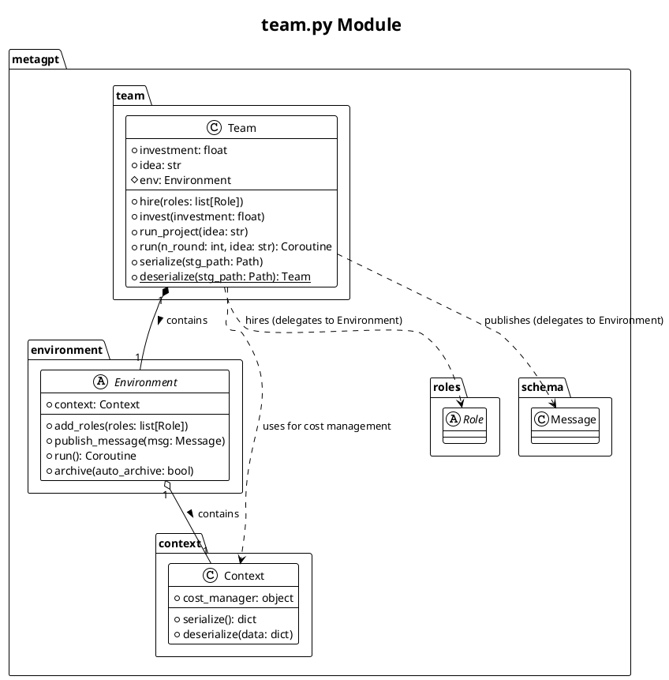
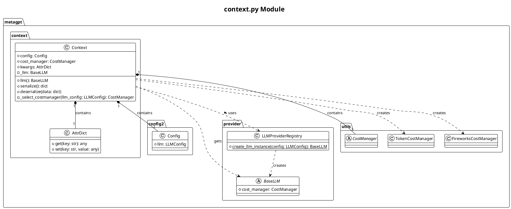
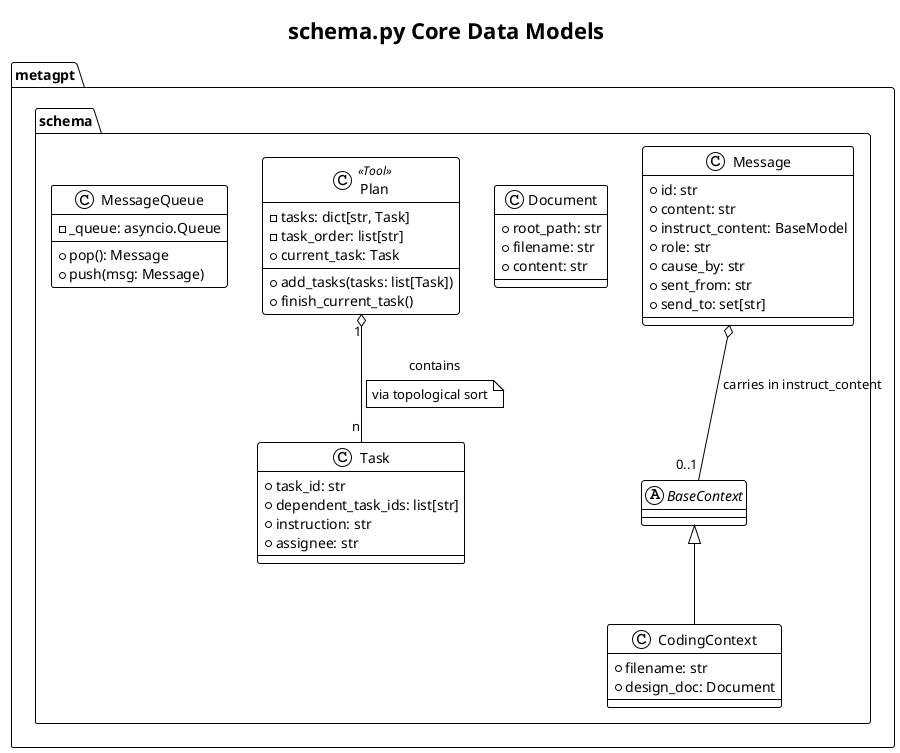
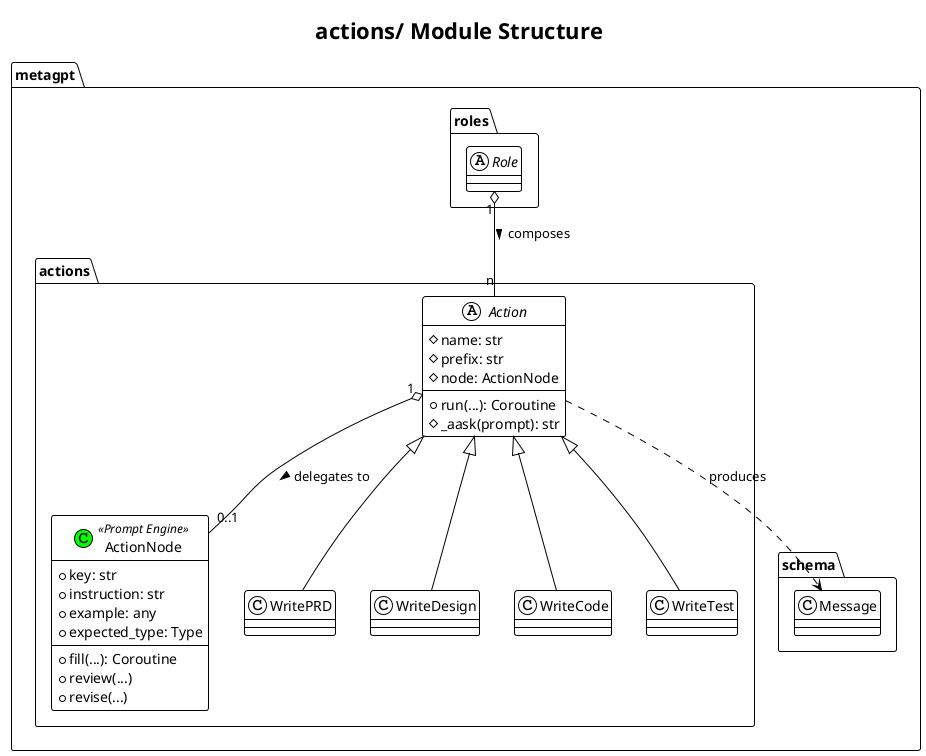
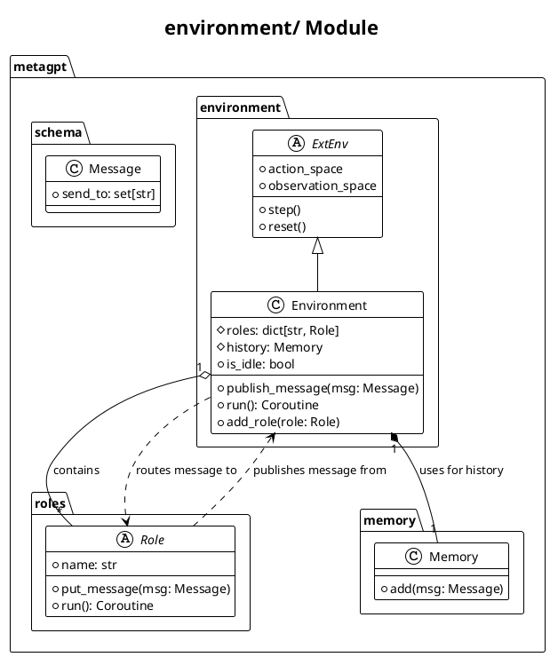
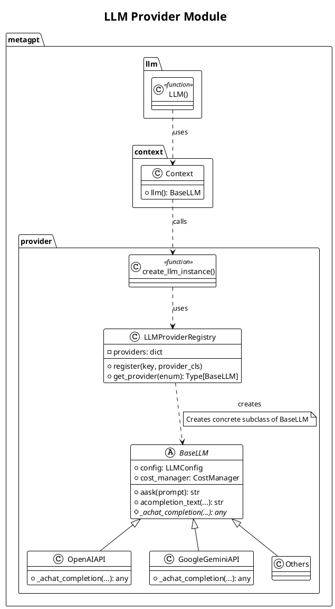
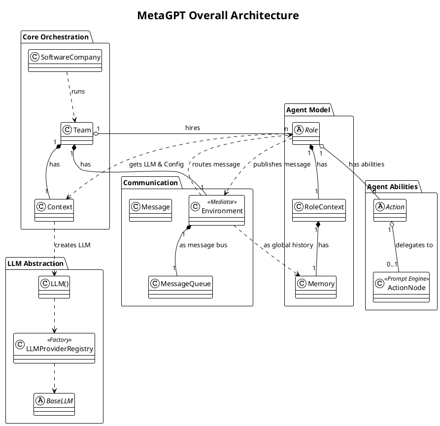

# MetaGPT 项目解读报告

## 0. 项目概览

**项目名称:** MetaGPT

**项目简介:** MetaGPT 是一个创新的多智能体协作框架，它将标准操作程序（SOP）编码到大型语言模型（LLM）中，以模拟一个软件公司的运作流程。通过为不同的智能体分配特定角色（如产品经理、架构师、工程师、QA工程师），MetaGPT 能够自主完成从需求分析到代码实现和测试的整个软件开发生命周期。

**核心理念与设计哲学:** MetaGPT 的核心理念是 "Code = SOPs + LLMs"。它不只是简单地将自然语言指令转化为代码，而是通过结构化的工作流和角色扮演，将复杂的软件开发任务分解为可管理的、有序的步骤。其设计哲学强调将人类的软件工程最佳实践（如需求分析、架构设计、编码、测试）赋能给 AI 智能体，从而实现更高效、更可靠的自动化软件开发。

**技术栈与主要依赖:**
- **核心语言:** Python
- **LLM 交互:** 主要通过 `openai` API，但设计上可扩展至其他 LLM 提供商。
- **依赖管理:** `poetry` 或 `pip`
- **主要库:** `pydantic` (用于数据模型定义与验证), `aiohttp` (异步网络请求), `tenacity` (用于重试机制), `loguru` (日志记录) 等。

## 1. 目录结构与核心模块

### 1.1 目录结构概览
```
metagpt/
  ├── actions/         # 智能体行为定义 (例如: 需求分析, 写代码)
  ├── base/            # 基础类库 (例如: POI, 文件仓库)
  ├── configs/         # 配置文件
  ├── context.py       # 全局上下文管理
  ├── const.py         # 全局常量
  ├── document.py      # 文档抽象
  ├── document_store/  # 文档存储与索引
  ├── environment/     # 环境定义 (智能体运行的环境)
  ├── ext/             # 扩展模块
  ├── exp_pool/        # 经验池 (暂存和复用历史产出)
  ├── learn/           # 学习与进化能力
  ├── llm.py           # LLM API 统一入口
  ├── logs.py          # 日志配置
  ├── management/      # 管理模块 (发布器、订阅器)
  ├── memory/          # 记忆模块 (智能体的短期和长期记忆)
  ├── provider/        # LLM及其他服务提供商接口 (OpenAI, Gemini 等)
  ├── prompts/         # 提示词工程模板
  ├── rag/             # 检索增强生成模块
  ├── repo_parser.py   # 代码仓库解析器
  ├── roles/           # 角色定义 (产品经理, 工程师等)
  ├── schema.py        # 核心数据模型 (Message, Role, Action 等)
  ├── skills/          # 可复用的技能
  ├── software_company.py # 核心编排器: 软件公司
  ├── startup.py       # 启动脚本
  ├── strategy/        # 策略定义 (数据处理策略等)
  ├── subscription.py  # 发布-订阅机制
  ├── team.py          # 团队定义
  ├── tools/           # 外部工具 (代码解释器, 搜索引擎等)
  └── utils/           # 通用工具函数
```

### 1.2 核心模块清单
根据 `thirdpartyanalyzer` 的代码穷尽原则，我将对以下核心模块进行逐一深入分析：

**核心编排与顶层设计:**
- `software_company.py`
- `team.py`
- `context.py`
- `environment/`

**核心抽象与数据模型:**
- `schema.py`
- `base/`
- `roles/`
- `actions/`

**LLM 与记忆:**
- `llm.py`
- `provider/`
- `memory/`

**功能模块:**
- `tools/`
- `skills/`
- `rag/`
- `document_store/`
- `document.py`

**支撑模块:**
- `utils/`
- `subscription.py`
- `repo_parser.py`

## 2. 核心模块详细分析

我将从最核心的编排模块 `software_company.py` 开始，逐步深入分析每个模块。

### 2.2 `team.py` - 团队与生命周期管理

#### 2.2.1 模块概述

`team.py` 定义了 `Team` 类，它是多智能体协作的核心容器。`Team` 聚合了一个共享的 `Environment` 和一组 `Role`（智能体），并负责管理整个项目从启动、运行到结束的生命周期。它是一个高层级的编排器，但将具体的智能体交互和消息传递工作委托给了 `Environment`。

#### 2.2.2 核心实现分析

1.  **环境与角色管理**：
    -   `Team` 在初始化时会创建一个 `Environment` 实例，这个环境是所有角色共享的"工作空间"。
    -   `hire(roles)` 方法并不直接持有 `Role` 对象，而是通过 `self.env.add_roles(roles)` 将它们添加到环境中。这种设计模式将角色管理的责任清晰地划分给了 `Environment`。

2.  **项目生命周期控制**：
    -   `invest(investment)`：通过设置 `Context` 中的 `cost_manager.max_budget` 来为项目注入资金，用于控制成本。
    -   `run_project(idea)`：通过 `self.env.publish_message(Message(content=idea))` 将用户的初始需求作为第一条消息发布到环境中，从而启动整个工作流。
    -   `run(n_round, idea)`：这是核心的异步执行循环。它会迭代 `n_round` 次，在每一轮中调用 `await self.env.run()` 来驱动环境中所有角色的行动。循环的终止条件是达到最大轮次，或 `self.env.is_idle`（所有角色都处于待命状态，没有新消息要处理），或资金耗尽。

3.  **状态持久化**：
    -   `serialize()` 和 `deserialize()` 方法提供了强大的状态管理能力。`serialize` 会将 `Team` 自身的属性以及其关联的 `Context`（包含了所有成本、历史记录等信息）完整地序列化为 JSON 文件。
    -   `deserialize` 则可以从文件中恢复 `Team` 的全部状态，使得长时间运行的任务可以被中断和恢复。

#### 2.2.3 模块类图



### 2.3 `context.py` - 全局上下文与资源工厂

#### 2.3.1 模块概述

`context.py` 定义了 `Context` 类，它是 MetaGPT 框架的"心脏"和"大脑"。作为一个全局上下文管理器和资源工厂，它被设计为单例实例在整个应用中传递。`Context` 负责持有全局配置、动态创建和管理对大语言模型（LLM）的访问，以及跟踪 API 调用成本。这种设计模式实现了依赖注入，避免了全局变量，使得所有组件（如 `Team`, `Role`）都能访问到一致的、最新的共享资源。

#### 2.3.2 核心实现分析

1.  **资源持有**：
    -   `config: Config`：持有一个 `Config` 对象，该对象从 `config2.yaml` 文件加载，包含了所有静态配置，如 LLM API密钥、模型名称、Agent设置等。
    -   `cost_manager: CostManager`：持有一个成本管理器实例，用于实时累计 LLM token 开销。这是实现 `Team` 投资和预算控制功能的基础。
    -   `kwargs: AttrDict`：一个可动态读写的属性字典，用作运行时共享数据（如 `project_path`）的通用存储，非常灵活。

2.  **LLM 工厂方法**：
    -   `llm() -> BaseLLM` 是其核心功能。它并非直接存储一个 `_llm` 实例，而是在每次被调用时，通过 `create_llm_instance(self.config.llm)` 工厂函数动态地创建一个 LLM 实例。
    -   这个工厂函数利用了注册表模式，能够根据 `config.llm.api_type` 的配置（如 "openai", "azure"）返回正确的 LLM 封装类。
    -   `_select_costmanager` 方法进一步增强了工厂的智能性，它会根据 LLM 的类型为其匹配合适的 `CostManager`（例如，为 `fireworks` API 使用 `FireworksCostManager`），然后将 `CostManager` 注入到新创建的 LLM 实例中。

3.  **状态持久化**：
    -   `serialize` 和 `deserialize` 方法专门用于持久化那些在运行过程中会发生变化的状态，即 `kwargs` 和 `cost_manager`。
    -   静态的 `config` 和临时的 `_llm` 对象不会被序列化，因为它们可以在应用重启时根据配置文件被重新构建，这是一种合理且高效的状态管理策略。

#### 2.3.3 模块类图



### 2.4 `schema.py` - 核心数据模型

#### 2.4.1 模块概述

`schema.py` 是 MetaGPT 的数据基石，定义了整个框架中用于通信、规划、记忆和知识表示的核心数据结构。几乎所有类都继承自 `pydantic.BaseModel`，这强制确保了在系统各部分之间流动的数据都具有严格的类型、结构和可验证性。该模块的稳定性和设计合理性对整个系统的可靠运行至关重要。

#### 2.4.2 核心实现分析

1.  **`Message` - 通信的原子单元**：
    -   **设计思想**：`Message` 是智能体（`Role`）之间所有交互的载体。它不仅包含 `content`（自然语言），还包含了丰富的元数据用于路由和追溯。
    -   **路由与溯源**：`sent_from` 和 `send_to` 字段构成了消息路由的基础，由 `Environment` 用来决定消息的流向。`cause_by` 字段则记录了是哪个 `Action` 产生了这条消息，为调试和行为分析提供了便利。
    -   **结构化载荷 (`instruct_content`)**：这是 `Message` 设计中的一个亮点。它允许在消息中嵌入一个 `pydantic` 模型实例，从而在智能体之间传递复杂的、结构化的数据，而不仅仅是文本。这对于需要精确输入（如文件路径、代码片段、测试用例）的 `Action` 来说至关重要。

2.  **`Plan` 与 `Task` - 任务规划与分解**：
    -   **思想**：MetaGPT 模仿人类工作流，通过 `Plan` 和 `Task` 将复杂目标分解为可管理的步骤。
    -   **实现**：`Plan` 本质上是一个有向无环图（DAG），它通过 `_topological_sort` 维护 `Task` 之间的依赖关系。`Plan` 对象本身还被注册为一个 `tool`，这意味着智能体可以在运行时通过调用 `append_task` 或 `replace_task` 等函数来动态地修改和调整计划，赋予了系统极大的灵活性。

3.  **上下文模型 (`CodingContext`, `TestingContext` 等)**：
    -   这些类是 `instruct_content` 的具体实现。它们是为特定 `Action` 量身定制的数据容器，确保了 `Action` 在执行时能收到所有必需的、类型正确的信息。这种模式避免了复杂的参数传递，并使 `Action` 的接口更加清晰和稳定。

4.  **`MessageQueue` - 异步通信的基石**：
    -   它是一个与 `pydantic` 兼容的 `asyncio.Queue` 封装。`Environment` 使用它来作为消息总线，实现了角色之间的解耦和异步通信。

#### 2.4.3 模块类图



### 2.5 `roles/` - 智能体角色定义

#### 2.5.1 模块概述

`roles/` 目录是 MetaGPT 的"组织架构图"，它定义了构成"软件公司"的所有智能体（Agent）的蓝图。该模块的核心是抽象基类 `Role`，它为所有具体的智能体提供了一套统一的行为范式和生命周期管理。其他文件则定义了具有特定专业技能的角色，如 `ProductManager`、`Architect` 和 `Engineer`。

#### 2.5.2 核心实现分析 (`Role` 基类)

`Role` 类是整个智能体系统的基石，其设计精妙地平衡了通用性与可扩展性。

1.  **感知-思考-行动（Sense-Think-Act）循环**：
    -   `run()` 方法是角色的主引擎，它以异步方式驱动了 `_observe` -> `_think` -> `_act` 的完整循环。
    -   **`_observe()` (感知)**：角色从其私有的消息队列 `rc.msg_buffer` 中读取新的 `Message`。它并非被动接收所有信息，而是通过 `watch` 列表（一个 `Action` 的集合）来"订阅"它感兴趣的消息。这种发布/订阅模式极大地提高了通信效率。
    -   **`_think()` (思考)**：这是决策的核心。根据不同的 `react_mode`，角色的思考方式也不同。在默认的 `REACT` 模式下，它实际上实现了一个由 LLM 驱动的有限状态机（FSM）。`Role` 将自己的历史消息和当前可选状态（`self.states`）发送给 LLM，让 LLM 选择下一个最合适的状态，从而决定下一步要执行的 `Action`（`self.rc.todo`）。
    -   **`_act()` (行动)**：执行 `rc.todo` 中指定的 `Action`。`Action` 执行后会返回一个 `ActionOutput`，`Role` 会将其包装成一个新的 `Message`，并通过 `publish_message` 发送回 `Environment`，完成一次完整的行为闭环。

2.  **组合优于继承的设计**：
    -   `Role` 的能力不是通过继承 `Action` 来实现的，而是通过持有一个 `actions` 列表。一个 `Role *拥有* 一系列 `Action`。这种组合模式非常灵活，可以轻易地为角色增删技能，而无需修改角色自身的代码。

3.  **多样的反应模式 (`react_mode`)**：
    -   `REACT`：默认模式，由 LLM 驱动的状态机，最具动态性和智能性。
    -   `BY_ORDER`：按顺序执行 `actions` 列表中的动作，适用于固定的、线性的工作流。
    -   `PLAN_AND_ACT`：先调用 `Planner` 生成任务计划，然后按计划执行，适用于需要预先规划的复杂任务。
    -   这个设计是典型的**策略模式**，允许为不同角色或在不同场景下配置最合适的行为策略。

#### 2.5.3 具体角色分工

-   **`TeamLeader`**: 作为项目负责人，负责启动项目、定义高级别计划并协调团队。
-   **`ProductManager`**: 负责将用户需求转化为详细的产品需求文档（PRD）。
-   **`Architect`**: 根据 PRD 设计系统架构和技术方案。
-   **`Engineer2`**: 程序员，根据设计文档实现代码。
-   **`QaEngineer`**: 测试工程师，负责编写和执行测试用例，保证软件质量。
-   **`DataAnalyst`**: 数据分析师，专职处理数据分析、挖掘和可视化的任务。

#### 2.5.4 模块类图

```plantuml
@startuml
!theme plain
title roles/ Module Hierarchy

package "metagpt.roles" {
  abstract class Role {
    # name: str
    # profile: str
    # goal: str
    # actions: list[Action]
    # rc: RoleContext
    + run(): Coroutine
    # _observe()
    # _think()
    # _act()
  }

  class ProductManager extends Role
  class Architect extends Role
  class QaEngineer extends Role
}

package "metagpt.roles.di" {
    class TeamLeader extends Role
    class Engineer2 extends Role
    class DataAnalyst extends Role
}

package "metagpt.actions" {
    abstract class Action {
        + run(...): Coroutine
    }
}

Role "1" o-- "n" Action : has >

note on link of Role and Action: Composition over Inheritance

@enduml
```

### 2.6 `actions/` - 原子能力定义

#### 2.6.1 模块概述

如果说 `roles/` 定义了"谁来做"，那么 `actions/` 模块就定义了"做什么"和"怎么做"。它提供了 `Action` 抽象基类，并包含了大量具体的 `Action` 实现。这些 `Action` 是构成 `Role` 能力的原子单元，封装了与 LLM 的单次交互、调用外部工具或执行一段确定性逻辑。整个系统的智能和功能最终都是通过这些 `Action` 的组合与编排来体现的。

#### 2.6.2 核心实现分析

1.  **`Action` 基类 - 命令模式的体现**：
    -   `Action` 的设计是典型的**命令模式**。它将一个请求（例如"编写一段代码"）封装成一个独立的对象。这使得 `Role`（请求者）与 `Action`（执行者）解耦。`Role` 的职责是决定在何时调用哪个 `Action`，而 `Action` 则专注于如何完成该项任务。
    -   `run(...)` 方法是所有 `Action` 的统一执行接口。子类通过重写此方法来定义其具体逻辑。

2.  **`ActionNode` - 强大的声明式提示引擎**：
    -   许多 `Action` 的核心任务是从 LLM 获取结构化的输出。为了避免在每个 `Action` 中重复编写复杂的提示工程和输出解析代码，MetaGPT 抽象出了 `ActionNode`。
    -   `ActionNode` 允许开发者以**声明式**的方式定义 LLM 的输入（`instruction`, `example`）和输出的期望格式（`expected_type`）。它就像一个"表单"，`Action` 的工作简化为将上下文信息"填"入这个表单，然后调用 `node.fill(...)`。
    -   `fill` 方法会自动将这些声明式定义编译成一个高质量的提示，发送给 LLM，然后对返回结果进行解析和验证。更强大的是，它内置了 `review` 和 `revise` 的自我修正循环，可以要求 LLM 对自己的输出进行检查和改进，极大地提升了输出的可靠性。
    -   当一个 `Action` 拥有一个 `ActionNode` 实例时，它的 `run` 方法通常会直接**委托**给 `node.fill`，这是一种非常高效的复用和抽象。

3.  **具体的 `Action` 类别**：
    -   这些原子能力与软件开发流程高度对应，例如：
        -   **需求设计**：`WritePRD` (产品经理使用), `WriteDesign` (架构师使用)。
        -   **编码实现**：`WriteCode`, `WriteCodeReview`, `FixBug` (工程师使用)。
        -   **测试验证**：`WriteTest`, `RunCode` (QA工程师使用)。
        -   **通用技能**：`Research`, `SummarizeCode`，可以被赋予任何角色。

#### 2.6.3 模块类图



### 2.7 `environment/` - 环境与消息总线

#### 2.7.1 模块概述

`environment/` 模块定义了智能体（`Role`）赖以生存和交互的"世界"。其核心是 `Environment` 类，它扮演着双重角色：一是作为所有智能体的容器，二是作为它们之间通信的中央消息总线。这种设计将智能体彼此解耦，所有交互都通过环境进行中介，是典型的**中介者模式**。

#### 2.7.2 核心实现分析

1.  **`Environment` - 默认的协作空间**：
    -   **角色容器**：`Environment` 通过一个字典 `self.roles` 持有系统内所有已注册的 `Role` 实例。
    -   **消息发布-订阅（Pub/Sub）**：`publish_message(message)` 是其最重要的功能。当一个 `Role` 完成一个 `Action` 并生成 `Message` 时，它并不直接将消息发送给另一个 `Role`，而是调用 `env.publish_message`。`Environment` 随后会遍历其所有的 `Role`，检查消息头中的 `send_to` 字段是否与某个 `Role` 的"地址"匹配。如果匹配，它就调用该 `Role` 的 `put_message` 方法，将消息放入对应角色的私有消息缓冲 `rc.msg_buffer` 中。
    -   **并发执行引擎**：`run()` 方法是环境的"时钟"。它通过 `asyncio.gather` 并发地运行所有处于非空闲状态的 `Role` 的 `run()` 方法。这使得在一个"回合"中，所有 `Role` 都有机会感知环境、思考并采取行动。`Team` 中的主循环就是通过反复调用 `env.run()` 来驱动整个模拟的。
    -   **全局历史**：`Environment` 还有一个 `history` 属性，它是一个 `Memory` 对象，记录了所有被发布过的消息。这为全局状态追踪和调试提供了极大的便利。

2.  **`ExtEnv` - 连接外部世界**：
    -   该模块还定义了一个 `ExtEnv` 抽象基类，用于将 MetaGPT 与外部的有状态环境（如游戏、模拟器、物理设备）集成。
    -   它借鉴了强化学习库 **`gymnasium`** 的接口设计，提供了 `step`, `reset`, `observe` 等标准方法，这使得将 MetaGPT 应用于更广泛的智能体任务成为可能。
    -   它还设计了一套 `mark_as_readable` 和 `mark_as_writeable` 的 API 注册机制，这是一种**适配器模式**的体现，能将任意外部系统的功能封装成 `Role` 可以调用的标准接口。

#### 2.7.3 模块类图



### 2.8 `memory/` - 智能体记忆

#### 2.8.1 模块概述

`memory/` 模块为智能体提供了认知能力的基础——记忆。如果说 `Environment` 是智能体之间共享的"世界"，那么 `Memory` 就是每个智能体对这个世界的主观记录和认知沉淀。该模块的核心是 `Memory` 类，它被用于两个关键地方：一是作为每个 `Role` 的私有工作记忆，二是作为 `Environment` 的全局历史记录。

#### 2.8.2 核心实现分析

1.  **`Memory` 类 - 高效的短期工作记忆**：
    -   **数据结构**：`Memory` 类的实现非常直观且高效。它主要由两部分组成：一个 `storage` 列表，按时间顺序存储所有接收到的 `Message` 对象；以及一个 `index` 字典，用于快速检索。
    -   **核心索引策略**：`Memory` 设计中最关键的一点是它的索引方式。它并非对消息内容进行全文索引，而是以产生消息的 `Action` 类名（即 `message.cause_by`）为键，将消息分组存储。
    -   **与角色感知的联动**：这个索引策略与 `Role` 的 `_observe`（感知）机制完美配合。`Role` 通过 `watch` 列表来声明它只对某些特定 `Action` 的产出感兴趣。当 `Role` 需要检索新信息时，它只需调用 `memory.get_by_actions(self.rc.watch)`，就能利用索引极快地从记忆中筛选出所有它关心的消息，而无需遍历全部历史。这是一种非常高效的信息过滤机制。

2.  **分层记忆的雏形**：
    -   基础的 `Memory` 类是一个**短期、易失性**的记忆模块。它的内容存在于内存中，程序关闭后即消失（除非被序列化）。
    -   目录中存在的 `longterm_memory.py` 和 `brain_memory.py` 等文件暗示了 MetaGPT 的长远设计中包含一个更复杂的分层记忆系统。这通常意味着：
        -   **短期记忆（Working Memory）**: 由基础 `Memory` 类提供，用于存储当前任务的直接上下文。
        -   **长期记忆（Long-term Memory）**: 由 `LongTermMemory` 等类实现，可能会对接一个向量数据库（Vector DB）。重要的信息（如核心设计决策、用户关键指令）可以被"编码"并存入长期记忆，以便在未来通过语义搜索进行检索。

#### 2.8.3 模块类图

```plantuml
@startuml
!theme plain
title memory/ Module

package "metagpt.memory" {
  class Memory {
    # storage: list[Message]
    # index: dict[str, list[Message]]
    + add(msg: Message)
    + get(k: int): list[Message]
    + get_by_action(action: str): list[Message]
    + get_by_actions(actions: set[str]): list[Message]
  }
}

package "metagpt.roles" {
    class RoleContext {
        + memory: Memory
    }
}

package "metagpt.environment" {
    class Environment {
        + history: Memory
    }
}

package "metagpt.schema" {
  class Message {
    + cause_by: str
  }
}

RoleContext "1" *-- "1" Memory : has working memory
Environment "1" *-- "1" Memory : has global history
Memory o-- "*" Message : stores
note on link of Memory and Message: Index is on Message.cause_by

@enduml
```

### 2.9 `provider/` & `llm.py` - LLM服务提供者

#### 2.9.1 模块概述

这组模块是 MetaGPT 与大语言模型（LLM）世界沟通的桥梁。其核心设计目标是**模型无关性**，通过一个统一的接口来适配各种不同的 LLM 服务（如 OpenAI, Azure, Gemini, Ollama 等）。这种设计使得上层应用（`Action`, `Role`）无需关心底层具体使用的是哪个 LLM，极大地提高了框架的灵活性和可扩展性。

#### 2.9.2 核心实现分析

该模块的优雅设计主要体现在两个经典设计模式的运用上：

1.  **工厂模式 (Factory Pattern)**：
    -   **`llm_provider_registry.py`** 中定义了一个全局的 `LLM_REGISTRY`。这是一个注册表，保存了从 `LLMType` 枚举（如 `LLMType.OPENAI`）到具体 LLM Provider 类（如 `OpenAIAPI`）的映射。
    -   任何一个具体的 Provider 类（如 `google_gemini_api.py` 中的 `GoogleGeminiAPI`）都会通过 `@register_provider` 装饰器在程序加载时自动"注册"到这个 `LLM_REGISTRY` 中。
    -   `create_llm_instance(config)` 函数充当了工厂方法。当 `Context` 需要一个 LLM 实例时，它会调用这个函数，函数根据传入配置中的 `api_type` 从注册表中查找对应的类，并创建实例。这是整个系统中创建 LLM 实例的唯一入口，实现了创建与使用的分离。

2.  **模板方法模式 (Template Method Pattern)**：
    -   **`base_llm.py`** 中定义的 `BaseLLM` 是所有 Provider 的抽象基类。它定义了与 LLM 交互的完整流程的"骨架"。
    -   **具体方法 (Concrete Methods)**：`BaseLLM` 提供了如 `aask`、`acompletion_text` 等上层接口。这些方法封装了通用的、可复用的逻辑，包括：将 `Message` 对象格式化为 LLM API 所需的 `list[dict]` 格式、使用 `tenacity` 库实现强大的**指数退避重试**机制、调用成本管理器更新费用等。
    -   **抽象方法 (Abstract Methods)**：`BaseLLM` 将最核心、也是唯一因 Provider 而异的部分——实际的网络API调用——抽象成了 `_achat_completion` 方法。
    -   每个具体的 Provider 子类（如 `OpenAIAPI`）的职责就是继承 `BaseLLM` 并**实现**这个 `_achat_completion` 抽象方法，填补上与特定 LLM 服务（如 `api.openai.com`）通信的逻辑。上层的 `aask` 等方法在执行时，会在完成所有准备工作后，最终调用这个由子类实现的 `_achat_completion` 方法来获取结果。

3.  **外观模式 (Facade)**：
    -   顶层的 `llm.py` 文件提供了一个极其简洁的 `LLM()` 函数。这个函数隐藏了 `Context`、工厂、注册表等所有内部复杂性，为外部调用者提供了一个最简单的获取 LLM 实例的入口，是典型的外观模式。

#### 2.9.3 模块类图



## 3. 整体架构分析与总结

经过对核心模块的深入分析，我们可以描绘出 MetaGPT 的整体架构和设计哲学。

### 3.1 核心架构思想：SOPs as Code

MetaGPT 的核心思想是将一个复杂的、创造性的软件开发过程，通过**标准化操作程序 (Standard Operating Procedures, SOPs)** 进行形式化、流程化的定义。它并没有将 AI Agent 视为一个无所不能的黑盒，而是借鉴了现实世界中软件公司的组织架构和工作流。

整个系统可以被看作一个**由事件驱动的、基于角色的多智能体模拟器**：

1.  **角色 (Role)**：系统中的基本执行单元，模拟软件公司的员工（产品经理、架构师、工程师等）。每个角色都有明确的**职责 (Profile)** 和**目标 (Goal)**。
2.  **能力 (Action)**：每个角色拥有一系列**原子能力 (Action)**。这些能力是固定的、可复用的，例如 `WritePRD`、`WriteCode` 等。角色的智能体现在于"思考"并决定在当前上下文中应该使用哪个 `Action`。
3.  **消息 (Message)**：角色之间通过**消息**进行异步通信。消息是事件驱动的载体，包含了路由信息和结构化的数据载荷 `instruct_content`。
4.  **环境 (Environment)**：所有角色生存的"空间"，充当**中央消息总线（Mediator）**，负责将角色产生的消息路由给一个或多个目标角色。
5.  **工作流 (SOP)**：一个完整的软件开发流程（SOP）被定义为一系列**消息在不同角色之间的有序传递**。例如：
    -   `TeamLeader` 接收用户`idea` -> 发布 `需求分析` 消息给 `ProductManager`。
    -   `ProductManager` 完成 `WritePRD` 动作 -> 发布 `PRD文档` 消息给 `Architect`。
    -   `Architect` 完成 `WriteDesign` 动作 -> 发布 `设计文档` 消息给 `Engineer`。
    -   这个过程形成了一个清晰的、由消息驱动的、可追溯的工作流。

### 3.2 整体架构PlantUML类图

这张图展示了 MetaGPT 核心组件之间的关系，描绘了一个优雅的、高度解耦的系统。



### 3.3 设计模式与亮点

MetaGPT 的代码质量很高，清晰地运用了多种经典设计模式来实现其灵活性和可扩展性。

-   **命令模式 (Command)**：`Action` 类是对命令模式的完美诠释。它将一个操作（如"写代码"）封装成对象，使得 `Role` 可以灵活地组合和调用这些命令，而无需关心其内部实现。
-   **中介者模式 (Mediator)**：`Environment` 类是典型的中介者。所有 `Role` 之间的通信都通过 `Environment` 进行，避免了 `Role` 之间复杂的网状依赖，使得通信逻辑集中且清晰。
-   **策略模式 (Strategy)**：`Role` 的 `react_mode` (`REACT`, `BY_ORDER`, `PLAN_AND_ACT`) 允许在运行时切换其核心决策算法，是策略模式的灵活应用。
-   **工厂模式 (Factory)**：`LLMProviderRegistry` 和 `create_llm_instance` 函数共同构成了一个工厂，用于根据配置动态创建不同类型的 LLM 服务实例，实现了对 LLM 的解耦。
-   **模板方法模式 (Template Method)**：`BaseLLM` 定义了与 LLM 交互的通用流程骨架（重试、日志、成本计算），而将具体 API 调用这一"可变部分" (`_achat_completion`) 交给子类去实现。
-   **组合优于继承**：框架的核心设计哲学。`Team` 组合 `Role`，`Role` 组合 `Action`。这种设计比继承更加灵活，使得系统各部分的职责更加单一，易于扩展和维护。
-   **声明式提示工程**：`ActionNode` 是项目的一大亮点。它将复杂的提示工程（prompt engineering）和输出解析工作抽象成一个声明式的"表单填充"引擎，并内置了自我修正循环，显著提高了与 LLM 交互的可靠性和代码的复用性。

### 3.4 总结与建议

**总结**：

MetaGPT 是一个设计精良、架构清晰的多智能体框架。它最大的贡献在于成功地将传统软件工程的**标准化流程（SOP）**与大语言模型的**生成能力**相结合，为解决复杂的、多步骤的认知任务提供了一个可行的、可扩展的范本。其对经典设计模式的娴熟运用和对核心概念（`Role`, `Action`, `Environment`, `Message`）的清晰抽象，使其代码易于理解、维护和二次开发。

**潜在改进建议**：

1.  **动态SOP调整**：目前的 SOP（即角色和他们的交互流程）在启动时是相对固定的。可以探索让 `TeamLeader` 或一个专门的 `Director` 角色根据任务的复杂度和类型，动态地"雇佣"或"解雇"角色，甚至调整角色之间的消息流，使SOP本身也具备一定的自适应性。
2.  **增强长期记忆与学习**：`longterm_memory` 的概念已经存在，可以进一步强化。例如，可以让 `Engineer` 从过去项目中"学习"编码风格或常见库的用法，或者让 `Architect` 学习并复用过去成功的设计模式。将成功的 `Action` 执行序列（包含上下文和结果）作为"经验"存入经验池，供未来任务参考。
3.  **可视化与可观测性**：提供一个可视化的前端界面，用于实时展示当前环境中的角色状态、消息流动、任务计划图和成本消耗，将极大地提升用户对系统运行过程的理解和可控性。