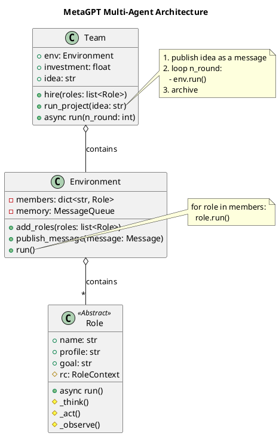
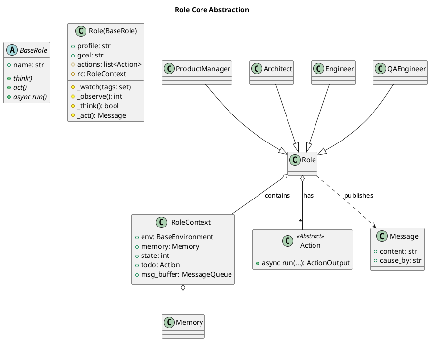

# MetaGPT Agent 架构深度分析

## 0. 项目概览

- **项目名称**: MetaGPT
- **核心理念**: MetaGPT 将软件公司的标准操作流程（SOP）编码为一个多 Agent 协作的框架。它通过为不同角色的 Agent（如产品经理、架构师、工程师）分配特定任务，模拟真实世界中的软件开发团队，以流式方式协同完成复杂的软件工程任务。
- **Agent抽象**: 在MetaGPT中，Agent的核心抽象是 `Role`。每个 `Role` 代表一个具有特定技能和目标的智能体。
- **技术栈**: Python, Pydantic, asyncio

## 1. 项目架构设计

### 1.1. 系统整体架构

MetaGPT 的核心架构由三个主要部分组成：`Team`、`Environment` 和 `Role`。

- **`Team`**: 作为多 Agent 协作的组织者和驱动者。它负责：
    - **招募（Hire）**: 将一组 `Role` 对象聚合到一个团队中。
    - **投资（Invest）**: 设置项目预算，通过 `CostManager` 跟踪成本。
    - **驱动项目（Run Project）**: 接收初始想法（`idea`），并启动整个工作流。`Team` 的 `run` 方法会循环驱动 `Environment` 运行，直到所有 `Role` 都处于空闲状态或达到最大轮次。

- **`Environment`**: 扮演着通信总线和共享工作空间的角色。它负责：
    - **消息发布/订阅**: 维护一个消息队列，`Role` 可以向环境中发布（`publish_message`）消息，而环境则根据 `Role` 的订阅（`watch`）将消息分发给对应的 `Role`。
    - **成员管理**: 存储团队中所有的 `Role` 实例。
    - **工作流驱动**: `run` 方法会遍历所有 `Role`，并执行它们的 `run` 方法，从而驱动整个团队向前推进。

- **`Role` (Agent)**: 是执行具体任务的智能体。每个 `Role` 都有明确的画像（`profile`）、目标（`goal`）和约束（`constraints`）。它们通过观察环境中的消息、思考、并采取行动来完成任务。

这个架构清晰地将“团队管理”、“通信环境”和“个体执行者”分离开来，实现了高度模块化和可扩展的多 Agent 系统。

### 1.2. 整体架构PlantUML类图

### 1.3. 模块划分与职责

- **`metagpt.base`**: 定义了最核心的抽象基类，如 `BaseRole`。
- **`metagpt.roles`**: 包含了所有具体的 `Role` 实现，是框架的核心业务逻辑所在。
- **`metagpt.team`**: 定义了 `Team` 类，负责组织和协调 `Role`。
- **`metagpt.environment`**: 定义了 `Environment` 类，提供 `Role` 之间的通信机制。
- **`metagpt.actions`**: 定义了 `Role` 可以执行的原子操作（`Action`），如写代码、写文档等。
- **`metagpt.schema`**: 定义了系统中使用的数据结构，如 `Message`。

---

## 2. 核心模块：Role (Agent) 详细分析

### 2.1. 模块概述

- **模块路径**: `metagpt.base.base_role`, `metagpt.roles.role`
- **核心职责**: `Role` 是 MetaGPT 中 Agent 的核心实现。它封装了 Agent 的状态、记忆、行为和生命周期，使其能够自主地执行任务。
- **主要组件**:
    - **`BaseRole`**: 一个抽象基类，定义了 `Role` 必须实现的接口，如 `think`, `act`, `react`, `run`。这确保了所有 `Role` 都遵循统一的执行模型。
    - **`Role`**: `BaseRole` 的具体实现，增加了状态管理、记忆、订阅机制和行动（`Action`）管理等丰富功能。
    - **`RoleContext`**: 存储 `Role` 的运行时上下文，包括记忆（`memory`）、状态（`state`）、待办事项（`todo`）和消息缓冲区（`msg_buffer`）。

### 2.2. Agent生命周期与交互

`Role` 的核心工作流程体现在 `run` 方法中，它遵循一个经典的 **Observe-Think-Act** 循环：

1.  **`_observe()`**: `Role` 从其私有的消息缓冲区（`rc.msg_buffer`）中观察新的消息。它只处理自己订阅（`_watch`）的消息类型。这个阶段是 Agent 感知环境变化的入口。

2.  **`_think()`**: `Role` 根据观察到的新消息和自身的历史记忆，决定下一步应该执行哪个 `Action`。它会更新 `self.rc.todo` 来设置待办事项。如果返回 `False`，则表示当前没有需要做的事情，`Role` 进入空闲状态。

3.  **`_act()`**: `Role` 执行 `self.rc.todo` 中指定的 `Action`。`Action` 是一个原子的、可复用的能力单元（如 `WriteCode`, `WritePRD`）。执行完 `Action` 后，通常会产生一个 `ActionOutput`，这个输出会被包装成 `Message` 并发布回 `Environment`，供其他 `Role` 观察。

### 2.3. 模块PlantUML类图

### 2.4. 具体角色分析

MetaGPT 通过继承 `Role` 类定义了多个专业角色，模拟软件开发团队：

- **`ProductManager`**: 
    - **目标**: 理解用户需求，撰写产品需求文档（PRD）。
    - **核心Action**: `WritePRD`。
    - **交互**: 观察 `UserRequirement` 消息，并将生成的 `PRD` 文档（作为消息）发布出去。

- **`Architect`**:
    - **目标**: 根据PRD设计系统架构和API。
    - **核心Action**: `WriteDesign`。
    - **交互**: 观察由 `ProductManager` 生成的 `WritePRD` 消息，然后发布系统设计文档。

- **`Engineer`**:
    - **目标**: 根据系统设计和任务列表编写代码。
    - **核心Action**: `WriteCode`, `WriteCodeReview`。
    - **交互**: 观察 `Architect` 的设计文档和 `ProjectManager` 分解的任务，生成代码文件，并可能触发 `QAEngineer` 进行测试。

- **`QAEngineer`**:
    - **目标**: 编写和执行测试用例，确保代码质量。
    - **核心Action**: `WriteTest`, `RunCode`, `DebugError`。
    - **交互**: 观察 `Engineer` 生成的代码（通过 `SummarizeCode` 消息），编写测试用例，运行测试，如果发现bug，则可能将调试信息发回给 `Engineer`。

## 3. 总结与亮点

### 3.1. 设计模式与亮点

- **策略模式**: `Role` 的不同行为（`react_mode`）如 `REACT`, `BY_ORDER`，可以看作是不同的策略，使得 Agent 的行为模式可以灵活切换。
- **发布/订阅模式**: `Environment` 作为消息总线，`Role` 作为发布者和订阅者，实现了松耦合的异步通信，这是多 Agent 系统设计的关键。
- **责任链模式**: 整个软件开发流程可以看作是一条责任链，用户需求消息从 `ProductManager` 开始，依次流经 `Architect`、`Engineer`、`QAEngineer`，每个 `Role` 处理自己负责的部分，然后将结果传递给下一个 `Role`。
- **高度可扩展性**: 框架的设计使得添加新的 `Role` 或 `Action` 变得非常容易，只需继承基类并实现特定逻辑即可，而无需修改核心的 `Team` 或 `Environment` 代码。

### 3.2. 二次开发指南

- **添加新角色**: 创建一个新类继承自 `metagpt.roles.Role`，定义其 `name`, `profile`, `goal`，并设置其 `actions` 和 `_watch` 的消息类型。
- **添加新能力**: 创建一个新类继承自 `metagpt.actions.Action`，实现其 `run` 方法。然后可以将这个新的 `Action` 添加到任意 `Role` 的 `actions` 列表中。
- **定制工作流**: 通过创建一个 `Team` 实例，并 `hire` 一个自定义的角色列表，可以轻松地构建出全新的、针对特定任务的 Agent 团队。