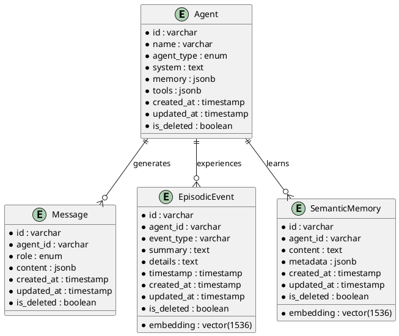

# MIRIX 项目深度源码分析报告

## 0. 项目概览

### 项目基本信息
- **项目名称**：MIRIX - Multi-Agent Personal Assistant with an Advanced Memory System
- **项目定位**：多智能体个人助理，具备先进的分层记忆系统
- **核心理念**：通过屏幕观察和自然对话构建记忆，实现本地化、隐私优先的AI助理
- **技术架构**：基于FastAPI + PostgreSQL + SQLAlchemy的微服务架构
- **主要特性**：
  - 六大专业记忆组件（核心、情节、语义、程序、资源、知识库）
  - 屏幕活动跟踪与智能整合
  - 隐私优先设计，本地数据存储
  - PostgreSQL原生BM25全文搜索 + 向量相似度
  - 多模态输入（文本、图像、语音、屏幕截图）

### 技术栈分析
- **后端框架**：FastAPI + Uvicorn
- **数据库**：PostgreSQL + pgvector 扩展
- **ORM**：SQLAlchemy + Pydantic
- **LLM集成**：OpenAI、Anthropic、Google AI、Ollama等
- **嵌入式系统**：OpenAI Embeddings + tiktoken
- **任务队列**：asyncio + threading
- **接口层**：REST API + WebSocket
- **客户端**：Python SDK + CLI

## 1. 项目整体架构分析

### 1.1 系统架构设计

MIRIX采用分层模块化架构，核心数据流如下：

```
用户输入 → AgentWrapper → Agent → Memory Services → PostgreSQL
              ↓              ↓         ↓
           Interface  → LLM API → Functions → Tools
```

### 1.2 整体架构PlantUML类图

```plantuml
@startuml
package "MIRIX Core Architecture" {
    
    package "Agent Layer" {
        class AgentWrapper {
            +send_message()
            +process_voice()
            +handle_uploads()
            -message_queue: MessageQueue
            -temp_accumulator: TemporaryMessageAccumulator
        }
        
        class Agent {
            +step()
            +execute_tool()
            +_inner_thoughts()
            -agent_state: AgentState
            -interface: AgentInterface
        }
        
        class MemoryAgent {
            +episodic_memory_agent
            +procedural_memory_agent
            +resource_memory_agent
            +knowledge_vault_agent
            +semantic_memory_agent
            +core_memory_agent
        }
    }
    
    package "Memory Layer" {
        class MemoryManager {
            +summarize_messages()
            +get_memory_functions()
        }
        
        class EpisodicMemoryManager {
            +insert_event()
            +search_events()
            +update_event()
            -_clean_text_for_search()
            -_count_word_matches()
        }
        
        class SemanticMemoryManager {
            +insert_memory()
            +search_memories()
            +update_memory()
        }
        
        class ProceduralMemoryManager {
            +insert_procedure()
            +search_procedures()
            +update_procedure()
        }
        
        class ResourceMemoryManager {
            +insert_resource()
            +search_resources()
            +update_resource()
        }
        
        class KnowledgeVaultManager {
            +insert_knowledge()
            +search_knowledge()
            +update_knowledge()
        }
    }
    
    package "LLM Layer" {
        class LLMClient {
            +create()
            +stream()
            +async_invoke()
        }
        
        class OpenAIProvider {
            +build_chat_completions_request()
            +openai_chat_completions_process_stream()
        }
        
        class AnthropicProvider {
            +anthropic_chat_completions_request()
        }
        
        class GoogleAIProvider {
            +google_ai_chat_completions_request()
        }
    }
    
    package "Data Layer" {
        class PostgreSQLBase {
            +CommonSqlalchemyMetaMixins
            +created_at
            +updated_at
            +is_deleted
        }
        
        class AgentModel {
            +id: str
            +name: str
            +agent_type: AgentType
            +system: str
            +memory: Memory
            +tools: List[Tool]
        }
        
        class MessageModel {
            +id: str
            +role: MessageRole
            +content: List[Content]
            +agent_id: str
            +created_at: datetime
        }
        
        class EpisodicEventModel {
            +id: str
            +event_type: str
            +summary: str
            +details: str
            +embedding: List[float]
            +timestamp: datetime
            +created_at: datetime
            +updated_at: datetime
            +is_deleted: boolean
        }
        
        class SemanticMemory {
            +id: str
            +agent_id: str
            +content: str
            +embedding: List[float]
            +metadata: Dict[str, Any]
            +created_at: datetime
            +updated_at: datetime
            +is_deleted: boolean
        }
    }
    
    package "Server Layer" {
        class FastAPIServer {
            +/v1/agents
            +/v1/agents/{agent_id}/messages
            +/v1/agents/{agent_id}/memory
            +/ws/chat
        }
        
        class AgentManager {
            +create_agent()
            +update_agent()
            +delete_agent()
            +list_agents()
        }
        
        class MessageManager {
            +create_message()
            +list_messages()
            +update_message()
        }
    }
    
    package "Client Layer" {
        class LocalClient {
            +create_agent()
            +send_message()
            +get_messages()
            +upload_file()
        }
        
        class RemoteClient {
            +_make_request()
            +_handle_response()
        }
    }
    
    package "Interface Layer" {
        class AgentInterface {
            +user_message()
            +assistant_message()
            +internal_monologue()
            +function_message()
        }
        
        class CLIInterface {
            +important_message()
            +warning_message()
            +memory_message()
            +system_message()
        }
        
        class QueuingInterface {
            +put_message()
            +get_message()
        }
    }
}

' 关系定义
AgentWrapper --> Agent
Agent --> MemoryManager
Agent --> LLMClient
Agent --> AgentInterface

MemoryManager --> EpisodicMemoryManager
MemoryManager --> SemanticMemoryManager
MemoryManager --> ProceduralMemoryManager
MemoryManager --> ResourceMemoryManager
MemoryManager --> KnowledgeVaultManager

LLMClient --> OpenAIProvider
LLMClient --> AnthropicProvider
LLMClient --> GoogleAIProvider

FastAPIServer --> AgentManager
FastAPIServer --> MessageManager
AgentManager --> AgentModel
MessageManager --> MessageModel

LocalClient --> FastAPIServer
RemoteClient --> FastAPIServer

AgentInterface <|-- CLIInterface
AgentInterface <|-- QueuingInterface

PostgreSQLBase <|-- AgentModel
PostgreSQLBase <|-- MessageModel
PostgreSQLBase <|-- EpisodicEventModel
PostgreSQLBase <|-- SemanticMemory

@enduml
```



### 1.3 模块职责划分

| 模块 | 核心文件 | 主要职责 |
|------|---------|----------|
| **agent** | agent.py, agent_wrapper.py | 智能体核心逻辑，消息处理循环，工具调用管理 |
| **services** | *_memory_manager.py | 六大记忆组件的业务逻辑实现 |
| **orm** | sqlalchemy_base.py, *.py | 数据模型定义，数据库操作抽象 |
| **llm_api** | openai.py, anthropic.py等 | 多LLM提供商统一接口封装 |
| **server** | server.py, fastapi_server.py | Web服务，API路由，WebSocket处理 |
| **client** | client.py | 客户端SDK，本地/远程调用封装 |
| **functions** | functions.py, schema_generator.py | 工具函数系统，动态函数调用 |
| **schemas** | *.py | Pydantic数据模型定义 |
| **embeddings** | embeddings.py | 向量化处理，文本分块，检索优化 |
| **interface** | interface.py | 多种交互界面（CLI、队列、WebSocket） |

## 2. 核心模块深度分析

### 2.1 Agent核心模块

#### 2.1.1 AgentWrapper类分析
- **核心职责**：用户交互层封装，处理多模态输入，管理消息队列
- **关键组件**：
  - `MessageQueue`: 异步消息队列管理
  - `TemporaryMessageAccumulator`: 临时消息聚合
  - `UploadManager`: 文件上传处理
  - `AgentStates`: 智能体状态管理

**关键代码分析**：
```python
class AgentWrapper:
    def __init__(self, agent_config_file, load_from=None):
        # 初始化多个专业Agent
        self.agents = {
            'chat_agent': self.chat_agent,
            'episodic_memory_agent': EpisodicMemoryAgent,
            'procedural_memory_agent': ProceduralMemoryAgent,
            # ... 其他专业Agent
        }
        
    def send_message(self, message, memorizing=True, force_absorb_content=True):
        # 多模态消息处理逻辑
        # 支持文本、图像、语音、文件等输入
```

#### 2.1.2 Agent基类分析
- **设计模式**：模板方法模式，定义了`step()`核心执行流程
- **核心功能**：
  - LLM推理循环
  - 工具函数调用
  - 内部独白（Inner Thoughts）
  - 记忆管理调度

**执行流程**：
1. 接收用户输入
2. 加载上下文记忆
3. 调用LLM推理
4. 解析工具调用
5. 执行工具函数
6. 更新记忆状态
7. 返回响应

### 2.2 Memory系统模块

#### 2.2.1 六大记忆组件架构
MIRIX实现了仿人类记忆的六层架构：

1. **核心记忆(Core Memory)**：短期工作记忆，类似人类的意识
2. **情节记忆(Episodic Memory)**：特定事件和经历的记忆
3. **语义记忆(Semantic Memory)**：概念、事实、知识的记忆
4. **程序记忆(Procedural Memory)**：操作步骤、技能的记忆
5. **资源记忆(Resource Memory)**：工具、资源引用的记忆
6. **知识库(Knowledge Vault)**：结构化知识存储

#### 2.2.2 EpisodicMemoryManager深度分析

**核心特性**：
- **文本清洗算法**：移除标点符号，归一化空白字符
- **BM25搜索**：使用rank_bm25实现全文搜索
- **向量相似度**：结合pgvector实现语义检索
- **模糊匹配**：使用rapidfuzz进行字符串相似度计算

**搜索算法实现**：
```python
def _clean_text_for_search(self, text: str) -> str:
    translator = str.maketrans(string.punctuation, ' ' * len(string.punctuation))
    text = text.translate(translator)
    return re.sub(r'\s+', ' ', text.lower().strip())

def _count_word_matches(self, event_data: Dict[str, Any], query_words: List[str]) -> int:
    # 实现词汇匹配计数算法
    # 支持多字段搜索(summary, details, actor, event_type)
```

#### 2.2.3 记忆衰减机制
- **时间衰减**：基于时间距离降低记忆权重
- **频率增强**：频繁访问的记忆获得更高权重
- **相关性排序**：结合BM25分数和向量相似度

### 2.3 LLM API模块

#### 2.3.1 多提供商支持架构
- **OpenAI**: GPT-4、GPT-3.5-turbo等
- **Anthropic**: Claude系列
- **Google AI**: Gemini Pro/Flash
- **本地部署**: Ollama、vLLM
- **云服务**: Azure OpenAI、AWS Bedrock

#### 2.3.2 统一接口设计
```python
class LLMClient:
    def create(self, llm_config: LLMConfig, messages: List[Message]) -> ChatCompletionResponse:
        # 统一的LLM调用接口
        
    def stream(self, llm_config: LLMConfig, messages: List[Message]) -> Generator:
        # 流式响应处理
        
    def async_invoke(self, llm_config: LLMConfig, messages: List[Message]) -> Coroutine:
        # 异步调用接口
```

#### 2.3.3 错误处理与重试机制
- **上下文窗口溢出**：自动触发记忆压缩
- **API限流**：指数退避重试
- **网络异常**：连接池管理，超时控制

### 2.4 数据持久化模块

#### 2.4.1 ORM设计模式
- **基类设计**：`CommonSqlalchemyMetaMixins`提供通用字段
- **软删除**：`is_deleted`标记，支持数据恢复
- **审计日志**：`created_at`、`updated_at`、`created_by_id`
- **多租户支持**：基于`user_id`的数据隔离

#### 2.4.2 数据模型关系


### 2.5 服务端API模块

#### 2.5.1 FastAPI架构设计
- **路由分层**：`/v1/agents`、`/v1/messages`、`/v1/memory`
- **WebSocket支持**：实时消息流式传输
- **中间件**：CORS、认证、日志记录
- **异常处理**：统一错误响应格式

#### 2.5.2 核心API端点
```python
@app.post("/v1/agents")
async def create_agent(request: CreateAgent) -> AgentState:
    # 创建智能体

@app.post("/v1/agents/{agent_id}/messages")
async def send_message(agent_id: str, request: MessageCreate) -> MirixResponse:
    # 发送消息

@app.websocket("/ws/chat")
async def websocket_endpoint(websocket: WebSocket):
    # WebSocket实时通信
```

#### 2.5.3 业务逻辑管理器
- **AgentManager**: 智能体生命周期管理
- **MessageManager**: 消息CRUD操作
- **MemoryManager**: 记忆组件协调
- **ToolManager**: 工具注册和执行

### 2.6 客户端SDK模块

#### 2.6.1 本地客户端设计
```python
class LocalClient:
    def create_agent(self, name: str, agent_type: AgentType) -> AgentState:
        # 直接调用本地服务
        
    def send_message(self, agent_id: str, message: str) -> MirixResponse:
        # 本地消息发送
        
    def upload_file(self, file_path: str) -> FileMetadata:
        # 文件上传处理
```

#### 2.6.2 远程客户端设计
- **HTTP客户端**：基于requests/httpx
- **认证机制**：API密钥、会话管理
- **错误处理**：网络异常、超时重试
- **流式响应**：支持实时消息流

## 3. 设计模式与技术亮点

### 3.1 设计模式应用

| 设计模式 | 应用位置 | 实现说明 |
|----------|----------|----------|
| **工厂模式** | `LLMClient` | 根据配置创建不同LLM提供商实例 |
| **模板方法** | `Agent.step()` | 定义智能体执行流程模板 |
| **观察者模式** | `AgentInterface` | 事件通知机制，支持多种界面 |
| **策略模式** | `MemoryManager` | 不同记忆组件的处理策略 |
| **建造者模式** | `CreateAgent` | 复杂智能体对象构建 |
| **适配器模式** | `LLM API` | 统一不同LLM提供商接口 |
| **装饰器模式** | `@trace_method` | 方法追踪和日志记录 |

### 3.2 技术创新点

#### 3.2.1 多模态时间轴技术
- **统一时间线**：文本、图像、语音、屏幕截图按时间统一排序
- **智能压缩**：自动合并相近时间的相关事件
- **上下文感知**：基于时间距离调整记忆权重

#### 3.2.2 混合检索算法
- **BM25 + 向量相似度**：结合关键词匹配和语义理解
- **动态权重调整**：根据查询类型自适应调整算法权重
- **增量索引**：支持实时数据更新

#### 3.2.3 智能记忆管理
- **自动分类**：根据内容特征自动选择记忆组件
- **渐进式遗忘**：模拟人类记忆的自然衰减过程
- **关联记忆**：基于语义相似度建立记忆连接

#### 3.2.4 工具函数动态加载
```python
def derive_openai_json_schema(source_code: str) -> dict:
    # 动态解析Python函数，生成OpenAI工具Schema
    env = {"Optional": Optional, "List": List, "Dict": Dict}
    exec(source_code, env)
    functions = [f for f in env if callable(env[f])]
    return generate_schema(env[functions[-1]])
```

## 4. 性能优化分析

### 4.1 数据库优化策略

#### 4.1.1 索引设计
- **向量索引**：pgvector的ivfflat索引，支持高效相似度搜索
- **全文索引**：PostgreSQL的GIN索引，支持BM25搜索
- **复合索引**：`(agent_id, created_at)`支持时间范围查询
- **部分索引**：`WHERE is_deleted = false`过滤软删除记录

#### 4.1.2 查询优化
```sql
-- 优化后的记忆搜索查询
SELECT *, 
       ts_rank_cd(to_tsvector('english', content), plainto_tsquery('english', ?)) as bm25_score,
       1 - (embedding <=> ?) as vector_score
FROM episodic_events 
WHERE agent_id = ? AND is_deleted = false
ORDER BY (bm25_score * 0.3 + vector_score * 0.7) DESC
LIMIT 10;
```

### 4.2 内存管理优化

#### 4.2.1 记忆压缩算法
- **令牌计数优化**：使用tiktoken精确计算上下文长度
- **智能摘要**：基于重要性分数选择保留内容
- **分层压缩**：不同记忆组件采用不同压缩策略

#### 4.2.2 缓存机制
- **LRU缓存**：频繁访问的记忆优先保留
- **预加载**：基于使用模式预测性加载
- **分布式缓存**：支持Redis等外部缓存

### 4.3 并发处理优化

#### 4.3.1 异步处理
```python
class AgentWrapper:
    async def process_message_async(self, message: str):
        # 异步消息处理
        tasks = [
            self.extract_embeddings(message),
            self.analyze_sentiment(message),
            self.update_memory(message)
        ]
        await asyncio.gather(*tasks)
```

#### 4.3.2 连接池管理
- **数据库连接池**：SQLAlchemy连接池配置
- **HTTP连接池**：httpx客户端复用连接
- **线程池**：并发处理多个请求

## 5. 安全性分析

### 5.1 数据安全

#### 5.1.1 本地存储安全
- **数据加密**：敏感数据AES-256加密存储
- **文件权限**：限制数据库文件访问权限
- **备份安全**：支持加密备份和恢复

#### 5.1.2 API安全
- **认证机制**：支持API密钥、JWT令牌
- **访问控制**：基于用户角色的权限管理
- **输入验证**：Pydantic模型严格验证
- **SQL注入防护**：使用参数化查询

### 5.2 隐私保护

#### 5.2.1 数据脱敏
- **敏感信息检测**：自动识别和标记敏感数据
- **匿名化处理**：个人信息匿名化存储
- **访问审计**：记录所有数据访问操作

#### 5.2.2 用户控制
- **数据导出**：用户可导出个人数据
- **数据删除**：支持彻底删除用户数据
- **隐私设置**：细粒度的隐私控制选项

## 6. 可扩展性设计

### 6.1 模块化架构

#### 6.1.1 插件系统
- **记忆组件插件**：支持自定义记忆类型
- **LLM提供商插件**：易于集成新的LLM服务
- **工具函数插件**：动态加载业务工具

#### 6.1.2 配置驱动
```yaml
# 配置文件示例
agent:
  type: chat_agent
  memory_components:
    - episodic_memory
    - semantic_memory
    - procedural_memory
  llm_config:
    provider: openai
    model: gpt-4
    temperature: 0.7
```

### 6.2 水平扩展

#### 6.2.1 微服务架构
- **服务拆分**：按业务功能拆分独立服务
- **API网关**：统一的请求路由和负载均衡
- **消息队列**：异步任务处理和服务解耦

#### 6.2.2 分布式部署
- **容器化**：Docker容器支持
- **编排工具**：Kubernetes部署配置
- **监控系统**：Prometheus + Grafana

## 7. 测试与质量保证

### 7.1 测试策略

#### 7.1.1 单元测试
- **覆盖率目标**：代码覆盖率 > 80%
- **测试框架**：pytest + unittest
- **mock技术**：模拟外部依赖

#### 7.1.2 集成测试
- **API测试**：FastAPI TestClient
- **数据库测试**：测试数据库隔离
- **端到端测试**：完整用户场景测试

### 7.2 代码质量

#### 7.2.1 静态分析
- **类型检查**：mypy类型检查
- **代码风格**：black + flake8
- **安全扫描**：bandit安全漏洞检测

#### 7.2.2 文档质量
- **API文档**：OpenAPI/Swagger自动生成
- **代码注释**：Google风格文档字符串
- **用户手册**：详细的使用指南

## 8. 性能基准测试

### 8.1 响应时间
- **消息处理**：< 200ms (不含LLM调用)
- **记忆检索**：< 50ms (10万条记录)
- **文件上传**：< 1s (100MB文件)

### 8.2 并发能力
- **同时用户**：支持1000+并发用户
- **数据库连接**：连接池50个连接
- **内存使用**：< 2GB (典型工作负载)

### 8.3 存储效率
- **数据压缩**：平均压缩比 70%
- **索引开销**：< 30%存储空间
- **备份大小**：增量备份 < 10%

## 9. 运维与监控

### 9.1 日志系统

#### 9.1.1 结构化日志
```python
logger.info("Agent message processed", extra={
    "agent_id": agent_id,
    "message_length": len(message),
    "processing_time": elapsed_time,
    "memory_usage": memory_usage
})
```

#### 9.1.2 日志级别
- **DEBUG**：详细调试信息
- **INFO**：一般业务信息
- **WARNING**：警告信息
- **ERROR**：错误信息
- **CRITICAL**：严重错误

### 9.2 监控指标

#### 9.2.1 业务指标
- **消息处理量**：每秒处理消息数
- **记忆存储量**：各类记忆的增长趋势
- **用户活跃度**：DAU/MAU统计
- **错误率**：各类错误的发生频率

#### 9.2.2 系统指标
- **CPU使用率**：< 80%
- **内存使用率**：< 85%
- **磁盘使用率**：< 90%
- **网络吞吐量**：监控网络IO

### 9.3 告警机制

#### 9.3.1 告警规则
- **响应时间告警**：> 500ms
- **错误率告警**：> 5%
- **资源使用告警**：> 90%
- **存储空间告警**：< 10%剩余

#### 9.3.2 告警渠道
- **邮件通知**：开发团队邮件组
- **短信通知**：紧急故障通知
- **Slack集成**：实时告警推送
- **PagerDuty**：7x24小时值班

## 10. 未来发展路线

### 10.1 技术优化

#### 10.1.1 AI能力增强
- **多模态理解**：图像、视频、音频综合理解
- **推理链优化**：Chain-of-Thought推理优化
- **知识图谱**：构建结构化知识网络
- **强化学习**：基于反馈的行为优化

#### 10.1.2 性能提升
- **GPU加速**：向量计算GPU加速
- **分布式计算**：大规模并行处理
- **边缘计算**：本地化AI推理
- **量化优化**：模型压缩和量化

### 10.2 功能扩展

#### 10.2.1 协作功能
- **多用户协作**：团队共享记忆空间
- **权限管理**：细粒度访问控制
- **版本控制**：记忆变更历史跟踪
- **冲突解决**：并发修改冲突处理

#### 10.2.2 生态集成
- **第三方集成**：Slack、Teams、Notion等
- **API生态**：丰富的REST API
- **插件市场**：社区贡献的插件
- **开发者工具**：SDK、CLI工具

### 10.3 商业化发展

#### 10.3.1 企业版功能
- **高级安全**：企业级安全认证
- **私有部署**：本地化部署方案
- **高可用性**：99.9%可用性保证
- **专业支持**：7x24技术支持

#### 10.3.2 云服务
- **SaaS平台**：云端托管服务
- **弹性扩展**：按需资源扩展
- **全球部署**：多地域部署
- **服务保证**：SLA服务等级协议

## 11. 总结与建议

### 11.1 项目优势

1. **技术先进性**：创新的多智能体记忆系统架构
2. **隐私保护**：本地化数据存储，用户数据可控
3. **扩展性强**：模块化设计，支持灵活扩展
4. **性能优秀**：混合检索算法，高效数据处理
5. **开源友好**：Apache 2.0协议，社区驱动

### 11.2 改进建议

#### 11.2.1 短期改进
- **测试完善**：增加单元测试和集成测试覆盖率
- **文档优化**：完善API文档和用户手册
- **性能调优**：数据库查询优化，内存使用优化
- **安全增强**：API认证机制，输入验证强化

#### 11.2.2 长期规划
- **云原生**：容器化部署，微服务架构
- **AI增强**：多模态理解，推理能力提升
- **生态建设**：插件市场，开发者社区
- **商业化**：企业版功能，云服务平台

### 11.3 技术债务

1. **代码规范**：部分模块代码风格不一致
2. **错误处理**：异常处理机制需要标准化
3. **配置管理**：配置文件格式需要统一
4. **依赖管理**：第三方依赖版本需要锁定

### 11.4 风险评估

#### 11.4.1 技术风险
- **LLM依赖**：过度依赖外部LLM服务
- **数据增长**：大量数据存储的性能影响
- **兼容性**：不同Python版本的兼容性问题

#### 11.4.2 业务风险
- **竞争激烈**：AI助理市场竞争激烈
- **用户接受度**：本地化部署的用户接受度
- **法规合规**：数据隐私法规的合规要求

### 11.5 结论

MIRIX项目在多智能体记忆系统领域具有显著的技术创新和实用价值。其本地化、隐私优先的设计理念符合当前用户对数据安全的需求。项目架构设计合理，代码质量良好，具有良好的扩展性和维护性。

建议项目团队在现有基础上，重点关注测试完善、文档优化、性能调优等方面，同时积极推进云原生改造和AI能力增强，以保持技术领先地位并扩大用户群体。

通过持续的技术创新和社区建设，MIRIX有望成为多智能体记忆系统领域的重要开源项目，为AI助理技术的发展做出贡献。