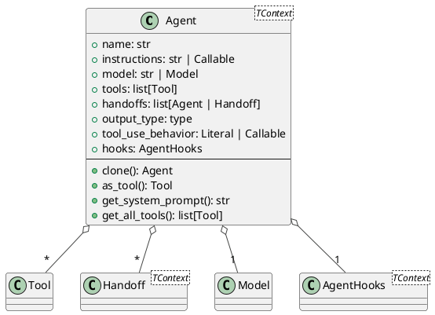
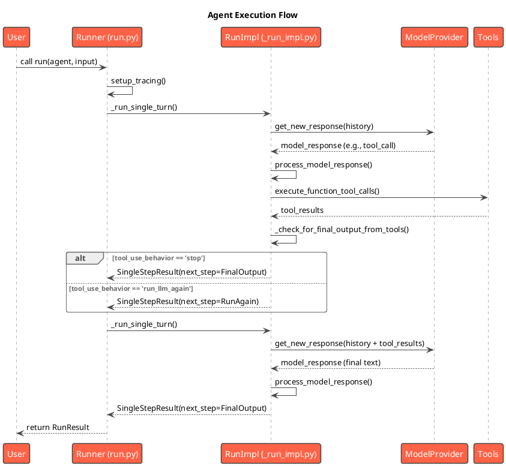
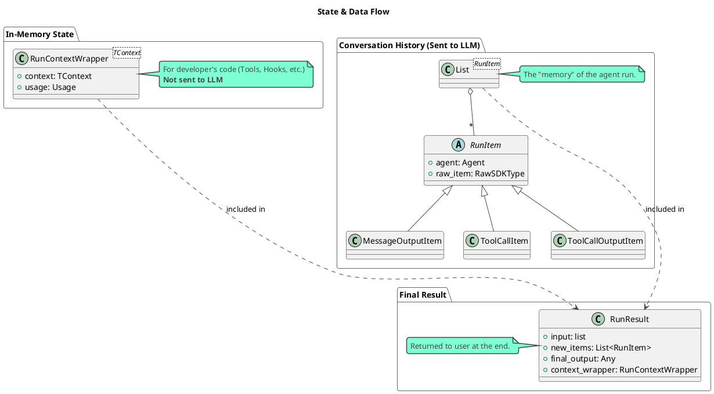
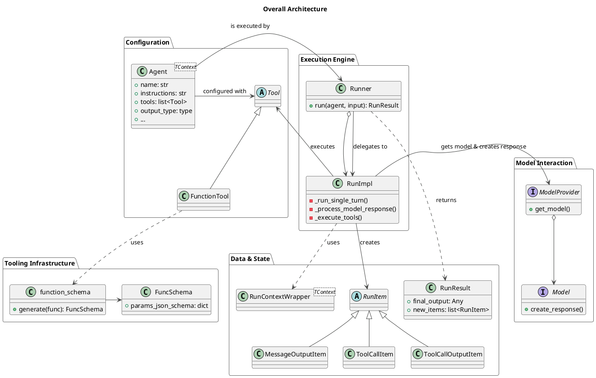

# OpenAI-Agents-Python 源码解读报告

## 0. 项目概览

- **项目名称**: `openai-agents-python`
- **核心理念**: 提供一个用于构建、管理和运行自主代理的Python库。该库似乎是OpenAI Assistants API的一个Python实现或其早期版本/变体，重点在于状态管理、工具使用、模型交互和可扩展性。
- **技术栈**: Python
- **目录结构概览**: 

```
.
├── agent.py
├── computer.py
├── exceptions.py
├── extensions
│   ├── handoff_filters.py
│   ├── handoff_prompt.py
│   ├── models
│   │   ├── litellm_model.py
│   │   └── litellm_provider.py
│   └── visualization.py
├── function_schema.py
├── guardrail.py
├── handoffs.py
├── items.py
├── lifecycle.py
├── mcp
│   ├── server.py
│   └── util.py
├── models
│   ├── _openai_shared.py
│   ├── chatcmpl_converter.py
│   ├── chatcmpl_helpers.py
│   ├── chatcmpl_stream_handler.py
│   ├── fake_id.py
│   ├── interface.py
│   ├── multi_provider.py
│   ├── openai_chatcompletions.py
│   ├── openai_provider.py
│   └── openai_responses.py
├── model_settings.py
├── repl.py
├── result.py
├── run.py
├── run_context.py
├── stream_events.py
├── strict_schema.py
├── tool.py
├── tool_context.py
├── tracing
│   ├── create.py
│   ├── processor_interface.py
│   ├── processors.py
│   ├── scope.py
│   ├── setup.py
│   ├── span_data.py
│   ├── spans.py
│   └── traces.py
├── usage.py
├── util
│   ├── _coro.py
│   ├── _error_tracing.py
│   ├── _json.py
│   ├── _pretty_print.py
│   ├── _transforms.py
│   └── _types.py
└── voice
    ├── events.py
    ├── exceptions.py
    ├── imports.py
    ├── input.py
    ├── model.py
    ├── models
    │   ├── openai_model_provider.py
    │   ├── openai_stt.py
    │   └── openai_tts.py
    ├── pipeline.py
    ├── pipeline_config.py
    ├── result.py
    └── workflow.py
```

## 1. 核心模块分析

### 1.1 Agent Core: `agent.py`

#### 1.1.1 核心职责

`agent.py` 文件定义了 `Agent` 类的核心结构和配置。这个类是整个系统的中心枢纽，它不包含具体的运行逻辑（执行循环），而是作为一个配置容器，描述了一个Agent"是什么"——包括它的身份、指令、能力和行为规则。

#### 1.1.2 关键组件分析

- **`Agent[TContext]` (Generic Dataclass)**:
  - 这是定义一个Agent的核心数据类。它使用了Python的泛型，允许用户传入一个自定义的 `context` 类型 `TContext`。这个`context`对象是可变的，并在整个运行周期中（如工具调用、Guardrail检查等）被共享和传递，用于状态管理。
  - **主要属性**:
    - `name` & `instructions`: 定义Agent的身份和核心指令（System Prompt）。`instructions`可以是静态字符串，也可以是一个函数，动态生成提示。
    - `model` & `model_settings`: 指定了要使用的LLM模型和相关参数（如 `temperature`）。
    - `tools`: 一个`Tool`对象列表，定义了Agent可用的具体能力。这是Agent功能扩展性的基础。
    - `handoffs`: 允许一个Agent将任务委托给另一个Agent。这是实现Agent协作和责任分离的关键机制。
    - `output_type`: 指定Agent最终输出的数据结构。支持Pydantic模型或数据类，从而实现结构化输出。
    - `tool_use_behavior`: 一个非常精巧的设计，用于控制工具调用后的流程。它可以配置为：
      - `run_llm_again` (默认): 工具执行后，将结果返回给LLM进行下一步决策。
      - `stop_on_first_tool`: 第一个工具的输出即为最终结果，流程终止。
      - `StopAtTools`: 当调用了列表中指定的某个工具后，流程终止。
      - `ToolsToFinalOutputFunction`: 允许传入一个自定义函数，根据工具执行结果动态决定是否终止流程。
    - `guardrails`: 输入和输出守卫，用于在执行前后进行数据校验或策略检查。
    - `mcp_servers`: 与模型上下文协议（MCP）集成，允许Agent动态地从外部服务获取工具。

- **`as_tool()` 方法**:
  - 这是一个强大的元编程功能，可以将一个完整的Agent实例封装成一个`Tool`。这使得一个Agent可以被另一个Agent作为工具来调用，实现了Agent的组合与嵌套，是构建复杂Agent系统的关键。

- **`get_all_tools()` 方法**:
  - 此方法负责在运行时动态组装当前Agent可用的所有工具。它会合并静态定义的`tools`、来自`mcp_servers`的工具，并根据`is_enabled`属性过滤掉当前不可用的工具。

#### 1.1.3 模块PlantUML类图



### 1.2 Agent Execution: `run.py` & `_run_impl.py`

#### 1.2.1 核心职责

如果说 `agent.py` 定义了Agent的"静态配置"，那么 `run.py` 和 `_run_impl.py` 则定义了Agent的"动态执行"。这两个文件共同构成了Agent的运行时引擎，负责管理整个生命周期，从接收输入开始，到与模型交互、执行工具，再到产生最终输出为止。

- **`run.py`**: 提供了面向用户的高级API，如 `Runner.run()`、`Runner.run_sync()` 和 `Runner.run_streamed()`。它管理着一个宏观的、跨多轮（turns）的循环，并处理诸如`max_turns`超限、全局配置（`RunConfig`）和顶层异常处理等事务。
- **`_run_impl.py`**: 包含了单次"轮次"（turn）内部的复杂实现细节。一个"轮次"通常指一次"LLM思考 -> 执行动作"的循环。这个文件负责解析模型响应、调用工具、执行Handoff、应用`tool_use_behavior`策略等具体工作。

#### 1.2.2 关键组件与流程

1.  **`Runner` (in `run.py`)**:
    -   作为执行入口，它初始化整个运行环境，包括追踪（Tracing）、上下文（Context）和钩子（Hooks）。
    -   它维护一个主循环 (`while True`)，每一轮循环代表一个Agent Turn。
    -   循环内部调用 `_run_single_turn()` 来执行单轮逻辑。
    -   根据单轮返回的结果 (`SingleStepResult`)，决定下一步是：
        - `NextStepFinalOutput`: 成功获得最终结果，退出循环。
        - `NextStepHandoff`: 将控制权交给新的Agent，继续循环。
        - `NextStepRunAgain`: 使用当前Agent，带着工具执行的结果，再次进入下一轮循环。

2.  **`RunImpl` (in `_run_impl.py`)**:
    -   **`process_model_response()`**: 这是模型交互的核心。它接收来自LLM的原始响应，并将其解析为一个结构化的`ProcessedResponse`对象。此过程会识别出响应中包含的各种意图，如：
        - 普通消息 (`MessageOutputItem`)
        - 函数工具调用 (`ToolRunFunction`)
        - Handoff请求 (`ToolRunHandoff`)
        - 桌面自动化操作 (`ToolRunComputerAction`)
        - 本地Shell命令 (`ToolRunLocalShellCall`)
    -   **`execute_tools_and_side_effects()`**: 此方法负责执行`ProcessedResponse`中解析出的所有动作。它使用`asyncio.gather`来并行执行多个工具调用，然后收集它们的输出。
    -   **`_check_for_final_output_from_tools()`**: 这是实现 `agent.tool_use_behavior` 策略的关键。在工具执行完毕后，此函数会检查相关策略（如 `stop_on_first_tool`），以确定工具的输出是否应该被视为流程的最终结果。

3.  **`SingleStepResult` (Dataclass)**:
    -   这是一个关键的数据结构，用于在 `RunImpl` 和 `Runner` 之间传递单轮执行的结果。它封装了当前轮次产生的所有新事件（`new_step_items`）以及最重要的——下一步的指令（`next_step`）。

#### 1.2.3 执行流程时序图

为了更清晰地展示执行流程，下面是一个简化的时序图。



### 1.3 Tooling & Capabilities: `tool.py` & `function_schema.py`

#### 1.3.1 核心职责

这两个文件共同定义了Agent的能力系统。Agent本身只是一个协调者，其真正的"能力"来自于它可以使用的工具。

- **`tool.py`**: 定义了"工具"（`Tool`）的抽象概念以及其各种具体实现。它是一个工具箱，包含了可以直接使用的各种工具，如`FunctionTool`、`FileSearchTool`、`WebSearchTool`等。
- **`function_schema.py`**: 提供了将普通Python函数"翻译"成LLM能够理解的JSON Schema的核心逻辑。这是连接开发者代码和LLM世界的桥梁，也是该框架最为亮眼的功能之一。

#### 1.3.2 关键组件分析

1.  **`Tool` (Union Type in `tool.py`)**:
    -   这是一个`Union`类型，囊括了所有可能的工具类型。这种设计使得工具系统易于扩展，只需定义一个新的工具类并将其加入`Union`即可。
    -   **主要工具类型**:
        - **`FunctionTool`**: 最核心、最通用的工具类型。它将一个Python函数包装起来，使其能被Agent调用。
        - **Hosted Tools** (`FileSearchTool`, `WebSearchTool`, `CodeInterpreterTool`, `ComputerTool`): 这些是与特定后端服务（可能是OpenAI API）集成的托管工具。Agent只需要在请求中声明使用它们，具体的执行逻辑由外部服务处理，Agent无需关心其实现细节。这是一种强大的服务集成模式。
        - **`LocalShellTool`**: 允许Agent请求执行本地Shell命令，但需要开发者提供一个安全的`executor`函数来实际执行，保证了安全性。
        - **MCP Tools**: 通过`HostedMCPTool`和在`Agent`中配置`mcp_servers`，实现了对模型上下文协议（MCP）的支持，提供了一种标准化的方式来发现和使用外部工具。

2.  **`@function_tool` (Decorator in `tool.py`)**:
    -   这是创建`FunctionTool`的首选方式。它是一个非常方便的装饰器，开发者只需将其应用到任意一个Python函数上，它就会自动处理所有创建`FunctionTool`实例所需的样板代码，包括调用`function_schema`生成模式。

3.  **`function_schema()` (in `function_schema.py`)**:
    -   这是实现自动模式生成的"魔法"所在。它接收一个Python函数，通过以下步骤生成`FuncSchema`：
        - **解析文档字符串**: 使用`griffe`库解析函数的docstring（支持Google, Numpy, Sphinx等多种风格），自动提取函数的总体描述以及每个参数的描述。这意味着开发者只需编写符合规范的、人类可读的文档，这些文档就会自动成为LLM看到的工具说明。
        - **检查类型提示**: 使用Python内置的`inspect`和`get_type_hints`来获取函数的参数名、类型和默认值。
        - **动态创建Pydantic模型**: 它根据函数的签名（参数、类型等）在内存中动态创建一个Pydantic模型。这是一个非常聪明的做法，因为它复用了Pydantic强大的数据校验和JSON Schema生成能力。
        - **生成JSON Schema**: 从上一步的Pydantic模型生成最终的JSON Schema。它还会通过`ensure_strict_json_schema`函数确保生成的Schema符合大模型API的"严格模式"，提高了调用成功率。
        - **自动处理上下文**: 它能自动检测函数的第一个参数是否为`RunContextWrapper`或`ToolContext`。如果是，它会将其从生成给LLM的Schema中排除，但在实际调用函数时，会自动将上下文对象注入。

#### 1.3.3 模块PlantUML类图

```plantuml
@startuml
!theme vibrant
title Tooling & Schema Generation

package "tool.py" {
    abstract class Tool {
        +name: str
    }

    class FunctionTool {
        +description: str
        +params_json_schema: dict
        +on_invoke_tool: Callable
    }

    class FileSearchTool {
    }
    class WebSearchTool {
    }
    
    class ComputerTool {
    }

    Tool <|-- FunctionTool
    Tool <|-- FileSearchTool
    Tool <|-- WebSearchTool
    Tool <|-- ComputerTool

    decorator "function_tool()" as decorator
    decorator ..> FunctionTool : creates
}

package "function_schema.py" {
    class FuncSchema {
        +name: str
        +description: str
        +params_pydantic_model: type[BaseModel]
        +params_json_schema: dict
    }

    function "function_schema(func)" as function_schema
    function_schema --> FuncSchema : returns

    function "generate_func_documentation(func)" as generate_func_documentation
    function_schema ..> generate_func_documentation
    
    class "griffe.Docstring" as Griffe
    generate_func_documentation ..> Griffe : uses

    class "pydantic.create_model" as create_model
    function_schema ..> create_model : uses
}

decorator ..> function_schema : uses

@enduml
```

### 1.4 State & Data Management

#### 1.4.1 核心职责

这部分涉及的文件共同构建了Agent在运行时的状态表示、数据流和最终结果的封装。一个良好、清晰的状态管理是Agent能够进行多轮对话、在代码和LLM之间传递信息的关键。

- **`items.py`**: 定义了构成对话历史的"原子单位"。每一次交互，无论是模型输出、工具调用还是工具结果，都被封装成一个具体的`RunItem`对象。
- **`run_context.py`**: 定义了`RunContextWrapper`，这是一个面向开发者的、用于在Python代码中传递状态和依赖的机制。
- **`agent_output.py`**: 定义了`AgentOutputSchema`，负责处理Agent的结构化输出，包括生成Schema和验证模型返回的JSON。
- **`result.py`**: 定义了`RunResult`和`RunResultStreaming`，这是Agent执行完毕后返回给用户的最终产物。

#### 1.4.2 关键组件分析

1.  **`RunItem` (in `items.py`)**:
    -   这是Agent运行历史的核心数据结构。它不是一个单一的类，而是一个`TypeAlias`（类型别名），联合了所有可能的事件类型，例如：
        - `MessageOutputItem`: LLM生成的文本消息。
        - `ToolCallItem`: LLM发出的工具调用请求。
        - `ToolCallOutputItem`: 执行工具后返回的结果。
        - `HandoffCallItem` / `HandoffOutputItem`: Agent之间切换的事件。
        - `ReasoningItem`: LLM的思考过程。
    -   在`Runner`的执行循环中，会维护一个`generated_items: list[RunItem]`列表。这个列表就是Agent的**短期记忆**，它被完整地记录下来，并在每一轮新的LLM调用时，转换为`TResponseInputItem`列表，作为上下文历史传递给模型。这种"事件溯源"式的日志记录方式，使得整个交互过程非常清晰和可追溯。

2.  **`RunContextWrapper[TContext]` (in `run_context.py`)**:
    -   这是一个非常重要的概念，它解决了如何在开发者自己的代码（如工具函数、钩子、守卫等）中共享状态的问题。
    -   用户在调用`Runner.run(context=...)`时可以传入一个自定义的`context`对象。这个对象被`RunContextWrapper`包装后，会分发给所有相关的回调函数。
    -   **关键点**: `RunContext`中的数据**不会**被发送给LLM。它是一个纯粹的、存在于Python运行环境中的状态容器，用于实现依赖注入或在不同工具调用之间共享信息（例如，数据库连接、用户会话信息等），而不会污染模型的Prompt。

3.  **`AgentOutputSchema` (in `agent_output.py`)**:
    -   该类与`agent.py`中的`output_type`属性紧密配合，专门负责处理结构化输出。
    -   它的`json_schema()`方法能根据用户定义的类型（如Pydantic模型）生成一个JSON Schema，并告知LLM应该以何种格式输出结果。
    -   它的`validate_json()`方法则负责接收LLM返回的JSON字符串，并根据Schema进行校验和解析，最终转换成一个干净、类型安全的Python对象。这极大地保证了Agent最终产出的可靠性。

4.  **`RunResult` (in `result.py`)**:
    -   这是Agent执行成功后返回给用户的"成绩单"。它是一个不可变的Dataclass，包含了此次运行的所有信息：
        - 原始输入 `input`。
        - 完整的交互历史 `new_items`。
        - 经过`AgentOutputSchema`验证和解析后的`final_output`。
        - Guardrail的检查结果。
        - 最终的`context_wrapper`，其中包含了Token使用量等统计信息。
    -   它将一次复杂的、可能包含多轮交互的Agent运行，封装成一个干净、易于使用的结果对象。`RunResultStreaming`则为其流式版本。

#### 1.4.3 状态管理模型图



## 2. 整体架构与总结

### 2.1 核心抽象与设计理念

通过对核心模块的分析，我们可以总结出`openai-agents-python`库的几个核心设计理念：

1.  **配置与执行分离 (Declarative & Imperative Separation)**:
    -   `Agent`对象本身是一个**声明式**的配置块。开发者通过它来定义一个Agent"是什么"（指令、工具、输出类型等），而不关心它"如何"运行。
    -   `Runner`则负责**命令式**的执行。它获取`Agent`配置，并驱动整个运行时循环。
    -   这种分离使得`Agent`的定义非常干净、可移植，并且易于被其他系统（如`as_tool`功能）组合和复用。

2.  **事件溯源的对话历史 (Event-Sourced Conversation History)**:
    -   整个Agent的运行历史由一系列不可变的`RunItem`事件构成。无论是模型的消息、工具的调用还是结果，都被记录为独立的事件。
    -   这种设计提供了极佳的可追溯性和调试能力。每一轮的输入就是之前所有事件的集合，逻辑非常清晰。它也天然地支持流式处理，因为每个新事件都可以被独立地推送给客户端。

3.  **万物皆工具 (Everything is a Tool)**:
    -   该库将Agent的能力高度抽象为"工具"。无论是本地的Python函数、外部的Web API，还是另一个完整的Agent（通过`as_tool`），都可以被统一封装成`Tool`接口。
    -   这种设计提供了无与伦比的扩展性。`handoffs`机制是"万物皆工具"理念的延伸，它允许将控制权完全交给另一个专用的"工具人"（Agent）。

4.  **面向开发者的友好设计 (Developer-Friendly Design)**:
    -   **自动Schema生成**: 从Python函数的类型提示和文档字符串自动生成LLM可用的JSON Schema，是该库的杀手级特性，极大地降低了开发门槛。
    -   **上下文注入**: `RunContextWrapper`提供了一个干净的依赖注入和状态管理机制，避免了使用全局变量或复杂的参数传递。
    -   **结构化输出**: `output_type`和`AgentOutputSchema`让获取可靠的、类型安全的结构化数据变得简单。

### 2.2 组件交互与数据流（整体架构图）

下面的类图汇总了核心组件之间的关系，展示了从配置、执行到数据管理的完整流程。



### 2.3 设计模式与亮点

- **策略模式 (Strategy Pattern)**: `agent.tool_use_behavior`是策略模式的完美体现。它将决定工具调用后流程的算法（是停止还是继续）封装在不同的策略对象/函数中（`"run_llm_again"`, `"stop_on_first_tool"`, `ToolsToFinalOutputFunction`），使得Agent的行为可以在运行时灵活切换。
- **装饰器模式 (Decorator Pattern)**: `@function_tool`装饰器极大地简化了工具的创建过程，它向一个普通的Python函数附加了生成Schema和处理调用的能力，而无需修改函数本身的代码。
- **组合模式 (Composite Pattern)**: `agent.as_tool()`允许将一个复杂的Agent（它本身可能由多个工具和Handoff组成）组合成一个单一的`Tool`，被其他Agent使用。这使得可以构建出层次化的、功能强大的Agent系统。
- **依赖注入 (Dependency Injection)**: `RunContextWrapper`机制本质上是一种依赖注入。它将外部的依赖（如数据库连接、配置对象等）注入到需要它们的地方（工具函数、钩子），解耦了业务逻辑和其依赖的基础设施。

### 2.4 总结与建议

`openai-agents-python`是一个设计精良、高度工程化的Agent框架。它在开发者体验、可扩展性和健壮性之间取得了出色的平衡。

**主要优点**:
- **自动化程度高**: 自动从代码生成工具Schema，极大提升开发效率。
- **架构清晰**: 配置与执行分离、事件溯源的历史记录，使得代码易于理解和维护。
- **扩展性强**: "万物皆工具"的设计理念和对Handoff、MCP的支持，为构建复杂系统提供了坚实的基础。
- **健壮性好**: 强制的结构化输出、Guardrail机制和类型安全的状态对象，保证了运行的可靠性。

**潜在改进建议**:
- **可视化与调试**: 虽然有Tracing，但如果能提供一个更直观的可视化工具来展示Agent的决策树和数据流，将会非常有帮助（`extensions/visualization.py`似乎是一个尝试，但可以更深入）。
- **长时记忆**: 当前的记忆模型（`RunItem`列表）是基于单次运行的。对于需要跨会话记忆的场景，需要一个更持久化的记忆模块。
- **动态工具加载**: 目前工具在Agent初始化时基本确定。如果能支持在运行时动态地为Agent增加或移除工具，会增加其灵活性。

**二次开发指南**:
- **入门**: 从`run.py`的`Runner.run`方法入手，跟踪`_run_single_turn`的调用，是理解执行流程的最佳路径。
- **扩展能力**: 学习`@function_tool`的使用，为你自己的函数编写符合规范的文档和类型提示，是扩展Agent能力的核心。
- **自定义行为**: 深入研究`Agent`的各项参数，特别是`tool_use_behavior`、`hooks`和`guardrails`，是定制化Agent行为的关键。
- **集成外部服务**: 研究`MCP`相关代码，可以了解如何将Agent与外部的工具生态系统集成。
