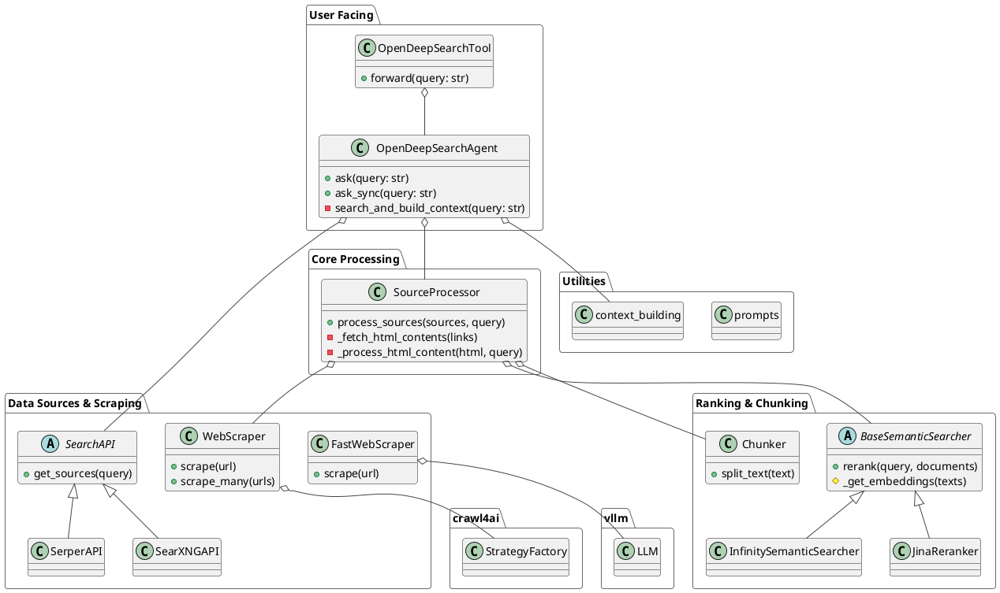

# 解读报告: OpenDeepSearch

## 0. 项目概览

- **项目名称与简介**: OpenDeepSearch 是一个 AI 驱动的搜索Agent，它结合了网络搜索、内容抓取、重排序和大型语言模型（LLM）生成，以提供基于网络最新信息的准确回答。
- **核心理念与设计哲学**: 项目的核心理念是实现“深度”搜索。不同于仅依赖搜索引擎返回的摘要，它会主动访问搜索结果页面，抓取完整内容，并利用语义重排序模型从页面中提取与用户查询最相关的部分，从而构建一个信息丰富、信噪比高的上下文，最终由 LLM 根据这个上下文生成答案。这种方法旨在模拟人类专家在研究问题时的信息收集与提炼过程。
- **技术栈与主要依赖**:
    - **LLM 调用**: `litellm` (用于调用各类 LLM), `vllm` (用于本地高速 LLM 推理)
    - **网络搜索**: `requests` (用于 API 调用), 支持 `Serper` 和 `SearXNG`
    - **内容抓取**: `crawl4ai` (一个强大的异步网络抓取库)
    - **语义/向量计算**: `torch`, `fasttext`
    - **文本处理**: `langchain_text_splitters`
    - **Agent/Tooling**: `smolagents` (用于将搜索功能封装为工具)
- **目录结构概览**:
    - `opendeepsearch/`: 项目根目录
        - `serp_search/`: 处理与外部搜索引擎（Serper, SearXNG）的 API 交互。
        - `ranking_models/`: 包含文本分块和语义重排序模型（基于 Jina 或本地 Infinity API）。
        - `context_scraping/`: 负责从 URL 抓取和清洗网页内容，包含多种抓取策略。
        - `context_building/`: 将抓取和处理过的信息源，整合成最终给 LLM 的上下文。
        - `ods_agent.py`: 项目核心，编排搜索、抓取、重排和生成流程的 `OpenDeepSearchAgent`。
        - `ods_tool.py`: 将 Agent 封装为 `smolagents` 工具，方便集成。
        - `prompts.py`: 存放所有提供给 LLM 的系统提示和指令。

## 1. 项目架构设计

### 1.1. 系统整体架构

OpenDeepSearch 的架构是一个清晰的流水线（Pipeline）设计，包含以下几个关键阶段：

1.  **查询接收**: `OpenDeepSearchAgent` 接收用户查询。
2.  **外部搜索 (SERP)**: `serp_search` 模块调用外部搜索引擎（如 Google Serper）API，获取初始的搜索结果列表（包含链接、标题、摘要等）。
3.  **深度内容处理 (Source Processing)**: 这是项目的核心。`SourceProcessor` 类负责：
    a. **内容抓取**: 使用 `context_scraping` 模块中的 `WebScraper` 访问排名靠前的几个 URL，获取完整的网页 HTML/Markdown 内容。
    b. **内页重排序 (In-page Reranking)**:
        i.  使用 `Chunker` 将抓取到的长文本页面分割成小块。
        ii. 使用 `ranking_models` 中的语义模型（如 `InfinitySemanticSearcher`）对这些小块进行与原始查询相关的相似度计算和重排序。
        iii. 提取最相关的几个文本块作为此页面的核心内容。
4.  **上下文构建 (Context Building)**: `build_context` 函数将处理过的、高质量的信息源（包括重排序后的页面内容和搜索引擎的 Answer Box）整合成一个格式化的、干净的文本上下文。
5.  **LLM 回答生成**: `OpenDeepSearchAgent` 将整合后的上下文和原始查询一起发送给一个大型语言模型（通过 `litellm`），生成最终的答案。

这个架构的亮点在于第 3 步的“深度内容处理”，它极大地提升了最终上下文的信息质量，是项目实现高质量回答的关键。

### 1.2. 整体架构PlantUML类图

### 1.3. 模块划分与职责

-   **`ods_agent` & `ods_tool` (核心编排与封装)**:
    -   `ods_agent.py`: `OpenDeepSearchAgent` 是整个工作流的指挥中心，它初始化所有需要的组件（搜索、处理、LLM），并按顺序调用它们来响应用户查询。
    -   `ods_tool.py`: `OpenDeepSearchTool` 将 Agent 的功能封装成一个符合 `smolagents` 规范的工具，使其可以被集成到更复杂的 Agent 系统中。

-   **`serp_search` (外部信息获取)**:
    -   职责：作为项目与外部世界（搜索引擎）的接口。
    -   实现：通过 `SearchAPI` 抽象类和 `SerperAPI`、`SearXNGAPI` 等具体实现，提供了一个统一的 `get_sources` 方法来获取原始搜索结果。

-   **`context_scraping` (网页内容抓取与清洗)**:
    -   职责：从给定的 URL 中提取“干净”的核心内容。
    -   实现：提供了多种抓取器。`WebScraper` 使用 `crawl4ai` 库，可以组合多种策略（如 LLM 提取、CSS/XPath 提取）。`FastWebScraper` 则利用本地 `vllm` 模型进行快速内容提取。`utils.py` 中的 `filter_quality_content` 函数利用 fasttext 模型过滤低质量内容，是保证内容质量的关键。

-   **`ranking_models` (语义理解与重排)**:
    -   职责：深入理解文本内容，并根据与查询的语义相关性进行排序。
    -   实现：`BaseSemanticSearcher` 定义了重排器的基本接口。`InfinitySemanticSearcher` 和 `JinaReranker` 是具体的实现，分别对接本地 embedding API 和 Jina API。`Chunker` 负责将长文本切块，为重排做准备。

-   **`context_building` (最终上下文整合)**:
    -   职责：将所有处理过的、高质量的信息片段，整合成一个结构化、清晰的文本块，供 LLM 参考。
    -   实现：`process_sources_pro.py` 中的 `SourceProcessor` 是核心，负责执行“抓取 -> 分块 -> 重排”的深度处理流程。`build_context.py` 则负责最后的格式化拼接。

## 2. 核心模块详细分析

### 2.1 `opendeepsearch` (主模块)

-   **核心职责**: 定义并编排整个 OpenDeepSearch 的工作流程。
-   **关键文件**:
    -   `ods_agent.py`: `OpenDeepSearchAgent` 类是核心。它的 `__init__` 方法初始化搜索提供者、源处理器(`SourceProcessor`)和 LLM 配置。`ask` 方法是入口点，它调用 `search_and_build_context` 来执行完整的“搜索->处理->构建上下文”流程，然后将结果喂给 LLM。
    -   `ods_tool.py`: 将 `OpenDeepSearchAgent` 包装成工具，使其易于在其他框架中使用。
    -   `prompts.py`: 存储了 `SEARCH_SYSTEM_PROMPT`，这是指导 LLM 如何根据上下文回答问题的关键指令。

### 2.2 `serp_search` 模块

-   **核心职责**: 抽象化并执行对外部搜索引擎的 API 调用。
-   **实现分析**:
    -   定义了 `SearchAPI` 抽象基类，规范了 `get_sources` 接口。
    -   `SerperAPI` 和 `SearXNGAPI` 分别实现了对 Google Serper 和 SearXNG 的支持。
    -   `create_search_api` 工厂函数使得 `OpenDeepSearchAgent` 可以轻松地根据配置选择使用哪个搜索引擎。
    -   返回结果被统一格式化，方便下游处理。

### 2.3 `context_scraping` 模块

-   **核心职责**: 从网页 URL 中抓取、清洗并提取高质量的内容。
-   **实现分析**:
    -   `WebScraper` (`crawl4ai_scraper.py`) 是一个高度灵活的抓取器，它使用 `StrategyFactory` 来创建不同的 `crawl4ai` 提取策略，并能并行处理多个 URL。
    -   `FastWebScraper` (`fast_scraper.py`) 是一个创新的实现，它直接使用本地的 `vllm` 模型来从原始 HTML 中提取内容，追求速度和效果的平衡。
    -   `utils.py` 是该模块的“秘密武器”，`clean_html` 函数通过正则有效去除噪音标签，而 `filter_quality_content` 和 `predict_educational_value` 使用 `fasttext` 分类模型来评估内容的“教育价值”，从而在段落级别过滤掉广告、导航、评论等低质量文本，极大提升了信噪比。

### 2.4 `ranking_models` 模块

-   **核心职责**: 对文本内容进行语义理解和相关性重排序。
-   **实现分析**:
    -   `BaseSemanticSearcher` (`base_reranker.py`) 定义了 reranker 的通用逻辑：获取 embeddings -> 计算相似度 -> 排序。子类只需实现 `_get_embeddings` 方法。
    -   `InfinitySemanticSearcher` (`infinity_rerank.py`) 设计用于调用本地的、兼容 OpenAI API 格式的 embedding 服务（如 infinity），并在查询前添加指令前缀以优化效果。
    -   `JinaReranker` (`jina_reranker.py`) 实现了对 Jina AI 云端 embedding 服务的调用。
    -   `Chunker` (`chunker.py`) 封装了 `langchain` 的文本分割器，为长文本的重排序提供了必要的前置处理。

### 2.5 `context_building` 模块

-   **核心职责**: 执行深度内容处理，并构建最终的上下文。
-   **实现分析**:
    -   `SourceProcessor` (`process_sources_pro.py`) 是连接“外部搜索”和“LLM 生成”的桥梁。它编排了抓取、分块、重排的完整流程。它不仅仅是传递信息，而是对信息进行了一次“精炼”。
    -   其 `pro_mode` 逻辑和对维基百科的优先处理，体现了在效率和质量之间进行权衡的设计思路。
    -   `build_context.py` 负责最后的“收尾”工作，将所有精炼过的信息源（Answer Box, Reranked Snippets）格式化为一段清晰的文本，作为 LLM 的唯一参考依据。

## 3. 设计模式与亮点分析

### 3.1 设计模式

-   **策略模式 (Strategy Pattern)**: 在 `context_scraping` 模块中体现得淋漓尽致。`WebScraper` 可以根据配置使用不同的抓取策略（`LLMExtractionStrategy`, `CosineStrategy` 等），这些策略都来自 `crawl4ai` 库，并且可以通过 `StrategyFactory` 轻松创建和切换。
-   **工厂模式 (Factory Pattern)**: `StrategyFactory` 本身就是一个工厂，用于创建抓取策略。同时，`serp_search` 模块中的 `create_search_api` 函数也是一个简单的工厂方法，用于根据配置参数创建不同的搜索引擎客户端。
-   **模板方法模式 (Template Method Pattern)**: `ranking_models.base_reranker.BaseSemanticSearcher` 是该模式的典型应用。它在 `rerank` 方法中定义了重排序的算法骨架，而将获取 embedding 的具体实现（`_get_embeddings`）延迟到子类（`JinaReranker`, `InfinitySemanticSearcher`）中完成。
-   **外观模式 (Facade Pattern)**: `OpenDeepSearchAgent` 在某种程度上扮演了一个外观角色，它为用户提供了一个简单的 `ask` 接口，隐藏了背后复杂的搜索、抓取、重排、调用 LLM 的整个流程。

### 3.2 项目亮点

-   **深度内容精炼**: 项目最大的亮点是其 `SourceProcessor` 实现的“in-page reranking”机制。这使得它能超越传统 RAG 仅依赖原始网页摘要的限制，深入到网页内部，挖掘出最相关的“黄金片段”，从而为 LLM 提供高质量、高密度的信息上下文。
-   **模块化与可扩展性**: 项目的模块划分非常清晰，职责单一。想替换搜索引擎？修改 `serp_search`。想增加一种新的重排模型？在 `ranking_models` 中继承 `BaseSemanticSearcher` 即可。想尝试新的抓取技术？在 `context_scraping` 中添加新的 scraper。这种设计使得项目易于维护和扩展。
-   **基于质量的内容过滤**: `context_scraping.utils` 中使用 fasttext 模型对内容进行质量打分和过滤，这是一个非常实用和创新的点。在充斥着大量噪音和 SEO 内容的互联网上，这种机制能有效地帮助系统“去芜存菁”。
-   **异步优先**: 项目大量使用 `asyncio` 来处理网络 I/O 密集型任务（如并发抓取多个 URL），这使得其在处理多个信息源时具有很高的性能和效率。

## 4. 总结与建议

### 4.1 潜在改进建议

-   **Reranker 模型的本地化**: 当前默认的 `InfinitySemanticSearcher` 依赖于一个外部的 embedding 服务。可以考虑集成一个直接在库内部使用 `sentence-transformers` 的 reranker，减少对外部服务的依赖，让项目开箱即用。
-   **缓存机制**: 对于相同的 URL，短时间内可能会被重复抓取。可以引入一个基于时间的缓存（如 `cachetools`），缓存抓取和处理过的页面内容，以减少不必要的网络请求和计算，提高响应速度和降低成本。
-   **错误处理与容错**: 当前的错误处理主要以打印日志和返回空结果为主。可以设计更精细的容错机制，例如当一个 URL 抓取失败时，可以自动尝试下一个搜索结果，而不是直接返回部分信息。
-   **流式输出 (Streaming)**: 当前的 `ask` 方法需要等待整个流程完成后才返回答案。可以将其改造为支持流式输出，即将 LLM 生成的 token 实时返回给用户，以提升用户体验。

### 4.2 二次开发指南

-   **探索代码的最佳路径**:
    1.  从 `ods_agent.py` 的 `ask` 方法开始，理解整个工作流的主线。
    2.  顺着 `ask` 的调用，深入到 `SourceProcessor.process_sources`，这是理解“深度搜索”核心逻辑的关键。
    3.  查看 `context_scraping` 和 `ranking_models` 两个模块，了解具体的数据抓取和内容重排是如何实现的。
    4.  最后，阅读 `prompts.py`，理解系统是如何与 LLM 进行交互的。
-   **如何扩展？**:
    -   **添加新的搜索引擎**: 在 `serp_search` 目录下，创建一个继承自 `SearchAPI` 的新类，并实现 `get_sources` 方法。然后在 `create_search_api` 工厂中加入对它的支持。
    -   **添加新的重排模型**: 在 `ranking_models` 目录下，创建一个继承自 `BaseSemanticSearcher` 的新类，并实现 `_get_embeddings` 方法。然后在 `SourceProcessor` 中添加选择逻辑。
    -   **调整 LLM 提示**: 直接修改 `prompts.py` 中的 `SEARCH_SYSTEM_PROMPT`，以改变 LLM 的行为和回答风格。

