# OpenManus 核心源码深度分析报告

## 📊 执行摘要

OpenManus 是一个基于现代 Python 架构构建的复杂多智能体框架，实现了支持本地和远程工具（通过 MCP 协议）的通用 AI 智能体系统。该代码库展示了优秀的关注点分离、广泛的配置能力和企业级安全考虑。

## 🏗️ 架构概览

### 核心系统设计

- **模块化架构**：智能体、工具、流程和基础设施之间的清晰分离
- **基于插件的系统**：支持 3 种范式（本地、MCP、远程）的可扩展工具系统
- **多租户就绪**：基于组织的隔离机制
- **事件驱动**：具有适当状态管理的异步执行模型

### 关键组件

#### 1. 智能体层 (app/agent/)

- **BaseAgent**：具有状态管理、内存和执行循环的抽象基础
- **Manus**：具有 MCP 支持的主要通用智能体
- **专用智能体**：浏览器、SWE、React、数据分析、ToolCall 变体

#### 2. 工具系统 (app/tool/)

- **BaseTool**：具有标准化执行的抽象工具接口
- **ToolCollection**：具有冲突解决功能的集中式工具管理
- **工具范式**：
  - 本地执行（Python、Bash、文件操作）
  - 浏览器自动化（基于 Playwright）
  - MCP 集成（通过 SSE/stdio 的远程工具）
  - 搜索集成（Google、Bing、DuckDuckGo、Baidu）

#### 3. LLM 集成 (app/llm.py)

- **多提供商支持**：OpenAI、Azure、AWS Bedrock、Ollama
- **高级令牌管理**：集成 Tiktoken 的图像令牌计数
- **重试逻辑**：具有 6 次尝试的指数退避
- **流式支持**：实时响应流
- **令牌限制**：具有安全检查的可配置输入/输出限制

#### 4. 沙盒系统 (app/sandbox/)

- **基于 Docker 的隔离**：容器化执行环境
- **资源控制**：内存、CPU、网络限制
- **安全功能**：路径遍历保护、安全文件操作
- **异步操作**：全面的 async/await 支持

#### 5. 配置系统 (app/config.py)

- **Pydantic 模型**：具有验证的类型安全配置
- **多格式支持**：TOML + JSON 配置
- **环境感知**：自动示例配置回退
- **线程安全单例**：配置实例管理

## 🔍 质量分析

### 代码质量优势

✅ **现代 Python 实践**
- 整个代码库中的类型提示
- 用于数据验证的 Pydantic 模型
- I/O 操作的 Async/await 模式
- 可扩展性的抽象基类

✅ **错误处理**
- 全面的异常层次结构
- 优雅的降级策略
- 具有上下文的详细日志记录
- 具有退避的重试机制

✅ **安全考虑**
- 沙盒中的路径遍历保护
- 代码执行的容器隔离
- 具有验证的安全文件操作
- 所有边界的输入验证

### 改进领域

⚠️ **配置管理**
- 考虑在启动时添加配置验证
- 缺少配置可以从更好的错误消息中受益
- 环境变量支持可以增强

⚠️ **测试覆盖**
- 缺少全面的测试套件
- 提供的结构中看不到单元测试
- 需要 MCP/工具系统的集成测试

⚠️ **文档**
- 存在文档字符串但可以更全面
- 缺少 API 文档
- 配置示例可以更详细

## 🛡️ 安全分析

### 安全优势

- **容器隔离**：基于 Docker 的沙盒防止系统访问
- **路径验证**：防止目录遍历攻击
- **资源限制**：内存/CPU 约束防止资源耗尽
- **网络控制**：可配置的网络访问限制

### 安全考虑

- **MCP 服务器信任**：远程 MCP 服务器需要建立信任
- **API 密钥管理**：密钥存储在配置文件中（应使用环境变量/密钥）
- **浏览器安全**：默认禁用安全功能的无头浏览器（可配置）

## ⚡ 性能分析

### 性能优化

- **异步操作**：整个系统的非阻塞 I/O
- **连接池**：重用的 HTTP 客户端
- **令牌缓存**：具有缓存的高效令牌计数
- **延迟加载**：按需加载工具

### 潜在瓶颈

- **Docker 开销**：每个沙盒会话的容器创建/拆除
- **MCP 延迟**：远程工具调用增加网络延迟
- **令牌计数**：对于大型对话可以优化

## 🎯 架构模式

### 使用的设计模式

1. **策略模式**：工具执行策略
2. **工厂模式**：智能体/工具创建
3. **观察者模式**：状态管理和事件
4. **构建器模式**：配置构建
5. **装饰器模式**：工具结果增强

### SOLID 原则

- **单一职责**：每个类都有清晰、专注的目的
- **开闭原则**：通过继承和组合可扩展
- **里氏替换**：BaseAgent/BaseTool 正确抽象
- **接口隔离**：工具和智能体的清洁接口
- **依赖倒置**：通过配置注入依赖

## 📈 可扩展性考虑

### 水平扩展

- **无状态设计**：智能体可以用存储的内存重新创建
- **MCP 分发**：远程工具启用分布式执行
- **基于队列**：可以添加消息队列进行任务分发

### 垂直扩展

- **资源池**：LLM 客户端的连接池
- **缓存层**：工具结果和 LLM 响应
- **内存管理**：可配置的内存限制

## 🔧 建议

### 高优先级

1. **添加全面测试**
   - 核心组件的单元测试
   - MCP/工具系统的集成测试
   - 性能基准测试

2. **增强安全性**
   - 实现密钥管理
   - 为所有用户输入添加输入清理
   - 考虑添加速率限制

### 中优先级

1. **文档增强**
   - API 文档生成
   - 每个工具的使用示例
   - 架构决策记录

2. **性能优化**
   - 为常用工具添加缓存
   - 为 MCP 客户端实现连接池
   - 添加性能监控

### 低优先级

1. **开发者体验**
   - 添加类型检查（mypy）配置
   - 实现开发的热重载
   - 添加调试工具

## 🎯 结论

OpenManus 代表了一个架构良好、生产就绪的多智能体框架，在安全性、可扩展性和可维护性方面具有坚实的基础。该代码库展示了成熟的工程实践，将作为企业 AI 智能体部署的出色基础。模块化设计允许轻松扩展和自定义，同时保持安全边界。

## 📋 核心模块详细分析

### 1. 配置系统 (config.py)

**核心职责**：提供类型安全的配置管理，支持多种配置格式和环境感知的配置加载。

**关键特性**：
- 使用 Pydantic 进行数据验证
- 支持 TOML 和 JSON 格式
- 线程安全的单例模式
- 环境变量和配置文件支持

**主要类**：
- `AppConfig`：主配置类
- `LLMSettings`：LLM 配置
- `SandboxSettings`：沙盒配置
- `BrowserSettings`：浏览器配置
- `MCPSettings`：MCP 配置

### 2. 智能体基础 (agent/base.py)

**核心职责**：提供智能体的抽象基础，包括状态管理、内存管理和执行循环。

**关键特性**：
- 抽象基类设计
- 状态上下文管理
- 内存管理
- 步骤执行循环

**主要方法**：
- `state_context()`：状态转换上下文管理器
- `update_memory()`：内存更新
- `run()`：执行循环
- `step()`：抽象步骤方法

### 3. 工具系统 (tool/base.py)

**核心职责**：提供工具执行的标准化接口和结果管理。

**关键特性**：
- 抽象工具接口
- 标准化工具结果
- 工具参数管理
- 错误处理机制

**主要类**：
- `BaseTool`：工具抽象基类
- `ToolResult`：工具结果类
- `ToolFailure`：工具失败类
- `CLIResult`：CLI 结果类

### 4. LLM 集成 (llm.py)

**核心职责**：提供多提供商 LLM 集成，包括令牌管理、重试逻辑和流式支持。

**关键特性**：
- 多提供商支持（OpenAI、Azure、AWS Bedrock、Ollama）
- 高级令牌计数
- 指数退避重试
- 流式响应支持

**主要类**：
- `TokenCounter`：令牌计数器
- `LLM`：LLM 客户端

### 5. 沙盒系统 (sandbox/)

**核心职责**：提供安全的代码执行环境，基于 Docker 容器隔离。

**关键特性**：
- Docker 容器隔离
- 资源限制控制
- 文件操作安全
- 网络访问控制

**主要组件**：
- `BaseSandboxClient`：沙盒客户端抽象
- `LocalSandboxClient`：本地沙盒实现
- `DockerSandbox`：Docker 沙盒实现

### 6. 流程管理 (flow/)

**核心职责**：管理多智能体执行流程，支持复杂的智能体协作。

**关键特性**：
- 多智能体管理
- 流程执行控制
- 智能体间通信
- 状态协调

**主要类**：
- `BaseFlow`：流程抽象基类
- `PlanningFlow`：规划流程实现

## 🔄 系统交互流程

### 1. 初始化流程
1. 加载配置（config.py）
2. 初始化 LLM 客户端（llm.py）
3. 创建智能体实例（agent/）
4. 初始化工具集合（tool/）
5. 建立沙盒环境（sandbox/）

### 2. 执行流程
1. 用户输入处理
2. 智能体状态转换
3. 工具选择和执行
4. 结果处理和内存更新
5. 下一步决策

### 3. 错误处理流程
1. 异常捕获和分类
2. 状态回滚
3. 错误日志记录
4. 降级策略执行
5. 用户反馈

## 🎨 设计亮点

### 1. 模块化设计
- 清晰的关注点分离
- 可插拔的组件架构
- 标准化的接口定义

### 2. 异步支持
- 全面的 async/await 模式
- 非阻塞 I/O 操作
- 并发执行支持

### 3. 类型安全
- 全面的类型提示
- Pydantic 数据验证
- 编译时错误检查

### 4. 安全考虑
- 容器化执行环境
- 输入验证和清理
- 资源限制控制

### 5. 可扩展性
- 插件化工具系统
- 多提供商支持
- 配置驱动的行为

## 🚀 部署建议

### 1. 生产环境配置
- 使用环境变量管理敏感信息
- 配置适当的资源限制
- 启用全面的日志记录

### 2. 监控和可观测性
- 添加性能指标收集
- 实现分布式追踪
- 配置告警机制

### 3. 安全加固
- 实施网络隔离
- 配置访问控制
- 定期安全审计

### 4. 扩展策略
- 水平扩展智能体实例
- 分布式工具执行
- 负载均衡配置

## 📚 开发指南

### 1. 添加新工具
1. 继承 `BaseTool` 类
2. 实现 `execute()` 方法
3. 定义工具参数
4. 注册到工具集合

### 2. 创建新智能体
1. 继承 `BaseAgent` 类
2. 实现 `step()` 方法
3. 配置系统提示
4. 定义状态转换逻辑

### 3. 集成新 LLM 提供商
1. 实现提供商特定客户端
2. 配置认证机制
3. 处理响应格式
4. 添加错误处理

### 4. 扩展沙盒功能
1. 实现新的沙盒客户端
2. 配置资源限制
3. 添加安全检查
4. 优化性能

## 🔮 未来发展方向

### 1. 功能增强
- 支持更多 LLM 提供商
- 增强工具生态系统
- 改进智能体协作能力

### 2. 性能优化
- 实现智能缓存策略
- 优化令牌计数算法
- 减少沙盒开销

### 3. 安全加固
- 实施更严格的访问控制
- 添加审计日志
- 增强输入验证

### 4. 开发者体验
- 改进文档和示例
- 添加调试工具
- 简化配置过程

## 📊 系统架构类图

```plantuml
@startuml OpenManus系统架构类图

!theme plain
skinparam backgroundColor #FFFFFF
skinparam classBackgroundColor #F8F9FA
skinparam classBorderColor #6C757D
skinparam arrowColor #495057

' 配置系统
package "配置系统" {
    class Config {
        - _instance: Config
        - _lock: threading.Lock
        - _initialized: bool
        + __new__(): Config
        + _load_config(): dict
        + llm: Dict[str, LLMSettings]
        + sandbox: SandboxSettings
        + browser_config: BrowserSettings
        + mcp_config: MCPSettings
    }
    
    class AppConfig {
        + llm: Dict[str, LLMSettings]
        + sandbox: Optional[SandboxSettings]
        + browser_config: Optional[BrowserSettings]
        + search_config: Optional[SearchSettings]
        + mcp_config: Optional[MCPSettings]
        + run_flow_config: Optional[RunflowSettings]
    }
    
    class LLMSettings {
        + model: str
        + base_url: str
        + api_key: str
        + max_tokens: int
        + temperature: float
        + api_type: str
        + api_version: str
    }
    
    class SandboxSettings {
        + use_sandbox: bool
        + image: str
        + work_dir: str
        + memory_limit: str
        + timeout: int
        + network_enabled: bool
    }
    
    class BrowserSettings {
        + headless: bool
        + disable_security: bool
        + extra_chromium_args: List[str]
        + chrome_instance_path: Optional[str]
        + proxy: Optional[ProxySettings]
    }
    
    class MCPSettings {
        + server_reference: str
        + servers: Dict[str, MCPServerConfig]
        + load_server_config(): Dict[str, MCPServerConfig]
    }
}

' 智能体系统
package "智能体系统" {
    abstract class BaseAgent {
        + name: str
        + description: Optional[str]
        + system_prompt: Optional[str]
        + next_step_prompt: Optional[str]
        + llm: LLM
        + memory: Memory
        + state: AgentState
        + max_steps: int
        + current_step: int
        + state_context(new_state: AgentState): AsyncContextManager
        + update_memory(role, content, **kwargs): None
        + run(request: Optional[str]): str
        + {abstract} step(): str
        + handle_stuck_state(): None
        + is_stuck(): bool
    }
    
    abstract class ReActAgent {
        + name: str
        + description: Optional[str]
        + system_prompt: Optional[str]
        + next_step_prompt: Optional[str]
        + llm: LLM
        + memory: Memory
        + state: AgentState
        + max_steps: int
        + current_step: int
        + {abstract} think(): bool
        + {abstract} act(): str
        + step(): str
    }
    
    class ToolCallAgent {
        + name: str = "toolcall"
        + description: str
        + system_prompt: str
        + next_step_prompt: str
        + available_tools: ToolCollection
        + tool_choices: TOOL_CHOICE_TYPE
        + special_tool_names: List[str]
        + tool_calls: List[ToolCall]
        + max_steps: int
        + max_observe: Optional[Union[int, bool]]
        + think(): bool
        + act(): str
        + execute_tool(command: ToolCall): str
        + _handle_special_tool(name, result, **kwargs): None
        + _should_finish_execution(**kwargs): bool
        + _is_special_tool(name: str): bool
        + cleanup(): None
    }
    
    class Manus {
        + name: str = "Manus"
        + description: str
        + system_prompt: str
        + next_step_prompt: str
        + max_observe: int
        + max_steps: int
        + mcp_clients: MCPClients
        + available_tools: ToolCollection
        + special_tool_names: list[str]
        + browser_context_helper: BrowserContextHelper
        + connected_servers: Dict[str, str]
        + initialize_mcp_servers(): None
        + connect_mcp_server(server_url, server_id): None
        + disconnect_mcp_server(server_id): None
        + cleanup(): None
        + think(): bool
    }
    
    class BrowserAgent {
        + name: str = "browser"
        + description: str
        + system_prompt: str
        + next_step_prompt: str
        + max_observe: int
        + max_steps: int
        + available_tools: ToolCollection
        + tool_choices: ToolChoice
        + special_tool_names: list[str]
        + browser_context_helper: BrowserContextHelper
        + think(): bool
        + cleanup(): None
    }
    
    class MCPAgent {
        + name: str = "mcp_agent"
        + description: str
        + system_prompt: str
        + next_step_prompt: str
        + mcp_clients: MCPClients
        + available_tools: MCPClients
        + max_steps: int
        + connection_type: str
        + tool_schemas: Dict[str, Dict[str, Any]]
        + special_tool_names: List[str]
        + initialize(connection_type, server_url, command, args): None
        + _refresh_tools(): Tuple[List[str], List[str]]
        + think(): bool
        + _handle_special_tool(name, result, **kwargs): None
        + _should_finish_execution(name, **kwargs): bool
        + cleanup(): None
    }
    
    class SWEAgent {
        + name: str = "swe"
        + description: str
        + system_prompt: str
        + next_step_prompt: str
        + available_tools: ToolCollection
        + special_tool_names: List[str]
        + max_steps: int
    }
    
    class DataAnalysis {
        + name: str = "Data_Analysis"
        + description: str
        + system_prompt: str
        + next_step_prompt: str
        + max_observe: int
        + max_steps: int
        + available_tools: ToolCollection
    }
    
    class BrowserContextHelper {
        - agent: BaseAgent
        - _current_base64_image: Optional[str]
        + get_browser_state(): Optional[dict]
        + format_next_step_prompt(): str
        + cleanup_browser(): None
    }
}

' 工具系统
package "工具系统" {
    abstract class BaseTool {
        + name: str
        + description: str
        + parameters: Optional[dict]
        + __call__(**kwargs): Any
        + {abstract} execute(**kwargs): Any
        + to_param(): Dict
    }
    
    class ToolCollection {
        + tools: Tuple[BaseTool]
        + tool_map: Dict[str, BaseTool]
        + __init__(*tools: BaseTool)
        + __iter__(): Iterator[BaseTool]
        + to_params(): List[Dict[str, Any]]
        + execute(name: str, tool_input: Dict): ToolResult
        + execute_all(): List[ToolResult]
        + get_tool(name: str): BaseTool
        + add_tool(tool: BaseTool): ToolCollection
        + add_tools(*tools: BaseTool): ToolCollection
    }
    
    class ToolResult {
        + output: Any
        + error: Optional[str]
        + base64_image: Optional[str]
        + system: Optional[str]
        + __bool__(): bool
        + __add__(other: ToolResult): ToolResult
        + __str__(): str
        + replace(**kwargs): ToolResult
    }
    
    class ToolFailure {
        + error: str
    }
    
    class CLIResult {
        + output: str
    }
    
    class PythonExecute {
        + name: str = "python_execute"
        + description: str
        + parameters: dict
        + execute(code: str): ToolResult
    }
    
    class BrowserUseTool {
        + name: str = "browser_use"
        + description: str
        + parameters: dict
        + execute(action: str, **kwargs): ToolResult
        + get_current_state(): ToolResult
        + cleanup(): None
    }
    
    class StrReplaceEditor {
        + name: str = "str_replace_editor"
        + description: str
        + parameters: dict
        + execute(content: str, replacements: List[Dict]): ToolResult
    }
    
    class MCPClients {
        + sessions: Dict[str, Any]
        + tool_map: Dict[str, Any]
        + connect_sse(server_url: str): None
        + connect_stdio(command: str, args: List[str]): None
        + list_tools(): Any
        + execute_tool(name: str, arguments: dict): ToolResult
    }
    
    class CreateChatCompletion {
        + name: str = "create_chat_completion"
        + description: str
        + parameters: dict
        + execute(messages: List[dict], model: str, **kwargs): ToolResult
    }
    
    class Terminate {
        + name: str = "terminate"
        + description: str
        + parameters: dict
        + execute(reason: str): ToolResult
    }
    
    class Bash {
        + name: str = "bash"
        + description: str
        + parameters: dict
        + execute(command: str): ToolResult
    }
    
    class VisualizationPrepare {
        + name: str = "visualization_prepare"
        + description: str
        + parameters: dict
        + execute(data: str): ToolResult
    }
    
    class DataVisualization {
        + name: str = "data_visualization"
        + description: str
        + parameters: dict
        + execute(chart_type: str, data: dict): ToolResult
    }
    
    class NormalPythonExecute {
        + name: str = "normal_python_execute"
        + description: str
        + parameters: dict
        + execute(code: str): ToolResult
    }
}

' LLM集成
package "LLM集成" {
    class LLM {
        - _instances: Dict[str, LLM]
        - config_name: str
        - llm_config: LLMSettings
        - client: Union[AsyncOpenAI, AsyncAzureOpenAI, BedrockClient]
        - token_counter: TokenCounter
        - total_input_tokens: int
        - total_completion_tokens: int
        + __new__(config_name, llm_config): LLM
        + __init__(config_name, llm_config): None
        + count_tokens(text: str): int
        + count_message_tokens(messages: List[dict]): int
        + update_token_count(input_tokens, completion_tokens): None
        + check_token_limit(input_tokens: int): bool
        + format_messages(messages, supports_images): List[dict]
        + ask(messages, system_msgs, stream, temperature): str
        + ask_with_images(messages, images, system_msgs, stream, temperature): str
        + ask_tool(messages, system_msgs, timeout, tools, tool_choice, temperature): ChatCompletionMessage
    }
    
    class TokenCounter {
        - tokenizer: Any
        - BASE_MESSAGE_TOKENS: int
        - FORMAT_TOKENS: int
        - LOW_DETAIL_IMAGE_TOKENS: int
        - HIGH_DETAIL_TILE_TOKENS: int
        + count_text(text: str): int
        + count_image(image_item: dict): int
        + count_content(content: Union[str, List]): int
        + count_tool_calls(tool_calls: List[dict]): int
        + count_message_tokens(messages: List[dict]): int
        - _calculate_high_detail_tokens(width: int, height: int): int
    }
    
    class BedrockClient {
        + client: Any
        + model_id: str
        + ask(messages: List[dict]): str
        + ask_with_images(messages: List[dict], images: List[dict]): str
    }
}

' 沙盒系统
package "沙盒系统" {
    abstract class BaseSandboxClient {
        + {abstract} create(config, volume_bindings): None
        + {abstract} run_command(command, timeout): str
        + {abstract} copy_from(container_path, local_path): None
        + {abstract} copy_to(local_path, container_path): None
        + {abstract} read_file(path): str
        + {abstract} write_file(path, content): None
        + {abstract} cleanup(): None
    }
    
    class LocalSandboxClient {
        - sandbox: Optional[DockerSandbox]
        + create(config, volume_bindings): None
        + run_command(command, timeout): str
        + copy_from(container_path, local_path): None
        + copy_to(local_path, container_path): None
        + read_file(path): str
        + write_file(path, content): None
        + cleanup(): None
    }
    
    class DockerSandbox {
        + container: Any
        + config: SandboxSettings
        + volume_bindings: Dict[str, str]
        + create(): None
        + run_command(command, timeout): str
        + copy_file(src, dst): None
        + read_file(path): str
        + write_file(path, content): None
        + cleanup(): None
    }
    
    class SandboxFileOperations {
        + copy_from(container_path: str, local_path: str): None
        + copy_to(local_path: str, container_path: str): None
        + read_file(path: str): str
        + write_file(path: str, content: str): None
    }
}

' 流程管理
package "流程管理" {
    abstract class BaseFlow {
        + agents: Dict[str, BaseAgent]
        + tools: Optional[List]
        + primary_agent_key: Optional[str]
        + __init__(agents, **data): None
        + primary_agent: Optional[BaseAgent]
        + get_agent(key: str): Optional[BaseAgent]
        + add_agent(key: str, agent: BaseAgent): None
        + {abstract} execute(input_text: str): str
    }
    
    class PlanningFlow {
        + agents: Dict[str, BaseAgent]
        + tools: List[BaseTool]
        + primary_agent_key: str
        + execute(input_text: str): str
        + plan_execution(input_text: str): List[str]
        + execute_plan(plan: List[str]): str
    }
    
    class FlowFactory {
        + create_flow(flow_type: str, agents, **kwargs): BaseFlow
    }
}

' 数据模型
package "数据模型" {
    enum AgentState {
        IDLE
        RUNNING
        FINISHED
        ERROR
    }
    
    enum Role {
        SYSTEM
        USER
        ASSISTANT
        TOOL
    }
    
    enum ToolChoice {
        NONE
        AUTO
        REQUIRED
    }
    
    class Message {
        + role: ROLE_TYPE
        + content: Optional[str]
        + tool_calls: Optional[List[ToolCall]]
        + name: Optional[str]
        + tool_call_id: Optional[str]
        + base64_image: Optional[str]
        + __add__(other): List[Message]
        + __radd__(other): List[Message]
        + to_dict(): dict
        + user_message(content, base64_image): Message
        + system_message(content): Message
        + assistant_message(content, base64_image): Message
        + tool_message(content, name, tool_call_id, base64_image): Message
        + from_tool_calls(tool_calls, content, base64_image, **kwargs): Message
    }
    
    class Memory {
        + messages: List[Message]
        + max_messages: int
        + add_message(message: Message): None
        + add_messages(messages: List[Message]): None
        + clear(): None
        + get_recent_messages(n: int): List[Message]
        + to_dict_list(): List[dict]
    }
    
    class ToolCall {
        + id: str
        + type: str
        + function: Function
    }
    
    class Function {
        + name: str
        + arguments: str
    }
}

' 关系定义
Config --> AppConfig : 管理
AppConfig --> LLMSettings : 包含
AppConfig --> SandboxSettings : 包含
AppConfig --> BrowserSettings : 包含
AppConfig --> MCPSettings : 包含

BaseAgent --> LLM : 使用
BaseAgent --> Memory : 包含
BaseAgent --> AgentState : 状态
ReActAgent --> BaseAgent : 继承
ToolCallAgent --> ReActAgent : 继承
Manus --> ToolCallAgent : 继承
BrowserAgent --> ToolCallAgent : 继承
MCPAgent --> ToolCallAgent : 继承
SWEAgent --> ToolCallAgent : 继承
DataAnalysis --> ToolCallAgent : 继承
BrowserContextHelper --> BaseAgent : 使用

BaseTool --> ToolResult : 返回
ToolCollection --> BaseTool : 管理
ToolCollection --> ToolResult : 返回
ToolFailure --> ToolResult : 继承
CLIResult --> ToolResult : 继承
PythonExecute --> BaseTool : 继承
BrowserUseTool --> BaseTool : 继承
StrReplaceEditor --> BaseTool : 继承
CreateChatCompletion --> BaseTool : 继承
Terminate --> BaseTool : 继承
Bash --> BaseTool : 继承
VisualizationPrepare --> BaseTool : 继承
DataVisualization --> BaseTool : 继承
NormalPythonExecute --> BaseTool : 继承
MCPClients --> BaseTool : 实现

LLM --> TokenCounter : 使用
LLM --> LLMSettings : 配置
LLM --> Message : 处理
BedrockClient --> LLM : 实现

BaseSandboxClient --> SandboxSettings : 配置
LocalSandboxClient --> BaseSandboxClient : 继承
LocalSandboxClient --> DockerSandbox : 使用
DockerSandbox --> SandboxFileOperations : 实现

BaseFlow --> BaseAgent : 管理
PlanningFlow --> BaseFlow : 继承
FlowFactory --> BaseFlow : 创建

Message --> Role : 使用
Message --> ToolCall : 包含
ToolCall --> Function : 包含
Memory --> Message : 管理

@enduml
```

## 📈 性能优化建议

### 1. 缓存策略
- 实现 LLM 响应缓存
- 工具结果缓存
- 令牌计数缓存

### 2. 连接池优化
- HTTP 客户端连接池
- MCP 连接复用
- 数据库连接池

### 3. 异步优化
- 并发工具执行
- 并行智能体协作
- 异步文件操作

## 🔒 安全加固建议

### 1. 输入验证
- 所有用户输入验证
- 路径遍历防护
- SQL 注入防护

### 2. 访问控制
- 基于角色的访问控制
- API 密钥轮换
- 会话管理

### 3. 审计日志
- 操作审计日志
- 安全事件记录
- 性能监控日志

## 🎯 总结

OpenManus 是一个架构优秀、功能完善的多智能体框架，具有以下核心优势：

1. **模块化设计**：清晰的关注点分离，便于维护和扩展
2. **类型安全**：全面的类型提示和 Pydantic 验证
3. **异步支持**：全面的 async/await 模式
4. **安全考虑**：容器化执行环境和输入验证
5. **可扩展性**：插件化工具系统和多提供商支持

该框架为企业级 AI 智能体部署提供了坚实的基础，具有良好的可维护性和扩展性。