# OpenManus 代理架构分析

## 概述

OpenManus 代理系统采用分层架构设计，基于抽象基类 `BaseAgent` 构建了一套完整的代理框架。该架构支持多种类型的代理，包括反应式代理、工具调用代理、浏览器代理、MCP 代理等。

## 架构类图

```plantuml
@startuml OpenManus_Agents_Architecture

!define ABSTRACT_CLASS abstract class
!define INTERFACE interface

' 样式定义
skinparam class {
    BackgroundColor<<Abstract>> LightBlue
    BackgroundColor<<Concrete>> LightGreen
    BackgroundColor<<Helper>> LightYellow
    BorderColor Black
    ArrowColor Black
}

' 基础类和枚举
enum AgentState {
    IDLE
    RUNNING
    FINISHED
    ERROR
}

enum ToolChoice {
    NONE
    AUTO
    REQUIRED
}

class Memory {
    +messages: List[Message]
    +add_message(message: Message): None
}

class Message {
    +role: ROLE_TYPE
    +content: str
    +base64_image: Optional[str]
    +tool_calls: Optional[List[ToolCall]]
    +tool_call_id: Optional[str]
    +name: Optional[str]
    --
    +{static} user_message(content: str, base64_image: Optional[str] = None): Message
    +{static} system_message(content: str): Message
    +{static} assistant_message(content: str): Message
    +{static} tool_message(content: str, tool_call_id: str, name: str = None, base64_image: Optional[str] = None): Message
    +{static} from_tool_calls(content: str, tool_calls: List[ToolCall]): Message
}

class ToolCall {
    +id: str
    +function: FunctionCall
}

class FunctionCall {
    +name: str
    +arguments: str
}

class LLM {
    +config_name: str
    --
    +ask_tool(messages: List[Message], system_msgs: Optional[List[Message]], tools: List[dict], tool_choice: TOOL_CHOICE_TYPE): Response
}

class ToolCollection {
    +tools: List[BaseTool]
    +tool_map: Dict[str, BaseTool]
    --
    +add_tools(*tools: BaseTool): None
    +get_tool(name: str): Optional[BaseTool]
    +to_params(): List[dict]
    +execute(name: str, tool_input: dict): Any
}

' 抽象基类
ABSTRACT_CLASS BaseAgent <<Abstract>> {
    # 核心属性
    +name: str
    +description: Optional[str]
    
    # 提示词
    +system_prompt: Optional[str]
    +next_step_prompt: Optional[str]
    
    # 依赖项
    +llm: LLM
    +memory: Memory
    +state: AgentState
    
    # 执行控制
    +max_steps: int = 10
    +current_step: int = 0
    +duplicate_threshold: int = 2
    
    --
    # 抽象方法
    +{abstract} step(): str
    
    # 具体方法
    +initialize_agent(): BaseAgent
    +state_context(new_state: AgentState): AsyncContextManager
    +update_memory(role: ROLE_TYPE, content: str, base64_image: Optional[str] = None, **kwargs): None
    +run(request: Optional[str] = None): str
    +handle_stuck_state(): None
    +is_stuck(): bool
    +messages: List[Message] {get/set}
}

' ReAct 代理抽象类
ABSTRACT_CLASS ReActAgent <<Abstract>> {
    +name: str
    +description: Optional[str]
    +system_prompt: Optional[str]
    +next_step_prompt: Optional[str]
    +llm: Optional[LLM]
    +memory: Memory
    +state: AgentState
    +max_steps: int = 10
    +current_step: int = 0
    --
    +{abstract} think(): bool
    +{abstract} act(): str
    +step(): str
}

' 工具调用代理
class ToolCallAgent <<Concrete>> {
    +name: str = "toolcall"
    +description: str = "an agent that can execute tool calls."
    +system_prompt: str
    +next_step_prompt: str
    +available_tools: ToolCollection
    +tool_choices: TOOL_CHOICE_TYPE = ToolChoice.AUTO
    +special_tool_names: List[str]
    +tool_calls: List[ToolCall]
    +max_steps: int = 30
    +max_observe: Optional[Union[int, bool]] = None
    -_current_base64_image: Optional[str] = None
    --
    +think(): bool
    +act(): str
    +execute_tool(command: ToolCall): str
    -_handle_special_tool(name: str, result: Any, **kwargs): None
    -{static} _should_finish_execution(**kwargs): bool
    -_is_special_tool(name: str): bool
    +cleanup(): None
    +run(request: Optional[str] = None): str
}

' Manus 代理 - 通用多功能代理
class Manus <<Concrete>> {
    +name: str = "Manus"
    +description: str = "A versatile agent that can solve various tasks using multiple tools including MCP-based tools"
    +system_prompt: str
    +next_step_prompt: str
    +max_observe: int = 10000
    +max_steps: int = 20
    +mcp_clients: MCPClients
    +available_tools: ToolCollection
    +special_tool_names: list[str]
    +browser_context_helper: Optional[BrowserContextHelper] = None
    +connected_servers: Dict[str, str]
    -_initialized: bool = False
    --
    +initialize_helper(): Manus
    +{static} create(**kwargs): Manus
    +initialize_mcp_servers(): None
    +connect_mcp_server(server_url: str, server_id: str = "", use_stdio: bool = False, stdio_args: List[str] = None): None
    +disconnect_mcp_server(server_id: str = ""): None
    +cleanup(): None
    +think(): bool
}

' MCP 代理
class MCPAgent <<Concrete>> {
    +name: str = "mcp_agent"
    +description: str = "An agent that connects to an MCP server and uses its tools."
    +system_prompt: str
    +next_step_prompt: str
    +mcp_clients: MCPClients
    +available_tools: MCPClients = None
    +max_steps: int = 20
    +connection_type: str = "stdio"
    +tool_schemas: Dict[str, Dict[str, Any]]
    -_refresh_tools_interval: int = 5
    +special_tool_names: List[str]
    --
    +initialize(connection_type: Optional[str] = None, server_url: Optional[str] = None, command: Optional[str] = None, args: Optional[List[str]] = None): None
    -_refresh_tools(): Tuple[List[str], List[str]]
    +think(): bool
    -_handle_special_tool(name: str, result: Any, **kwargs): None
    -_should_finish_execution(name: str, **kwargs): bool
    +cleanup(): None
    +run(request: Optional[str] = None): str
}

' 浏览器代理
class BrowserAgent <<Concrete>> {
    +name: str = "browser"
    +description: str = "A browser agent that can control a browser to accomplish tasks"
    +system_prompt: str
    +next_step_prompt: str
    +max_observe: int = 10000
    +max_steps: int = 20
    +available_tools: ToolCollection
    +tool_choices: ToolChoice = ToolChoice.AUTO
    +special_tool_names: list[str]
    +browser_context_helper: Optional[BrowserContextHelper] = None
    --
    +initialize_helper(): BrowserAgent
    +think(): bool
    +cleanup(): None
}

' 软件工程代理
class SWEAgent <<Concrete>> {
    +name: str = "swe"
    +description: str = "an autonomous AI programmer that interacts directly with the computer to solve tasks."
    +system_prompt: str
    +next_step_prompt: str = ""
    +available_tools: ToolCollection
    +special_tool_names: List[str]
    +max_steps: int = 20
}

' 数据分析代理
class DataAnalysis <<Concrete>> {
    +name: str = "Data_Analysis"
    +description: str = "An analytical agent that utilizes python and data visualization tools to solve diverse data analysis tasks"
    +system_prompt: str
    +next_step_prompt: str
    +max_observe: int = 15000
    +max_steps: int = 20
    +available_tools: ToolCollection
}

' 浏览器上下文助手
class BrowserContextHelper <<Helper>> {
    +agent: BaseAgent
    -_current_base64_image: Optional[str] = None
    --
    +__init__(agent: BaseAgent)
    +get_browser_state(): Optional[dict]
    +format_next_step_prompt(): str
    +cleanup_browser(): None
}

' MCP 客户端
class MCPClients {
    +sessions: Dict[str, Any]
    +tool_map: Dict[str, BaseTool]
    +tools: List[BaseTool]
    --
    +connect_sse(server_url: str, server_id: str = ""): None
    +connect_stdio(command: str, args: List[str], server_id: str = ""): None
    +disconnect(server_id: str = ""): None
    +list_tools(): ToolListResponse
    +execute(name: str, tool_input: dict): Any
}

' 继承关系
BaseAgent <|-- ReActAgent
ReActAgent <|-- ToolCallAgent
ToolCallAgent <|-- Manus
ToolCallAgent <|-- MCPAgent
ToolCallAgent <|-- BrowserAgent
ToolCallAgent <|-- SWEAgent
ToolCallAgent <|-- DataAnalysis

' 组合关系
BaseAgent *-- Memory : contains
BaseAgent *-- LLM : contains
BaseAgent --> AgentState : uses
Memory *-- Message : contains
Message *-- ToolCall : contains
ToolCall *-- FunctionCall : contains
ToolCallAgent *-- ToolCollection : contains
ToolCallAgent --> ToolChoice : uses
Manus *-- MCPClients : contains
Manus *-- BrowserContextHelper : contains
MCPAgent *-- MCPClients : contains
BrowserAgent *-- BrowserContextHelper : contains
BrowserContextHelper --> BaseAgent : references

' 依赖关系
ToolCallAgent ..> ToolCall : uses
ToolCallAgent ..> Message : creates
MCPAgent ..> ToolCall : uses
BrowserAgent ..> Message : creates

@enduml
```

## 架构特点

### 1. 分层设计
- **BaseAgent**: 提供基础的代理功能，包括状态管理、内存管理和执行循环
- **ReActAgent**: 实现 ReAct (Reasoning + Acting) 模式的抽象层
- **ToolCallAgent**: 基于工具调用的代理实现，支持复杂的工具交互
- **具体代理类**: 针对特定领域的专门化代理实现

### 2. 核心组件

#### BaseAgent (抽象基类)
- 提供代理的基础生命周期管理
- 实现状态转换和内存管理
- 支持卡住状态检测和处理
- 定义统一的执行接口

#### ReActAgent (抽象类)
- 实现思考-行动循环模式
- 定义 `think()` 和 `act()` 抽象方法
- 继承 BaseAgent 的所有基础功能

#### ToolCallAgent (具体类)
- 实现工具调用功能
- 支持多种工具选择模式 (NONE, AUTO, REQUIRED)
- 提供工具执行和错误处理机制
- 支持特殊工具处理和状态管理

### 3. 专门化代理

#### Manus (通用代理)
- 支持本地工具和 MCP 工具
- 动态连接和管理 MCP 服务器
- 集成浏览器上下文助手
- 提供最全面的工具集合

#### MCPAgent (MCP 专用代理)
- 专门用于 MCP 服务器交互
- 支持 SSE 和 stdio 两种连接方式
- 动态工具发现和更新
- 工具模式变更检测

#### BrowserAgent (浏览器代理)
- 专门用于浏览器自动化任务
- 集成浏览器状态管理
- 支持截图和页面交互
- 提供浏览器上下文感知

#### SWEAgent (软件工程代理)
- 专门用于编程和软件开发任务
- 集成 Bash 和代码编辑工具
- 适用于代码生成和修改任务

#### DataAnalysis (数据分析代理)
- 专门用于数据分析和可视化
- 集成 Python 执行和图表生成工具
- 支持数据处理和报告生成

### 4. 辅助组件

#### BrowserContextHelper
- 为浏览器代理提供上下文管理
- 处理浏览器状态获取和格式化
- 管理截图和页面信息

#### MCPClients
- 管理 MCP 服务器连接
- 提供工具发现和执行接口
- 支持多服务器并发连接

## 设计优势

1. **高度可扩展**: 通过继承和组合模式，易于添加新的代理类型
2. **模块化设计**: 每个组件职责明确，便于维护和测试
3. **统一接口**: 所有代理都遵循相同的基础接口，便于统一管理
4. **灵活配置**: 支持多种工具选择模式和配置选项
5. **错误处理**: 完善的异常处理和状态管理机制
6. **资源管理**: 提供清理机制，确保资源正确释放

## 使用场景

- **Manus**: 通用任务处理，需要多种工具协作的复杂场景
- **MCPAgent**: 需要与特定 MCP 服务器交互的场景
- **BrowserAgent**: 网页自动化、数据抓取、UI 测试等
- **SWEAgent**: 代码生成、软件开发、系统管理等
- **DataAnalysis**: 数据处理、分析报告、可视化等

该架构设计体现了面向对象设计的最佳实践，通过抽象和继承实现了代码复用，通过组合实现了功能扩展，是一个设计良好的代理框架。
