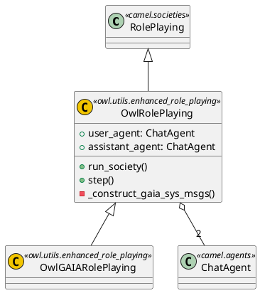

# 项目解读报告 - OWL (Optimized Workforce Learning)

## 0. 项目概览

- **项目名称与简介**: OWL (Optimized Workforce Learning for General Multi-Agent Assistance in Real-World Task Automation) 是一个为真实世界任务自动化设计的、先进的多智能体协作框架。
- **核心理念与设计哲学**: OWL 基于 `CAMEL-AI` 框架构建，其核心是通过模拟一个"智能体员工团队"来解决复杂任务。它采用"角色扮演"的模式，由一个智能体（用户代理）负责规划和拆解任务，另一个智能体（助理代理）负责执行和使用工具，从而实现高效、鲁棒的任务自动化。
- **技术栈与主要依赖**:
    - **核心框架**: `camel-ai` (版本 `0.2.57`)
    - **Web 界面**: `gradio`
    - **核心语言**: Python (`>=3.10,<3.13`)
    - **主要工具与能力**:
        - 网页抓取与自动化: `playwright`, `firecrawl`
        - 大语言模型 (LLM): 原生支持 `mistralai`，并通过 `camel-ai` 支持 OpenAI, Gemini, Claude 等多种模型。
        - 文档处理: `docx2markdown` 等。
- **目录结构概览**:
    - `owl/`: 核心应用源代码。
        - `webapp.py`: Gradio Web UI 应用主入口。
        - `utils/`: 包含核心的角色扮演逻辑和工具函数。
        - `assets/`: 静态资源。
    - `examples/`: 提供不同场景和模型的运行示例脚本。
    - `pyproject.toml`: 项目依赖和配置。
    - `README.md`: 详细的项目介绍和使用指南。

## 1. 项目架构设计

### 1.1. 系统整体架构

OWL 的架构可以分为三层：

1.  **表示层 (Presentation Layer)**: 由 `Gradio` 构建的 Web UI (`webapp.py`)。它为用户提供了一个交互界面，用于输入任务、选择运行配置（例如使用哪个 LLM 模型）、管理环境变量（API密钥），并实时查看智能体之间的对话日志。
2.  **应用层 (Application Layer)**: 这是连接前端和后端的核心。`webapp.py` 中的 `run_owl` 函数负责解析用户的输入，动态加载 `examples/` 目录中对应的配置脚本，并启动智能体"社会"。
3.  **核心逻辑层 (Core Logic Layer)**: 这是基于 `camel-ai` 框架的智能体系统，主要实现在 `owl/utils/enhanced_role_playing.py` 中。它定义了 `OwlRolePlaying` 类，负责初始化和管理两个核心智能体（用户代理和助理代理）并运行它们之间的交互循环。

### 1.2. 核心类图与继承体系

### 1.3. 模块划分与职责

- **`owl/webapp.py`**: **前端与应用控制**。负责UI展示、用户交互、配置选择和启动后台任务。
- **`owl/utils/enhanced_role_playing.py`**: **核心智能体逻辑**。定义了双智能体（User/Assistant）的角色扮演模式，包含了驱动智能体交互的核心提示词（System Prompts）和 `step` 交互循环。`run_society` 函数是整个智能体对话的驱动器。
- **`owl/utils/` 其他模块**: 提供如文档处理 (`document_toolkit.py`)、GAIA基准测试 (`gaia.py`) 等辅助功能。
- **`examples/`**: **运行配置模板**。每个脚本都是一个独立的运行配置，定义了使用何种模型、何种工具来初始化 `OwlRolePlaying` 智能体社会。

## 2. 组件交互机制分析

OWL 的核心是 **双智能体协作机制**，该机制在 `OwlRolePlaying` 类中实现：

1.  **初始化**:
    - 用户通过 `webapp.py` 提交一个任务（例如："查找 CAMEL-AI 的最新版本并总结其新功能"）。
    - `OwlRolePlaying` 类被实例化，并将用户任务嵌入到两个高度工程化的系统提示中。
    - 创建两个 `ChatAgent` 实例：**User Agent** 和 **Assistant Agent**。
        - **User Agent** 被赋予"任务规划者"的角色，其系统提示指示它将复杂任务分解为简单的、可执行的单步指令。
        - **Assistant Agent** 被赋予"工具执行者"的角色，其系统提示指示它利用可用工具（如搜索、浏览、代码执行）来完成 User Agent 给予的指令。

2.  **交互循环 (`step` 方法)**:
    - **User Agent** 发出第一条指令，例如："Instruction: 搜索 CAMEL-AI 的官方 GitHub 仓库。"
    - **Assistant Agent** 接收指令，调用 `SearchToolkit`，执行搜索，并将结果（例如，URL和摘要）封装在其响应中。
    - **User Agent** 接收到 Assistant 的响应，并根据结果生成下一条指令，例如："Instruction: 访问你找到的 GitHub URL 并提取 README.md 的内容。"
    - 这个"指令-执行-反馈"的循环持续进行，直到 User Agent 判断原始任务已完成。

3.  **任务完成**:
    - 当 User Agent 确认所有子任务都已完成，能够回答最初的宏观任务时，它会输出一个特殊的终止信号 `<TASK_DONE>`。
    - `run_society` 函数检测到此信号，停止交互循环，并整理最终结果。

这个流程有效地将一个复杂问题，通过"分而治之"的思想，转化为一系列简单的"工具使用"步骤，由专门的智能体来执行。

## 3. 设计模式与项目亮点

- **角色扮演模式 (Role-Playing Pattern)**: 这是项目的核心设计模式。通过将任务规划和任务执行的职责分离到两个不同的智能体，系统能够更结构化、更可靠地处理复杂问题，降低了单个智能体直接面对复杂任务时产生幻觉或陷入循环的风险。
- **提示词工程 (Prompt Engineering)**: 项目的"智能"很大程度上编码在 `_construct_gaia_sys_msgs` 函数的系统提示中。这些提示词经过精心设计，详细规定了每个智能体的行为准则、协作方式和约束，是整个系统得以高效运行的基础。
- **可扩展的工具集 (Extensible Toolkit)**: 基于 `camel-ai`，OWL 可以轻松集成大量工具（搜索、浏览器、代码解释器、文件操作等）。这使得 Assistant Agent 的能力可以被方便地扩展，以适应不同类型的任务。
- **用户友好的Web界面**: `Gradio` UI 降低了使用门槛，特别是其内置的环境变量管理功能，让非专业用户也能方便地配置和运行这个复杂的智能体系统。

## 4. 潜在改进建议

- **状态持久化**: 当前的交互似乎是无状态的，每次运行都是一次新的会话。可以引入会话管理和状态持久化机制，允许暂停和恢复复杂任务。
- **更精细的错误处理**: 当工具执行失败或返回非预期结果时，目前的机制依赖于LLM的自我修正能力。可以设计更明确的重试和异常处理逻辑来提高鲁棒性。
- **可视化增强**: 当前日志虽然展示了对话，但可以进一步增强可视化，例如绘制任务拆解的树状图、展示工具调用的详细流程图等，以帮助用户更好地理解智能体的"思考"过程。
