# Qwen Agent Agents 架构分析

## PlantUML 类图

```plantuml
@startuml QwenAgentArchitecture

!theme plain
skinparam classAttributeIconSize 0
skinparam classFontSize 10
skinparam classFontName Arial
skinparam backgroundColor white
skinparam classBackgroundColor #F8F9FA
skinparam classBorderColor #6C757D
skinparam arrowColor #495057

' 抽象基类
abstract class Agent {
    + llm: BaseChatModel
    + function_map: Dict[str, BaseTool]
    + system_message: str
    + name: str
    + description: str
    + extra_generate_cfg: dict
    
    + __init__(function_list, llm, system_message, name, description)
    + run(messages): Iterator[List[Message]]
    + run_nonstream(messages): List[Message]
    + {abstract} _run(messages, lang): Iterator[List[Message]]
    + _call_llm(messages, functions, stream, extra_generate_cfg): Iterator[List[Message]]
    + _call_tool(tool_name, tool_args): Union[str, List[ContentItem]]
    + _init_tool(tool): void
    + _detect_tool(message): Tuple[bool, str, str, str]
}

' 基础Agent实现
class BasicAgent {
    + _run(messages, lang): Iterator[List[Message]]
}

' 函数调用Agent
class FnCallAgent {
    + mem: Memory
    + _run(messages, lang): Iterator[List[Message]]
    + _call_tool(tool_name, tool_args): str
}

' 助手Agent
class Assistant {
    + _run(messages, lang, knowledge): Iterator[List[Message]]
    + _prepend_knowledge_prompt(messages, lang, knowledge): List[Message]
}

' 多Agent管理
abstract class MultiAgentHub {
    + agents: List[Agent]
    + agent_names: List[str]
    + nonuser_agents: List[Agent]
}

' 群聊Agent
class GroupChat {
    + agent_selection_method: str
    + host: GroupChatAutoRouter
    + _agents: List[Agent]
    
    + _run(messages, lang, max_round, need_batch_response, mentioned_agents_name): Iterator[List[Message]]
    + _gen_batch_response(messages, lang, max_round, mentioned_agents_name): Iterator[List[Message]]
    + _gen_one_response(messages, lang, mentioned_agents_name): Iterator[List[Message]]
    + _select_agent(messages, mentioned_agents_name, lang): Agent
    + _manage_messages(messages, name): List[Message]
    + _init_agents_from_config(cfgs, llm): List[Agent]
}

' 路由器Agent
class Router {
    + _agents: List[Agent]
    + _run(messages, lang): Iterator[List[Message]]
    + supplement_name_special_token(message): Message
}

' 自动路由器
class GroupChatAutoRouter {
    + _run(messages, lang): Iterator[List[Message]]
}

' ReAct Agent
class ReActChat {
    + _run(messages, lang): Iterator[List[Message]]
    + _prepend_react_prompt(messages, lang): List[Message]
    + _detect_tool(text): Tuple[bool, str, str, str]
}

' 用户Agent
class UserAgent {
    + _run(messages): Iterator[List[Message]]
}

' 虚拟内存Agent
class VirtualMemoryAgent {
    + retrieval_tool_name: str
    + _run(messages, lang): Iterator[List[Message]]
    + _format_file(messages, lang): List[Message]
}

' TIR数学Agent
class TIRMathAgent {
    + _run(messages, lang): Iterator[List[Message]]
    + _detect_tool(text): Tuple[bool, str, str, str]
}

' 写作Agent
class WriteFromScratch {
    + _run(messages, knowledge, lang): Iterator[List[Message]]
}

' 备忘录助手
class MemoAssistant {
    + _run(messages, lang, knowledge): Iterator[List[Message]]
    + _prepend_storage_info_to_sys(messages): List[Message]
    + _truncate_dialogue_history(messages): List[Message]
}

' 文章Agent
class ArticleAgent {
    + _run(messages, lang): Iterator[List[Message]]
}

' 对话检索Agent
class DialogueRetrievalAgent {
    + _run(messages, lang): Iterator[List[Message]]
}

' 对话模拟器
class DialogueSimulator {
    + _run(messages, lang): Iterator[List[Message]]
}

' 人类模拟器
class HumanSimulator {
    + _run(messages, lang): Iterator[List[Message]]
}

' 群聊创建器
class GroupChatCreator {
    + _run(messages, lang): Iterator[List[Message]]
}

' 文档QA相关
class BasicDocQA {
    + _run(messages, lang): Iterator[List[Message]]
}

class ParallelDocQA {
    + _run(messages, lang): Iterator[List[Message]]
}

' 写作相关Agent
class OutlineWriting {
    + _run(messages, knowledge, lang): Iterator[List[Message]]
}

class ExpandWriting {
    + _run(messages, knowledge, outline, lang): Iterator[List[Message]]
}

class ContinueWriting {
    + _run(messages, knowledge, lang): Iterator[List[Message]]
}

' 继承关系
Agent <|-- BasicAgent
Agent <|-- FnCallAgent
FnCallAgent <|-- Assistant
FnCallAgent <|-- ReActChat
FnCallAgent <|-- TIRMathAgent
FnCallAgent <|-- VirtualMemoryAgent
Assistant <|-- MemoAssistant
Assistant <|-- ArticleAgent
Assistant <|-- DialogueRetrievalAgent
Assistant <|-- DialogueSimulator
Assistant <|-- HumanSimulator
Assistant <|-- GroupChatCreator

Agent <|-- UserAgent
Agent <|-- WriteFromScratch
Agent <|-- BasicDocQA
Agent <|-- ParallelDocQA
Agent <|-- OutlineWriting
Agent <|-- ExpandWriting
Agent <|-- ContinueWriting

' 多Agent管理
Agent <|-- GroupChat
MultiAgentHub <|-- GroupChat
Assistant <|-- Router
MultiAgentHub <|-- Router
Assistant <|-- GroupChatAutoRouter

' 组合关系
GroupChat *-- Agent : contains
Router *-- Agent : contains
GroupChatAutoRouter *-- Agent : manages

' 工具相关
Agent *-- BaseTool : uses
FnCallAgent *-- Memory : has

@enduml
```

## 架构说明

### 核心层次结构

1. **Agent (抽象基类)**
   - 所有Agent的基类
   - 定义了统一的接口和通用功能
   - 包含LLM调用、工具管理、消息处理等核心功能

2. **BasicAgent**
   - 最简单的Agent实现
   - 仅使用LLM进行对话，不集成任何工具

3. **FnCallAgent**
   - 支持函数调用的Agent
   - 集成了Memory管理
   - 是大多数功能Agent的父类

### 主要Agent类型

#### 单Agent类型
- **Assistant**: 集成RAG能力的通用助手
- **ReActChat**: 使用ReAct格式调用工具的Agent
- **TIRMathAgent**: 工具集成推理的数学Agent
- **VirtualMemoryAgent**: 虚拟内存Agent，支持外部信息检索
- **MemoAssistant**: 备忘录助手，支持持久化存储
- **UserAgent**: 用户Agent，用于等待用户输入

#### 多Agent管理类型
- **GroupChat**: 群聊管理Agent，支持多种选择策略
- **Router**: 路由器Agent，根据内容选择合适Agent
- **GroupChatAutoRouter**: 自动路由器，智能选择下一个发言者

#### 专业领域Agent
- **WriteFromScratch**: 从零开始写作的Agent
- **ArticleAgent**: 文章处理Agent
- **DialogueRetrievalAgent**: 对话检索Agent
- **DialogueSimulator**: 对话模拟器
- **HumanSimulator**: 人类模拟器

#### 文档处理Agent
- **BasicDocQA**: 基础文档问答
- **ParallelDocQA**: 并行文档问答

#### 写作相关Agent
- **OutlineWriting**: 大纲写作
- **ExpandWriting**: 扩展写作
- **ContinueWriting**: 继续写作

### 设计模式

1. **模板方法模式**: Agent基类定义了run()方法，子类实现_run()方法
2. **策略模式**: 不同的Agent实现不同的处理策略
3. **组合模式**: MultiAgentHub管理多个Agent
4. **装饰器模式**: 各种Agent可以组合使用

### 关键特性

1. **流式处理**: 支持流式响应生成
2. **工具集成**: 统一的工具调用接口
3. **多语言支持**: 支持中英文等多种语言
4. **记忆管理**: 集成Memory系统
5. **多Agent协作**: 支持复杂的多Agent场景
6. **可扩展性**: 易于添加新的Agent类型
