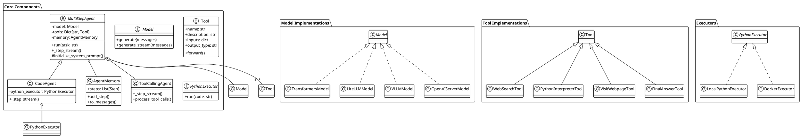

# smolagents 项目解读报告

## 0. 项目概览

- **项目名称**: smolagents
- **核心理念**: 一个由 Hugging Face 团队开发的、轻量级、可扩展的自主智能体（Agent）框架。它旨在提供一套构建、测试和分享AI智能体的模块化工具，强调与Hugging Face生态系统的深度集成，特别是模型（Models）、工具（Tools）和社区（Hub）。
- **技术栈**: Python, Jinja2, Gradio, Hugging Face Hub, Transformers。
- **目录结构概览**:
    - `src/smolagents/`: 核心源代码，包含智能体、模型、工具、内存等模块。
    - `src/smolagents/prompts/`: 定义不同智能体行为的YAML提示模板。
    - `examples/`: 展示如何使用框架构建各种应用的示例代码。
    - `docs/`: 项目文档的源文件。

## 1. 项目架构设计

### 1.1. 系统整体架构

`smolagents` 采用了一种灵活的、基于模块的架构，其核心是 `MultiStepAgent` 类。该架构遵循经典的**ReAct (Reason and Act)** 模式，智能体通过"思考 -> 行动 -> 观察"的循环来完成复杂任务。

其主要架构组件包括：

1.  **Agent (智能体)**: 系统的大脑，负责解析任务、制定计划、调用工具并最终生成答案。框架提供了两种核心实现：
    *   `ToolCallingAgent`: 适用于支持原生函数/工具调用的模型，可以并行执行工具。
    *   `CodeAgent`: 更通用的实现，通过生成并执行Python代码来调用工具，兼容性更强。

2.  **Model (模型)**: 连接各种大语言模型的桥梁。框架通过统一的 `Model` 基类，支持从本地（Transformers, vLLM, MLX）到云端API（Hugging Face Inference, LiteLLM, OpenAI, Bedrock）的多种模型，实现了模型提供者的解耦。

3.  **Tool (工具)**: 智能体可以使用的外部函数。`smolagents` 提供了一个强大的工具系统，可以通过继承 `Tool` 类或使用 `@tool` 装饰器轻松创建。工具的设计强调可移植性，可以方便地在社区分享。

4.  **Memory (内存)**: 记录智能体在任务执行过程中的所有步骤，包括思考、行动、观察和计划。内存为智能体提供了上下文，也为后续的复盘和调试提供了依据。

5.  **Executor (执行器)**: `CodeAgent` 的安全保障，提供一个沙盒环境来执行由LLM生成的Python代码，防止潜在的恶意操作。

数据流如下：
`User Task -> Agent -> Model (Reasoning) -> Tool Call (Action) -> Executor -> Observation -> Agent -> Model ... -> Final Answer`

### 1.2. 整体架构PlantUML类图



### 1.3. 模块划分与职责

-   **`agents.py`**: 定义了智能体的核心逻辑和生命周期，是整个框架的控制中心。
-   **`models.py`**: 提供了与各种LLM后端交互的接口抽象和具体实现，是框架的动力来源。
-   **`tools.py`**: 定义了工具的规范和创建方式，是智能体能力的扩展接口。
-   **`default_tools.py`**: 提供了一组开箱即用的常用工具，如网页搜索、代码执行等。
-   **`memory.py`**: 负责智能体运行状态和历史记录的管理。
-   **`local_python_executor.py`**: 提供了本地代码执行的沙盒环境。
-   **`prompts/`**: 存放定义智能体行为和能力的YAML提示模板，使得智能体的"性格"和"技能"高度可配置。

## 2. 核心模块详细分析

### 2.1 智能体模块 (`agents.py`)

-   **核心职责**: 作为框架的"大脑"，协调模型、工具和内存来完成用户指定的任务。
-   **关键文件与功能**:
    -   `MultiStepAgent`: 抽象基类，实现了ReAct循环、最大步数限制、规划(Planning)机制和日志记录。
    -   `ToolCallingAgent`: 专为支持工具调用的模型设计，能解析模型的结构化输出，并并行执行工具调用，效率更高。
    -   `CodeAgent`: 通用性更强的智能体，通过让LLM生成Python代码来间接调用工具。代码在一个安全的`PythonExecutor`中执行。
-   **核心实现**:
    -   **运行循环 (`run` & `_run_stream`)**: 管理智能体的执行流程，支持流式输出和一次性返回结果。
    -   **规划 (`_generate_planning_step`)**: 在任务开始前或执行过程中，智能体会生成一个行动计划，并在必要时进行反思和调整。这提高了解决复杂问题的成功率。
    -   **持久化与分享 (`save`, `push_to_hub`)**: 提供了将智能体（包括其配置、工具和提示）保存到本地或一键推送到Hugging Face Hub的功能，极大地促进了复用和分享。

### 2.2 模型模块 (`models.py`)

-   **核心职责**: 抽象化与不同LLM提供商的交互，为上层智能体提供统一的调用接口。
-   **关键文件与功能**:
    -   `Model`: 定义了所有模型客户端必须实现的接口，如`generate`和`generate_stream`。
    -   **具体实现**: 提供了对多种主流模型服务和库的封装，包括`TransformersModel` (本地), `VLLMModel`, `MLXModel`, `LiteLLMModel` (兼容数百种API), `InferenceClientModel` (HF Serverless), `OpenAIServerModel`等。
-   **核心实现**:
    -   **统一接口**: 无论后端是本地模型还是云端API，`Agent`都以同样的方式调用，实现了底层模型的即插即用。
    -   **消息处理 (`get_clean_message_list`)**: 负责将`AgentMemory`中的历史记录转换成符合特定模型聊天模板的格式。
    -   **工具调用适配**: 负责将`Tool`的定义转换成模型能理解的格式（如JSON Schema），并将模型的输出解析为工具调用请求。

### 2.3 工具模块 (`tools.py`, `default_tools.py`)

-   **核心职责**: 为智能体提供与外部世界交互的能力。
-   **关键文件与功能**:
    -   `Tool`: 所有工具的基类，定义了工具的元数据（`name`, `description`, `inputs`, `output_type`）和核心逻辑（`forward`方法）。
    -   `@tool`装饰器: 从一个标准Python函数快速创建`Tool`实例的语法糖，极大简化了工具开发。
    -   `default_tools.py`: 提供了一系列即用型工具，如`WebSearchTool`, `VisitWebpageTool`, `PythonInterpreterTool`。
-   **核心实现**:
    -   **可移植性**: 工具被设计为自包含的、可序列化的单元。`to_dict`方法能将工具（包括其源代码）导出，`from_code`则能从代码重新加载，这使其能轻松地通过Hub分享。
    -   **生态集成**: 提供了`from_space`, `from_langchain`等适配器，方便地将Gradio应用、LangChain工具等现有生态整合进来。

## 3. 重要使用案例分析：Text-to-SQL

`smolagents` 的一个典型且强大的应用场景是自然语言到SQL的转换。`examples/text_to_sql.py` 完美地展示了这一点。

### 3.1 案例概述

该案例展示了如何创建一个能理解用户用自然语言提出的数据查询需求，并能自动编写和执行SQL查询，最终返回准确结果的智能体。这是一个高价值的商业智能（BI）应用场景。

### 3.2 案例实现步骤

#### 1. 环境准备与安装

首先，需要安装`smolagents`以及其依赖，特别是`sqlalchemy`用于数据库操作。

```bash
pip install "smolagents[transformers]" sqlalchemy pandas
```

#### 2. 部署与设置

案例代码首先在内存中创建了一个SQLite数据库和一张名为`receipts`的表，并填充了示例数据。这是为了模拟一个真实的数据环境。

```python
# /examples/text_to_sql.py
from sqlalchemy import (
    Column, Float, Integer, MetaData, String, Table, create_engine, insert, inspect, text,
)

# 1. 创建内存数据库引擎
engine = create_engine("sqlite:///:memory:")
metadata_obj = MetaData()

# 2. 定义 receipts 表
table_name = "receipts"
receipts = Table(
    table_name,
    metadata_obj,
    Column("receipt_id", Integer, primary_key=True),
    Column("customer_name", String(16), primary_key=True),
    Column("price", Float),
    Column("tip", Float),
)
metadata_obj.create_all(engine)

# 3. 插入示例数据
rows = [...]
for row in rows:
    stmt = insert(receipts).values(**row)
    with engine.begin() as connection:
        cursor = connection.execute(stmt)
```

#### 3. 关键：创建自定义SQL工具

案例中最核心的部分是定义了一个`sql_engine`工具。这个工具是智能体与数据库交互的唯一桥梁。

```python
# /examples/text_to_sql.py
from smolagents import tool

@tool
def sql_engine(query: str) -> str:
    """
    Allows you to perform SQL queries on the table. Returns a string representation of the result.
    The table is named 'receipts'. Its description is as follows:
        Columns:
        - receipt_id: INTEGER
        - customer_name: VARCHAR(16)
        - price: FLOAT
        - tip: FLOAT

    Args:
        query: The query to perform. This should be correct SQL.
    """
    output = ""
    with engine.connect() as con:
        rows = con.execute(text(query))
        for row in rows:
            output += "\n" + str(row)
    return output
```

**重点分析**:
- **`@tool`装饰器**: 轻松将一个普通函数转换成`smolagents`的工具。
- **详细的Docstring**: 这里的文档字符串至关重要。它不仅告诉智能体这个工具是用来执行SQL的，还明确地**描述了数据库表的名称和结构**。LLM在"思考"阶段会阅读这个描述，从而知道如何构建正确的SQL查询语句。这是提示工程（Prompt Engineering）的绝佳实践。

#### 4. 使用：运行智能体

最后，代码实例化一个`CodeAgent`，将`sql_engine`工具传递给它，并用自然语言提出问题。

```python
# /examples/text_to_sql.py
from smolagents import CodeAgent, InferenceClientModel

agent = CodeAgent(
    tools=[sql_engine],
    model=InferenceClientModel(model_id="meta-llama/Meta-Llama-3.1-8B-Instruct"),
)
agent.run("Can you give me the name of the client who got the most expensive receipt?")
```

智能体的内部工作流大致如下：
1.  **思考**: "用户的任务是找出消费最高的客户。我有一个名为`sql_engine`的工具，它可以查询`receipts`表。该表有`customer_name`和`price`字段。我需要按`price`降序排序并取第一个客户的名字。"
2.  **行动**: 生成代码 `sql_engine(query="SELECT customer_name FROM receipts ORDER BY price DESC LIMIT 1")`。
3.  **执行**: `PythonInterpreterTool`执行上述代码，调用`sql_engine`函数，查询数据库。
4.  **观察**: 收到返回结果 `('Woodrow Wilson',)`。
5.  **最终回答**: 将观察到的结果格式化为自然语言，回复用户："The client who got the most expensive receipt is Woodrow Wilson."

这个案例清晰地展示了`smolagents`如何通过工具将LLM的语言理解能力与外部世界的实际操作能力（如数据库查询）结合起来，解决复杂问题。

## 4. 总结与评估

### 4.1 项目亮点

1.  **高度模块化与可扩展性**: `Agent`, `Model`, `Tool`三大核心组件解耦清晰，用户可以像搭积木一样组合和替换，轻松定制自己的智能体。
2.  **与Hugging Face生态无缝集成**: `smolagents`不仅仅是一个独立的框架，更是HF生态的延伸。它深度整合了Hub的模型、数据集和Spaces，特别是其一键分享和加载Agent/Tool的功能，极具吸引力。
3.  **强大的工具系统**: 通过`@tool`装饰器和多种适配器，极大地简化了工具的创建和集成。工具的可移植性设计是其成为一个有活力的开源项目的关键。
4.  **优秀的开发者体验**: 提供了从本地运行（Transformers, VLLM）到云端API（LiteLLM, InferenceClient）的多种模型支持，满足不同开发者的需求和预算。代码结构清晰，易于上手。

### 4.2 潜在改进建议

-   **内存管理增强**: 目前的内存机制比较直接。可以探索更高级的内存压缩技术（如摘要、向量化），以支持更长周期的任务和更复杂的对话历史。
-   **多智能体协作**: 框架目前主要聚焦于单智能体或主-从式（Managed Agent）的协作。可以进一步探索更复杂的协作模式，如多智能体辩论、分层协作等。
-   **可视化与调试**: 虽然提供了日志和Replay功能，但可以开发更强大的可视化调试工具，帮助开发者直观地理解智能体的决策过程。

### 4.3 二次开发指南

1.  **从工具开始**: 最快为`smolagents`贡献价值的方式是创建新的工具。利用`@tool`装饰器，将你常用的API或功能封装成工具，并分享到Hub上。
2.  **尝试不同模型**: `models.py`让你能轻松接入不同的LLM。可以尝试使用`LiteLLMModel`接入一个`smolagents`尚未直接支持的API，或者使用`TransformersModel`微调一个专用于特定任务的模型。
3.  **定制智能体**: 复制`prompts/toolcalling_agent.yaml`或`prompts/code_agent.yaml`，修改其中的提示模板，创造一个具有独特"个性"或专长的智能体。
