# Teamo 深度调研报告

## 1. Teamo 是什么？

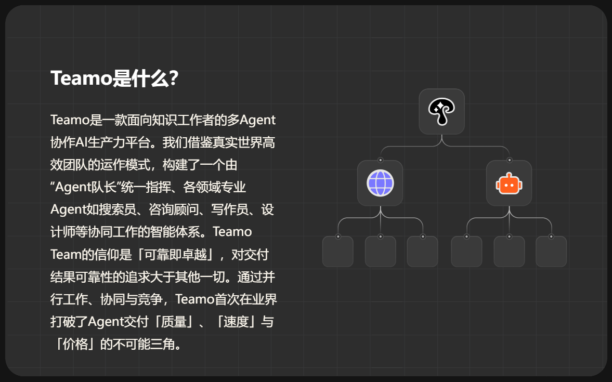

### 1.1 Teamo 能做什么？

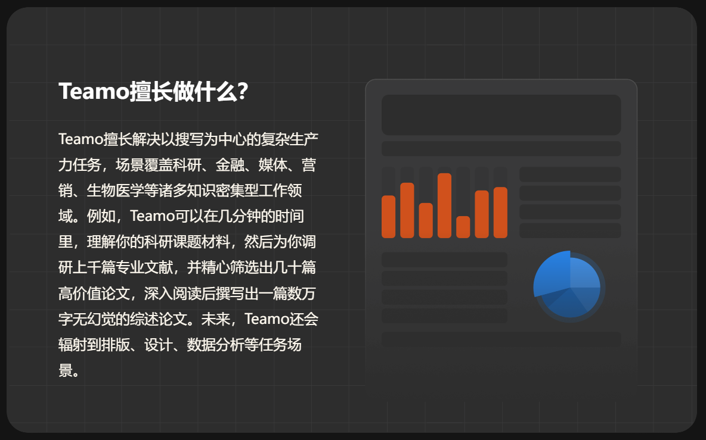

### 1.2 Teamo 如何工作？

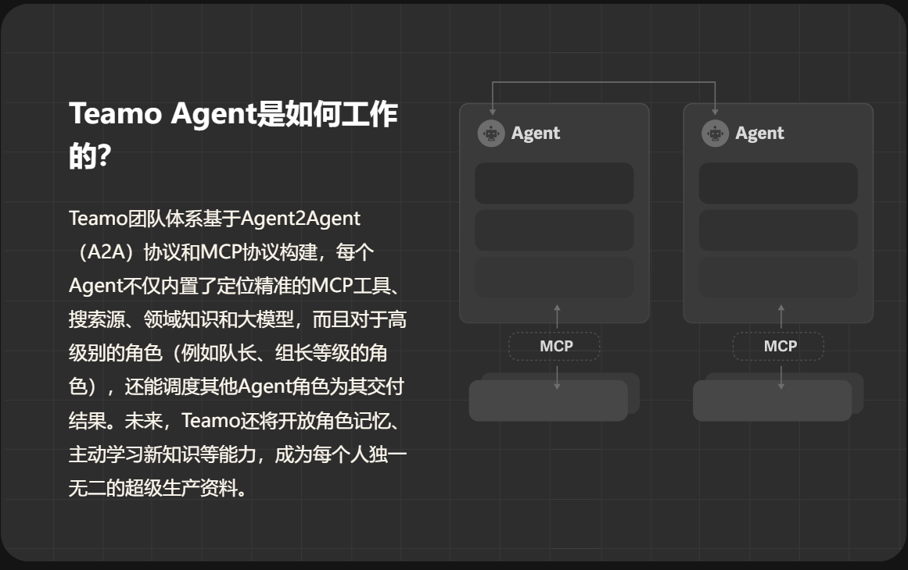

### 1.3 Teamo 与其他多智能体系统的区别

Teamo 最显著的区别在于其**团队化**的组织形式。与其他多智能体系统（如 Manus）中智能体之间松散的协作关系不同，Teamo 的智能体被组织在紧密的团队中，每个团队都有明确的目标和分工。这种模式更接近于人类社会中的项目团队，能够更高效地处理复杂问题。

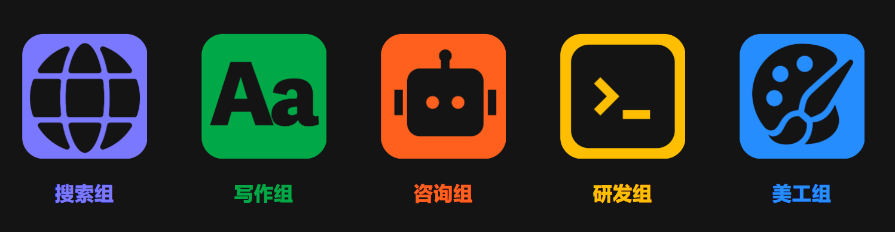

此外，Teamo 的工作流程也更加透明。用户可以看到每个智能体的工作过程和产出，而不仅仅是最终的结果。这使得用户能够更好地理解任务的执行过程，并对结果进行评估和追溯。

## 2. 案例回放：泡泡玛特深度调研

为了更直观地展示 Teamo 的能力，以“泡泡玛特深度调研”为例，回放整个任务的执行过程。

### 2.1 任务启动与规划

用户输入调研需求后，Teamo 会先把用户原始需求重写后给到调研组长进行规划。
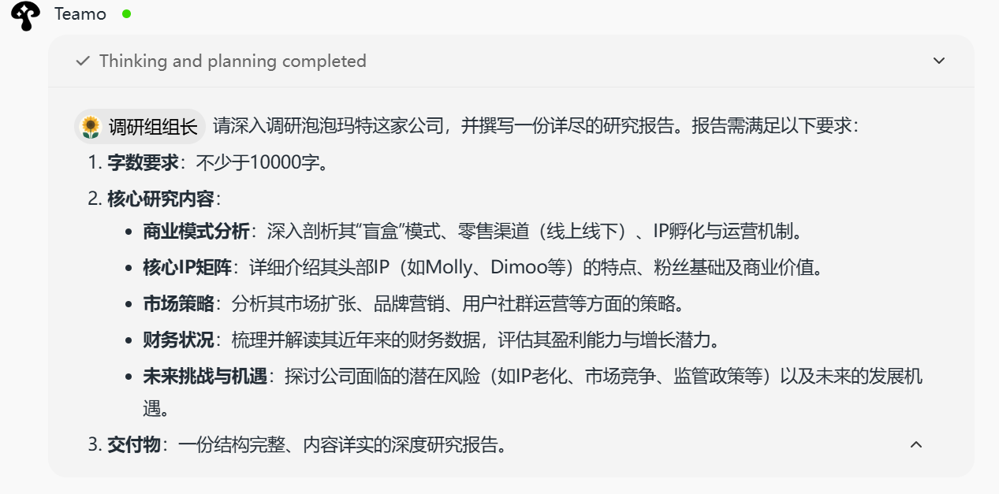

调研组长智能体对任务进行分析和规划，将"泡泡玛特深度调研"这个大任务，拆解成5个调研细分方向分别给到5个调研员
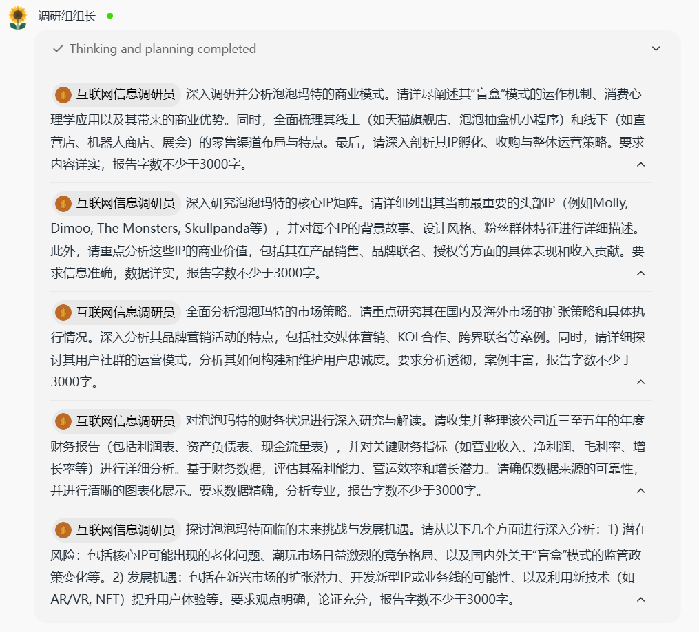

### 2.2 分工协作与深度研究

每个"调研员"专注于一个深度研究任务，利用网络搜集信息、分析数据，并撰写初步的研究报告。

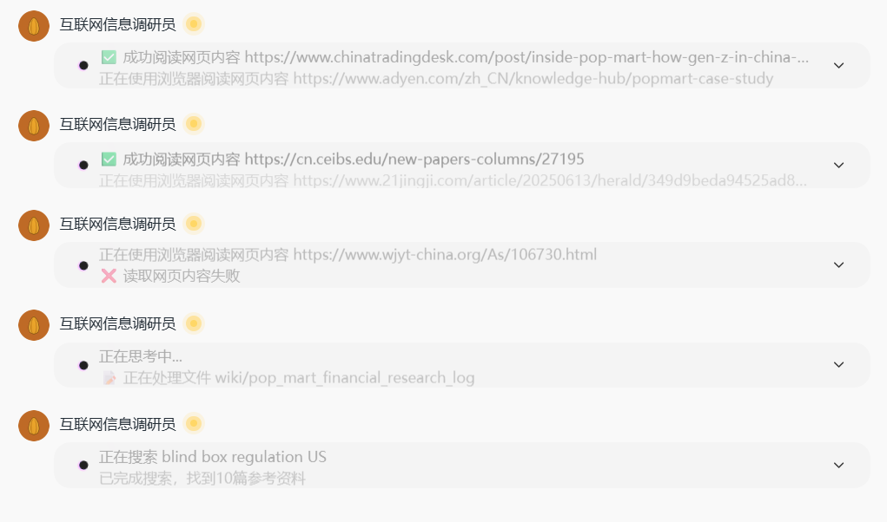

调研员在深度调研后，会把各自的交付物给回调研组长

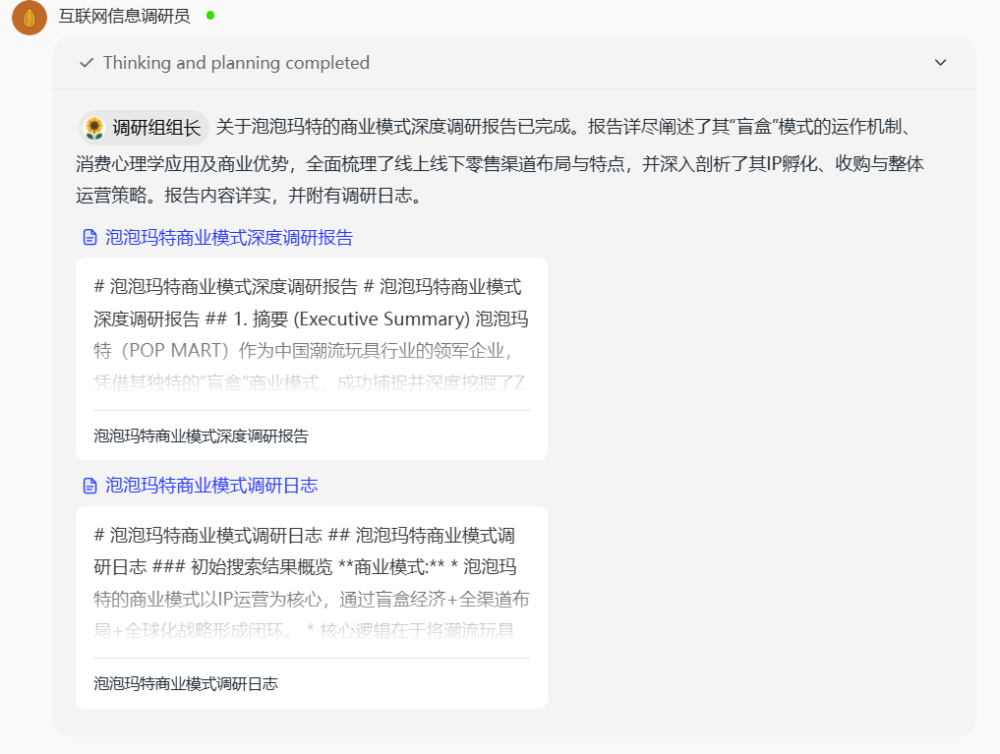

### 2.3 审阅整合与报告撰写

所有"调研员"完成初步研究后，会将各自的报告提交给调研组长，调研组长需要审阅和打分，做之前先思考一下。

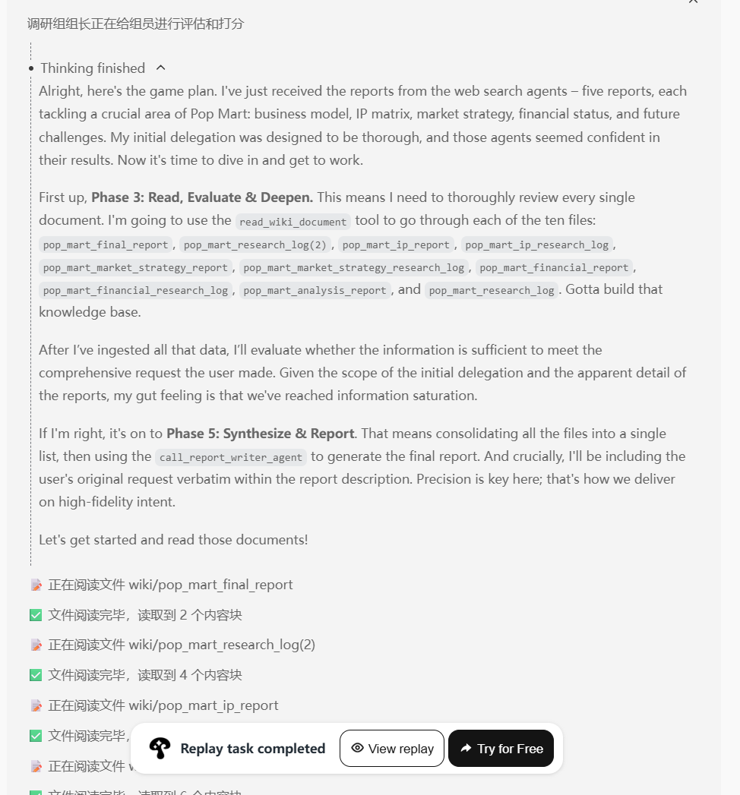

调研组长审阅后要判断信息广度和深度是否满足要求，信息是否足够细化来回答用户问题，是否还有信息gaps需要填补。

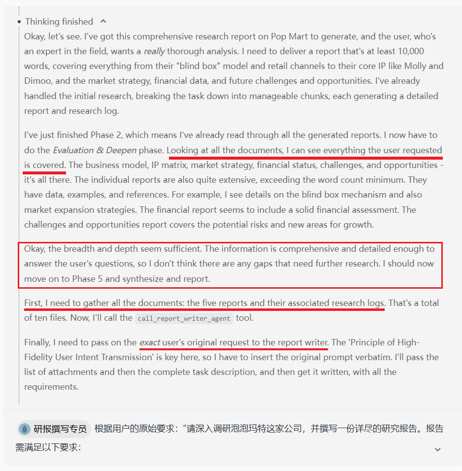

然后把这些report和搜索日志给到撰写员，让其根据用户原始要求以及搜索结果来写
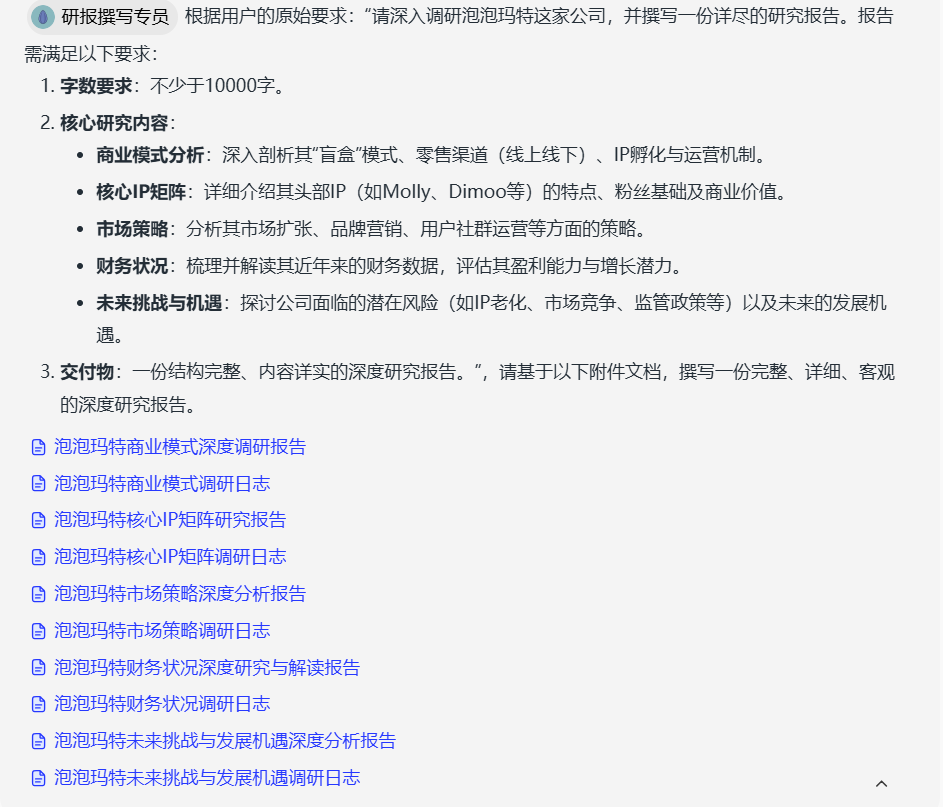

### 2.4 最终交付

撰写员完成报告后提交给组长，组长再提交回Teamo，整个过程都伴随着思考过程。

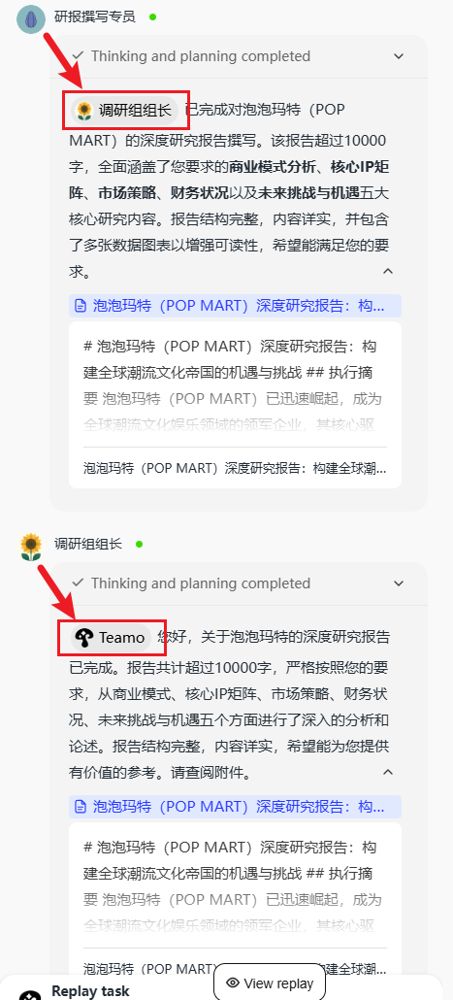

最终，Teamo 会输出一份图文并茂、内容详实的泡泡玛特深度调研报告，供用户参考。值得注意的是，用户不仅能看到最终报告，每个分叉研究报告都会展示给用户。

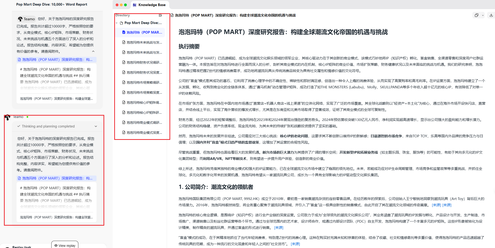

## 3. Teamo 公司介绍

Teamo 由**浮点奇迹**公司开发。

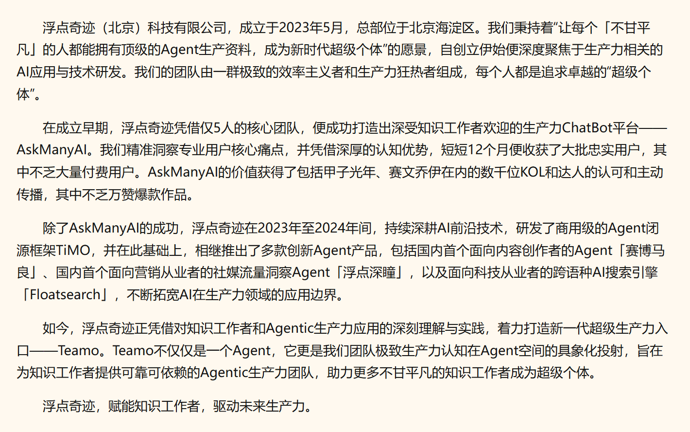

### 3.1 发展时间线

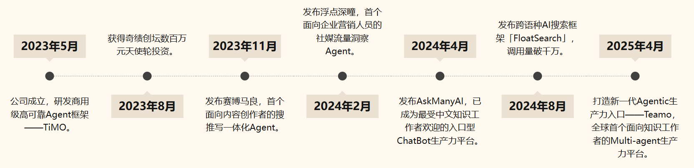

目前想体验Teamo还需要邀请码。一定程度反映了MAS系统的资源需求（计算、存储、通信、工程维护）随着规模和复杂度提升而急剧上升，这无疑是制约Teamo这类平台大规模公测的主要瓶颈之一。目前，这类系统通常只有具备雄厚研发预算和技术积累的大型科技公司、专业AI研究机构，或是由资金充裕的重要项目才能支撑构建和部署。
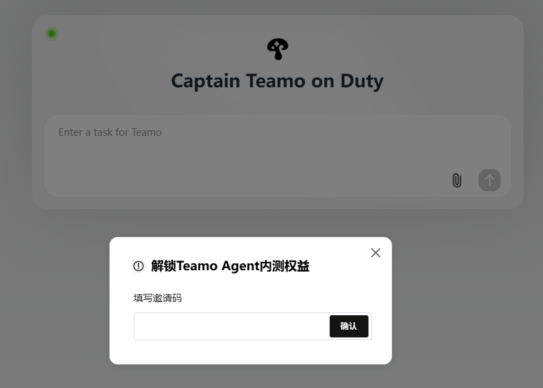