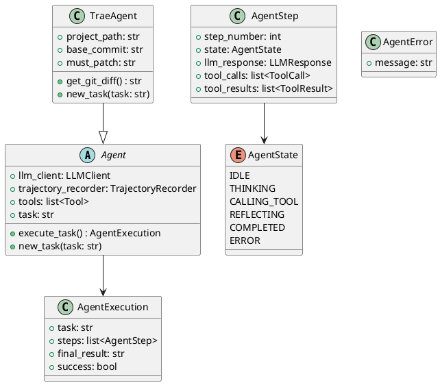
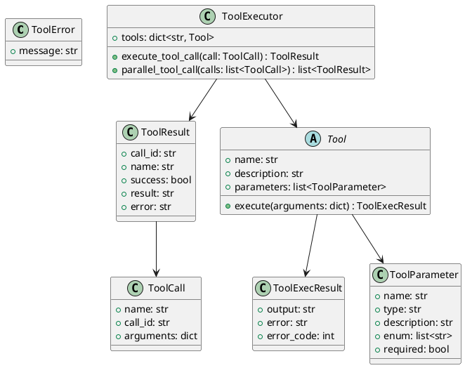
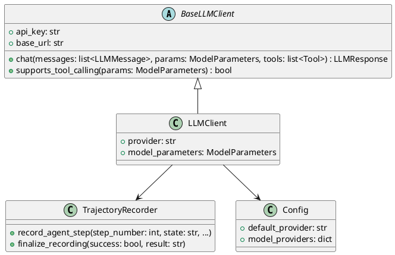
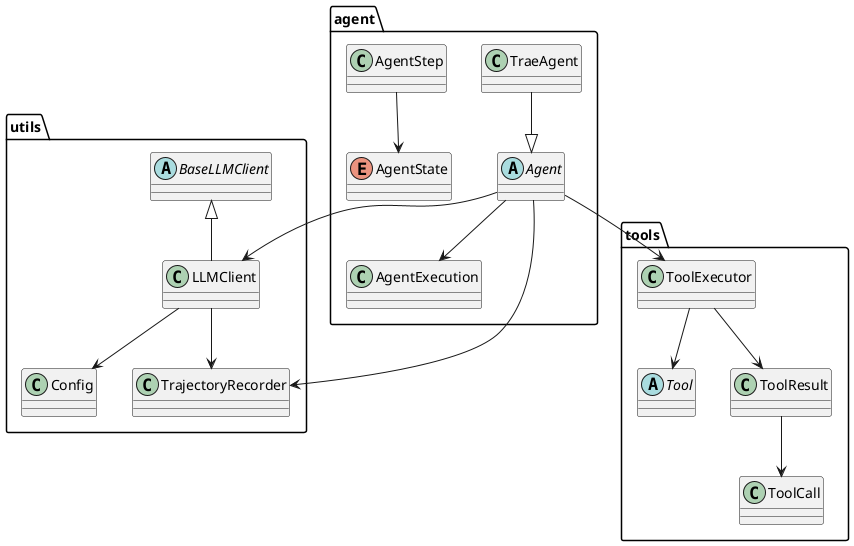

# Trae-Agent 项目深度解读报告

## 概述
Trae-Agent 是一个开源的 AI Agent框架，旨在通过轨迹增强（Trajectory Enhancement）来优化Agent的决策和执行过程。项目基于 Python 实现，支持多种 LLM 提供商（如 OpenAI、Anthropic 等），并提供 CLI 工具、SDK 和评估模块。核心目标是通过记录和分析Agent的执行轨迹来改进性能，支持工具调用、顺序思考和任务完成等功能。

项目 GitHub 仓库：https://github.com/TRADELAB/trae-agent
最新版本：基于扫描的代码库（2023 年后更新）。

## Phase 1: 全局扫描与规划
### 项目目录结构
```
thirdparty/trae-agent/
├── uv.lock                          # 依赖锁定文件
├── trae_config.json                 # 项目配置 JSON 文件
├── trae_agent/                      # 核心Agent实现目录
│   ├── utils/                       # 实用工具目录（LLM 客户端、配置、轨迹记录等）
│   │   ├── openai_client.py         # OpenAI LLM 客户端
│   │   ├── openrouter_client.py     # OpenRouter LLM 客户端
│   │   ├── trajectory_recorder.py   # 轨迹记录器
│   │   ├── ollama_client.py         # Ollama LLM 客户端
│   │   ├── lake_view.py             # 湖视图实用工具（可能用于数据可视化）
│   │   ├── llm_basics.py            # LLM 基础函数
│   │   ├── llm_client.py            # 通用 LLM 客户端
│   │   ├── google_client.py         # Google LLM 客户端
│   │   ├── cli_console.py           # CLI 控制台实用工具
│   │   ├── config.py                # 配置管理
│   │   ├── doubao_client.py         # Doubao LLM 客户端
│   │   ├── anthropic_client.py      # Anthropic LLM 客户端
│   │   ├── azure_client.py          # Azure LLM 客户端
│   │   ├── base_client.py           # 基础 LLM 客户端
│   │   └── models/                  # 模型定义目录
│   │       ├── openai_client.py     # OpenAI 模型定义
│   │       └── openai.py            # OpenAI 模型类
│   ├── tools/                       # 工具目录（Agent可调用的工具）
│   │   ├── sequential_thinking_tool.py # 顺序思考工具
│   │   ├── task_done_tool.py        # 任务完成工具
│   │   ├── json_edit_tool.py        # JSON 编辑工具
│   │   ├── run.py                   # 工具运行脚本
│   │   ├── bash_tool.py             # Bash 命令工具
│   │   ├── edit_tool.py             # 编辑工具
│   │   ├── base.py                  # 工具基类
│   │   └── __init__.py              # 工具初始化
│   ├── agent/                       # Agent核心目录
│   │   ├── trae_agent.py            # Trae Agent实现
│   │   ├── agent_basics.py          # Agent基础函数
│   │   ├── base.py                  # Agent基类
│   │   └── __init__.py              # Agent初始化
│   ├── cli.py                       # CLI 入口
│   └── __init__.py                  # 包初始化
├── sdk/                             # SDK 目录（Python 和 Node.js SDK）
│   └── python/                      # Python SDK
│       ├── _run.py                  # SDK 运行脚本
│       └── __init__.py              # SDK 初始化
├── tests/                           # 测试目录
├── evaluation/                      # 评估目录
├── docs/                            # 文档目录
└── .github/                         # GitHub 配置目录
```

核心代码文件夹：`trae_agent/`（包含 `utils/`、`tools/`、`agent/`），这些是Agent逻辑、工具和 LLM 支持的核心。

## Phase 2: 逐模块深度分析

### 模块: agent (路径: trae_agent/agent/)
- **模块核心职责**：提供 Agent 的核心抽象和实现，包括状态管理、执行流程和任务处理。
- **关键文件识别**：
  - base.py: Agent 基类。
  - trae_agent.py: TraeAgent 具体实现。
  - agent_basics.py: Agent 状态枚举和数据类。

#### 代码细节分析
- **核心实现**：Agent 类管理 LLM 调用、工具执行和轨迹记录。TraeAgent 扩展为软件工程任务，支持 Git diff 和补丁生成。
- **依赖关系**：依赖 utils (LLMClient, Config) 和 tools (ToolExecutor)。
- **错误与性能**：使用 AgentError 处理异常；执行循环限制 max_steps 以控制性能。

#### 模块 PlantUML 类图


### 模块: tools (路径: trae_agent/tools/)
- **模块核心职责**：定义工具基类和执行器，支持 Agent 调用各种工具如编辑、Bash 和 JSON 操作。
- **关键文件识别**：
  - base.py: Tool 和 ToolExecutor 基类。
  - edit_tool.py, bash_tool.py 等: 具体工具实现。

#### 代码细节分析
- **核心实现**：Tool 抽象类定义 execute 方法；ToolExecutor 支持并行/顺序执行。
- **依赖关系**：依赖 llm_basics (LLMMessage)。
- **错误与性能**：使用 ToolError 处理工具异常；异步执行提升性能。

#### 模块 PlantUML 类图


### 模块: utils (路径: trae_agent/utils/)
- **模块核心职责**：提供 LLM 客户端、配置管理和轨迹记录等支持功能。
- **关键文件识别**：
  - base_client.py: BaseLLMClient 抽象类。
  - config.py: 配置类。
  - trajectory_recorder.py: 轨迹记录器。
  - 各种 LLM 客户端如 openai_client.py。

#### 代码细节分析
- **核心实现**：BaseLLMClient 处理聊天和工具调用；TrajectoryRecorder 记录执行轨迹。
- **依赖关系**：依赖外部 LLM SDK 和内部工具。
- **错误与性能**：客户端处理 API 错误；轨迹记录使用 JSON 持久化。

#### 模块 PlantUML 类图


#### 轨迹增强（Trajectory Enhancement）实现细节
TrajectoryRecorder 并不仅仅是日志记录器，更是 **Trajectory Enhancement（轨迹增强）** 的核心。通过把执行全过程结构化地写入磁盘，再由其他组件（如 `LLMClient`、`LakeView` 等）消费这些轨迹信息，Agent 可以在后续推理里即时“回放”历史、生成摘要或检索决策依据，从而实现 **自反思、自适应** 的能力。其工作流程与增强场景如下：

1. **初始化 (`__init__`)**
   - 如果调用方未显式指定 `trajectory_path`，构造函数会以 `trajectory_<YYYYMMDD_HHMMSS>.json` 命名在当前工作目录创建 JSON 文件。
   - 初始化 `trajectory_data` 字典，默认字段包括 `task`、`start_time`、`end_time`、`provider`、`model`、`max_steps`、`llm_interactions`、`agent_steps`、`success`、`final_result`、`execution_time`，并在后续阶段不断增量更新。

2. **开始记录 (`start_recording`)**
   - 在 Agent 创建新任务时调用，写入任务描述、LLM 提供商、模型名称与最大步数，同时记录开始时间。
   - 调用 `save_trajectory()` 立即落盘，确保即使执行中断也能保留已写入的元数据。

3. **记录 LLM 交互 (`record_llm_interaction`)**
   - 每次 Agent 调用 LLM 后触发，采集输入 `messages`、`response` 对象及当时可用 `tools`。内部通过 `_serialize_message` 将 `LLMMessage` 转换为 JSON 友好结构，将 `LLMResponse` 的 `usage`、`tool_calls` 等详细信息写入 `llm_interactions` 数组。
   - 该方法同样调用 `save_trajectory()`，保证交互级别的持久化。

4. **记录 Agent 步骤 (`record_agent_step`)**
   - 在每个思考 / 工具调用 / 反思 / 完成 / 错误节点执行。
   - 采集 `step_number`、`state`、与 LLM 的通信、工具调用 (`ToolCall`) 和结果 (`ToolResult`)、反思文本、错误信息等。
   - 使用 `_serialize_tool_call`、`_serialize_tool_result` 对复杂对象展开，写入 `agent_steps` 数组後立即保存。

5. **结束记录 (`finalize_recording`)**
   - 当 Agent 结束运行（成功或失败）时调用，写入 `end_time`、`success`、`final_result` 与总执行时长。
   - 最终再次 `save_trajectory()` 将完整轨迹落盘。

6. **安全落盘 (`save_trajectory`)**
   - 每次记录数据都会尝试创建父目录并以 UTF-8 编码写入 JSON，采用 `indent=2`、`ensure_ascii=False` 便于阅读。
   - 若写盘失败仅打印警告，不会终止 Agent 运行，确保健壮性。

7. **轨迹消费与增强场景**
   - **即时上下文注入**：`LLMClient.chat()` 在调用时会先把 `TrajectoryRecorder` 注入自身，通过 `set_trajectory_recorder()` 将每轮对话写入 `llm_interactions`。当 Agent 需要“回顾”时，可快速检索已有对话，无需额外 I/O。
   - **LakeView 摘要**：`utils/lake_view.py` 提供“Lakeview”特性，会流式读取轨迹文件，对长对话生成精简摘要反馈到 CLI，使人类操作者和 Agent 都能快速获取“湖景”级概览。
   - **反射 / 自适应**：在 `Agent.reflect_on_result()` 或未来研究型插件中，可通过读取最新 `agent_steps`，对失败的工具调用进行错误模式匹配，动态调整下一步策略。
   - **离线学习**：轨迹文件天然适合作为 RAG / 监督微调数据集，为 Agent 迭代提供真实世界样本。

通过上述机制，TrajectoryRecorder **像飞行记录仪一样**完整捕获运行轨迹，并借助 Lakeview 及自反思回路，把“被动日志”转化为 **可执行的知识**，真正体现 Trae-Agent 的 Trajectory Enhancement 理念。

### 轨迹记录使用教程

#### CLI 使用
1. **自动命名文件**
```bash
trae run "Create a hello world Python script"
# Trajectory saved to: trajectory_20250711_142300.json
```

2. **自定义文件名**
```bash
trae run "Fix the bug in main.py" --trajectory-file my_debug_session.json
# Trajectory saved to: my_debug_session.json
```

3. **交互模式**
```bash
trae interactive --trajectory-file session.json
```

#### 编程接口示例
```python
from trae_agent.agent.trae_agent import TraeAgent
from trae_agent.utils.config import Config

# 构造或加载 Config 对象
config = Config.load("trae_config.json")  # 仅示例，实际 API 视实现而定

# 创建 Agent 并启用轨迹记录
agent = TraeAgent.from_config(config)
trajectory_path = agent.setup_trajectory_recording("my_trajectory.json")

# 配置并执行任务
agent.new_task("My task", {"project_path": "/path/to/project"})
execution = await agent.execute_task()

print(f"Trajectory saved to: {trajectory_path}")
```

> 以上示例与 `docs/TRAJECTORY_RECORDING.md` 中的用法保持一致，可帮助开发者快速上手 Trajectory Enhancement 功能。

## Phase 3: 整体架构与总结

#### 整体架构分析
- **核心抽象**：Agent 作为中央组件，集成 LLMClient (utils) 和 Tool (tools)，通过执行循环处理任务。
- **组件交互**：Agent 调用 LLMClient 发送消息，接收响应后通过 ToolExecutor 执行工具，结果反馈回 Agent。
- **生成项目整体PlantUML类图**：



- **设计模式**：使用抽象工厂 (from_config)，策略模式 (多 LLM 客户端)，观察者 (轨迹记录)。
- **项目亮点**：模块化设计支持扩展；轨迹记录便于调试和研究。

#### 总结与建议
- **潜在改进**：增强错误恢复机制；优化大型项目的性能。
- **二次开发指南**：从 Agent 类扩展新功能；添加自定义工具到 tools_registry。